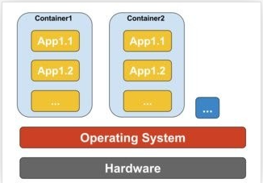
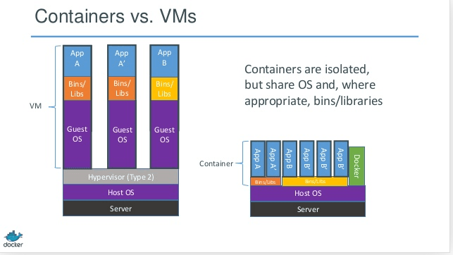

## 问题 6：Dockerfile 配置文件中的 COPY 和 ADD 指令有什么不同？

题目：Docker
难度： ⭐⭐

虽然 ADD 和 COPY 功能相似，推荐 COPY 。

那是因为 COPY 比 ADD 更直观易懂。 COPY 只是将本地文件拷入容器这么简单，而 ADD 有一些其它特性功能（诸如，本地归档解压和支持远程网址访问等），这些特性在指令本身体现并不明显。因此，有必要使用 ADD 指令的最好例子是需要在本地自动解压归档文件到容器中的情况，如 ADD rootfs.tar.xz 。

## 问题 8： Docker 容器（container）是什么？

题目： Docker
难度： ⭐⭐

Docker containers -- Docker 容器 -- 是包含其所有运行依赖环境，但与其它容器共享操作系统内核的应用，它运行在独立的主机操作系统用户空间进程中。Docker 容器并不紧密依赖特定的基础平台：可运行在任何配置的计算机，任何平台以及任何云平台上。

## Docker 技术与虚拟机技术有何不同？

题目： Docker
难度： ⭐⭐⭐⭐

Docker 不是严格意义上的虚拟化硬件的技术。它依赖 container-based virtualization（基于容器的虚拟化） 的技术实现工具，或可以认为它是**操作系统用户运行级别的虚拟化**。因此， Docker 最初使用 LXC 驱动它，后来移至由 libcontainer 基础库驱动它，现已更名为 runc 。 Docker 主要致力于应用容器内的应用程序的自动化部署。应用容器设计用于包装和运行单一服务，而操作系统设计用于运行多进程任务，提供多种运算服务的能力。如虚拟机中等同完全操作系统的能力。因此，Docker 被认为是容器化系统上管理容器及应用容器化的布署工具。

- 与虚拟机不同，容器无需启动操作系统内核，因此，容器可在不到 1 秒钟时间内运行起来。这个特性，使得容器化技术比其它虚拟化技术更具有独特性及可取性。
- 由于容器化技术很少或几乎不给主机系统增加负载，因此，基于容器的虚拟化技术具有近乎原生的性能表现。
- 基于容器的虚拟化，与其他硬件虚拟化不同，运行时不需要其他额外的虚拟管理层软件。
- 主机上的所有容器共享主机操作系统上的进程调度，从而节省了额外的资源的需求。
- 与虚拟机 image 相比，容器（Docker 或 LXC images）映像较小， 因此，容器映像易于分发。
- 容器中的资源分配由 `Cgroups` 实现。 `Cgroup` 不会让容器占用比给它们分配的更多的资源。但是，现在其它的虚拟化技术，对于虚拟机，主机的所有资源都可见，但无法使用。这可以通过在容器和主机上同时运行 top 或 htop 来观察到。在两个环境中的输出看起来相同。

## 容器化技术在底层的运行原理？

题目：  Docker
难度： ⭐⭐⭐⭐⭐

2006 年前后， 人们，包括一些谷歌的雇员， 在 Linux 内核级别上实现了一种新的名为 命名空间（namespace） 的技术（实际上这种概念在 FreeBSD 系统上由来已久）。我们知道，操作系统的一个功能就是进程共享公共资源， 诸如，网络和硬盘空间等。 但是，如果一些公共资源被包装在一个命名空间中， 只允许属于这个命名空间中的进程访问又如何呢？ 也就是说，可以分配一大块硬盘空间给命名空间 X 供其使用，但是，命名空间 Y 中的进程无法看到或访问这部分资源。 同样地， 命名空间 Y 中分配的资源，命名空间 X 中的进程也无法访问。当然， X 中的进程无法与 Y 中的进程进行交互。这提供了某种对公共资源的虚拟化和隔离的技术。

这就是 Docker 技术的底层工作原理： **每个容器运行在它自己的命名空间中，但是，确实与其它运行中的容器共用相同的系统内核**。 隔离的产生是由于系统内核清楚地知道命名空间及其中的进程，且这些进程调用系统 API 时，内核保证进程只能访问属于其命名空间中的资源。

图上文字说明： **运行中的容器是隔离的**。准确地说， **各容器共享操作系统内核及操作系统 API**

## 说说容器化技术与虚拟化技术的优缺点

题目： Docker
难度： ⭐⭐⭐⭐⭐

仅有下面的一些对比：

不能像虚拟机那样在容器上运行与主机完全不同的操作系统。 然而， 可以在容器上运行不同的 Linux 发布版，由于容器共享系统内核的缘故。容器的隔离性没有虚拟机那么健壮。事实上， 在早期容器化技术实现上，存在某种方法使客户容器可接管整个主机系统。
也可看到，载入新容器并运行，并不会像虚拟机那样装载一个新的操作系统进来。
所有的容器共享同一系统内核， 这也就是容器被认为非常轻量化的原因。
同样的原因，不像虚拟机， 你不须为容器预分配大量的内存空间， 因为它不是运行新的整个的操作系统。 这使得在一个操作系统主机上，可以同时运行成百上千个容器应用， 在运行完整操作系统的虚拟机上，进行这么多的并行沙箱实验是不可能的。

