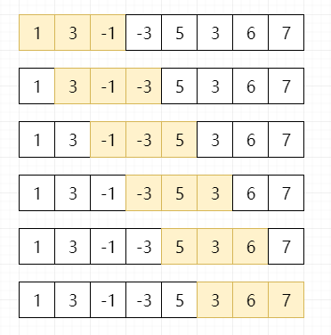

# 滑动窗口最大值

## 01、题目分析

### 第239题：滑动窗口最大值

给定一个数组 nums，有一个大小为 k 的滑动窗口从数组的最左侧移动到数组的最右侧。你只可以看到在滑动窗口内的 k 个数字。滑动窗口每次只向右移动一位。返回滑动窗口中的最大值。


返回滑动窗口中的最大值所构成的数组。


示例:

>输入: nums = [1,3,-1,-3,5,3,6,7], 和 k = 3
>输出: [3,3,5,5,6,7] 
>解释: 
>
>  滑动窗口的位置                最大值
>---------------               -----
>[1  3  -1] -3  5  3  6  7       3
>
> 1 [3  -1  -3] 5  3  6  7       3
>
> 1  3 [-1  -3  5] 3  6  7       5
>
> 1  3  -1 [-3  5  3] 6  7       5
>
> 1  3  -1  -3 [5  3  6] 7       6
>
> 1  3  -1  -3  5 [3  6  7]      7

## 02、题目分析

本题对于题目没有太多需要额外说明的，应该都能理解，直接进行分析。我们很容易想到，可以通过遍历所有的滑动窗口，找到每一个窗口的最大值，来进行暴力求解。那一共有多少个滑动窗口呢，小学题目，可以得到共有 L-k+1 个窗口。


假设 `nums = [1,3,-1,-3,5,3,6,7]`，和 `k = 3`，窗口数为`6`:



根据分析，直接完成代码：

```go
func maxSlidingWindow(nums []int, k int) []int {
	l1 := len(nums)
	index := 0
	ret := make([]int, 0)
	for index < l1 {
		m := nums[index]
		if index > l1 - k {
			break
		}
		for j := index + 1; j < index + k; j++ {
			if m < nums[j] {
				m = nums[j]
			}
		}
		ret = append(ret,m)
		index++
	}
	return ret
}
```

## 03、线性题解

这里不卖关子，其实这道题比较经典，我们可以采用队列，DP，堆等方式进行求解，所有思路的主要源头应该都是在窗口滑动的过程中，如何更快的完成查找最大值的过程。但是最典型的解法还是使用双端队列。具体怎么来求解，一起看一下。


首先，我们了解一下，什么是双端队列：是一种具有队列和栈的性质的数据结构。双端队列中的元素可以从两端弹出或者插入。


我们可以利用双端队列来实现一个窗口，目的是让该窗口可以做到张弛有度（汉语博大精深，也就是长度动态变化。其实用游标或者其他解法的目的都是一样的，就是去维护一个可变长的窗口）

然后我们再做一件事，只要遍历该数组，同时**在双端队列的头去维护当前窗口的最大值（在遍历过程中，发现当前元素比队列中的元素大，就将原来队列中的元素祭天），在整个遍历的过程中我们再记录下每一个窗口的最大值到结果数组中。**最终结果数组就是我们想要的，整体图解如下。

假设 `nums = [1,3,-1,-3,5,3,6,7]`，和 `k = 3`:


根据分析，得出代码：

```go
func maxSlidingWindow2(nums []int, k int) []int {
	ret := make([]int,0)
	if len(nums) == 0 {
		return ret
	}
	var queue []int
	for i := range nums {
		for i > 0 && (len(queue) > 0) && nums[i] > queue[len(queue)-1] {
			//将比当前元素小的元素祭天
			queue = queue[:len(queue)-1]
		}
		//将当前元素放入queue中
		queue = append(queue, nums[i])
		if i >= k && nums[i-k] == queue[0] {
			//维护队列，保证其头元素为当前窗口最大值
			queue = queue[1:]
		}
		if i >= k-1 {
			//放入结果数组
			ret = append(ret, queue[0])
		}
	}
	return ret
}
```