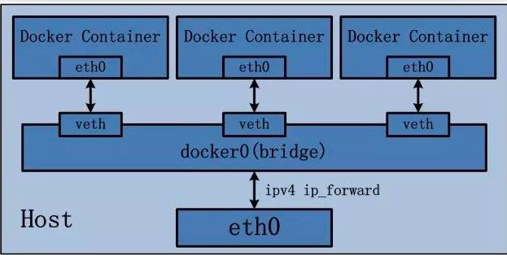
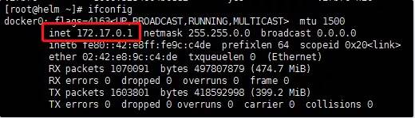
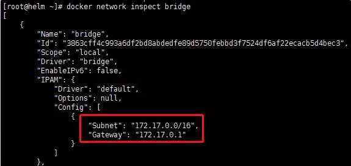
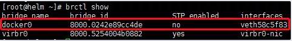
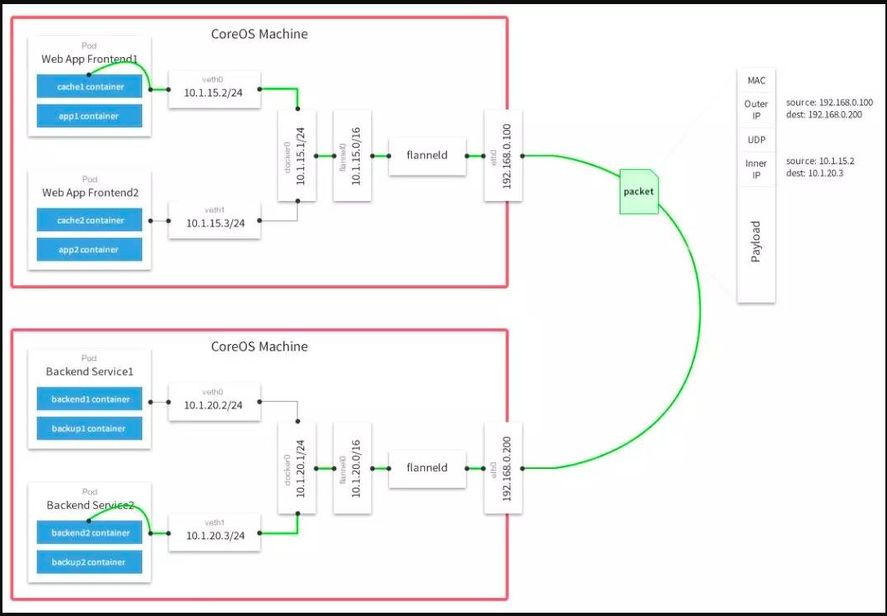
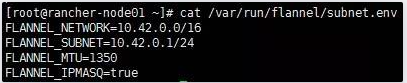
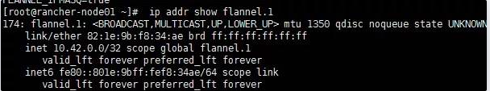
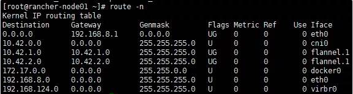

# flannel 网络插件详解 个人笔记总结


## 1、Docker网络模式

> 在讨论Kubernetes网络之前，让我们先来看一下Docker网络。Docker采用插件化的网络模式，默认提供bridge、host、none、overlay、maclan和Network plugins这几种网络模式，运行容器时可以通过–network参数设置具体使用那一种模式。

- bridge：这是Docker默认的网络驱动，此模式会为每一个容器分配Network Namespace和设置IP等，并将容器连接到一个虚拟网桥上。如果未指定网络驱动，这默认使用此驱动。
- host：此网络驱动直接使用宿主机的网络。
- none：此驱动不构造网络环境。采用了none 网络驱动，那么就只能使用loopback网络设备，容器只能使用127.0.0.1的本机网络。
- overlay：此网络驱动可以使多个Docker daemons连接在一起，并能够使用swarm服务之间进行通讯。也可以使用overlay网络进行swarm服务和容器之间、容器之间进行通讯，
- macvlan：此网络允许为容器指定一个MAC地址，允许容器作为网络中的物理设备，这样Docker daemon就可以通过MAC地址进行访问的路由。对于希望直接连接网络网络的遗留应用，这种网络驱动有时可能是最好的选择。
- Network plugins：可以安装和使用第三方的网络插件。可以在Docker Store或第三方供应商处获取这些插件。

在默认情况，Docker使用bridge网络模式，bridge网络驱动的示意图如下，此文以bridge模式对Docker的网络进行说明。




### 1.1 bridge网络的构建过程

1）安装Docker时，创建一个名为docke0的虚拟网桥，虚拟网桥使用“10.0.0.0 -10.255.255.255 “、”172.16.0.0-172.31.255.255″和“192.168.0.0——192.168.255.255”这三个私有网络的地址范围。
通过 ifconfig 命令可以查看docker0网桥的信息：



通过 docker network inspect bridge 可以查看网桥的子网网络范围和网关：



2）运行容器时，在宿主机上创建虚拟网卡veth pair设备，veth pair设备是成对出现的，从而组成一个数据通道，数据从一个设备进入，就会从另一个设备出来。**将veth pair设备的一端放在新创建的容器中，命名为eth0；另一端放在宿主机的docker0中，以veth为前缀的名字命名。**通过 brctl show 命令查看放在docker0中的veth pair设备




### 1.2 外部访问

**bridge的docker0是虚拟出来的网桥，因此无法被外部的网络访问。因此需要在运行容器时通过-p和-P参数对将容器的端口映射到宿主机的端口**。**实际上Docker是采用 NAT 的 方式**，将容器内部的服务监听端口与宿主机的某一个端口port 进行绑定，使得宿主机外部可以将网络报文发送至容器。
1）通过-P参数，将容器的端口映射到宿主机的随机端口：

```
$ docker run -P {images}
```

2）通过-p参数，将容器的端口映射到宿主机的制定端口：

```
$ docker run -p {hostPort}:{containerPort} {images}
```


### Kubernetes 网络设计模型：

•在 Kubernetes 网络中存在两种 IP（Pod IP 和 Service Cluster IP），Pod IP 地址是实际存在于某个网卡(可以是虚拟设备)上的，Service Cluster IP 它是一个虚拟 IP，是由 kube-proxy 使用 Iptables 规则重新定向到其本地端口，再均衡到后端 Pod 的。

基本原则：
 • 每个 Pod 都拥有一个独立的 IP 地址（IPper Pod），而且假定所有的 pod 都在一个可以直接连通的、扁平的网络空间中。

设计原因：
 • 用户不需要额外考虑如何建立 Pod 之间的连接，也不需要考虑将容器端口映射到主机端口等问题。

网络要求：
 • 所有的容器都可以在不用 NAT 的方式下同别的容器通讯；所有节点都可在不用 NAT 的方式下同所有容器通讯；容器的地址和别人看到的地址是同一个地址。

### K8S 网络主要解决以下网络通信问题:

• **同一 pod 下容器与容器的通信；**

• **同一节点下不同的 pod 之间的容器间通信；**

• **不同节点下容器之间的通信；**

• **集群外部与内部组件的通信；**

• **pod 与 service 之间的通信；**

### 1、容器间通信：

这种场景对于Kubernetes来说没有任何问题，根据Kubernetes的架构设计。**Kubernetes创建Pod时，首先会创建一个pause容器，为Pod指派一个唯一的IP地址。然后，以pause的网络命名空间为基础，创建同一个Pod内的其它容器（–net=container:xxx）**。因此，同一个Pod内的所有容器就会共享同一个网络命名空间，在同一个Pod之间的容器可以直接使用localhost进行通信。

同一个 [Pod](https://link.ld246.com/forward?goto=https%3A%2F%2Fwww.kubernetes.org.cn%2Ftags%2Fpod) 的容器**共享同一个网络命名空间 (network namespace)**，它们之间的访问可以用**localhost 地址 + 容器端口就可以访问。**


### 2、同一 Node 中 Pod 间通信：

同一 Node 中 Pod 的默认路由都是 docker0 的地址，由于它们关联在同一个 docker0（cni0）网桥上，**地址网段相同**，所有它们之间应当是能直接通信的。

```
同一网段指的是IP地址和子网掩码相与得到相同的网络地址。
```


### 3、不同 Node 中 Pod 间通信：

不同 Node 中 Pod 间通信要满足 2 个条件：

***\*Pod 的 IP 不能冲突\**；** **将 Pod 的 IP 和所在的 Node 的 IP 关联起来，通过这个关联让 Pod 可以互相访问**。所以就要用到 flannel 或者 calico 的网络解决方案。

对于此场景，情况现对比较复杂一些，这就需要解决 Pod 间的通信问题。在 Kubernetes 通过 flannel、calico 等网络插件解决 Pod 间的通信问题。以 flannel 为例说明在 Kubernetes 中网络模型，flannel 是 kubernetes 默认提供网络插件。Flannel 是由 CoreOs 团队开发社交的网络工具，CoreOS 团队采用 L3 Overlay 模式设计 flannel， **规定宿主机下各个 Pod 属于同一个子网，不同宿主机下的 Pod 属于不同的子网。**


**flannel会在每一个宿主机上运行名为flanneld代理**，**其负责为宿主机预先分配一个子网，并为Pod分配IP地址**。Flannel使用Kubernetes或etcd来存储网络配置、分配的子网和主机公共IP等信息。数据包则通过VXLAN、UDP或host-gw这些类型的后端机制进行转发。




### Flannel在K8S中运行的整体过程

#### 1）设置集群网络

flannel默认使用etcd作为配置和协调中心，首先使用etcd设置集群的整体网络。通过如下的命令能够查询网络配置信息：

```
$ etcdctl ls /coreos.com/network/config
```

#### 2）设置Node节点上的子网

基于在etcd中设置的网络，**flannel为每一个Node分配IP子网。**
获取子网列表

```
$ etcdctl ls /coreos.com/network/subnets
```

获取子网信息

```
$ etcdctl ls /coreos.com/network/subnets/{IP网段}
```

#### 3）在每个Node上启动flanneld

flannel在每个Node上启动了一个flanneld的服务，在flanneld启动后，将从etcd中读取配置信息，并请求获取子网的租约。所有Node上的flanneld都依赖etcd cluster来做集中配置服务，etcd保证了所有node上flanned所看到的配置是一致的。同时每个node上的flanned监听etcd上的数据变化，实时感知集群中node的变化。flanneld一旦获取子网租约、配置后端后，会将一些信息写入/run/flannel/subnet.env文件。

```
$ cat /var/run/flannel/subnet.env
```



#### 4）创建虚拟网卡

**在Node节点上，会创建一个名为flannel.1的虚拟网卡。**

```
$ ip addr show flannel.1
```



#### 5）创建Docker网桥

并为容器配置名为docker0的网桥，实际是通过修改Docker的启动参数–bip来实现的。通过这种方式，为每个节点的Docker0网桥设置在整个集群范围内唯一的网段，从保证创建出来的Pod的IP地址是唯一。

```
$ ip addr show docker0
```


#### 6）修改路由表

**flannel会对路由表进行修改，从而能够实现容器跨主机的通信。**

```
$ route -n
```



## 数据传递过程

在源容器宿主机中的数据传递过程：

#### 1）源容器向目标容器发送数据，数据首先发送给docker0网桥

在源容器内容查看路由信息：

```
$ kubectl exec -it -p {Podid} -c {ContainerId} -- ip route
```

#### 2）docker0网桥接受到数据后，将其转交给flannel.1虚拟网卡处理

docker0收到数据包后，docker0的内核栈处理程序会读取这个数据包的目标地址，根据目标地址将数据包发送给下一个路由节点：
查看源容器所在Node的路由信息：

```
$ ip route
```

#### 3）flannel.1接受到数据后，对数据进行封装，并发给宿主机的eth0

flannel.1收到数据后，flannelid会将数据包封装成**二层以太包**。
Ethernet Header的信息：

- From:{源容器flannel.1虚拟网卡的MAC地址}
- To:{目录容器flannel.1虚拟网卡的MAC地址}

#### 4）对在flannel路由节点封装后的数据，进行再封装后，转发给目标容器Node的eth0

由于目前的数据包只是vxlan tunnel上的数据包，因此还不能在物理网络上进行传输。因此，需要将上述数据包再次进行封装，才能源容器节点传输到目标容器节点，这项工作在由linux内核来完成。
Ethernet Header的信息：

- From:{源容器Node节点网卡的MAC地址}
- To:{目录容器Node节点网卡的MAC地址}

IP Header的信息：

- From:{源容器Node节点网卡的IP地址}
- To:{目录容器Node节点网卡的IP地址}

通过此次封装，就可以通过物理网络发送数据包。
在目标容器宿主机中的数据传递过程：

#### 5）目标容器宿主机的eth0接收到数据后，对数据包进行拆封，并转发给flannel.1虚拟网卡；

#### 6）flannel.1 虚拟网卡接受到数据，将数据发送给docker0网桥；

#### 7）最后，数据到达目标容器，完成容器之间的数据通信。

