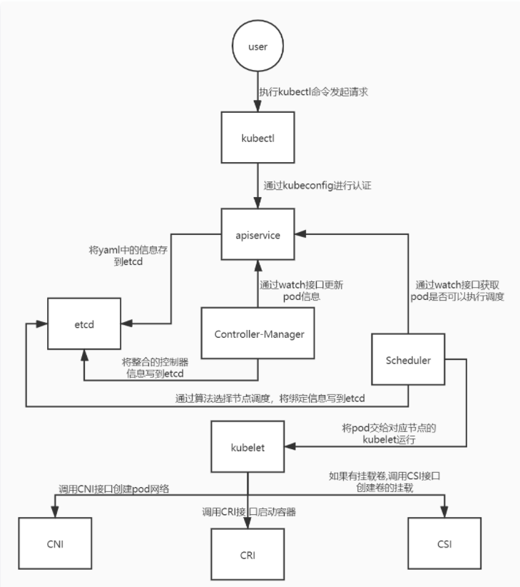

将 Pod 部署运行在 Kubernetes 内，前几个步骤你可能很熟悉

1. kubectl 将 YAML 发送到 API

1. Pod 存储在 etcd 中

1. 调度程序分配一个节点(此时Pod配置清单文件存储在 etcd 中，节点内并没有该 pod 

1. kubelet 开始创建 Pod

1. kubelet 将创建容器的委托委派给 CRI

1. kubelet 代表将容器连接到 CNI 的网络

1. CNI 分配一个 IP 地址

1. 检查探针

   

2. kubelet 将 IP 地址报告给控制平面

此时 Pod 就已经创建完成了，除非 Pod 是服务的一部分，否则 Kubernetes会在此处停止。如果 Pod 属于服务，Kubernetes 会创建一个端点 `endpoint `-它连接 Pod 的 IP 地址和端口（`targetPort`）。将端点 `endpoint `添加到端点（`对象 object`）。

这些端点将会用于以下:

- `kube-proxy`设置iptables规则
- `CoreDNS`更新DNS条目
- `Ingress`入口控制器设置下游服务`downstreams`
- Service meshes
- More operators其他运营商

就这样，完成一个 Pod 的创建和发布，对于删除 Pod 来说过程一样，不过是相反。

## 简述Kubernetes创建一个Pod的主要流程？

Kubernetes中创建一个Pod涉及多个组件之间联动，主要流程如下：

- 1、客户端提交Pod的配置信息（可以是yaml文件定义的信息）到kube-apiserver。
- 2、Apiserver收到指令后，通知给controller-manager创建一个资源对象。
- 3、Controller-manager通过api-server将pod的配置信息存储到ETCD数据中心中。
- 4、Kube-scheduler检测到pod信息会开始调度预选，会先过滤掉不符合Pod资源配置要求的节点，然后开始调度调优，主要是挑选出更适合运行pod的节点，然后将pod的资源配置单发送到node节点上的kubelet组件上。
- 5、Kubelet根据scheduler发来的资源配置单运行pod，运行成功后，将pod的运行信息返回给scheduler，scheduler将返回的pod运行状况的信息存储到etcd数据中心。

# Kubernetes中pod的创建流程

一般我们在创建pod的过程中都是，执行kubectl命令去apply对应的yaml文件，但是在执行这个操作的过程到pod被完成创建，k8s的组件都做了哪些操作呢？下面我们简要说说pod被创建的过程。

1.用户通过kubectl命名发起请求。

2.apiserver通过对应的kubeconfig进行认证，认证通过后将yaml中的po信息存到etcd。

\3. Controller-Manager通过apiserver的watch接口发现了pod信息的更新，执行该资源所依赖的拓扑结构整合，整合后将对应的信息写到etcd，此时pod已经可以被调度了。

4.Scheduler同样通过apiserver的watch接口更新到pod可以被调度，通过算法给pod分配节点，并将pod和对应节点绑定的信息写到etcd，然后将pod交给kubelet。

5.kubelet收到pod后，调用CNI接口给pod创建pod网络，调用CRI接口去启动容器，调用CSI进行存储卷的挂载。

6.网络，容器，存储创建完成后pod创建完成，等业务进程启动后，pod运行成功。