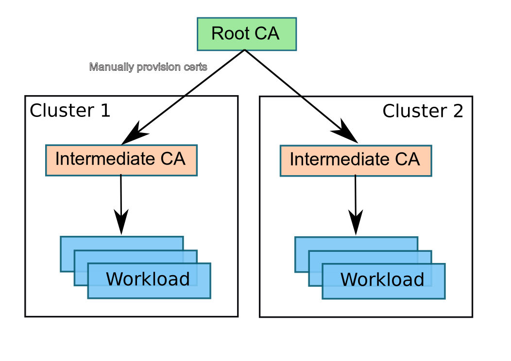
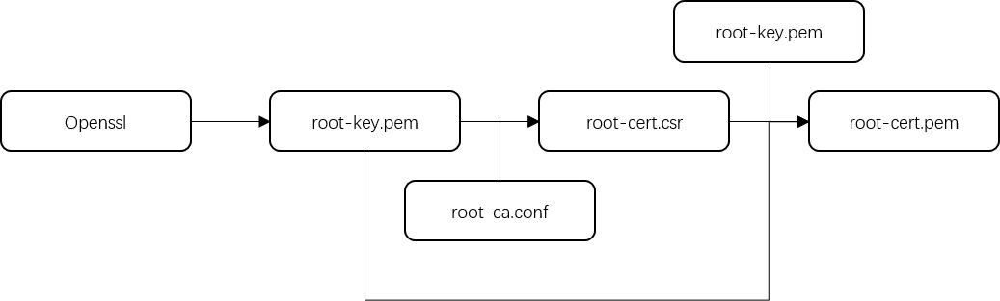
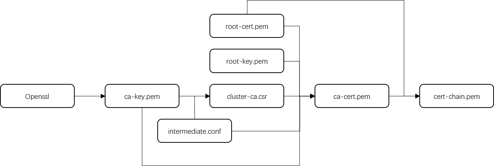

# 证书管理

## 概览

此节说明管理员如何使用root认证，签名认证和秘钥来配置istio权限认证。

默认情况下istio的CA会生成自签名root证书和秘钥，并使用他们去对workload证书进行签名。istio的CA也可以使用管理员指定的证书，秘钥，以及root证书来对workload证书进行签名。

root CA会被一个mesh中的所有workload当做信任root。每个istio的CA都会使用一个被root CA签名过的过渡CA来签名秘钥和证书。当一个mesh中存在多个istio的CA时，这些CA会建立一个信任层级结构，如下图：



​																				**CA Hierarchy**

## 添加证书

**本次演示实例使用istio包中提供的证书生成文件**

**根证书生成**



**次级证书签发**




```bash
# 新建目录用于存放证书文件
mkdir -p certs 
pushd certs

# 使用istio提供的文件生成根证书
make -f ../tools/certs/Makefile.selfsigned.mk root-ca 
# root-cert.pem: 根证书
# root-key.pem: 根秘钥
# root-ca.conf: 生成根证书的OpenSSL配置
# root-cert.csr: 生成根证书的csr

# 使用根证书签发次级证书
make -f ../tools/certs/Makefile.selfsigned.mk cluster1-cacerts
# ca-cert.pem: 次级证书
# ca-key.pem: 次级秘钥
# cert-chain.pem: 生成的istiod所需的证书链文件
# root-cert.pem: 根证书
```


## 与其他集群共用根证书

将原集群生成的根证书文件拷贝到所需签发的集群中，以istio为例，根证书文件包括：

- `root-cert.pem`
- `root-key.pem`

```bash
# 新建目录用于存放证书文件
mkdir -p certs 
pushd certs

# 将root-cert.pem root-key.pem两个文件拷贝到certs目录下

# 使用根证书签发次级证书
make -f ../tools/certs/Makefile.selfsigned.mk cluster1-cacerts
# ca-cert.pem: 次级证书
# ca-key.pem: 次级秘钥
# cert-chain.pem: 生成的istiod所需的证书链文件
# root-cert.pem: 根证书
```

