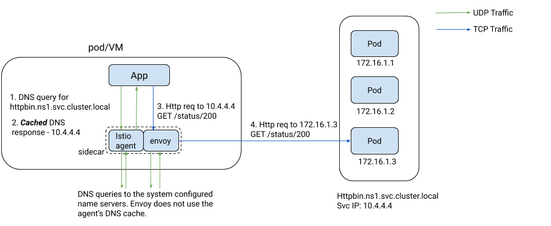
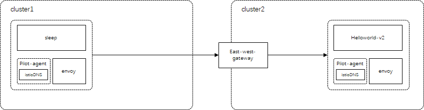

# 多云网络方案调研

## 约束

- 系统：

  - **所有的测试集群均为单节点k8s**

  - 测试：(2台同配置机器)

    ```bash
    [root@linuxtestb432 zhangc]# lsb_release -a
    LSB Version:	:core-4.1-amd64:core-4.1-noarch:cxx-4.1-amd64:cxx-4.1-noarch:desktop-4.1-amd64:desktop-4.1-noarch:languages-4.1-amd64:languages-4.1-noarch:printing-4.1-amd64:printing-4.1-noarch
    Distributor ID:	CentOS
    Description:	CentOS Linux release 7.5.1804 (Core) 
    Release:	7.5.1804
    Codename:	Core
    ------
    [root@linuxtestb432 zhangc]# lscpu
    Architecture:        x86_64
    CPU op-mode(s):      32-bit, 64-bit
    Byte Order:        Little Endian
    CPU(s):            8
    On-line CPU(s) list:   0-7
    Thread(s) per core:    1
    Core(s) per socket:    1
    Socket(s):         8
    NUMA node(s):        1
    Vendor ID:         GenuineIntel
    CPU family:        6
    Model:             85
    Model name:        Intel(R) Xeon(R) Gold 5118 CPU @ 2.30GHz
    Stepping:          4
    CPU MHz:           2294.609
    ------
    [root@linuxtestb432 zhangc]# free -h
              total      used      free    shared  buff/cache   available
    Mem:        39G      2.3G       25G      292M       11G       36G
    Swap:        0B        0B        0B
    ------
     [root@linuxtestb432 zhangc]# df -h
    Filesystem           Size  Used Avail Use% Mounted on
    /dev/mapper/centos-root  1.1T   19G  980G   2% /
    ```

  - 推荐：Centos 7.5.1804 | 4核8G

- 网络：不同网络。（跨集群pod间无法正常通信）

- docker环境：

  ```bash
  [root@linuxtestb432 zhangc]# docker version
  Client: Docker Engine - Community
   Version:           19.03.8
   API version:       1.40
   Go version:        go1.12.17
   Git commit:        afacb8b
   Built:             Wed Mar 11 01:27:04 2020
   OS/Arch:           linux/amd64
   Experimental:      false
  
  Server: Docker Engine - Community
   Engine:
    Version:          19.03.8
    API version:      1.40 (minimum version 1.12)
    Go version:       go1.12.17
    Git commit:       afacb8b
    Built:            Wed Mar 11 01:25:42 2020
    OS/Arch:          linux/amd64
    Experimental:     false
   containerd:
    Version:          1.2.13
    GitCommit:        7ad184331fa3e55e52b890ea95e65ba581ae3429
   runc:
    Version:          1.0.0-rc10
    GitCommit:        dc9208a3303feef5b3839f4323d9beb36df0a9dd
   docker-init:
    Version:          0.18.0
    GitCommit:        fec3683
  ```

  

- k8s环境：

  ```bash
  [root@linuxtestb432 zhangc]# kubectl version
  Client Version: version.Info{Major:"1", Minor:"18", GitVersion:"v1.18.2", GitCommit:"52c56ce7a8272c798dbc29846288d7cd9fbae032", GitTreeState:"clean", BuildDate:"2020-04-16T11:56:40Z", GoVersion:"go1.13.9", Compiler:"gc", Platform:"linux/amd64"}
  Server Version: version.Info{Major:"1", Minor:"18", GitVersion:"v1.18.2", GitCommit:"52c56ce7a8272c798dbc29846288d7cd9fbae032", GitTreeState:"clean", BuildDate:"2020-04-16T11:48:36Z", GoVersion:"go1.13.9", Compiler:"gc", Platform:"linux/amd64"}
  ```

- istio环境：

  ```bash
  [root@linuxtestb432 zhangc]# istioctl version
  client version: 1.9.2
  control plane version: 1.9.2
  data plane version: 1.9.2 (7 proxies)
  ```

  

## 前言

> Service workloads across cluster boundaries communicate indirectly, via dedicated gateways for [east-west](https://en.wikipedia.org/wiki/East-west_traffic) traffic. The gateway in each cluster must be reachable from the other cluster.
> 
> 跨集群的服务之间须要通过东西向网关简介通信。每个集群中的网关必须满足其他集群可达。

**目前根据istio官网文档，丝毫没有提及pod-to-pod网络的连通，因此需要我们自己打通网络，或者找出一套网络解决方案，用来实现跨集群pod通信**

**目前测试的网络环境为局域网，不具备`loadbalancer`能力**

## 网络情况&底层调用分析

### 网络情况

node间网络通畅（可以ping通），跨集群pod间网络隔离，处于不同的子网。

### 底层调用情况（跨集群）



可以看到，对于同一个集群来说，pod间通信，是直接访问目标podIP的，但是对于跨集群pod通信而言，最终调用的时候，当前的DNS服务器并不知道目标podIP在哪个服务器上。

istio官网提供的解决方案中，使用的网络解决方案是使用`loadbalancer`，但是一般的局域网而言，并不具备`loadbalancer`的能力，因此我们选择使用相同原理的`nodeport`模式。




如图，`East-west-gateway`是istio提供的东西向网关，以`nodeport`形式对外暴露，sleep服务的数据包全部导向`East-west-gateway`，再由`East-west-gateway`将流量重新导向目标pod `helloworld-v2`。

因为上文提到，pod-to-pod通信，是直接请求目标podIP，这是不合理的，因此需要在istio中配置一些信息：

```bash
kubectl edit cm istio -n istio-system
```

```yaml
apiVersion: v1
data:
  mesh: |-
    defaultConfig:
      discoveryAddress: istiod.istio-system.svc:15012
      meshId: mesh1
      proxyMetadata:
        ISTIO_META_DNS_AUTO_ALLOCATE: "true"
        ISTIO_META_DNS_CAPTURE: "true"
      tracing:
        zipkin:
          address: zipkin.istio-system:9411
    enablePrometheusMerge: true
    rootNamespace: istio-system
    trustDomain: cluster.local
  meshNetworks: |- # 需要添加部分
    networks:
      network1: # istioOperator中 .Values.global.network
        endpoints:
          - fromRegistry: cluster1 # istioOperator中 .Values.global.multiCluster.clusterName
        gateways:
          - address: 10.20.144.83 # eastwestgateway 所在nodeIP
            port: 31674 # eastwestgateway 对外暴露的port
      network2:
        endpoints:
          - fromRegistry: cluster2
        gateways:
          - address: 10.20.144.165
            port: 32361
kind: ConfigMap
...
```

上述configmap需要在每一个接入mesh的k8s上配置。


