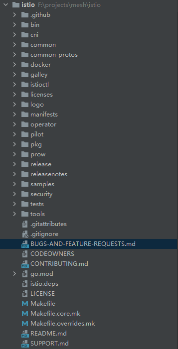

# multicluster 网络配置源码分析

## 约束

- 系统：

  - **所有的测试集群均为单节点k8s**

  - 测试：(2台同配置机器)

    ```bash
    [root@linuxtestb432 zhangc]# lsb_release -a
    LSB Version:	:core-4.1-amd64:core-4.1-noarch:cxx-4.1-amd64:cxx-4.1-noarch:desktop-4.1-amd64:desktop-4.1-noarch:languages-4.1-amd64:languages-4.1-noarch:printing-4.1-amd64:printing-4.1-noarch
    Distributor ID:	CentOS
    Description:	CentOS Linux release 7.5.1804 (Core) 
    Release:	7.5.1804
    Codename:	Core
    ------
    [root@linuxtestb432 zhangc]# lscpu
    Architecture:        x86_64
    CPU op-mode(s):      32-bit, 64-bit
    Byte Order:        Little Endian
    CPU(s):            8
    On-line CPU(s) list:   0-7
    Thread(s) per core:    1
    Core(s) per socket:    1
    Socket(s):         8
    NUMA node(s):        1
    Vendor ID:         GenuineIntel
    CPU family:        6
    Model:             85
    Model name:        Intel(R) Xeon(R) Gold 5118 CPU @ 2.30GHz
    Stepping:          4
    CPU MHz:           2294.609
    ------
    [root@linuxtestb432 zhangc]# free -h
              total      used      free    shared  buff/cache   available
    Mem:        39G      2.3G       25G      292M       11G       36G
    Swap:        0B        0B        0B
    ------
     [root@linuxtestb432 zhangc]# df -h
    Filesystem           Size  Used Avail Use% Mounted on
    /dev/mapper/centos-root  1.1T   19G  980G   2% /
    ```

  - 推荐：Centos 7.5.1804 | 4核8G

- 网络：不同网络。（跨集群pod间无法正常通信）

- docker环境：

  ```bash
  [root@linuxtestb432 zhangc]# docker version
  Client: Docker Engine - Community
   Version:           19.03.8
   API version:       1.40
   Go version:        go1.12.17
   Git commit:        afacb8b
   Built:             Wed Mar 11 01:27:04 2020
   OS/Arch:           linux/amd64
   Experimental:      false
  
  Server: Docker Engine - Community
   Engine:
    Version:          19.03.8
    API version:      1.40 (minimum version 1.12)
    Go version:       go1.12.17
    Git commit:       afacb8b
    Built:            Wed Mar 11 01:25:42 2020
    OS/Arch:          linux/amd64
    Experimental:     false
   containerd:
    Version:          1.2.13
    GitCommit:        7ad184331fa3e55e52b890ea95e65ba581ae3429
   runc:
    Version:          1.0.0-rc10
    GitCommit:        dc9208a3303feef5b3839f4323d9beb36df0a9dd
   docker-init:
    Version:          0.18.0
    GitCommit:        fec3683
  ```

  

- k8s环境：

  ```bash
  [root@linuxtestb432 zhangc]# kubectl version
  Client Version: version.Info{Major:"1", Minor:"18", GitVersion:"v1.18.2", GitCommit:"52c56ce7a8272c798dbc29846288d7cd9fbae032", GitTreeState:"clean", BuildDate:"2020-04-16T11:56:40Z", GoVersion:"go1.13.9", Compiler:"gc", Platform:"linux/amd64"}
  Server Version: version.Info{Major:"1", Minor:"18", GitVersion:"v1.18.2", GitCommit:"52c56ce7a8272c798dbc29846288d7cd9fbae032", GitTreeState:"clean", BuildDate:"2020-04-16T11:48:36Z", GoVersion:"go1.13.9", Compiler:"gc", Platform:"linux/amd64"}
  ```

- istio环境：

  ```bash
  [root@linuxtestb432 zhangc]# istioctl version
  client version: 1.9.2
  control plane version: 1.9.2
  data plane version: 1.9.2 (7 proxies)
  ```

  

## 在哪儿配置？

首先看一下istio的网络配置文件：

```bash
kubectl edit cm istio -n istio-system
```

```yaml
apiVersion: v1
data:
  mesh: |-
    defaultConfig:
      discoveryAddress: istiod.istio-system.svc:15012
      meshId: mesh1
      proxyMetadata:
        ISTIO_META_DNS_AUTO_ALLOCATE: "true"
        ISTIO_META_DNS_CAPTURE: "true"
      tracing:
        zipkin:
          address: zipkin.istio-system:9411
    enablePrometheusMerge: true
    rootNamespace: istio-system
    trustDomain: cluster.local
  meshNetworks: |-
    networks: {}
kind: ConfigMap
...
```

没有配置网络的情况下，可以看到`meshNetworks`部分为一个空结构。这个`meshNetworks`就是istio自身具备网络功能的配置文件，其功能的实现依赖于istio的数据面，也就是envoy。具体配置信息以及规则请参考《multicluster network investigation》。

**因此，我们只要在这个cm中配置正确的内容，就可以借助envoy实现跨集群通信功能。**

## 怎么生成的？

根据上一个问题，我们可以看出，这是一个configmap文件，其中包含了istio的两项配置：

- mesh
- meshNetworks

istio v1.9.2目录结构如下：



可以看到其中有一个manifests目录：

```
├─manifests
   └─charts
      └─istio-control
         └─istio-discovery
            ├─templates
            │  └─configmap.yaml
            └─values.yaml  
```

打开configmap.yaml文件

```yaml
apiVersion: v1
kind: ConfigMap
metadata:
  name: istio{{- if not (eq .Values.revision "") }}-{{ .Values.revision }}{{- end }}
  namespace: {{ .Release.Namespace }}
  labels:
    istio.io/rev: {{ .Values.revision | default "default" }}
    install.operator.istio.io/owning-resource: {{ .Values.ownerName | default "unknown" }}
    operator.istio.io/component: "Pilot"
    release: {{ .Release.Name }}
data:

  # Configuration file for the mesh networks to be used by the Split Horizon EDS.
  meshNetworks: |-
  {{- if .Values.global.meshNetworks }}
    networks:
{{ toYaml .Values.global.meshNetworks | trim | indent 6 }}
  {{- else }}
    networks: {}
  {{- end }}

  mesh: |-
{{- if .Values.meshConfig }}
{{ $mesh | toYaml | indent 4 }}
{{- else }}
{{- include "mesh" . }}
{{- end }}
---
```

可以看到`meshNetworks`是由gotemplate生成的，其模板替换条件文件就是上面提到的values.yaml,内容如下：

```yaml
...
 # Configure the mesh networks to be used by the Split Horizon EDS.
  #
  # The following example defines two networks with different endpoints association methods.
  # For `network1` all endpoints that their IP belongs to the provided CIDR range will be
  # mapped to network1. The gateway for this network example is specified by its public IP
  # address and port.
  # The second network, `network2`, in this example is defined differently with all endpoints
  # retrieved through the specified Multi-Cluster registry being mapped to network2. The
  # gateway is also defined differently with the name of the gateway service on the remote
  # cluster. The public IP for the gateway will be determined from that remote service (only
  # LoadBalancer gateway service type is currently supported, for a NodePort type gateway service,
  # it still need to be configured manually).
  #
  # meshNetworks:
  #   network1:
  #     endpoints:
  #     - fromCidr: "192.168.0.1/24"
  #     gateways:
  #     - address: 1.1.1.1
  #       port: 80
  #   network2:
  #     endpoints:
  #     - fromRegistry: reg1
  #     gateways:
  #     - registryServiceName: istio-ingressgateway.istio-system.svc.cluster.local
  #       port: 443
  #
  meshNetworks: {}
...
```

> The public IP for the gateway will be determined from that remote service (only LoadBalancer gateway service type is currently supported, for a NodePort type gateway service, it still need to be configured manually)

可以看到在判断条件中就是空值，所以需要我们手动在configmap中添加。

**所以，manifests目录下的这两个文件就是生成configmap的关键文件，而其中meshNetworks字段默认为空，所以需要我们手动配置。**

## 如何生效的？

接下来，我们将从源码的角度来分析，我们在配置好网络后，是如何被envoy感知到配置变更的。

我们知道，所有的配置下发行为都是从pilot组件产生的，网络配置也不例外。

### 入口文件

`./pilot/pkg/bootstrap/server.go`是pilot组件的启动入口文件，其中包含了所有组件的初始化逻辑：

```go
// ./pilot/pkg/bootstrap/server.go
func NewServer(args *PilotArgs) (*Server, error) {
    // doSomething
    
    s.initMeshConfiguration(args, s.fileWatcher)
	spiffe.SetTrustDomain(s.environment.Mesh().GetTrustDomain())

	s.initMeshNetworks(args, s.fileWatcher) // 初始化network配置监听
	s.initMeshHandlers() // 增加回调函数用于推送更新配置
    
    // doSomething
    
    s.initDiscoveryService(args)
    
    // doSomething
}
```

可以看到，代码中首先对network配置启动一个监听器，然后对其添加回调函数，用于推送更新。

### 初始化network配置监听

```go
// ./pilot/pkg/bootstrap/mesh.go
func (s *Server) initMeshNetworks(args *PilotArgs, fileWatcher filewatcher.FileWatcher) {
	log.Info("initializing mesh networks")
	if args.NetworksConfigFile != "" {
		var err error
		s.environment.NetworksWatcher, err = mesh.NewNetworksWatcher(fileWatcher, args.NetworksConfigFile) // 正常状态下会走得逻辑
		if err != nil {
			log.Info(err)
		}
	}

	if s.environment.NetworksWatcher == nil {
		log.Info("mesh networks configuration not provided")
		s.environment.NetworksWatcher = mesh.NewFixedNetworksWatcher(nil)
	}
}
```

`mesh.NewNetworksWatcher`会生成一个监听器，持久化在`s`中。

```go
// ./pkg/config/mesh/networks_watcher.go
func NewNetworksWatcher(fileWatcher filewatcher.FileWatcher, filename string) (NetworksWatcher, error) {
	meshNetworks, err := ReadMeshNetworks(filename)
	if err != nil {
		return nil, fmt.Errorf("failed to read mesh networks configuration from %q: %v", filename, err)
	}

	ResolveHostsInNetworksConfig(meshNetworks)
	networksdump, _ := gogoprotomarshal.ToJSONWithIndent(meshNetworks, "   ")
	log.Infof("mesh networks configuration: %s", networksdump)

	w := &networksWatcher{
		networks: meshNetworks,
	}

	// Watch the networks config file for changes and reload if it got modified
	addFileWatcher(fileWatcher, filename, func() { // 启动监听器
		// Reload the config file
		meshNetworks, err := ReadMeshNetworks(filename)
		if err != nil {
			log.Warnf("failed to read mesh networks configuration from %q: %v", filename, err)
			return
		}
		w.SetNetworks(meshNetworks) // 作为回调主要逻辑
	})
	return w, nil
}
```

```go
// ./pkg/config/mesh/watcher.go
func addFileWatcher(fileWatcher filewatcher.FileWatcher, file string, callback func()) {
	_ = fileWatcher.Add(file)
	go func() { // 开启持续监听
		var timerC <-chan time.Time
		for {
			select {
			case <-timerC:
				timerC = nil
				callback() // 接收到信号量后，执行回调
			case <-fileWatcher.Events(file): // 文件变化，开始执行防抖
				// 函数防抖，接下来0.1秒内，所有的配置更新操作只执行最后一次
				if timerC == nil {
					timerC = time.After(100 * time.Millisecond)
				}
			}
		}
	}()
}
```

```go
// ./pkg/config/mesh/networks_watcher.go
func (w *networksWatcher) SetNetworks(meshNetworks *meshconfig.MeshNetworks) {
	var handlers []func()

	w.mutex.Lock()
	if !reflect.DeepEqual(meshNetworks, w.networks) { // 配置变化，开始更新
		ResolveHostsInNetworksConfig(meshNetworks)
		networksdump, _ := gogoprotomarshal.ToJSONWithIndent(meshNetworks, "    ")
		log.Infof("mesh networks configuration updated to: %s", networksdump)

		// 存储配置w.networks
		atomic.StorePointer((*unsafe.Pointer)(unsafe.Pointer(&w.networks)), unsafe.Pointer(meshNetworks))
		handlers = append([]func(){}, w.handlers...)
	}
	w.mutex.Unlock()

	// 执行已注册的方法.
	for _, h := range handlers {
		h()
	}
}
```

### 增加回调函数

为监听事件添加回调函数，配置发生变化时调用回调函数

```go
// ./pilot/pkg/bootstrap/server.go
func (s *Server) initMeshHandlers() {
	log.Info("initializing mesh handlers")
	// When the mesh config or networks change, do a full push.
	s.environment.AddMeshHandler(func() {
		spiffe.SetTrustDomain(s.environment.Mesh().GetTrustDomain())
		s.XDSServer.ConfigGenerator.MeshConfigChanged(s.environment.Mesh())
		s.XDSServer.ConfigUpdate(&model.PushRequest{
			Full:   true,
			Reason: []model.TriggerReason{model.GlobalUpdate},
		})
	})
	s.environment.AddNetworksHandler(func() { // 注册grpc推送方法
		s.XDSServer.ConfigUpdate(&model.PushRequest{
			Full:   true,
			Reason: []model.TriggerReason{model.GlobalUpdate},
		})
	})
}

// ./pkg/config/mesh/networks_watcher.go
func (w *networksWatcher) AddNetworksHandler(h func()) {
	w.mutex.Lock()
	defer w.mutex.Unlock()

	// 将最新的方法注册到第一执行位
	w.handlers = append([]func(){h}, w.handlers...)
}
```

可以看到`s.XDSServer.ConfigUpdate`被注册进了`handlers`数组。在`SetNetworks`中完成**存储配置w.networks**后，`s.ENV`已经被成功修改，所以**执行已注册的方法**时，已经携带了最新的配置文件。


### 推送配置

`s.XDSServer.ConfigUpdate`执行了之后，由于已经启动了goroutine监听了PushRequest，因此每一次的ConfigUpdate都会触发一次配置推送。

```go
// ./pilot/pkg/bootstrap/server.go
func (s *Server) initDiscoveryService(args *PilotArgs) {
	log.Infof("starting discovery service")
	// Implement EnvoyXdsServer grace shutdown
	s.addStartFunc(func(stop <-chan struct{}) error {
		log.Infof("Starting ADS server")
		s.XDSServer.Start(stop)
		return nil
	})
}

// ./pilot/pkg/xds/discovery.go
// 启动了四个goroutine
func (s *DiscoveryServer) Start(stopCh <-chan struct{}) {
	go s.WorkloadEntryController.Run(stopCh)
	go s.handleUpdates(stopCh) // 启动goroutine监听PushRequest
	go s.periodicRefreshMetrics(stopCh)
	go s.sendPushes(stopCh)
}

// ./pilot/cmd/pilot-discovery/main.go

		RunE: func(c *cobra.Command, args []string) error {
			cmd.PrintFlags(c.Flags())

			// Create the stop channel for all of the servers.
			stop := make(chan struct{})

			// Create the server for the discovery service.
			discoveryServer, err := bootstrap.NewServer(serverArgs) // 新建服务
			if err != nil {
				return fmt.Errorf("failed to create discovery service: %v", err)
			}

			// Start the server
			if err := discoveryServer.Start(stop); err != nil { // 开始服务
				return fmt.Errorf("failed to start discovery service: %v", err)
			}

			cmd.WaitSignal(stop)
			// Wait until we shut down. In theory this could block forever; in practice we will get
			// forcibly shut down after 30s in Kubernetes.
			discoveryServer.WaitUntilCompletion()
			return nil
		},

//  ./pilot/pkg/bootstrap/server.go
func (s *Server) Start(stop <-chan struct{}) error {
	log.Infof("Starting Istiod Server with primary cluster %s", s.clusterID)

	// Now start all of the components.
	for _, fn := range s.startFuncs { // 执行所有注册函数
		if err := fn(stop); err != nil {
			return err
		}
	}
}
```

```go
// ./pilot/pkg/xds/discovery.go
// 以goroutine的方式监听一个channel s.pushChannel
func (s *DiscoveryServer) handleUpdates(stopCh <-chan struct{}) {
	debounce(s.pushChannel, stopCh, s.debounceOptions, s.Push, s.CommittedUpdates)
}

// The debounce helper function is implemented to enable mocking
func debounce(ch chan *model.PushRequest, stopCh <-chan struct{}, opts debounceOptions, pushFn func(req *model.PushRequest), updateSent *atomic.Int64) {
	var timeChan <-chan time.Time
	var startDebounce time.Time
	var lastConfigUpdateTime time.Time

	pushCounter := 0
	debouncedEvents := 0

	// Keeps track of the push requests. If updates are debounce they will be merged.
	var req *model.PushRequest

	free := true
	freeCh := make(chan struct{}, 1)

	push := func(req *model.PushRequest, debouncedEvents int) {
		pushFn(req)
		updateSent.Add(int64(debouncedEvents))
		freeCh <- struct{}{}
	}

	pushWorker := func() {
		eventDelay := time.Since(startDebounce)
		quietTime := time.Since(lastConfigUpdateTime)
		// it has been too long or quiet enough
		if eventDelay >= opts.debounceMax || quietTime >= opts.debounceAfter {
			if req != nil {
				pushCounter++
				adsLog.Infof("Push debounce stable[%d] %d: %v since last change, %v since last push, full=%v",
					pushCounter, debouncedEvents,
					quietTime, eventDelay, req.Full)

				free = false
				go push(req, debouncedEvents)
				req = nil
				debouncedEvents = 0
			}
		} else {
			timeChan = time.After(opts.debounceAfter - quietTime)
		}
	}

	for {
		select {
		case <-freeCh:
			free = true
			pushWorker()
		case r := <-ch: // 实时监听pushRequest，发起推送
			// If reason is not set, record it as an unknown reason
			if len(r.Reason) == 0 {
				r.Reason = []model.TriggerReason{model.UnknownTrigger}
			}
			if !opts.enableEDSDebounce && !r.Full {
				// trigger push now, just for EDS
				go pushFn(r)
				continue
			}

			lastConfigUpdateTime = time.Now()
			if debouncedEvents == 0 {
				timeChan = time.After(opts.debounceAfter)
				startDebounce = lastConfigUpdateTime
			}
			debouncedEvents++

			req = req.Merge(r)
		case <-timeChan:
			if free {
				pushWorker()
			}
		case <-stopCh:
			return
		}
	}
}
```

