# multicluster系统设计文档

## 版本

| 多云版本号 |  开始时间  |  截止时间  | 参与人员 | Mesh Server 版本 | 需求版本 |
| :--------: | :--------: | :--------: | :------: | :--------------: | :------: |
|   v2.3.4   | 2021.6中旬 | 2021.7中旬 |   张纯   |      v2.3.4      |  v2.3.4  |

## 约束

- 系统环境：

  ```txt
  centos 7.3 - centos 7.6 支持
  
  推荐4核8线程 8G内存 及以上
  最低配置 2核4线程 4G内存
  
  硬盘存储 50G+
  
  互相可访问的主机，pod-to-pod网络不通
  ```

- 版本支持：

  ```
  k8s 1.18.2+
  docekr 19.03+
  istio 1.9.2
  ```

- 根证书：

  根据istio官方约束，使用默认安装的自签名CA（self-signed CA）会导致多云环境不可用。所以需要使用istio官方提供的证书生成工具，或者自己提供一套证书用作根证书，并可用于签发子证书。

- ~~压缩包格式：~~

  ~~支持 zip 、rar、tar、tar.gz~~

- 根证书文件(必须提供)：

  - root-cert.pem
  - root-key.pem

- MySQL请参考数据表设计

## 多云部署模型：

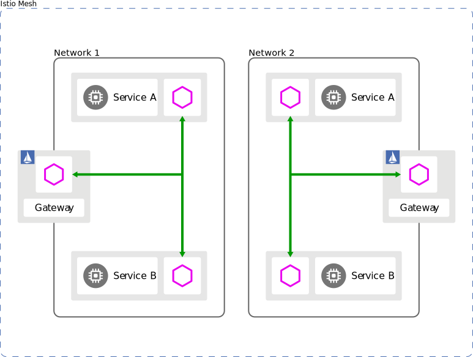

包含：

- 多主模型

  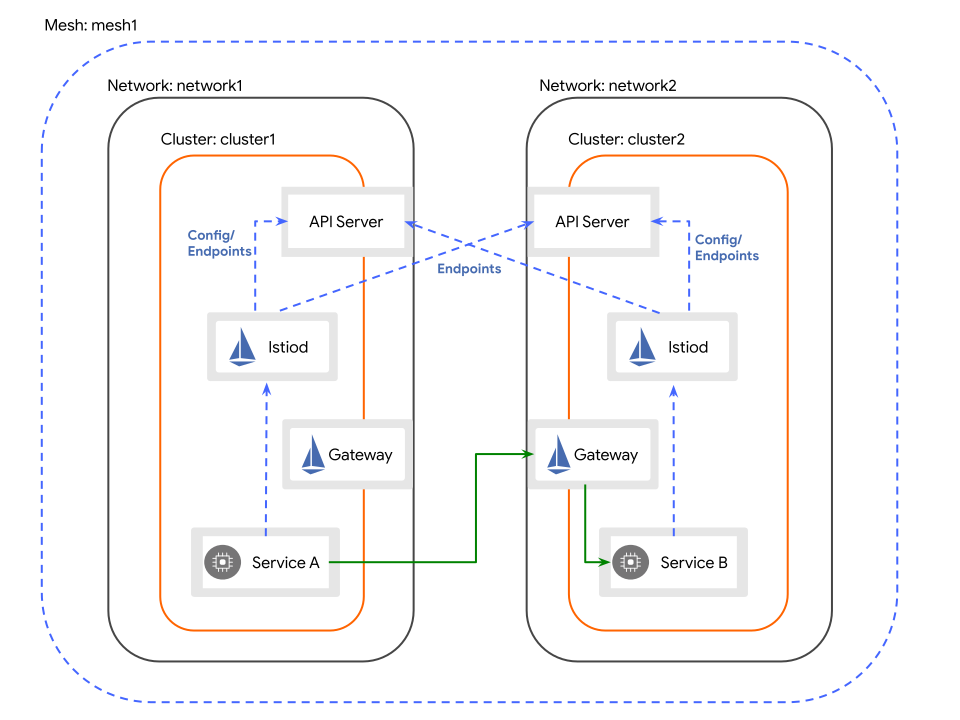

- 一主一从模型

  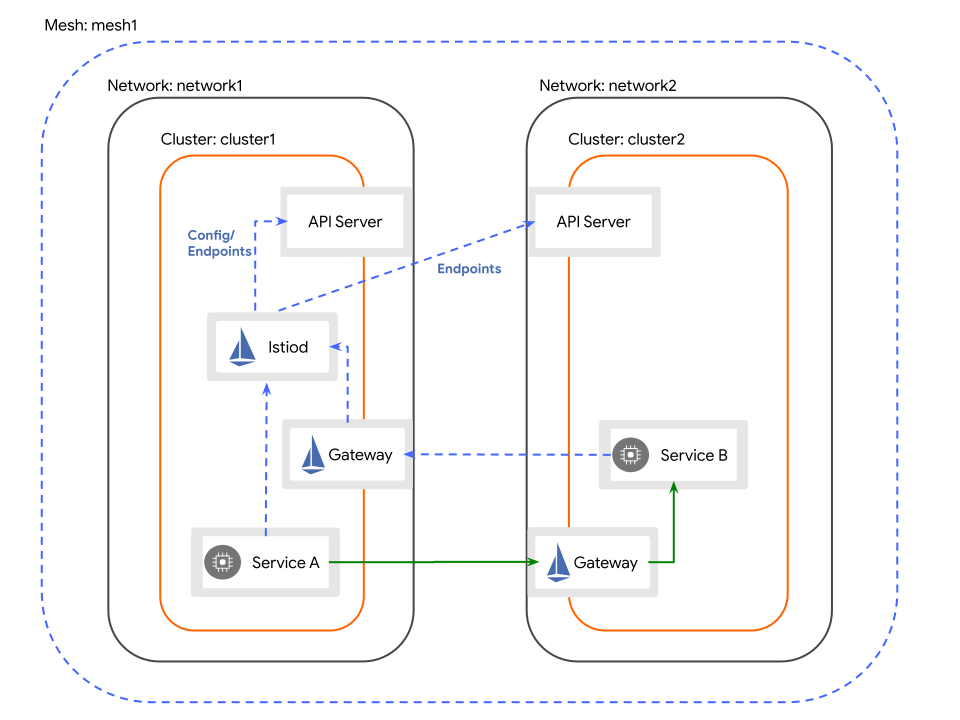


## 系统设计

### 用例图

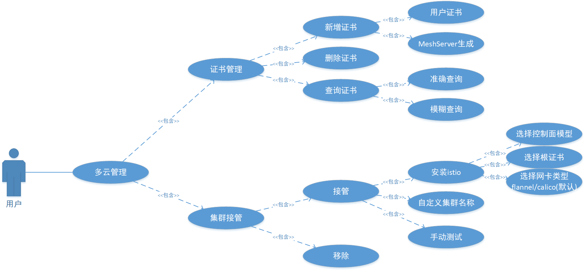

### 前提条件

- 需要获取目标集群的kubeconfig文件；
- istio本身不具备打通pod-to-pod网络的能力，需要借助其他方式，
  - 使用route命令添加网关打通pod-to-pod网络；
  - 使用istio的`eastwestgateway`实现pod间跨集群通信；

### 根证书管理

#### 增加

- 自定义上传根证书

  

  上传证书部分参考约束。

- 使用MeshServer生成的根证书

  

#### 删除

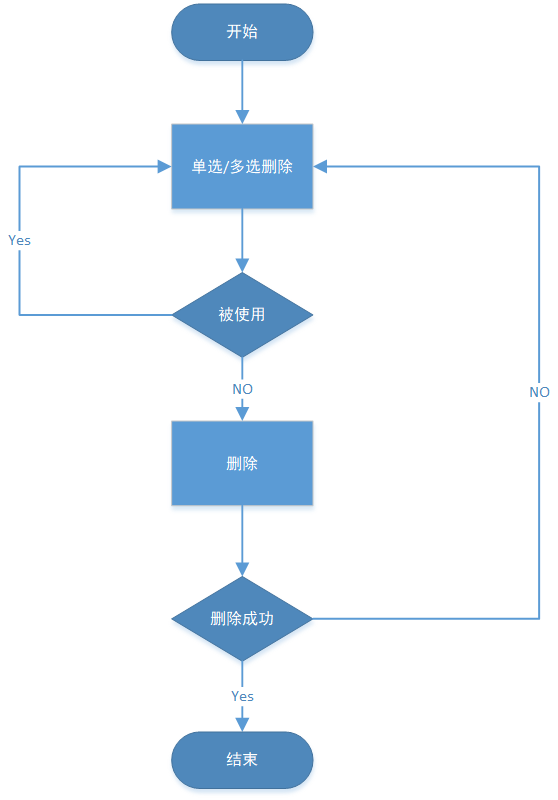

#### 查询

支持用户对证书名模糊查询

### 集群接管

**多云安装需要重新安装istio并重新选择根证书（默认使用istio生成的根证书）**

#### 接管

**主流程：**

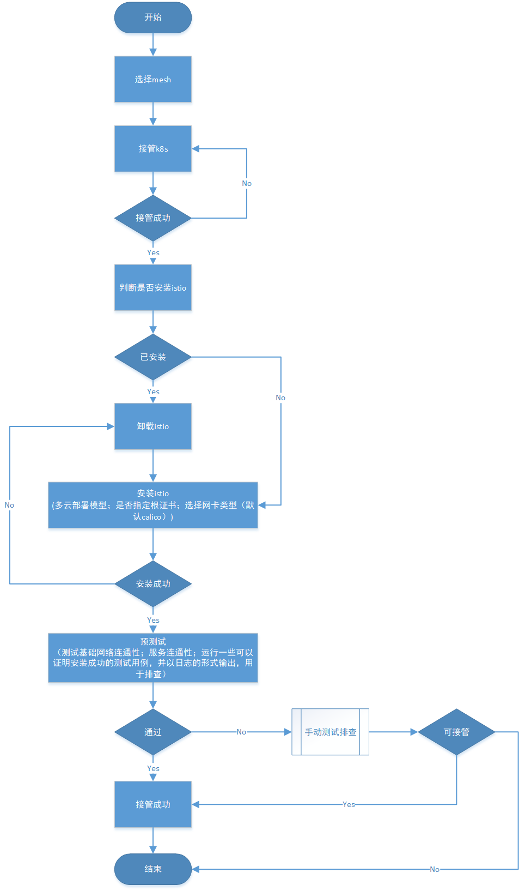


**选择mesh**

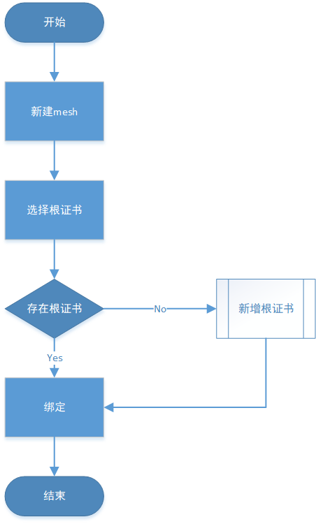

**接管k8s:**

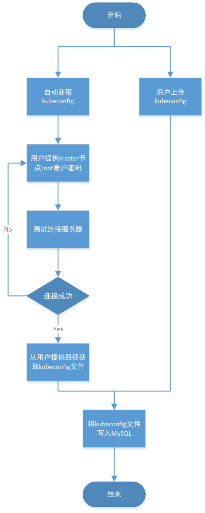

**安装istio**

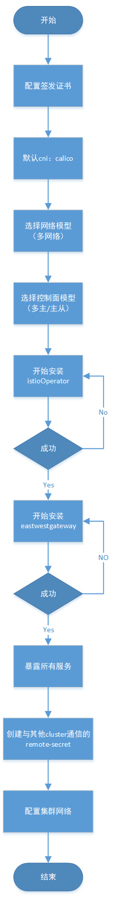


**预测试**

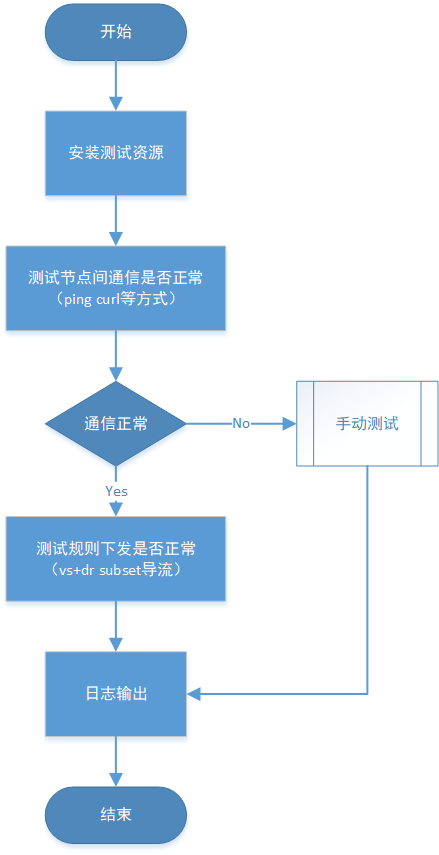

**手动测试排查**

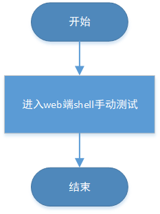

**手动测试排查，需要前端提供一个web端的shell界面提供给用户操作**

#### 移除

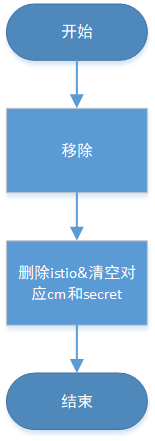

#### 接管已安装istio集群

1. 移除
2. 接管

