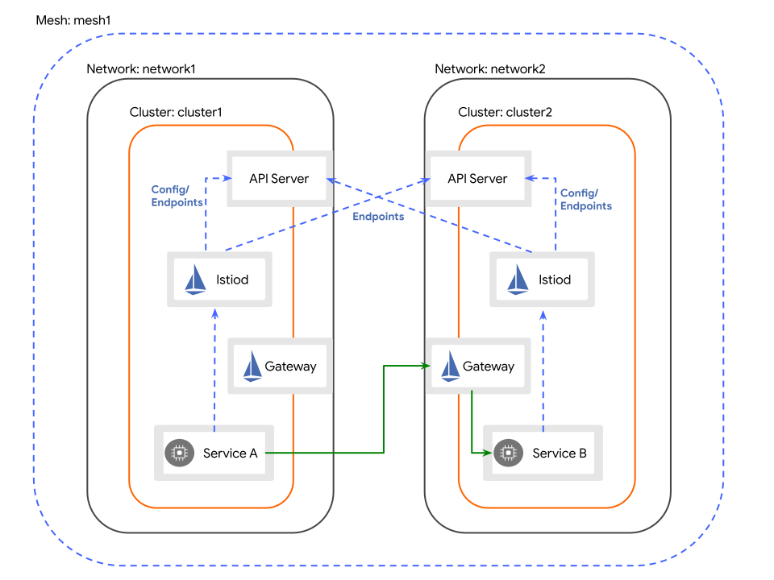
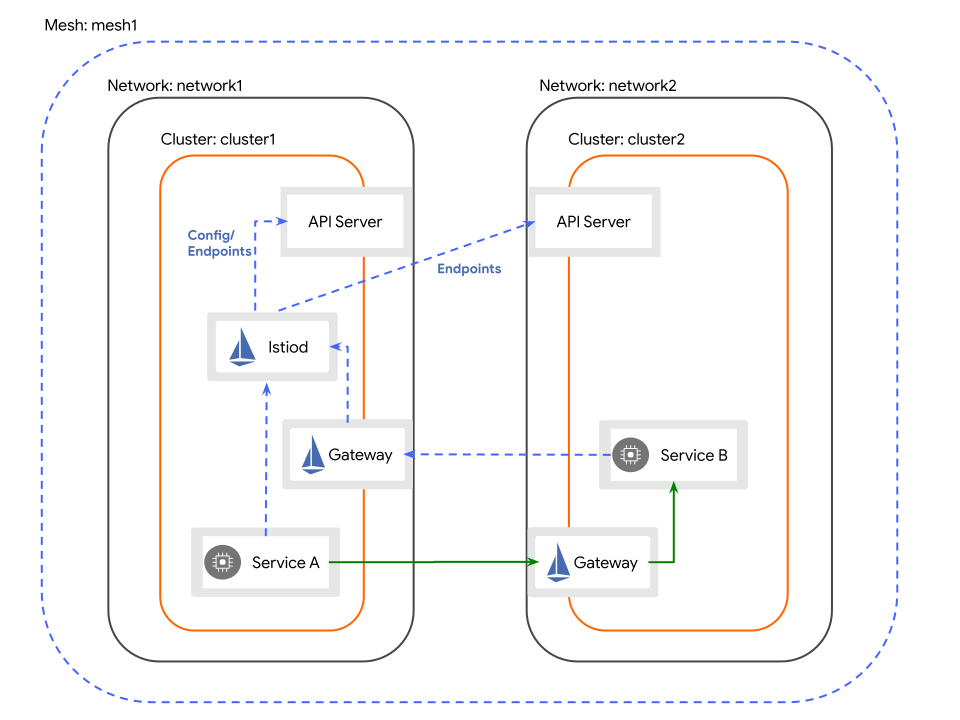

# multicluster安装部署

**multicluster 部署包含2种类型，具体请参考《multicluster investigation》**

## 约束

- 系统：

  - **所有的测试集群均为单节点k8s**

  - 测试：(2台同配置机器)

    ```bash
    [root@linuxtestb432 zhangc]# lsb_release -a
    LSB Version:	:core-4.1-amd64:core-4.1-noarch:cxx-4.1-amd64:cxx-4.1-noarch:desktop-4.1-amd64:desktop-4.1-noarch:languages-4.1-amd64:languages-4.1-noarch:printing-4.1-amd64:printing-4.1-noarch
    Distributor ID:	CentOS
    Description:	CentOS Linux release 7.5.1804 (Core) 
    Release:	7.5.1804
    Codename:	Core
    ------
    [root@linuxtestb432 zhangc]# lscpu
    Architecture:        x86_64
    CPU op-mode(s):      32-bit, 64-bit
    Byte Order:        Little Endian
    CPU(s):            8
    On-line CPU(s) list:   0-7
    Thread(s) per core:    1
    Core(s) per socket:    1
    Socket(s):         8
    NUMA node(s):        1
    Vendor ID:         GenuineIntel
    CPU family:        6
    Model:             85
    Model name:        Intel(R) Xeon(R) Gold 5118 CPU @ 2.30GHz
    Stepping:          4
    CPU MHz:           2294.609
    ------
    [root@linuxtestb432 zhangc]# free -h
              total      used      free    shared  buff/cache   available
    Mem:        39G      2.3G       25G      292M       11G       36G
    Swap:        0B        0B        0B
    ------
     [root@linuxtestb432 zhangc]# df -h
    Filesystem           Size  Used Avail Use% Mounted on
    /dev/mapper/centos-root  1.1T   19G  980G   2% /
    ```

  - 推荐：Centos 7.5.1804 | 4核8G

- 网络：不同网络。（跨集群pod间无法正常通信）

- docker环境：

  ```bash
  [root@linuxtestb432 zhangc]# docker version
  Client: Docker Engine - Community
   Version:           19.03.8
   API version:       1.40
   Go version:        go1.12.17
   Git commit:        afacb8b
   Built:             Wed Mar 11 01:27:04 2020
   OS/Arch:           linux/amd64
   Experimental:      false
  
  Server: Docker Engine - Community
   Engine:
    Version:          19.03.8
    API version:      1.40 (minimum version 1.12)
    Go version:       go1.12.17
    Git commit:       afacb8b
    Built:            Wed Mar 11 01:25:42 2020
    OS/Arch:          linux/amd64
    Experimental:     false
   containerd:
    Version:          1.2.13
    GitCommit:        7ad184331fa3e55e52b890ea95e65ba581ae3429
   runc:
    Version:          1.0.0-rc10
    GitCommit:        dc9208a3303feef5b3839f4323d9beb36df0a9dd
   docker-init:
    Version:          0.18.0
    GitCommit:        fec3683
  ```

  

- k8s环境：

  ```bash
  [root@linuxtestb432 zhangc]# kubectl version
  Client Version: version.Info{Major:"1", Minor:"18", GitVersion:"v1.18.2", GitCommit:"52c56ce7a8272c798dbc29846288d7cd9fbae032", GitTreeState:"clean", BuildDate:"2020-04-16T11:56:40Z", GoVersion:"go1.13.9", Compiler:"gc", Platform:"linux/amd64"}
  Server Version: version.Info{Major:"1", Minor:"18", GitVersion:"v1.18.2", GitCommit:"52c56ce7a8272c798dbc29846288d7cd9fbae032", GitTreeState:"clean", BuildDate:"2020-04-16T11:48:36Z", GoVersion:"go1.13.9", Compiler:"gc", Platform:"linux/amd64"}
  ```

- istio环境：

  ```bash
  [root@linuxtestb432 zhangc]# istioctl version
  client version: 1.9.2
  control plane version: 1.9.2
  data plane version: 1.9.2 (7 proxies)
  ```

  

## 前置操作

### 校准时间

```bash
timedatectl set-timezone Asia/Shanghai
yum -y install ntp
ntpdate 192.168.60.14
```

### 配置kubeconfig

```yaml
apiVersion: v1
clusters:
- cluster:
    certificate-authority-data: LS0tL...tLS0tLQo= # 对应机器上的kubeconfig内
    server: https://10.20.144.82:6443
  name: cluster82 # 自定义名
- cluster:
    certificate-authority-data: LS0tL...tLS0tLQo= # 对应机器上的kubeconfig内
    server: https://10.20.144.83:6443
  name: cluster83 # 自定义名
contexts:
- context:
    cluster: cluster82 # 和上文保持一致
    user: kubernetes-admin82 # 自定义
  name: kubernetes-admin82@kubernetes # 自定义
- context:
    cluster: cluster83 # 和上文保持一致
    user: kubernetes-admin83 # 自定义
  name: kubernetes-admin83@kubernetes # 自定义
current-context: ""
kind: Config
preferences: {}
users:
- name: kubernetes-admin82 # 和上文保持一致
  user:
    client-certificate-data: LS0tL...tLS0tLQo= # 对应机器上的kubeconfig内
    client-key-data: LS0tL...tLS0tLQo= # 对应机器上的kubeconfig内
- name: kubernetes-admin83 # 和上文保持一致
  user:
    client-certificate-data: LS0tL...tLS0tLQo= # 对应机器上的kubeconfig内
    client-key-data: LS0tL...tLS0tLQo= # 对应机器上的kubeconfig内

```

下文中统一对这个kubeconfig文件简称为multiconf

```bash
export CTX_CLUSTER1=<your cluster1 context>
export CTX_CLUSTER2=<your cluster2 context>
```

### 生成根证书

```bash
mkdir cert

make -f ../tools/certs/Makefile.selfsigned.mk root-ca

make -f ../tools/certs/Makefile.selfsigned.mk cluster1-cacerts

kubectl create namespace istio-system
kubectl create secret generic cacerts -n istio-system \
      --from-file=istio-1.9.2/cert/cluster1/ca-cert.pem \
      --from-file=istio-1.9.2/cert/cluster1/ca-key.pem \
      --from-file=istio-1.9.2/cert/cluster1/root-cert.pem \
      --from-file=istio-1.9.2/cert/cluster1/cert-chain.pem
```


## multi-primary



### 约束

- **请保证已经执行完前置操作所有步骤**
- **不同网络**

### 安装-单网络-多primary cluster

#### 配置cluster1为primary-cluster

```bash
kubectl --context="${CTX_CLUSTER1}" get namespace istio-system && \
  kubectl --context="${CTX_CLUSTER1}" label namespace istio-system topology.istio.io/network=network1
```

创建cluster1的istio配置文件

```bash
cat <<EOF > cluster1.yaml
apiVersion: install.istio.io/v1alpha1
kind: IstioOperator
spec:
  meshConfig:
    defaultConfig:
      proxyMetadata:
        ISTIO_META_DNS_CAPTURE: "true"
        ISTIO_META_DNS_AUTO_ALLOCATE: "true"
  values:
    global:
      proxy:
        clusterDomain: cluster.local
      meshID: mesh1
      multiCluster:
        clusterName: cluster1
      network: network1
EOF
```

运行cluster1中的istio

```bash
istioctl install -c yourpath/multiconf --context="${CTX_CLUSTER1}" -f cluster1.yaml
```

#### 为cluster1安装东西向网关

```bash
samples/multicluster/gen-eastwest-gateway.sh \
    --mesh mesh1 --cluster cluster1 --network network1 | \
    istioctl -c yourpath/multiconf --context="${CTX_CLUSTER1}" install -y -f -
```

验证东西向网关是否安装成功

```bash
kubectl --context="${CTX_CLUSTER1}" get svc istio-eastwestgateway -n istio-system
NAME                    TYPE           CLUSTER-IP    EXTERNAL-IP    PORT(S)   AGE
istio-eastwestgateway   LoadBalancer   10.80.6.124    <pending>     ...       51s
```

#### 将cluster1中的服务全部暴露出去

```bash
kubectl -f yourpath/multiconf --context="${CTX_CLUSTER1}" apply -n istio-system -f \
    samples/multicluster/expose-services.yaml
```


#### 配置cluster2为primary-cluster

```bash
kubectl -f yourpath/multiconf --context="${CTX_CLUSTER2}" get namespace istio-system && \
  kubectl -f yourpath/multiconf --context="${CTX_CLUSTER2}" label namespace istio-system topology.istio.io/network=network2
```

创建cluster2的istio配置文件

```bash
cat <<EOF > cluster2.yaml
apiVersion: install.istio.io/v1alpha1
kind: IstioOperator
spec:
  meshConfig:
    defaultConfig:
      proxyMetadata:
        ISTIO_META_DNS_CAPTURE: "true"
        ISTIO_META_DNS_AUTO_ALLOCATE: "true"
  values:
    global:
      proxy:
        clusterDomain: cluster.local
      meshID: mesh1
      multiCluster:
        clusterName: cluster2
      network: network2
EOF
```

运行cluster2中的istio

```bash
istioctl install -c yourpath/multiconf --context="${CTX_CLUSTER2}" -f cluster2.yaml
```
#### 为cluster2安装东西向网关

```bash
samples/multicluster/gen-eastwest-gateway.sh \
    --mesh mesh1 --cluster cluster2 --network network2 | \
    istioctl -c yourpath/multiconf --context="${CTX_CLUSTER1}" install -y -f -
```

验证东西向网关是否安装成功

```bash
kubectl --context="${CTX_CLUSTER1}" get svc istio-eastwestgateway -n istio-system
NAME                    TYPE           CLUSTER-IP    EXTERNAL-IP    PORT(S)   AGE
istio-eastwestgateway   LoadBalancer   10.80.6.124    <pending>     ...       51s
```

#### 将cluster2中的服务全部暴露出去

```bash
kubectl -f yourpath/multiconf --context="${CTX_CLUSTER1}" apply -n istio-system -f \
    samples/multicluster/expose-services.yaml
```

#### 修改configmap

分别在cluster1与cluster2修改如下文件

```bash
kubectl edit cm istio -n istio-system
```

```yaml
apiVersion: v1
data:
  mesh: |-
    defaultConfig:
      discoveryAddress: istiod.istio-system.svc:15012
      meshId: mesh1
      proxyMetadata:
        ISTIO_META_DNS_AUTO_ALLOCATE: "true"
        ISTIO_META_DNS_CAPTURE: "true"
      tracing:
        zipkin:
          address: zipkin.istio-system:9411
    enablePrometheusMerge: true
    rootNamespace: istio-system
    trustDomain: cluster.local
  meshNetworks: |- # 需要添加部分
    networks:
      network1: # istioOperator中 .Values.global.network
        endpoints:
          - fromRegistry: cluster1 # istioOperator中 .Values.global.multiCluster.clusterName
        gateways:
          - address: 10.20.144.83 # eastwestgateway 所在nodeIP
            port: 31674 # eastwestgateway 对外暴露的15443对应port
      network2:
        endpoints:
          - fromRegistry: cluster2
        gateways:
          - address: 10.20.144.165
            port: 32361
kind: ConfigMap
...
```


#### 安装远程秘钥

允许cluster2访问cluster1

```bash
istioctl x create-remote-secret -c yourpath/multiconf \
    --context="${CTX_CLUSTER2}" \
    --name=cluster2 | \
    kubectl --kubeconfig=yourpath/multiconf apply -f - --context="${CTX_CLUSTER1}"
```

允许cluster1访问cluster2

```bash
istioctl x create-remote-secret -c yourpath/multiconf \
    --context="${CTX_CLUSTER1}" \
    --name=cluster2 | \
    kubectl --kubeconfig=yourpath/multiconf apply -f - --context="${CTX_CLUSTER2}"
```

## install primary-remote



### 约束

- **请保证已经执行完before you begin所有步骤**
- 不**同网络**
- **截止1.9.2，远程配置文件将在远程集群中安装一个istiod组件，用于该集群中的CA和webhook注入。但是，服务发现将被定向到主集群中的控制平面。未来的版本中可能会在remote-cluster中移除istiod组件**

### 安装-单网络-单primary cluster-单remote cluster

#### 配置cluster1为primary-cluster

```bash
cat <<EOF > cluster1.yaml
apiVersion: install.istio.io/v1alpha1
kind: IstioOperator
spec:
  meshConfig:
    defaultConfig:
      proxyMetadata:
        ISTIO_META_DNS_CAPTURE: "true"
        ISTIO_META_DNS_AUTO_ALLOCATE: "true"
  values:
    global:
      proxy:
        clusterDomain: cluster.local
      meshID: mesh1
      multiCluster:
        clusterName: cluster1
      network: network1
EOF
```

运行cluster1中的istio

```bash
istioctl install -c yourpath/multiconf --context="${CTX_CLUSTER1}" -f cluster1.yaml
```

#### 在cluster1中安装东西向网关（east-west gateway）

默认的东西向网关是在网络上公开的，产品级的系统需要额外做一些操作（e.g. 防火墙规则等）用来保证系统安全。

```bash
./gen-eastwest-gateway.sh \
    --mesh mesh1 --cluster cluster1 --network network1 | \
    istioctl -c yourpath/multiconf --context="${CTX_CLUSTER1}" install -y -f -
```

查看东西向网关是否安装成功

```bash
kubectl --kubeconfig=yourpath/multiconf --context="${CTX_CLUSTER1}" get svc istio-eastwestgateway -n istio-system
```

#### 将cluster1中的控制面对外暴露

```bash
kubectl apply --kubeconfig=yourpath/multiconf --context="${CTX_CLUSTER1}" -f \
    samples/multicluster/expose-istiod.yaml
```

#### 将cluster1中的服务全部暴露出去

```bash
kubectl -f yourpath/multiconf --context="${CTX_CLUSTER1}" apply -n istio-system -f \
    samples/multicluster/expose-services.yaml
```

#### 安装远程秘钥

允许cluster1访问cluster2

```bash
istioctl x -c your/multiconf \
    create-remote-secret \
    --context="${CTX_CLUSTER2}" \
    --name=cluster2 | \
    kubectl apply --kubeconfig=your/multiconf  -f - --context="${CTX_CLUSTER1}"
```

#### 配置cluster2为remote-cluster

```bash
kubectl --context="${CTX_CLUSTER2}" get namespace istio-system && \
  kubectl --context="${CTX_CLUSTER2}" label namespace istio-system topology.istio.io/network=network2
```

将cluster1的东西向网关ip暴露作为服务发现IP地址

```bash
export DISCOVERY_ADDRESS=$(kubectl --kubeconfig=your/multiconf --context="${CTX_CLUSTER1}" get svc istio-eastwestgateway -n istio-system -o jsonpath='{.spec.clusterIP}')
```

假设目前我使用的集群master节点的ip分别是10.20.144.83和10.20.144.82

使用下列命令输出cluster1 service的网段

```bash
kubectl --kubeconfig=yourpath/multiconf --context="${CTX_CLUSTER1}" cluster-info dump | grep -m 1 service-cluster-ip-range | grep -Eoe "(([0-9]|[1-9][0-9]|1[0-9]{2}|2[0-4][0-9]|25[0-5])\.){3}([0-9]|[1-9][0-9]|1[0-9]{2}|2[0-4][0-9]|25[0-5])/([1-2][0-9]|3[0-2]|[1-9])" -Eoe '^(e|b)[[:lower:]]+[[:digit:]]+?'
```

给10.20.144.82添加如下规则

```bash
route add -net <service-cluster-ip-range> gw <destnation hostip 这里是 10.20.144.83>
```

创建cluster2的配置项

```bash
cat <<EOF > cluster2.yaml
apiVersion: install.istio.io/v1alpha1
kind: IstioOperator
spec:
  profile: remote
  meshConfig:
    defaultConfig:
      proxyMetadata:
        ISTIO_META_DNS_CAPTURE: "true"
        ISTIO_META_DNS_AUTO_ALLOCATE: "true"
  hub: registry.hundsun.com/hcs
  values:
    global:
      proxy:
        clusterDomain: cluster.local
      meshID: mesh1
      multiCluster:
        clusterName: cluster2
      network: network1
      remotePilotAddress: ${DISCOVERY_ADDRESS}
EOF
```

安装cluster2：

```bash
istioctl install -c your/multiconf --context="${CTX_CLUSTER2}" -f cluster2.yaml
```
#### 为cluster2安装东西向网关

```bash
samples/multicluster/gen-eastwest-gateway.sh \
    --mesh mesh1 --cluster cluster2 --network network2 | \
    istioctl -c yourpath/multiconf --context="${CTX_CLUSTER1}" install -y -f -
```

验证东西向网关是否安装成功

```bash
kubectl --context="${CTX_CLUSTER1}" get svc istio-eastwestgateway -n istio-system
NAME                    TYPE           CLUSTER-IP    EXTERNAL-IP    PORT(S)   AGE
istio-eastwestgateway   LoadBalancer   10.80.6.124    <pending>     ...       51s
```

#### 将cluster2中的服务全部暴露出去

```bash
kubectl -f yourpath/multiconf --context="${CTX_CLUSTER1}" apply -n istio-system -f \
    samples/multicluster/expose-services.yaml
```

#### 修改configmap

分别在cluster1与cluster2修改如下文件

```bash
kubectl edit cm istio -n istio-system
```

```yaml
apiVersion: v1
data:
  mesh: |-
    defaultConfig:
      discoveryAddress: istiod.istio-system.svc:15012
      meshId: mesh1
      proxyMetadata:
        ISTIO_META_DNS_AUTO_ALLOCATE: "true"
        ISTIO_META_DNS_CAPTURE: "true"
      tracing:
        zipkin:
          address: zipkin.istio-system:9411
    enablePrometheusMerge: true
    rootNamespace: istio-system
    trustDomain: cluster.local
  meshNetworks: |- # 需要添加部分
    networks:
      network1: # istioOperator中 .Values.global.network
        endpoints:
          - fromRegistry: cluster1 # istioOperator中 .Values.global.multiCluster.clusterName
        gateways:
          - address: 10.20.144.83 # eastwestgateway 所在nodeIP
            port: 31674 # eastwestgateway 对外暴露的15443对应port
      network2:
        endpoints:
          - fromRegistry: cluster2
        gateways:
          - address: 10.20.144.165
            port: 32361
kind: ConfigMap
...
```


## 验证安装(一定要在安装完集群后再安装)

#### 创建测试用的namespace

```bash
kubectl create --kubeconfig=yourpath/multiconf --context="${CTX_CLUSTER1}" namespace sample
kubectl create --kubeconfig=yourpath/multiconf --context="${CTX_CLUSTER2}" namespace sample
```

#### 自动注入边车

```bash
kubectl label --kubeconfig=yourpath/multiconf  --context="${CTX_CLUSTER1}" namespace sample \
    istio-injection=enabled
kubectl label --kubeconfig=yourpath/multiconf  --context="${CTX_CLUSTER2}" namespace sample \
    istio-injection=enabled
```

#### 在两个集群中部署helloworld服务

```bash
kubectl apply --kubeconfig=yourpath/multiconf  --context="${CTX_CLUSTER1}" \
    -f https://raw.githubusercontent.com/istio/istio/release-1.9/samples/helloworld/helloworld.yaml \
    -l service=helloworld -n sample
kubectl apply --kubeconfig=yourpath/multiconf  --context="${CTX_CLUSTER2}" \
    -f https://raw.githubusercontent.com/istio/istio/release-1.9/samples/helloworld/helloworld.yaml \
    -l service=helloworld -n sample
```

#### 部署helloworld V1

```bash
kubectl apply --kubeconfig=yourpath/multiconf  --context="${CTX_CLUSTER1}" \
    -f https://raw.githubusercontent.com/istio/istio/release-1.9/samples/helloworld/helloworld.yaml \
    -l version=v1 -n sample
```

验证v1是否部署成功

```bash
kubectl get pod  --kubeconfig=yourpath/multiconf   --context="${CTX_CLUSTER1}" -n sample -l app=helloworld
```

如下则成功

```bash
NAME                            READY     STATUS    RESTARTS   AGE
helloworld-v1-86f77cd7bd-cpxhv  2/2       Running   0          40s
```

#### 部署helloworld V2

```bash
kubectl apply --kubeconfig=yourpath/multiconf  --context="${CTX_CLUSTER2}" \
    -f https://raw.githubusercontent.com/istio/istio/release-1.9/samples/helloworld/helloworld.yaml \
    -l version=v1 -n sample
```

验证v1是否部署成功

```bash
kubectl get pod  --kubeconfig=yourpath/multiconf   --context="${CTX_CLUSTER2}" -n sample -l app=helloworld
```

如下则成功

```bash
NAME                            READY     STATUS    RESTARTS   AGE
helloworld-v2-86f77cd7bd-cpghj  2/2       Running   0          40s
```

#### 部署sleep

给两个集群部署sleep

```bash
kubectl apply --kubeconfig=yourpath/multiconf  --context="${CTX_CLUSTER1}" \
    -f https://raw.githubusercontent.com/istio/istio/release-1.9/samples/sleep/sleep.yaml -n sample
kubectl apply --kubeconfig=yourpath/multiconf  --context="${CTX_CLUSTER2}" \
    -f https://raw.githubusercontent.com/istio/istio/release-1.9/samples/sleep/sleep.yaml -n sample
```

验证sleep是否部署成功

```bash
kubectl --kubeconfig=yourpath/multiconf get pod --context="${CTX_CLUSTER1}" -n sample -l app=sleep
NAME                             READY   STATUS    RESTARTS   AGE
sleep-754684654f-n6bzf           2/2     Running   0          5s
```

```bash
kubectl --kubeconfig=yourpath/multiconf get pod --context="${CTX_CLUSTER2}" -n sample -l app=sleep
NAME                             READY   STATUS    RESTARTS   AGE
sleep-754684654f-dzl9j           2/2     Running   0          5s
```


#### 测试跨集群通信

由cluster1的sleep发起请求

```bash
kubectl exec --kubeconfig=yourpath/multiconf --context="${CTX_CLUSTER1}" -n sample -c sleep \
    "$(kubectl get pod  --kubeconfig=yourpath/multiconf --context="${CTX_CLUSTER1}" -n sample -l \
    app=sleep -o jsonpath='{.items[0].metadata.name}')" \
    -- curl -sS helloworld.sample:5000/hello
```

重复上述请求，出现v1 v2交替出现的结果则表示成功

```
Hello version: v2, instance: helloworld-v2-758dd55874-6x4t8
Hello version: v1, instance: helloworld-v1-86f77cd7bd-cpxhv
...
```

由cluster2的sleep发起请求

```bash
kubectl exec --kubeconfig=yourpath/multiconf --context="${CTX_CLUSTER2}" -n sample -c sleep \
    "$(kubectl get pod  --kubeconfig=yourpath/multiconf --context="${CTX_CLUSTER2}" -n sample -l \
    app=sleep -o jsonpath='{.items[0].metadata.name}')" \
    -- curl -sS helloworld.sample:5000/hello
```

重复上述请求，出现v1 v2交替出现的结果则表示成功

```
Hello version: v2, instance: helloworld-v2-758dd55874-6x4t8
Hello version: v1, instance: helloworld-v1-86f77cd7bd-cpxhv
...
```

