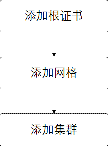

# 多云六期使用文档

## 流程图



## 根证书管理

根证书管理页面支持用户新增、查询、删除根证书。删除支持批量删除。


### 添加根证书


用户可以选择系统生成和上传两种方式。

系统生成需要用户填写证书名称；证书有效期，单位为天；所属机构；

上传需要用户填写证书名称，并提供根证书以及私钥文件。

## 网格管理

根证书管理页面支持用户新增、查询、删除网格。删除支持批量删除。

针对每一个网格，提供网格内集群间通信测试。


测试连通性效果如下：


### 添加网格

点击添加网格


用户需要填写

- 网格名称（不可重复）
- 网络模型（下拉选择）
- 控制面模型（下拉选择）
- 根证书（下拉选择绑定用户添加的根证书）

点击确定添加。

## 集群管理

根证书管理页面支持用户新增、查询、删除集群。删除支持批量删除。


### 添加集群

点击添加集群，得到如下页面


1. 用户需要填写集群的基础配置，用户需要填写如下字段：

   - 选择之前已经添加好的网格，
   - 填写集群名称（不可重复）
   - 选择集群角色
   - 填写网络名称（多网络模式不可以相同，单网络模式必须相同）
   - 镜像仓库（用来拉取服务镜像的镜像仓库）

2. 用户需要填写所接管机群master节点的服务器信息：

   - ip+端口
   - root账号
   - root密码

   目前只支持root权限，点击测试，如果账号密码正确，则会提示成功。

3. 选择kubeconfig文件：

   - ssh获取：用户需要提供文件路径
   - 上传：用户需要提供kubeconfig文件


点击添加：

- 接管机群未安装istio，则会直接接管
- 接管机群已经安装istio，系统会提示已检测到istio，是否覆盖安装，如果选择取消，则中断集群接管，如果选择确定，则会卸载原有istio，并重新安装。

接管通常会耗时2min左右。


接管成功后会打印日志。

点击下一步，进行预测试：


预测试一般耗时10s左右，


可以看到集群颜色为绿色，数据流颜色为红色，表示集群内部网络通信正常，集群建通信失败。但是由于机器性能、cni类型等影响，集群间正常通信需要等待30s-10min时间，


集群建正常通信效果如图所示。

### 删除集群

点击移除，系统会移除集群，需要等待一段时间。


## 测试istio规则下发

提供的`canary.yaml`文件如下：

```yaml
apiVersion: networking.istio.io/v1alpha3
kind: VirtualService
metadata:
  name: helloworld-vs
  namespace: sample
spec:
  hosts:
    - helloworld.sample.svc.cluster.local
  http:
  - route:
    - destination:
        host: helloworld.sample.svc.cluster.local
        subset: v1
      weight: 90 # 权重90
    - destination:
        host: helloworld.sample.svc.cluster.local
        subset: v2
      weight: 10 # 权重10
---
apiVersion: networking.istio.io/v1alpha3
kind: DestinationRule
metadata:
  name: helloworld-dr
  namespace: sample
spec:
  host: helloworld.sample.svc.cluster.local
  subsets:
  - name: v1
    labels:
      version: v1
  - name: v2
    labels:
      version: v2
```

其中v1版本流量权重为90，v2为10。预期请求结果中。v1:v2约为9:1

使用提供的`testCanary.sh`：

```bash
[root@linuxtestcb09 home]# ./testCanary.sh 
service/helloworld created
deployment.apps/helloworld-v1 created
deployment.apps/helloworld-v2 created
virtualservice.networking.istio.io/helloworld-vs created
destinationrule.networking.istio.io/helloworld-dr created
Hello version: v1, instance: helloworld-v1-5b75657f75-pmjc4
Hello version: v1, instance: helloworld-v1-5b75657f75-pmjc4
Hello version: v1, instance: helloworld-v1-5b75657f75-pmjc4
Hello version: v1, instance: helloworld-v1-5b75657f75-pmjc4
Hello version: v1, instance: helloworld-v1-5b75657f75-pmjc4
Hello version: v1, instance: helloworld-v1-5b75657f75-pmjc4
Hello version: v1, instance: helloworld-v1-5b75657f75-pmjc4
Hello version: v1, instance: helloworld-v1-5b75657f75-pmjc4
Hello version: v1, instance: helloworld-v1-5b75657f75-pmjc4
Hello version: v2, instance: helloworld-v2-7855866d4f-r6xjk
Hello version: v1, instance: helloworld-v1-5b75657f75-pmjc4
Hello version: v1, instance: helloworld-v1-5b75657f75-pmjc4
Hello version: v1, instance: helloworld-v1-5b75657f75-pmjc4
Hello version: v1, instance: helloworld-v1-5b75657f75-pmjc4
···
```

可以看到v1:v2大约为9:1，表示规则下发成功

**PS:如果接管的是多主模型，则需要在两个集群上都执行该脚本，如果是主从模型，只需要在主集群执行该脚本**

