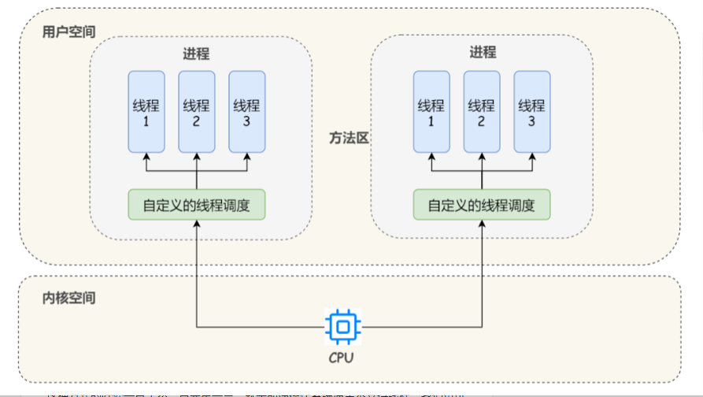
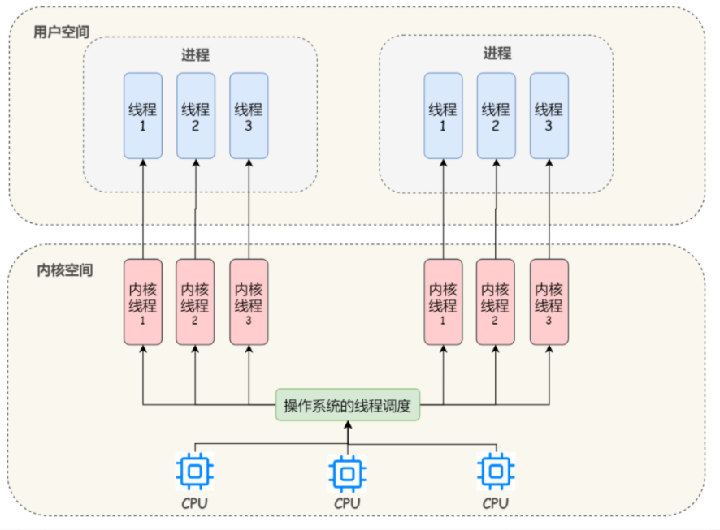
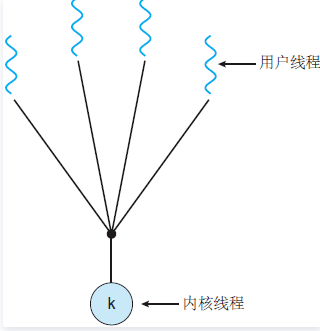
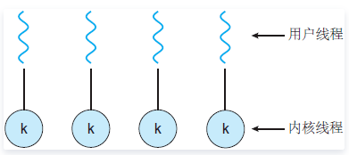
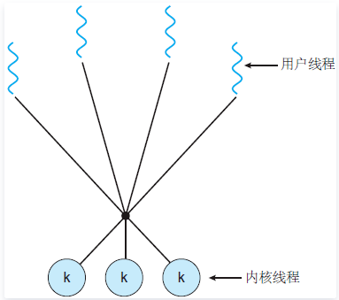

# 用户级线程和内核级线程

### 用户级线程

“既然你说你已经看过线程的基本概念，那我就直接跳过这一部分了。

很久很久之前，线程的概念是出现了，但操作系统厂商可不能直接就去修改操作系统的内核，因为对他们来说，**稳定性**是最重要的。贸然把未经验证的东西加入内核，出问题了怎么办？所以想要验证线程的可用性，得另想办法。”

“我知道我知道，那些研究人员就编写了一个关于线程的函数库，**用函数库来实现线程**！”小白得意的说：“这个我刚刚在网上看到了。”

“是的，他们把**创建线程**、**终止线程**等功能放在了这个**线程库**内，用户就可以通过调用这些函数来实现所需要的功能。”小明找了张纸，写上了几个函数：`pthread_creat` ，`pthread_exit` ，`pthread_join` ，`pthread_yield` ，接着说：“这是几个重要的函数，你应该能大概猜出这些函数的功能吧？”

“emmmm，让我想想，`pthread_creat` 是创建一个新线程，`pthread_exit` 是结束线程，`pthread_join`  嘛，我猜是准备运行某一个线程，然后把它加进**就绪队列**。最后一个函数我就不知道了。”

“不知道也没关系，一会你就清楚了。”小明接着讲：“要知道，刚刚我们说的线程库，是位于用户空间的，**操作系统内核对这个库一无所知**，所以从内核的角度看，它还是按正常的方式管理。”

小白问道：“也就是说**操作系统眼里还是只有进程**喽？那我用线程库写的一个多线程进程，只能一次在**一个 CPU 核心**上运行？”

小明点点头，说：“你说的没错，这其实是用户级线程的一个缺点，这些线程只能占用一个核，所以做不到**并行加速**，而且由于用户线程的**透明性**，**操作系统是不能主动切换线程的**，换句话讲：

- 如果 A，B 是同一个进程的两个线程的话， A 正在运行的时候，线程 B 想要运行的话，只能等待 A **主动放弃** CPU，也就是主动调用 `pthread_yield` 函数。”

*tobe 注：对操作系统来说，用户级线程具有**不可见性**，也称**透明性**。*

“停一下，让我想一想，”小白飞速思考着小明的话，“是不是说，即使有线程库，用户级线程也做不到像进程那样的**轮转调度**？”

“非常正确！看来你对进程的概念很清楚嘛。不过呢，虽然不能做到轮转调度，但用户级线程也有他自己的好处——你可以**为你的应用程序定制调度算法**，毕竟什么时候退出线程你自己说了算。刚刚说了，因为操作系统只能看到进程的存在，那如果**某一个线程阻塞**了，你觉得会发生什么？”

“在操作系统眼里，是进程阻塞了，那么整个进程就会进入**阻塞态**，在阻塞操作结束前，这个进程都无法得到 CPU 资源。那就相当于，**所有的线程都被阻塞**了。”小白得意的回答。

“没错，所以如果任由线程进行阻塞操作，进程的效率将受到很大的影响，所以在这个过程中，出现了一个替代方案——**jacket**。所谓 jacket，就是把一个产生阻塞的系统调用转化成一个非阻塞的系统调用。”

小白惊讶地问：“这怎么做得到？该阻塞的调用，还能变得不阻塞？”

小明答道：“我来举个例子吧，不是直接调用一个系统 I/O 例程，而是调用一个应用级别的 I/O jacket 例程，这个 jacket 例程中的代码会检查并且确定 I/O 设备是不是正忙，如果忙的话，就在**用户态**下将该线程阻塞，然后把控制权交给另一个线程。隔一段时间后再次检查 I/O 设备。就像你说的，最后还是会执行阻塞调用，但使用 jacket 可以缩短被阻塞的时间。不过有些情况下是可以不被阻塞的，取决于具体的实现。”

小明停顿了一会，说：“用户级线程的概念大概就这么多，我们接下来讲内核级线程吧。”

### 内核级线程

“有了用户级线程的铺垫，内核级线程就好讲多了。现在我们知道，许多操作系统都已经支持内核级线程了。为了实现线程，内核里就需要有用来记录系统里所有线程的线程表。当需要创建一个新线程的时候，就需要进行一个**系统调用**，然后由**操作系统**进行线程表的更新。当然了，传统的进程表也还是有的。你想想看，如果操作系统「看得见」线程，有什么好处？“

小白自信的回答：“操作系统内核如果知道线程的存在，就可以像调度多个进程一样，把这些线程放在好几个 CPU 核心上，就能做到实际上的**并行**了。”

“还有一点你没有说到，如果线程可见，那么**假如线程 A 阻塞了，与他同属一个进程的线程也不会被阻塞**。这是内核级线程的绝对优势。”

“那内核级线程就没有什么缺点吗？”

“缺点当然是有的，你想想看，让操作系统进行线程调度，那意味着每次切换线程，就需要「**陷入**」内核态，而操作系统从**用户态到内核态**的转变是有开销的，所以说**内核级线程切换的代价要比用户级线程大**。还有很重要的一点——线程表是存放在操作系统固定的**表格空间**或者**堆栈空间**里，所以内核级线程的数量是有限的，扩展性比不上用户级线程。”

"内核级线程就这么点东西，我最后给你留一张图，你要是能看得懂，就说明你理解今天的概念了。"

小白得意地说：“我当然看得懂了，谢谢小明！”

## 前言

- linux内核不存在整真正意义上的线程。linux将所有的执行实体都称之为任务（task），每一个任务在干年上都类似于一个单线程的进程，具有内存空间、执行实体、文件资源等。但是，linux下不同任务之间可以选择公用内存空间，因而在实际意义上，共享同一个内存空间的多个任务构成了一个进程，而这些任务就成为这个任务里面的线程。

## 内核线程

- 内核线程又称为守护进程，内核线程的调度由内核负责，一个内核线程处于阻塞状态时不影响其他的内核线程，因为其是调度的基本单位。这与用户线程是不一样的；
- 这些线程可以在全系统内进行资源的竞争；
- 内核空间内为每一个内核支持线程设置了一个线程控制块（TCB），内核根据该控制块，感知线程的存在，并进行控制。在一定程度上类似于进程，只是创建、调度的开销要比进程小。有的统计是1：10。
- 内核线程切换由内核控制，当线程进行切换的时候，由用户态转化为内核态。切换完毕要从内核态返回用户态，**即存在用户态和内核态之间的转换**，***比如多核cpu，还有win线程的实现\***。

#### 优点

在多处理器系统中，内核能够同时调度同一进程中多个线程并行执行到多个处理器中；如果进程中的一个线程被阻塞，内核可以调度同一个进程中的另一个线程；内核支持线程具有很小的数据结构和堆栈，线程的切换比较快，切换开销小；内核本身也可以使用多线程的方式来实现。

#### 缺点

即使CPU在同一个进程的多个线程之间切换，也需要陷入内核，因此其速度和效率不如用户级线程。

## 用户线程

- 用户线程在用户空间中实现，内核并没有直接对用户线程进程调度，内核的调度对象和传统进程一样，还是进程（用户进程）本身，内核并不能看到用户线程，内核并不知道用户线程的存在。
- 不需要内核支持而在用户程序中实现的线程，其不依赖于操作系统核心，应用进程利用线程库提供创建、同步、调度和管理线程的函数来控制用户线程。
- 内核资源的分配仍然是按照进程（用户进程）进行分配的；**各个用户线程只能在进程内进行资源竞争**。
- 用户级线程内核的切换由用户态程序自己控制内核切换（通过系统调用来获得内核提供的服务）,不需要内核干涉，少了进出内核态的消耗，但不能很好的利用多核Cpu。目前Linux pthread大体是这么做的。
- 每个用户线程并不具有自身的线程上下文。因此，就线程的同时执行而言，任意给定时刻每个进程只能够有一个线程在运行，而且只有一个处理器内核会被分配给该进程。

#### 优点

**线程的切换无需陷入内核，故切换开销小，速度非常快；**

#### 缺点

系统调用的阻塞问题：对应用程序来讲，**同一进程中只能同时有一个线程在运行**，**一个线程的阻塞将导致整个进程中所有线程的阻塞**；由于这里的处理器时间片分配是以进程为基本单位，所以每个线程执行的时间相对减少。

## 用户级线程和内核级线程的区别：

- **内核支持：**用户级线程可在一个不支持线程的OS中实现；内核支持线程则需要得到OS内核的支持。亦即内核支持线程是OS内核可感知的，而用户级线程是OS内核不可感知的。
- **处理器分配：**在多处理机环境下，对用户级线程而言主，内核一次只为一个进程分配一个处理器，进程无法享用多处理机带来的好处；在设置有内核支持线程时，内核可调度一个应用中的多个线程同时在多个处理器上并行运行，提高程序的执行速度和效率。
- **调度和线程执行时间：**设置有内核支持线程的系统，其调度方式和算法与进程的调度十分相似，只不过调度单位是线程；对只设置了用户级线程的系统，调度的单位仍为进程。
- 用户级线程执行系统调用指令时将导致其所属进程被中断，而内核支持线程执行系统调用指令时，只导致该线程被中断。
- 在只有用户级线程的系统内，CPU调度还是以进程为单位，处于运行状态的进程中的多个线程，由用户程序控制线程的轮换运行；在有内核支持线程的系统内，CPU调度则以线程为单位，由OS的线程调度程序负责线程的调度。

## 内核线程与用户线程的联系

#### 一对一模型

- 特点

> 有了内核线程，每个用户线程被映射或绑定到一个内核线程。用户线程在其生命期内都会绑定到该内核线程。一旦用户线程终止，两个线程都将离开系统。这被称作"一对一"线程映射。（反过来，一个内核线程不一定就会对应一个用户线程）。一般一直使用API或者是系统调用创建的线程均为一对一线程。例如，linux使用clone创建的线程，以及win下使用CreateThread创建的线程。

- 弊端

> 内核线程数量有限
>  许多操作系统内核线程调用的时候，上下文切换的开销很大。

### 混合线程模型

> 混合线程实现是用户线程和内核线程的交叉，使得库和操作系统都可以管理线程。用户线程由运行时库调度器管理，内核线程由操作系统调度器管理。在这种实现中，进程有着自己的内核线程池。可运行的用户线程由运行时库分派并标记为准备好执行的可用线程。操作系统选择用户线程并将它映射到线程池中的可用内核线程。多个用户线程可以分配给相同的内核线程。

- #### 多对一模型

- 特点

> 多对一的模型将多个用户线程映射到一个内核线程。
>  多对一模型线程的切换速度要快很多（线程之间的切换由用户代码来执行）

- 弊端

> 如果其中一个线程阻塞，那么所有线程将无法执行。

- #### 多对多模型

- 特点

> 将上述两种模型的特点进行综合，即将多个用户线程映射到少数但不只一个内核线程中去。
>  多对多模型对用户线程的数量没有什么限制，在多处理器系统上也会有一定的性能提升，不过提升的幅度比不上一对一模型。

## **1. 用户空间和内核空间**

关于内核态和用户态我们在 [**了解操作系统的那些事儿，从这篇文章开始**](https://mp.weixin.qq.com/s?__biz=MzI0NDc3ODE5OQ==&mid=2247484759&idx=1&sn=950ef2864ea75ef936c053184a728056&scene=21#wechat_redirect) 这篇文章中已经详细介绍过，这里不再过多赘述。

至于什么是系统空间和用户空间也非常好理解：在操作系统中，内存通常会被分成用户空间（User space）与内核空间（Kernel space）这两个部分。当进程/线程运行在用户空间时就处于用户态，运行在内核空间时就处于内核态：

- 运行在内核态的程序可以访问用户空间和内核空间，或者说它可以访问计算机的任何资源，不受限制，为所欲为，例如协调 CPU 资源，分配内存资源，提供稳定的环境供应用程序运行等
- 而应用程序基本都是运行在用户态的，或者说用户态就是提供应用程序运行的空间。运行在用户态的程序只能访问用户空间

**那为什么要区分用户态和内核态呢**？

其实早期操作系统是不区分用户态和内核态的，也就是说应用程序可以访问任意内存空间，如果程序不稳定常常会让系统崩溃，比如清除了操作系统的内存数据。为此大佬们设计出了一套规则：对于那些比较危险的操作需要切到内核态才能运行，比如 CPU、内存、设备等资源管理器程序就应该在内核态运行，否则安全性没有保证。

举个例子，对于文件系统和数据来说，文件系统数据和管理就必须放在内核态，但是用户的数据和管理可以放在用户态。

**用户态的程序不能随意操作内核地址空间，这样有效地防止了操作系统程序受到应用程序的侵害**。

那如果处于用户态的程序想要访问内核空间的话怎么办呢？就需要进行系统调用从用户态切换到内核态。

## **2. 操作系统线程**

### **① 在用户空间中实现线程**

在**早期**的操作系统中，所有的线程都是在用户空间下实现的，操作系统只能看到线程所属的进程，而不能看到线程。

从我们开发者的角度来理解用户级线程就是说：在这种模型下，我们需要自己定义线程的数据结构、创建、销毁、调度和维护等，这些线程运行在操作系统的某个进程内，然后**操作系统直接对进程进行调度**。

这种方式的好处一目了然，首先第一点，就是即使操作系统原生不支持线程，我们也可以通过库函数来支持线程；第二点，**线程的调度只发生在用户态**，**避免了操作系统从内核态到用户态的转换开销**。

当然缺点也很明显：由于操作系统看不见线程，不知道线程的存在，**而 CPU 的时间片切换是以进程为维度的**，所以如果进程中某个线程进行了耗时比较长的操作，那么由于用户空间中没有时钟中断机制，就会导致此进程中的其它线程因为得不到 CPU 资源而长时间的持续等待；另外，**如果某个线程进行系统调用时比如缺页中断而导致了线程阻塞，此时操作系统也会阻塞住整个进程**，即使这个进程中其它线程还在工作。

### **② 在内核空间中实现线程**

所谓内核级线程就是运行在内核空间的线程， 直接由内核负责，只能由内核来完成线程的调度。

几乎所有的**现代**操作系统，包括 Windows、Linux、Mac OS X 和 Solaris 等，都支持内核线程。

每个内核线程可以视为内核的一个分身，这样操作系统就有能力同时处理多件事情，**支持多线程的内核就叫做多线程内核**（Multi-Threads Kernel）。

从我们开发者的角度来理解内核级线程就是说：我们可以直接使用操作系统中已经内置好的线程，线程的创建、销毁、调度和维护等，都是直接由操作系统的内核来实现，我们只需要使用系统调用就好了，不需要像用户级线程那样自己设计线程调度等。

上图画的是 1：1 的线程模型，所谓线程模型，也就是用户线程和内核线程之间的关联方式，线程模型当然不止 1：1 这一种，下面我们来详细解释以下这三种多线程模型：

> 下文翻译自 https://www.cs.uic.edu/~jbell/CourseNotes/OperatingSystems/4_Threads.html

1）**多对一线程模型**：

- 在多对一模型中，多个用户级线程映射到某一个内核线程上
- 线程管理由用户空间中的线程库处理，这非常有效
- 但是，如果进行了阻塞系统调用，那么即使其他用户线程能够继续，整个进程也会阻塞
- 由于单个内核线程只能在单个 CPU 上运行，因此多对一模型不允许在多个 CPU 之间拆分单个进程

从并发性角度来总结下，虽然多对一模型允许开发人员创建任意多的用户线程，但**是由于内核只能一次调度一个线程，所以并未增加并发性**。现在已经几乎没有操作系统来使用这个模型了，因为它无法利用多个处理核。

2）**一对一线程模型**：

- 一对一模型克服了多对一模型的问题
- 一对一模型创建一个单独的内核线程来处理每个用户线程
- 但是，管理一对一模型的开销更大，涉及更多开销和减慢系统速度
- 此模型的大多数实现都限制了可以创建的线程数

从并发性角度来总结下，虽然一对一模型提供了更大的并发性，但是开发人员应注意不要在应用程序内创建太多线程（有时系统可能会限制创建线程的数量），因为管理一对一模型的开销更大。**Windows (从 Win95 开始) 和 Linux 都实现了线程的一对一模型**。

3）**多对多线程模型**：

- 多对多模型将任意数量的用户线程复用到相同或更少数量的内核线程上，结合了一对一和多对一模型的最佳特性
- 用户对创建的线程数没有限制
- **阻止内核系统调用不会阻止整个进程**
- **进程可以分布在多个处理器上**
- 可以为各个进程分配可变数量的内核线程，具体取决于存在的 CPU 数量和其他因素

参考：https://blog.csdn.net/gatieme/article/details/51892437