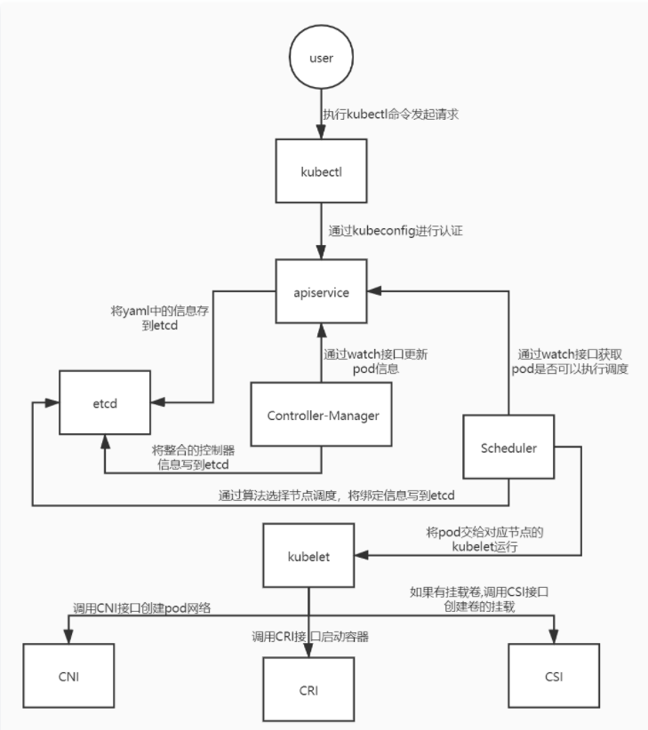
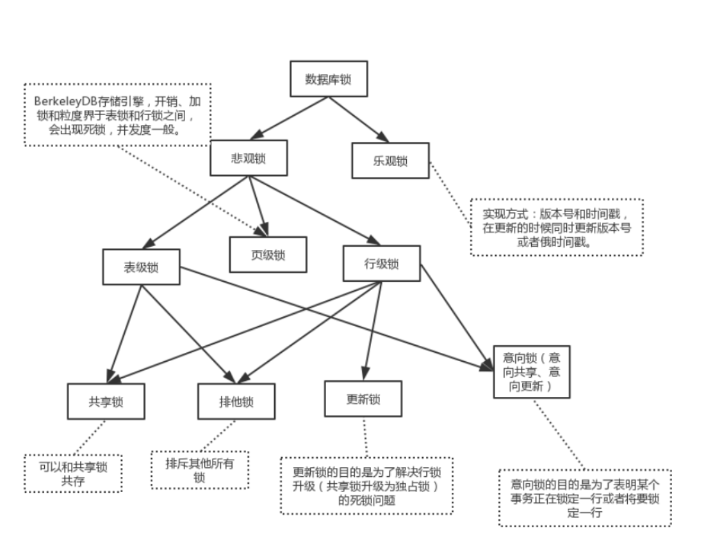

# 操作系统

## 操作系统的组成

- `进程管理`: 进程管理的主要作用就是任务调度，在单核处理器下，操作系统会为每个进程分配一个任务，进程管理的工作十分简单；而在多核处理器下，操作系统除了要为进程分配任务外，还要解决处理器的调度、分配和回收等问题
- `内存管理`：内存管理主要是操作系统负责管理内存的分配、回收，在进程需要时分配内存以及在进程完成时回收内存，协调内存资源，通过合理的页面置换算法进行页面的换入换出
- `设备管理`：根据确定的设备分配原则对设备进行分配，使设备与主机能够并行工作，为用户提供良好的设备使用界面。
- `文件管理`：有效地管理文件的存储空间，合理地组织和管理文件系统，为文件访问和文件保护提供更有效的方法及手段。
- `提供用户接口`：操作系统提供了访问应用程序和硬件的接口，使用户能够通过应用程序发起系统调用从而操纵硬件，实现想要的功能。

## 一 进程通信方法

每个进程各自有不同的用户地址空间,任何一个进程的全局变量在另一个进程中都看不到，所以进程之间要交换数据必须通过内核,在内核中开辟一块缓冲区,进程A把数据从用户空间拷到内核缓冲区,进程B再从内核缓冲区把数据读走,内核提供的这种机制称为进程间通信。

### 1 匿名管道通信

------

匿名管道( pipe )：管道是一种**半双工**的通信方式，**数据只能单向流动**，而且只能在具**有亲缘关系的进程间**使用。进程的亲缘关系通常是指**父子进程关系**。

```vala
// 需要的头文件
#include <unistd.h>

// 通过pipe()函数来创建匿名管道
// 返回值：成功返回0，失败返回-1
// fd参数返回两个文件描述符
// fd[0]指向管道的读端，fd[1]指向管道的写端
// fd[1]的输出是fd[0]的输入。
int pipe (int fd[2]);
```

通过匿名管道实现进程间通信的步骤如下：

- 父进程创建管道，得到两个⽂件描述符指向管道的两端
- 父进程fork出子进程，⼦进程也有两个⽂件描述符指向同⼀管道。
- 父进程关闭fd[0],子进程关闭fd[1]，即⽗进程关闭管道读端,⼦进程关闭管道写端（因为管道只支持单向通信）。⽗进程可以往管道⾥写,⼦进程可以从管道⾥读,管道是⽤环形队列实现的,数据从写端流⼊从读端流出,这样就实现了进程间通信。


### 2 有名管道通信

------

有名管道 (named pipe) ： 有名管道也是**半双工**的通信方式，但是它**允许无亲缘关系进程间的通信**。


### 3 [消息队列](https://cloud.tencent.com/product/cmq?from=10680)通信

------

消息队列( message queue ) ： 消息队列是由消息的链表，存放在内核中并由消息队列标识符标识。消息队列克服了信号传递信息少、管道只能承载无格式字节流以及缓冲区大小受限等缺点。


### 4 信号量通信

------

信号量( semophore ) ： 信号量是一个计数器，可以用来控制多个进程对共享资源的访问。它常作为一种锁机制，防止某进程正在访问共享资源时，其他进程也访问该资源。因此，主要作为进程间以及同一进程内不同线程之间的同步手段。

### 5 信号

------

信号 ( sinal ) ： 信号是一种比较复杂的通信方式，用于通知接收进程某个事件已经发生。

### 6 共享内存通信

------

共享内存( shared memory ) ：共享内存就是映射一段能被其他进程所访问的内存，这段共享内存由一个进程创建，但多个进程都可以访问。共享内存是最快的 IPC 方式，它是针对其他进程间通信方式运行效率低而专门设计的。它往往与其他通信机制，如信号两，配合使用，来实现进程间的同步和通信。

### 7 套接字通信


## 二 孤儿进程僵尸进程

### 孤儿进程

一个父进程退出，而它的一个或多个子进程还在运行，那么那些子进程将成为孤儿进程。**孤儿进程将被 init 进程(进程号为 1)所收养，并由 init 进程对它们完成状态收集工作  。**

### 僵尸进程

一个进程使用 fork 创建子进程，**如果子进程退出，而父进程并没有调用 wait 或 waitpid通知内核释放僵尸进程**，那么子进程的**进程描述符（PCB）**仍然保存在系统中。这种进程称之为僵尸进程。    如果进程不调用 wait / waitpid 的话， 那么保留的那段信息就不会释放， 其进程号就会一直被占用，但是系统所能使用的进程号是有限的，如果大量的产生僵死进程，将因为没有可用的进程号而导致系统不能产生新的进程。  


孤儿进程：父进程先于子进程结束，则子进程成为孤儿进程，子进程的父进程成为init 进程， init 进程接管。

僵尸进程：子进程终止，父进程尚未回收， 子进程残留资源（ PCB）存放于内核中，变成僵尸（ zombie）进程， 父进程可以调用 wait()或waitpid()来通知内核释放进程。  


## 三 死锁条件，如何避免

死锁是指两个或两个以上进程在执行过程中，因争夺资源而造成的相互等待的现象若无外力作用，它们都将无法推进下去，此事称系统处于死锁状态。死锁发生的

四个必要条件如下：

**互斥条件**：进程对所分配到的资源不允许其他进程访问，若其他进程访问该资源，只能等待，直至占有该资源的进程使用完成后释放该资源；
**请求和保持条件**：进程获得一定的资源后，又对其他资源发出请求，但是该资源可能被其他进程占有，此时请求阻塞，但该进程不会释放自己已经占有的资源
**不可剥夺条件**：进程已获得的资源，在未完成使用之前，不可被剥夺，只能在使用后自己释放
**环路等待条件**：进程发生死锁后，必然存在一个进程-资源之间的环形链  


### 如何避免


## 四 哈希的实现有哪几种，如何取hashcode，冲突检测几种方法

## 五 自旋锁 和 互斥锁

### 自旋锁

**是指当一个线程在获取锁的时候，如果锁已经被其它线程获取，那么该线程将循环等待，然后不断的判断锁是否能够被成功获取，直到获取到锁才会退出循环。** 

获取锁的线程一直处于活跃状态，但是并没有执行任何有效的任务，使用这种锁会造成[busy-waiting](https://en.wikipedia.org/wiki/Busy_waiting)。

它是为实现保护共享资源而提出一种锁机制。其实，自旋锁与互斥锁比较类似，它们都是为了解决对某项资源的互斥使用。无论是互斥锁，还是自旋锁，在任何时刻，最多只能有一个保持者，也就说，在任何时刻最多只能有一个执行单元获得锁。但是两者在调度机制上略有不同。

- **对于互斥锁，如果资源已经被占用，资源申请者只能进入睡眠状态**。
- **但是自旋锁不会引起调用者睡眠**，如果自旋锁已经被别的执行单元保持，调用者就一直循环在那里看是否该自旋锁的保持者已经释放了锁，"自旋"一词就是因此而得名。

#### 自旋锁存在的问题

1. 如果某个线程持有锁的时间过长，就会导致其它等待获取锁的线程进入循环等待，消耗CPU。使用不当会造成CPU使用率极高。 **（自旋锁一直占用CPU）**
2. 上面Java实现的自旋锁不是公平的，即无法满足等待时间最长的线程优先获取锁。不公平的锁就会存在“线程饥饿”问题。

#### 自旋锁的优点

1. 自旋锁不会使线程状态发生切换，一直处于用户态，即线程一直都是active的；**不会使线程进入阻塞状态，减少了不必要的上下文切换，执行速度快**
2. **非自旋锁在获取不到锁的时候会进入阻塞状态，从而进入内核态，当获取到锁的时候需要从内核态恢复，需要线程上下文切换**。 （线程被阻塞后便进入内核（Linux）调度状态，这个会导致系统在用户态与内核态之间来回切换，严重影响锁的性能）

#### 自旋锁使用情况

如果加锁的代码经常被调用，但竞争情况很少发生时，应该考虑使用自旋锁，自旋锁开销小，互斥量开销大。  


## 六 进程线程协程


## 七 64位和32位的区别

1. 运行能力不同。64位可以一次性可以处理8个字节的数据量，而32位一次性只可以处理4个字节的数据量，因此64位比32位的运行能力提高了一倍。

2. 内存寻址不同。64位最大寻址空间为2的64次方，理论值直接达到了16TB，而32位的最大寻址空间为2的32次方，为4GB，换而言之，就是说32位系统的处理器最大只支持到4G内存，而64位系统最大支持的内存高达亿位数。

3. 64位的操作系统可以兼容运行32位的软件，反过来32位系统不可以运行64位的软件

\1. 进程: 通俗理解一个运行起来的程序或者软件叫做进程    1.1 每次启动一个进程都需要向操作系统索要运行资源，让进程中的线程去执行对应的代码，进程是操作系统分配资源的基本单位    1.2 默认情况下一个进程只有一个线程，线程是依附在进程里面的， 没有进程就没有线程， 当在进程里面还可以创建多个线程    1.3 如何理解进程： 把进程想成现实生活中的公司，公司可以给员工提供办公资源(办公桌椅，办公电脑等资源)， 真正干活的是员工，所以员工可以想成线程，公司就是进程 

2. 进程和线程的对比    2.1 进程是操作系统资源分配的基本单位，每启动一个进程都需要向操作系统索要运行资源，默认一个进程只有一个线程，线程是依附在进程里面的    2.2 线程是cpu调度的基本单位， 通过线程去执行进程中代码， 线程是执行代码的分支    2.3 多进程开发比单进程多线程开发稳定性要强，但是多进程开发比多线程开发资源开销要大    2.4 多进程开发某个进程死了不会影响其它进程的运行，但是多线程开发该进程死了那么这些线程都要进行销毁 并发: 任务数大于cpu的核数，多个任务轮流执行，由于cpu切换速度特别快，看起来像是一起运行，其实是假象。 并行:  任务数小于或者等于cpu的核数，那么多个任务是真正意义一起执行。 3. 进程、线程、协程    1.1 先有进程，然后进程可以创建线程，线程是依附在进程里面的， 线程里面可以包含多个协程    1.2 进程之间不共享全局变量，线程之间共享全局变量，但是要注意资源竞争的问题    1.3 多进程开发比单进程多线程开发稳定性要强，但是多进程开发比多线程开发资源开销要大    1.4 多线程开发线程之间执行是无序的，协程之间执行按照一定顺序交替执行    1.5 协程以后主要用在网络爬虫和网络请求，开辟一个协程大概需要5k空间，开辟一个线程需要512k空间， 开辟一个进程占用资源最多

## 八 用户级线程和内核级线程

### 用户级线程


用户级线程是指不需要内核支持而在用户程序中实现的线程，它的内核的切换是由用户态程序自己控制内核的切换，不需要内核的干涉。但是它不能像内核级线程一样更好的运用多核CPU。

- **操作系统感知不到 用户级线程的存在。**
- **用线程库写的多线程程序，只能在一个CPU核心上运行。做不到并行加速**
- **操作系统不能主动切换用户级线程，做不到轮转调度，但是可以定制调度算法。**
- **一个线程阻塞，整个进程会进入阻塞态，相当于所有的线程都被阻塞了。**
- **线程的切换在用户态下即可完成**

优点：

（1） **线程的调度不需要内核直接参与，控制简单。 ** 也就是说用户级线程可以自己实现调度，不需要内核

（2） 可以在不支持线程的操作系统中实现。

（3） **同一进程中只能同时有一个线程在运行，如果有一个线程使用了系统调用而阻塞，那么整个进程都会被挂起，**可以节约更多的系统资源。

缺点：

（1） **一个用户级线程的阻塞将会引起整个进程的阻塞。**

（2） 用户级线程不能利用系统的多重处理，仅有一个用户级线程可以被执行。

### 内核级线程


内核级线程:**切换由内核控制，当线程进行切换的时候，由用户态转化为内核态。切换完毕要从内核态返回用户态**。可以很好的运用多核CPU，就像Windows电脑的四核八线程，双核四线程一样。

- **假如线程 A 阻塞了，与他同属一个进程的线程也不会被阻塞**
- 让操作系统进行线程调度，那意味着每次切换线程，就需要「**陷入**」内核态，而操作系统从**用户态到内核态**的转变是有开销的，所以说**内核级线程切换的代价要比用户级线程大**
- 线程表是存放在操作系统固定的**表格空间**或者**堆栈空间**里，所以内核级线程的数量是有限的，扩展性比不上用户级线程。

优点：

（1）**当有多个处理机时，一个进程的多个线程可以同时执行。**

（2） 由于内核级线程只有很小的数据结构和堆栈，切换速度快，当然它本身也可以用多线程技术实现，提高系统的运行速率。

（3）**内核中的线程操作 I/O 不需要进行系统调用；一个内核线程阻塞了，可以立即让另一个执行。**

缺点：

（1） **线程在用户态的运行，而线程的调度和管理在内核实现，在控制权从一个线程传送到另一个线程需要用户态到内核态再到用户态的模式切换**，比较占用系统资源。（就是必须要受到内核的监控）

关联性

（1） 它们之间的差别在于性能。

（2） 内核支持线程是OS内核可感知的，而用户级线程是OS内核不可感知的。

（3） 用户级线程的创建、撤消和调度不需要OS内核的支持。

（4） 用户级线程执行系统调用指令时将导致其所属进程被中断，而内核支持线程执行系统调用指令时，只导致该线程被中断。

（5） 在只有用户级线程的系统内，CPU调度还是以进程为单位，处于运行状态的进程中的多个线程，由用户程序控制线程的轮换运行；在有内核支持线程的系统内，CPU调度则以线程为单位，由OS的线程调度程序负责线程的调度。

（6） 用户级线程的程序实体是运行在用户态下的程序，而内核支持线程的程序实体则是可以运行在任何状态下的程序。


## 九 进程调度算法 和 页面置换算法

先来先服务—FCFS

短作业优先—SJF

高响应比优先—HRRN

时间片轮转—RR

优先级调度算法

多级反馈队列调度算法


## 十 虚拟内存

**每个进程都有虚拟内存，是一段连续的地址空间， 这个空间被分成了大小相等的页，这些页映射到物理内存中，并不是所有页都要在物理内存中程序才能运**
**行，暂时不用的部分放在外存，使用的部分放在物理内存中**， 进程访问一个地址可能会经历的过程：

每次访问一个地址，首先要把地址翻译成实际的物理内存地址所有的进程共享一块物理内存，每个进程只把目前需要的虚拟内存映射到物理内存上。
进程需要知道哪些地址空间的数据在物理内存上，哪些在磁盘上。通过**页表**来记录。

页表每个表项分为两个部分，第一部分记录是否在物理内存上，第二部分记录在物理内存的的地址。

**当进程访问某个地址的时候，先会去看页表，如果数据不在物理内存上，就会发生缺页异常。**

缺页异常的处理过程是，操作系统阻塞该进程，从硬盘中换入对应的也到内存里，然后该进程就绪，如果内存满了，就找一个页覆盖。怎么覆盖就需要看操作系统的页面置换算法。  


## 十一 操作系统分页分段分别是什么


## 十二 自旋锁、乐观锁、悲观锁区别


## 十三 kill -2和kill -9的区别？


## 十四 信号和信号量的区别？

### 信号量 Semphare：

为控制具有有限数量的用户资源而设计的，它允许多个线程在同一时刻去访问同一个资源，但一般需要限制同一时刻访问此资源的最大线程数目。

**信号量本质是一个计数器。**

**让一个临界区同一时间只有一个线程在访问它，也就是说信号量是用来调协进程对共享资源的访问的**

由于信号量只能进行两种操作等待和发送信号，即P(sv)和V(sv),他们的行为是这样的：

P(sv)：如果sv的值大于零，就给它减1；如果它的值为零，就挂起该进程的执行

V(sv)：如果有其他进程因等待sv而被挂起，就让它恢复运行，如果没有进程因等待sv而挂起，就给它加1.

举个例子，就是两个进程共享信号量sv，一旦其中一个进程执行了P(sv)操作，它将得到信号量，并可以进入临界区，使sv减1。而第二个进程将被阻止进入临界

区，因为当它试图执行P(sv)时，sv为0，它会被挂起以等待第一个进程离开临界区域并执行V(sv)释放信号量，这时第二个进程就可以恢复执行。

### 事件(信号)， Wait/Notify：

**通过通知操作的方式来保持多线程同步**，还可以方便的实现多线程优先级的比较操作  


## 十五 内存管理是如何设计的？


## 十六 软连接和硬链接

若 1 个 inode 号对应多个文件名，则为硬链接， 即硬链接就是同一个文件使用了不同的别名,使用 ln 创建  

**软连接**

每个文件有自己独立的inode (1个inode对应一个文件)

**硬链接**

创建的硬链接指向同一个 inode，指向了物理硬盘的同一块区域，文件系统会维护一个引用计数值，只要有文件指向这块区域，那么就不会从硬盘上消失，修改硬链接的文件是直接修改 inode 那块区域的数据，所以是一个全局修改的过程   （1个inode对应多个文件）


## 十七 什么是上下文切换

上下文切换 (Context Switch) 是一种 **将 CPU 资源从一个进程分配给另一个进程的机制**

就是先把前一个任务的 CPU 上下文（也就是 CPU 寄存器和程序计数器）保存起来，然后加载新任务的上下文到这些寄存器和程序计数器，最后再跳转到程序计数器所指的新位置，运行新任务。


## 十八 内存管理的内容

1. 操作系统负责内容的分配和回收

2. 通过虚拟内存对实际内存的扩容
3. 提供地址转换功能，实现程序逻辑地址和物理地址之间的转换
4. 提供内存保护功能， 保证各个进程在各自的存储空间内运行，不会相互干扰。


## 十九 内部碎片和外部碎片的区别

碎片的内存”描述一个系统中所有不可用的空闲内存。这些资源之所以仍然未被使用，是因为负责分配内存的分配器使这些内存无法使用。这一问题通常都会发生，原因在于空闲内存以小而不连续方式出现在不同的位置。由于分 配方法决定内存碎片是否是一个问题，因此内存分配器在保证空闲资源可用性方面扮演着重要的角色。


**内部碎片是已经被分配出去的的内存空间大于请求所需的内存空间**。

**外部碎片**是指**还没有分配出去，但是由于大小太小而无法分配给申请空间的新进程的内存空间空闲块**。‘

------


一般情况下，**固定分区存在内部碎片，可变式分区分配会存在外部碎片**；

**页式虚拟存储系统**存在内部碎片；**段式虚拟存储系统**，存在外部碎片


【外部碎片】
外部碎片指的是还没有被分配出去（不属于任何进程），但由于太小了无法分配给申请内存空间的新进程的内存空闲区域。
外部碎片是出于任何已分配区域或页面外部的空闲存储块。这些存储块的总和可以满足当前申请的长度要求，但是由于它们的地址不连续或其他原因，使得系统无法满足当前申请。
【内部碎片】
内部碎片就是已经被分配出去（能明确指出属于哪个进程）却不能被利用的内存空间；
内部碎片是处于区域内部或页面内部的存储块。占有这些区域或页面的进程并不使用这个存储块。而在进程占有这块存储块时，系统无法利用它。直到进程释放它，或进程结束时，系统才有可能利用这个存储块。
单道连续分配只有内部碎片。多道固定连续分配既有内部碎片，又有外部碎片。


## 二十 分页 和 分段


### 分页


#### 如何知道页面在内存中的起始地址？


### 分段


# 计算机网络


## 一、time-wait的作用

## 二、http能不能一次连接多次请求，不等后端返回

## 三、TCP 有哪些状态

## 四、建立一个 socket 连接要经过哪些步骤

## 五  TCP 拥塞控制（快速恢复、快速重传）

## 六 https 握手，为什么需要 非对称加密 和 对称加密

## 七 io多路复用，epoll和select的区别

## 八   cookie session

HTTP协议是无状态的，即服务器无法判断用户身份。Session和Cookie可以用来进行身份辨认。

- **Cookie  （存放在客户端，由服务端发给客户端）**

  Cookie是保存在客户端一个小数据块，其中包含了用户信息。当客户端向服务端发起请求，服务端会像客户端浏览器发送一个Cookie，客户端会把Cookie存起来，当下次客户端再次请求服务端时，会携带上这个Cookie，服务端会通过这个Cookie来确定身份。

- **Session（存放在服务端）**

  Session是通过Cookie实现的，和Cookie不同的是，**Session是存在服务端的**。当客户端浏览器**第一次访问服务器时，服务器会为浏览器创建一个sessionid**，将sessionid放到Cookie中，存在客户端浏览器。比如浏览器访问的是购物网站，将一本《图解HTTP》放到了购物车，**当浏览器再次访问服务器时，服务器会取出Cookie中的sessionid，并根据sessionid获取会话中的存储的信息**，确认浏览器的身份是上次将《图解HTTP》放入到购物车那个用户。 （确认是同一会话）

## 九 TCP滑动窗口

双方在通信的时候，发送方的速率与接收方的速率是不一定相等，如果发送方的发送速率太快，会导致接收方处理不过来，这时候接收方只能把处理不过来的数据存在缓存区里（失序的数据包也会被存放在缓存区里）。如果缓存区满了发送方还在疯狂着发送数据，接收方只能把收到的数据包丢掉，大量的丢包会极大着浪费网络资源，因此，我们需要控制发送方的发送速率，让接收方与发送方处于一种动态平衡才好。

对发送方发送速率的控制，我们称之为流量控制。

**接收方每次收到数据包，可以在发送确定报文的时候，同时告诉发送方自己的缓存区还剩余多少是空闲的，我们也把缓存区的剩余大小称之为接收窗口大小，用变量 win 来表示接收窗口的大小**。发送方收到之后，便会调整自己的发送速率，也就是调整自己发送窗口的大小，当发送方收到接收窗口的大小为 0 时，发送方就会停止发送数据，防止出现大量丢包情况的发生  


## 十 select poll epoll

## 十一 http 和 https 区别

### HTTP 与 HTTPS 的区别　＊＊＊

|              |            HTTP            |                  HTTPS                  |
| :----------: | :------------------------: | :-------------------------------------: |
|     端口     |             80             |                   443                   |
|    安全性    | 无加密，安全性较差（明文） |         有加密机制，安全性较高          |
|   资源消耗   |            较少            |       由于加密处理，资源消耗更多        |
| 是否需要证书 |           不需要           |                  需要                   |
|     协议     |     运行在TCP协议之上      | 运行在SSL协议之上，SSL运行在TCP协议之上 |

HTTP 协议和 HTTPS 协议区别如下：
1） HTTP 协议是以**明文**的方式在网络中传输数据，而 HTTPS 协议传输的数据则是经过**TLS 加密后**的， HTTPS 具有更高的安全性
2） HTTPS 在 **TCP 三次握手阶段之后**，还需要进行 **SSL 的 handshake**，协商加密使用的对称加密密钥
3） **HTTPS 协议需要服务端申请证书，浏览器端安装对应的根证书**
4） HTTP 协议端口是 80， HTTPS 协议端口是 443  


## 十二 http1.0 1.1 2.0 区别

HTTP 1.0和HTTP 1.1的区别

- 长连接

  **HTTP 1.1支持长连接和请求的流水线操作**。长连接是指不在需要每次请求都重新建立一次连接，**HTTP 1.0默认使用短连接**，每次请求都要重新建立一次TCP连接，资源消耗较大。请求的流水线操作是指客户端在收到HTTP的响应报文之前可以先发送新的请求报文，不支持请求的流水线操作需要等到收到HTTP的响应报文后才能继续发送新的请求报文。

- 缓存处理

  在HTTP 1.0中主要使用header中的If-Modified-Since,Expires作为缓存判断的标准，HTTP 1.1引入了Entity tag，If-Unmodified-Since, If-Match等更多可供选择的缓存头来控制缓存策略。

- 错误状态码

  在HTTP 1.1新增了24个错误状态响应码

- HOST域

  在HTTP 1.0 中认为每台服务器都会绑定唯一的IP地址，所以，请求中的URL并没有传递主机名。但后来一台服务器上可能存在多个虚拟机，它们共享一个IP地址，**所以HTTP 1.1中请求消息和响应消息都应该支持Host域**。

- 带宽优化及网络连接的使用

  在HTTP 1.0中会存在浪费带宽的现象，主要是因为不支持断点续传功能，客户端只是需要某个对象的一部分，服务端却将整个对象都传了过来。在HTTP 1.1中请求头引入了range头域，它支持只请求资源的某个部分，返回的状态码为206。

HTTP 2.0的新特性

- 新的二进制格式：**HTTP 1.x的解析是基于文本，HTTP 2.0的解析采用二进制**，实现方便，健壮性更好。  **（二进制分帧）**
- **多路复用**：每一个request对应一个id，一个连接上可以有多个request，每个连接的request可以随机混在一起，这样接收方可以根据request的id将request归属到各自不同的服务端请求里。
- **header压缩**：在HTTP 1.x中，header携带大量信息，并且每次都需要重新发送，HTTP 2.0采用编码的方式减小了header的大小，**同时通信双方各自缓存一份header fields表，避免了header的重复传输**。
- 服务端推送：客户端在请求一个资源时，会把相关资源一起发给客户端，这样客户端就不需要再次发起请求。


**HTTP/1.0**

- 默认使用**短连接**，每次请求都需要建立一个TCP连接。它可以设置`Connection: keep-alive` 这个字段，强制开启长连接。

**HTTP/1.1**

- **引入了持久连接**，即TCP连接默认不关闭，可以被多个请求复用。
- 分块传输编码，即服务端没产生一块数据，就发送一块，用”流模式”取代”缓存模式”。
- 管道机制，即在同一个TCP连接里面，客户端可以同时发送多个请求。

**HTTP/2.0**

- 二进制协议（**二进制分帧**），1.1版本的头信息是文本（ASCII编码），数据体可以是文本或者二进制；2.0中，头信息和数据体都是二进制。
- 完全**多路复用**，在一个连接里，客户端和浏览器都可以同时发送多个请求或回应，而且不用按照顺序一一对应。
- **报头压缩**，HTTP协议不带有状态，每次请求都必须附上所有信息。Http/2.0引入了头信息压缩机制，使用gzip或compress压缩后再发送。
- 服务端推送，允许服务器未经请求，主动向客户端发送资源。


## 十三 tls 流程

- 对称加密

  对称加密指加密和解密使用同一密钥，**优点是运算速度快**，缺点是如何安全将密钥传输给另一方。常见的对称加密算法有DES、AES等等。

- 非对称加密

  **非对称加密指的是加密和解密使用不同的密钥，一把公开的公钥，一把私有的私钥**。公钥加密的信息只有私钥才能解密，私钥加密的信息只有公钥才能解密。优点解决了对称加密中存在的问题。**缺点是运算速度较慢**。常见的非对称加密算法有RSA、DSA、ECC等等。

  非对称加密的工作流程：**A生成一对非堆成密钥，将公钥向所有人公开**，B拿到A的公钥后使用A的公钥对信息加密后发送给A，经过加密的信息只有A手中的私钥能解密。这样B可以通过这种方式将自己的公钥加密后发送给A，两方建立起通信，可以通过对方的公钥加密要发送的信息，接收方用自己的私钥解密信息。

上面已经介绍了对称加密和非对称加密的优缺点，**HTTPS是将两者结合起来，使用的对称加密和非对称加密的混合加密算法**。具体做法就是**使用非对称加密来传输对称密钥来保证安全性，使用对称加密来保证通信的效率**。

简化的工作流程：服务端生成一对非对称密钥，将公钥发给客户端。客户端生成对称密钥，用服务端发来的公钥进行加密，加密后发给服务端。服务端收到后用私钥进行解密，得到客户端发送的对称密钥。通信双方就可以通过对称密钥进行高效地通信了。

但是仔细想想这其中存在一个很大地问题，就是客户端最开始如何判断收到的这个公钥就是来自服务端而不是其他人冒充的？

这就需要证书上场了，服务端会向一个权威机构申请一个证书来证明自己的身份，**到时候将证书（证书中包含了公钥）发给客户端就可以了**，客户端收到证书后既证明了服务端的身份又拿到了公钥就可以进行下一步操作了。

HTTPS的加密过程：

1. 客户端向服务端发起第一次握手请求，告诉服务端客户端所支持的SSL的指定版本、加密算法及密钥长度等信息。
2. 服务端将自己的公钥发给数字证书认证机构，数字证书认证机构利用自己的私钥对服务器的公钥进行数字签名，并给服务器颁发公钥证书。
3. 服务端将证书发给客户端。
4. 客户端利用数字认证机构的公钥，向数字证书认证机构验证公钥证书上的**数字签名**，确认服务器公开密钥的真实性。
5. 客服端使用服务端的公开密钥加密自己生成的对称密钥，发给服务端。
6. 服务端收到后利用私钥解密信息，获得客户端发来的对称密钥。
7. 通信双方可用对称密钥来加密解密信息。

上述流程存在的一个问题是客户端哪里来的数字认证机构的公钥，其实，在很多浏览器开发时，会内置常用数字证书认证机构的公钥。

流程图如下：


## 十四 http 状态码

1XX

- 100 Continue：表示正常，客户端可以继续发送请求
- 101 Switching Protocols：切换协议，服务器根据客户端的请求切换协议。

2XX

- **200 OK：请求成功**
- 201 Created：已创建，表示成功请求并创建了新的资源
- 202 Accepted：已接受，已接受请求，但未处理完成。
- 204 No Content：无内容，服务器成功处理，但未返回内容。
- 205 Reset Content：重置内容，服务器处理成功，客户端应重置文档视图。
- 206 Partial Content：表示客户端进行了范围请求，响应报文应包含Content-Range指定范围的实体内容

3XX

- **301 Moved Permanently：永久性重定向**
- **302 Found：临时重定向**
- 303 See Other：和301功能类似，但要求客户端采用get方法获取资源
- 304 Not Modified：所请求的资源未修改，服务器返回此状态码时，不会返回任何资源。
- 305 Use Proxy：所请求的资源必须通过代理访问
- 307 Temporary Redirect： 临时重定向，与302类似，要求使用get请求重定向。

4XX

- **400 Bad Request：客户端请求的语法错误，服务器无法理解。**
- 401 Unauthorized：表示发送的请求需要有认证信息。
- **403 Forbidden：服务器理解用户的请求，但是拒绝执行该请求**
- **404 Not Found：服务器无法根据客户端的请求找到资源。**
- 405 Method Not Allowed：客户端请求中的方法被禁止
- 406 Not Acceptable：服务器无法根据客户端请求的内容特性完成请求
- 408 Request Time-out：服务器等待客户端发送的请求时间过长，超时

5XX

- **500 Internal Server Error：服务器内部错误，无法完成请求**
- 501 Not Implemented：服务器不支持请求的功能，无法完成请求

## 十五 get post 区别

GET 方法与 POST 方法的区别（面试常问）

1、 get 重点在从服务器上获取资源， post 重点在向服务器发送数据；

2、 get 传输数据**是通过 URL 请求**，以 field（字段） = value 的形式，置于URL 后，并用"?"连接，多个请求数据间用"&"连接，如http://127.0.0.1/Test/login.action?name=admin&password=admin，这个过程用户是可见的； post 传输数据通过 Http 的 post 机制，将字段与对应值封存在请求实体中发送给服务器，这个过程对用户是不可见的；

3、 **Get 传输的数据量小，因为受 URL 长度限制，但效率较高**； Post 可以传输大量数据，所以上传文件时只能用 Post 方式

4、 **get 是不安全的**，因为 URL 是可见的，可能会泄露私密信息，如密码等；**post 较 get 安全性较高**

5、 **get 方式只能支持 ASCII 字符**，向服务器传的中文字符可能会乱码； post支持标准字符集，可以正确传递中文字符  


## 十六 TCP UDP

1. **传输控制协议 TCP**（Transmisson Control Protocol）--提供**面向连接**的，**可靠的**数据传输服务。
   2. **用户数据协议 UDP**（User Datagram Protocol）--提供**无连接**的，尽最大努力的数据传输服务（**不保证数据传输的可靠性**）。

#### UDP 的主要特点

1. UDP 是无连接的；
2. UDP 使用尽最大努力交付，即不保证可靠交付，因此主机不需要维持复杂的链接状态（这里面有许多参数）； （不可靠）
3. UDP 是面向报文的； （面向数据报）
4. UDP 没有拥塞控制，因此网络出现拥塞不会使源主机的发送速率降低（对实时应用很有用，如 直播，实时视频会议等）；
5. UDP 支持一对一、一对多、多对一和多对多的交互通信；
6. UDP 的首部开销小，只有8个字节，比TCP的20个字节的首部要短。

#### TCP 的主要特点

1. TCP 是面向连接的。（就好像打电话一样，通话前需要先拨号建立连接，通话结束后要挂机释放连接）；
2. 每一条 TCP 连接只能有两个端点，每一条TCP连接只能是点对点的（一对一）；
3. TCP 提供可靠交付的服务。通过TCP连接传送的数据，无差错、不丢失、不重复、并且按序到达；
4. TCP 提供全双工通信。TCP 允许通信双方的应用进程在任何时候都能发送数据。TCP 连接的两端都设有发送缓存和接收缓存，用来临时存放双方通信的数据；
5. 面向字节流。TCP 中的“流”（Stream）指的是流入进程或从进程流出的字节序列。“面向字节流”的含义是：虽然应用程序和 TCP 的交互是一次一个数据块（大小不等），但 TCP 把应用程序交下来的数据仅仅看成是一连串的无结构的字节流。


## 十七 可靠性

- 首先，TCP 的连接是基于**三次握手**，而断开则是**四次挥手**。确保连接和断开的可靠性。
- 其次，TCP 的可靠性，还体现在**有状态**;TCP 会记录哪些数据发送了，哪些数据被接受了，哪些没有被接受，并且保证数据包按序到达，保证数据传输不出差错。
- 再次，TCP 的可靠性，还体现在**可控制**。它有数据包校验、ACK 应答、**超时重传(发送方)**、失序数据重传（接收方）、丢弃重复数据、流量控制（滑动窗口）和拥塞控制等机制。


## 十八 访问一个访问的过程

\1. 浏览器获取输入的域名 www.baidu.com
\2. 浏览器向域名系统 DNS 请求解析 www.baidu.com 的 IP 地址
\3. DNS 解析出百度服务器的 IP 地址
\4. 浏览器与服务器建立 TCP 连接（默认端口 80）
\5. 浏览器发出 HTTP 请求，请求百度首页
\6. 服务器通过 HTTP 请求把首页文件发给浏览器
\7. TCP 连接释放
\8. 浏览器解析首页文件，展示 web 界面  


## 十九 三次握手 四次挥手


## 二十 ARP


## 二十一 tcp 粘包

### tcp包和udp包的区别

在socket网络程序中，TCP和UDP分别是面向连接和非面向连接的。因此TCP的socket编程，收发两端（客户端和服务器端）都要有成对的socket，因此，**发送端为了将多个发往接收端的包，更有效的发到对方，使用了优化方法（Nagle算法），将多次间隔较小、数据量小的数据，合并成一个大的数据块，然后进行封包**。这样，接收端，就难于分辨出来了，必须提供科学的拆包机制。

对于UDP，不会使用块的合并优化算法，这样，实际上目前认为，是由于UDP支持的是一对多的模式，所以接收端的skbuff(套接字缓冲区）采用了**链式结构来记录每一个到达的UDP包**，在**每个UDP包中就有了消息头（消息来源地址，端口等信息）**，这样，对于接收端来说，就容易进行区分处理了。所以UDP不会出现粘包问题。

### 保护消息边界和流

那么什么是保护消息边界和流呢?

保护消息边界，就是指传输协议把数据当作一条独立的消息在网上传输，接收端只能接收独立的消息。

- 也就是说存在保护消息边界，接收端一次只能接收发送端发出的一个数据包。  （udp）
- 而面向流则是指无保护消息保护边界的，如果发送端连续发送数据，接收端有可能在一次接收动作中，会接收两个或者更多的数据包。  （tcp）


例如，我们连续发送三个数据包，大小分别是2k，4k ，8k,这三个数据包，都已经到达了接收端的网络堆栈中。

- 如果使用UDP协议，不管我们使用多大的接收缓冲区去接收数据，我们必须有三次接收动作，才能够把所有的数据包接收完.
- 而使用TCP协议，我们只要把接收的缓冲区大小设置在14k以上，我们就能够一次把所有的数据包接收下来，只需要有一次接收动作。

 

注意：

这就是因为UDP协议的保护消息边界使得每一个消息都是独立的。而流传输却把数据当作一串数据流，他不认为数据是一个一个的消息。所以有很多人在使用tcp协议通讯的时候，并不清楚tcp是基于流的传输，当连续发送数据的时候，他们时常会认识tcp会丢包。其实不然，因为当他们使用的缓冲区足够大时，他们有可能会一次接收到两个甚至更多的数据包，而很多人往往会忽视这一点，只解析检查了第一个数据包，而已经接收的其他数据包却被忽略了。所以大家如果要作这类的网络编程的时候,必须要注意这一点。

 

结论：

（1）TCP为了保证可靠传输，尽量减少额外开销（每次发包都要验证），因此采用了流式传输，面向流的传输，相对于面向消息的传输，可以减少发送包的数量，从而减少了额外开销。但是，对于数据传输频繁的程序来讲，使用TCP可能会容易粘包。当然，对接收端的程序来讲，如果机器负荷很重，也会在接收缓冲里粘包。这样，就需要接收端额外拆包，增加了工作量。因此，这个特别适合的是数据要求可靠传输，但是不需要太频繁传输的场合（两次操作间隔100ms，具体是由TCP等待发送间隔决定的，取决于内核中的socket的写法）


（2）UDP，由于面向的是消息传输，它把所有接收到的消息都挂接到缓冲区的接受队列中，因此，它对于数据的提取分离就更加方便，但是，它没有粘包机制，因此，当发送数据量较小的时候，就会发生数据包有效载荷较小的情况，也会增加多次发送的系统发送开销（系统调用，写硬件等）和接收开销。因此，应该最好设置一个比较合适的数据包的包长，来进行UDP数据的发送。（UDP最大载荷为1472，因此最好能每次传输接近这个数的数据量，这特别适合于视频，音频等大块数据的发送，同时，通过减少握手来保证流媒体的实时性）


====================================================================

粘包问题分析与对策

TCP粘包是指发送方发送的若干包数据到接收方接收时粘成一包，从接收缓冲区看，后一包数据的头紧接着前一包数据的尾。

出现粘包现象的原因是多方面的，它既可能由发送方造成，也可能由接收方造成。

 

什么时候需要考虑粘包问题

1如果利用tcp每次发送数据，就与对方建立连接，然后双方发送完一段数据后，就关闭连接，这样就不会出现粘包问题（因为只有一种包结构,类似于http协议）。

关闭连接主要是要双方都发送close连接（参考tcp关闭协议）。如：A需要发送一段字符串给B，那么A与B建立连接，然后发送双方都默认好的协议字符如"hello give me sth abour yourself"，然后B收到报文后，就将缓冲区数据接收，然后关闭连接，这样粘包问题不用考虑到，因为大家都知道是发送一段字符。

2如果发送数据无结构，如文件传输，这样发送方只管发送，接收方只管接收存储就ok，也不用考虑粘包

3如果双方建立连接，需要在连接后一段时间内发送不同结构数据，如连接后，有好几种结构：

1)"hellogive me sth abour yourself"

2)"Don'tgive me sth abour yourself"

那这样的话，如果发送方连续发送这个两个包出去，接收方一次接收可能会是"hellogive me sth abour yourselfDon't give me sth abour yourself"这样接收方就傻了，到底是要干嘛？不知道，因为协议没有规定这么诡异的字符串，所以要处理把它分包，怎么分也需要双方组织一个比较好的包结构，所以一般可能会在头加一个数据长度之类的包，以确保接收。

 

粘包出现原因

简单得说，在流传输中出现，UDP不会出现粘包，因为它有消息边界(参考Windows网络编程)

**1 发送端需要等缓冲区满才发送出去，造成粘包**

**2 接收方不及时接收缓冲区的包，造成多个包接收**

具体点：

（1）发送方引起的粘包是由TCP协议本身造成的，**TCP为提高传输效率，发送方往往要收集到足够多的数据后才发送一包数据。若连续几次发送的数据都很少，通常TCP会根据优化算法把这些数据合成一包后一次发送出去，这样接收方就收到了粘包数据**。

（2）**接收方引起的粘包是由于接收方用户进程不及时接收数据，从而导致粘包现象**。这是因为接收方先把收到的数据放在系统接收缓冲区，用户进程从该缓冲区取数据，若下一包数据到达时前一包数据尚未被用户进程取走，则下一包数据放到系统接收缓冲区时就接到前一包数据之后，而用户进程根据预先设定的缓冲区大小从系统接收缓冲区取数据，这样就一次取到了多包数据。

粘包情况有两种，一种是粘在一起的包都是完整的数据包，另一种情况是粘在一起的包有不完整的包。

不是所有的粘包现象都需要处理，若传输的数据为不带结构的连续流数据（如文件传输），则不必把粘连的包分开（简称分包）。但在实际工程应用中，传输的数据一般为带结构的数据，这时就需要做分包处理。

在处理定长结构数据的粘包问题时，分包算法比较简单；在处理不定长结构数据的粘包问题时，分包算法就比较复杂。特别是粘在一起的包有不完整的包的粘包情况，由于一包数据内容被分在了两个连续的接收包中，处理起来难度较大。实际工程应用中应尽量避免出现粘包现象。

 

为了避免粘包现象，可采取以下几种措施：

（1）对于发送方引起的粘包现象，用户可通过编程设置来避免，TCP提供了强制数据立即传送的操作指令push，TCP软件收到该操作指令后，就立即将本段数据发送出去，而不必等待发送缓冲区满；

（2）对于接收方引起的粘包，则可通过优化程序设计、精简接收进程工作量、提高接收进程优先级等措施，使其及时接收数据，从而尽量避免出现粘包现象；

（3）由接收方控制，将一包数据按结构字段，人为控制分多次接收，然后合并，通过这种手段来避免粘包。

 

以上提到的三种措施，都有其不足之处。

（1）第一种编程设置方法虽然可以避免发送方引起的粘包，但它关闭了优化算法，降低了网络发送效率，影响应用程序的性能，一般不建议使用。

（2）第二种方法只能减少出现粘包的可能性，但并不能完全避免粘包，当发送频率较高时，或由于网络突发可能使某个时间段数据包到达接收方较快，接收方还是有可能来不及接收，从而导致粘包。

（3）第三种方法虽然避免了粘包，但应用程序的效率较低，对实时应用的场合不适合。

 

一种比较周全的对策是：接收方创建一预处理线程，对接收到的数据包进行预处理，将粘连的包分开。对这种方法我们进行了实验，证明是高效可行的。

具体可以参考：http://blog.csdn.net/soli/article/details/1297109

 

TCP无保护消息边界的解决

针对这个问题，一般有3种解决方案：

(1)发送固定长度的消息

(2)把消息的尺寸与消息一块发送

(3)使用特殊标记来区分消息间隔


====================================================================

网络通讯的封包和拆包

对于基于TCP开发的通讯程序，有个很重要的问题需要解决，就是封包和拆包。

 

#### 为什么基于TCP的通讯程序需要进行封包和拆包

TCP是个"流"协议，所谓流，就是没有界限的一串数据，大家可以想想河里的流水，是连成一片的，其间是没有分界线的。但一般通讯程序开发是需要定义一个个相互独立的数据包的，比如用于登陆的数据包，用于注销的数据包。由于TCP"流"的特性以及网络状况，在进行数据传输时会出现以下几种情况。

假设我们连续调用两次send分别发送两段数据data1和data2,在接收端有以下几种接收情况(当然不止这几种情况,这里只列出了有代表性的情况)

A.先接收到data1,然后接收到data2.

B.先接收到data1的部分数据,然后接收到data1余下的部分以及data2的全部.

C.先接收到了data1的全部数据和data2的部分数据,然后接收到了data2的余下的数据.

D.一次性接收到了data1和data2的全部数据.

对于A这种情况正是我们需要的,不再做讨论.对于B,C,D的情况就是大家经常说的"粘包",就需要我们把接收到的数据进行拆包，拆成一个个独立的数据包，为了拆包就必须在发送端进行封包。

另：**对于UDP来说就不存在拆包的问题,因为UDP是个"数据包"协议,也就是两段数据间是有界限的，在接收端要么接收不到数据要么就是接收一个完整的一段数据，不会少接收也不会多接收。**

 

为什么会出现B.C.D的情况

1.由Nagle算法造成的发送端的粘包:Nagle算法是一种改善网络传输效率的算法.简单的说,**当我们提交一段数据给TCP发送时,TCP并不立刻发送此段数据,而是等待一小段时间,看看在等待期间是否还有要发送的数据,若有则会一次把这两段数据发送出去**.这是对Nagle算法一个简单的解释,详细的请看相关书籍. C和D的情况就有可能是Nagle算法造成的.

2.接收端接收不及时造成的接收端粘包:**TCP会把接收到的数据存在自己的缓冲区中,然后通知应用层取数据.当应用层由于某些原因不能及时的把TCP的数据取出来,就会造成TCP缓冲区中存放了几段数据**.

 

怎样封包和拆包

最初遇到"粘包"的问题时,我是通过在两次send之间调用sleep来休眠一小段时间来解决。这个解决方法的缺点是显而易见的，使传输效率大大降低，而且也并不可靠。后来就是通过应答的方式来解决，尽管在大多数时候是可行的，但是不能解决B的那种情况，而且采用应答方式增加了通讯量,加重了网络负荷. 再后来就是对数据包进行封包和拆包的操作。

 

封包

封包就是给一段数据加上包头,这样一来数据包就分为包头和包体两部分内容了(以后讲过滤非法包时封包会加入"包尾"内容)。包头其实上是个大小固定的结构体，其中有个结构体成员变量表示包体的长度，这是个很重要的变量，其他的结构体成员可根据需要自己定义。**根据包头长度固定以及包头中含有包体长度的变量就能正确的拆分出一个完整的数据包**。

 

拆包

对于拆包目前我最常用的是以下两种方式：

（1）动态缓冲区暂存方式。之所以说缓冲区是动态的是因为当需要缓冲的数据长度超出缓冲区的长度时会增大缓冲区长度。

大概过程描述如下:

A,为每一个连接动态分配一个缓冲区,同时把此缓冲区和SOCKET关联,常用的是通过结构体关联.

B,当接收到数据时首先把此段数据存放在缓冲区中.

C,判断缓存区中的数据长度是否够一个包头的长度,如不够,则不进行拆包操作.

D,根据包头数据解析出里面代表包体长度的变量.

E,判断缓存区中除包头外的数据长度是否够一个包体的长度,如不够,则不进行拆包操作.

F,取出整个数据包.这里的"取"的意思是不光从缓冲区中拷贝出数据包,而且要把此数据包从缓存区中删除掉.删除的办法就是把此包后面的数据移动到缓冲区的起始地址.

 

这种方法有两个缺点.

1） 为每个连接动态分配一个缓冲区增大了内存的使用.

2） 有三个地方需要拷贝数据,一个地方是把数据存放在缓冲区,一个地方是把完整的数据包从缓冲区取出来,一个地方是把数据包从缓冲区中删除.第二种拆包的方法会解决和完善这些缺点.

前面提到过这种方法的缺点.下面给出一个改进办法, 即采用环形缓冲.但是这种改进方法还是不能解决第一个缺点以及第一个数据拷贝,只能解决第三个地方的数据拷贝(这个地方是拷贝数据最多的地方).第2种拆包方式会解决这两个问题.

环形缓冲实现方案是定义两个指针,分别指向有效数据的头和尾.在存放数据和删除数据时只是进行头尾指针的移动.


（2）利用底层的缓冲区来进行拆包

由于TCP也维护了一个缓冲区,所以我们完全可以利用TCP的缓冲区来缓存我们的数据，这样一来就不需要为每一个连接分配一个缓冲区了。另一方面我们知道recv或者wsarecv都有一个参数,用来表示我们要接收多长长度的数据。利用这两个条件我们就可以对第一种方法进行优化。

对于阻塞SOCKET来说，我们可以利用一个循环来接收包头长度的数据，然后解析出代表包体长度的那个变量，再用一个循环来接收包体长度的数据。

编程实现见：http://blog.csdn.net/zhangxinrun/article/details/6721495

这个问题产生于编程中遇到的几个问题：

1、使用TCP的Socket发送数据的时候，会出现发送出错，WSAEWOULDBLOCK，在TCP中不是会保证发送的数据能够安全的到达接收端的吗？也有窗口机制去防止发送速度过快，为什么还会出错呢？

2、TCP协议，在使用Socket发送数据的时候，每次发送一个包，接收端是完整的接受到一个包还是怎么样？如果是每发一个包，就接受一个包，为什么还会出现粘包问题，具体是怎么运行的？

3、关于Send，是不是只有在非阻塞状态下才会出现实际发送的比指定发送的小？在阻塞状态下会不会出现实际发送的比指定发送的小，就是说只能出现要么全发送，要么不发送？在非阻塞状态下，如果之发送了一些数据，要怎么处理，调用了Send函数后，发现返回值比指定的要小，具体要怎么做？

4、最后一个问题，就是TCP/IP协议和Socket是什么关系？是指具体的实现上，Socket是TCP/IP的实现？那么为什么会出现使用TCP协议的Socket会发送出错。

这个问题第1个回答：

1应该是你的缓冲区不够大,

2 tcp是流,没有界限.也就没所谓的包.

3阻塞也会出现这种现象,出现后继续发送没发送出去的.

4tcp是协议,socket是一种接口,没必然联系.错误取决于你使用接口的问题,跟tcp没关系.

这个问题第2个回答：

1、应该不是缓冲区大小问题，我试过设置缓冲区大小，不过这里有个问题，就是就算我把缓冲区设置成几G，也返回成功，不过实际上怎么可能设置那么大

3、出现没发送完的时候要手动发送吧，有没有具体的代码实现？

4、当选择TCP的Socket发送数据的时候，TCP中的窗口机制不是能防止发送速度过快的吗？为什么Socket在出现了WSAEWOULDBLOCK后没有处理？

这个问题第3个回答：

1.在使用非阻塞模式的情况下，如果系统发送缓冲区已满，并示及时发送到对端，就会产生该错误，继续重试即可。

3.如果没有发完就继续发送后续部分即可。

这个问题第4个回答：

1、使用非阻塞模式时，如果当前操作不能立即完成则会返回失败，错误码是WSAEWOULDBLOCK，这是正常的，程序可以先执行其它任务，过一段时间后再重试该操作。

2、发送与接收不是一一对应的，TCP会把各次发送的数据重新组合，可能合并也可能拆分，但发送次序是不变的。

3、在各种情况下都要根据send的返回值来确定发送了多少数据，没有发送完就再接着发。

4、socket是Windows提供网络编程接口，TCP/IP是网络传输协议，使用socket是可以使用多种协议，其中包括TCP/IP。


## 二十二 DNS域名解析的过程


## 二十三 从浏览器输入域名到显示主页的过程

1. DNS解析，查找域名对应的IP地址。
2. 与服务器通过三次握手，建立TCP连接
3. 向服务器发送HTTP请求
4. 服务器处理请求，返回网页内容
5. 浏览器解析并渲染页面
6. TCP四次挥手，连接结束


## 二十四 数字签名

数字证书是指在互联网通讯中标志通讯各方身份信息的一个数字认证，人们可以在网上用它来识别对方的身份。**它的出现，是为了避免身份被篡改冒充**的。比如Https的数字证书，就是为了避免公钥被中间人冒充篡改：

**数字证书构成**

- 公钥和个人等信息，经过Hash摘要算法加密，形成消息摘要；将消息摘要拿到拥有公信力的认证中心（CA），用它的私钥对消息摘要加密，形成**数字签名**。
- 公钥和个人信息、数字签名共同构成**数字证书**。


- 在自己的服务器上生成一对公钥和私钥。然后将域名、申请者、公钥(注意不是私钥，私钥是无论如何也不能泄露的)等其他信息整合在一起，生成.csr 文件。
- 将这个 .csr 文件发给 CA 机构，CA 机构收到申请后，会通过各种手段验证申请者的组织信息和个人信息，如无异常(组织存在，企业合法，确实是域名的拥有者)，CA 就会使用散列算法对.csr里的明文信息先做一个HASH，得到一个**信息摘要**，再用 **CA 自己的私钥对这个信息摘要进行加密**，生成一串密文，密文即是所说的 **签名**。签名 + .csr 明文信息，即是 证书。CA 把这个证书返回给申请人。


## 二十五 有了IP 地址 为什么还要MAC地址


- 来随着网络中的设备越来越多，整个路由过程越来越复杂，便出现了**子网**的概念。**对于目的地址在其他子网的数据包，路由只需要将数据包送到那个子网即可**。
- 那为什么要用IP地址呢？是因为IP地址是和地域相关的，**对于同一个子网上的设备，IP地址的前缀都是一样的**，这样路由器通过IP地址的前缀就知道设备在在哪个子网上了，而只用MAC地址的话，路由器则需要记住每个MAC地址在哪个子网，这需要路由器有极大的存储空间，是无法实现的。
- IP地址可以比作为地址，MAC地址为收件人，在一次通信过程中，两者是缺一不可的。


## 二十六 说说DNS的解析过程

**主机向本地域名服务器的查询一般是采用递归查询，而本地域名服务器向根域名的查询一般是采用迭代查询。**

- 递归查询主机向本地域名发送查询请求报文，而本地域名服务器不知道该域名对应的IP地址时，本地域名会继续向**根域名**发送查询请求报文，不是通知主机自己向根域名发送查询请求报文。
- 迭代查询是，**本地域名服务器向根域名发出查询请求报文后**，根域名不会继续向顶级域名服务器发送查询请求报文，而是通知本地域名服务器向顶级域名发送查询请求报文。


1. 在浏览器中输入www.baidu.com域名，操作系统会先检查自己**本地的hosts文件**是否有这个域名的映射关系，如果有，就先调用这个IP地址映射，完成域名解析。
2. 如果hosts文件中没有，则查询**本地DNS解析器**缓存，如果有，则完成地址解析。
3. 如果本地DNS解析器缓存中没有，则去查找**本地DNS服务器**，如果查到，完成解析。
4. 如果没有，则本地服务器会向**根域名服务器发起查询请求**。根域名服务器会告诉本地域名服务器去查询哪个**顶级域名服务器**。
5. 本地域名服务器向顶级域名服务器发起查询请求，顶级域名服务器会告诉本地域名服务器去查找哪个**权限域名服务器**。
6. 本地域名服务器向权限域名服务器发起查询请求，权限域名服务器告诉本地域名服务器www.baidu.com所对应的IP地址。
7. 本地域名服务器告诉主机www.baidu.com所对应的IP地址。


## 二十七 https 流程


1. 用户在浏览器里输入一个 https 网址，然后连接到 server 的 443 端口。
2. **服务器必须要有一套数字证书**，可以自己制作，也可以向组织申请，区别就是自己颁发的证书需要客户端验证通过。这套证书其实就是一对公钥和私钥。
3. 服务器将自己的**数字证书（含有公钥）发送给客户端**。
4. 客户端收到服务器端的数字证书之后，会对其进行检查，如果不通过，则弹出警告框。如果证书没问题，**则生成一个密钥（对称加密），用证书的公钥对它加密。**
5. 客户端会发起 HTTPS 中的第二个 HTTP 请求，将加密之后的客户端密钥发送给服务器。
6. 服务器接收到客户端发来的密文之后，会用自己的私钥对其进行非对称解密，解密之后得到客户端密钥，然后用客户端密钥对返回数据进行对称加密，这样数据就变成了密文。
7. 服务器将加密后的密文返回给客户端。
8. 客户端收到服务器发返回的密文，用自己的密钥（客户端密钥）对其进行对称解密，得到服务器返回的数据。


# docker


## 1 docker 进程 可以在宿主机上看到吗

 


# k8s


## 一、简述Kubernetes创建一个Pod的主要流程？

Kubernetes中创建一个Pod涉及多个组件之间联动，主要流程如下：

- 1、客户端提交Pod的配置信息（可以是yaml文件定义的信息）到kube-apiserver。
- 2、Apiserver收到指令后，通知给controller-manager创建一个资源对象。
- 3、Controller-manager通过api-server将pod的配置信息存储到ETCD数据中心中。
- 4、Kube-scheduler检测到pod信息会开始调度预选，会先过滤掉不符合Pod资源配置要求的节点，然后开始调度调优，主要是挑选出更适合运行pod的节点，然后将pod的资源配置单发送到node节点上的kubelet组件上。
- 5、Kubelet根据scheduler发来的资源配置单运行pod，运行成功后，将pod的运行信息返回给scheduler，scheduler将返回的pod运行状况的信息存储到etcd数据中心。


## Kubernetes中pod的创建流程

一般我们在创建pod的过程中都是，执行kubectl命令去apply对应的yaml文件，但是在执行这个操作的过程到pod被完成创建，k8s的组件都做了哪些操作呢？下面我们简要说说pod被创建的过程。



1.用户通过kubectl命名发起请求。

2.apiserver通过对应的kubeconfig进行认证，认证通过后将yaml中的po信息存到etcd。

\3. Controller-Manager通过apiserver的watch接口发现了pod信息的更新，执行该资源所依赖的拓扑结构整合，整合后将对应的信息写到etcd，此时pod已经可以被调度了。

4.Scheduler同样通过apiserver的watch接口更新到pod可以被调度，通过算法给pod分配节点，并将pod和对应节点绑定的信息写到etcd，然后将pod交给kubelet。

5.kubelet收到pod后，调用CNI接口给pod创建pod网络，调用CRI接口去启动容器，调用CSI进行存储卷的挂载。

6.网络，容器，存储创建完成后pod创建完成，等业务进程启动后，pod运行成功。


## 二、k8s 核心组件

### **1.Master节点（默认不参加工作）**

```text
Kubectl：
 客户端命令行工具，作为整个K8s集群的操作入口；

Api Server：
 在K8s架构中承担的是“桥梁”的角色，作为资源操作的唯一入口，它提供了认证、授权、访问控制、API注册和发现等机制。客户端与k8s群集及K8s内部组件的通信，都要通过Api Server这个组件；

Controller-manager：
 负责维护群集的状态，比如故障检测、自动扩展、滚动更新等

Scheduler：
 负责资源的调度，按照预定的调度策略将pod调度到相应的node节点上；
```

> Etcd(可以不在master节点)：担任数据中心的角色，保存了整个群集的状态；

### **2.Node节点**

```text
Kubelet：
 负责维护容器的生命周期，同时也负责Volume和网络的管理，一般运行在所有的节点，是Node节点的代理，当Scheduler确定某个node上运行pod之后，会将pod的具体信息（image，volume）等发送给该节点的kubelet，kubelet根据这些信息创建和运行容器，并向master返回运行状态。（自动修复功能：如果某个节点中的容器宕机，它会尝试重启该容器，若重启无效，则会将该pod杀死，然后重新创建一个容器）；

Kube-proxy：
 Service在逻辑上代表了后端的多个pod。负责为Service提供cluster内部的服务发现和负载均衡（外界通过Service访问pod提供的服务时，Service接收到的请求后就是通过kube-proxy来转发到pod上的）；
 
container-runtime：
 是负责管理运行容器的软件，比如docker
```


Master服务端（主控节点）主要负责管理和控制整个Kubernetes集群，对集群做出全局性决策，相当于整个集群的“大脑”。集群所执行的所有控制命令都由Master服务端接收并处理。Master服务端主要包含如下组件。

● kube-apiserver组件：集群的HTTP REST API接口，**是集群控制的入口。**

● kube-controller-manager组件：**集群中所有资源对象的自动化控制中心。Controller Manager负责确保Kubernetes系统的实际状态收敛到所需状态，其默认提供了一些控制器（Controller）**

● kube-scheduler组件：集群中Pod资源对象的**调度服务**。它负责在Kubernetes集群中为一个Pod资源对象找到合适的节点并在该节点上运行

Node客户端（工作节点）是Kubernetes集群中的工作节点，Node节点上的工作由Master服务端进行分配，比如当某个Node节点宕机时，Master节点会将其上面的工作转移到其他Node节点上。Node节点主要包含如下组件。

● kubelet组件：**负责管理节点上容器的创建、删除、启停等任务**，**与Master节点进行通信**。

● kube-proxy组件：负责Kubernetes**服务的通信及负载均衡服务。**它监控kube-apiserver的服务和端点资源变化，**并通过iptables/ipvs等配置负载均衡器**，为一组Pod提供统一的TCP/UDP流量转发和负载均衡功能

● container组件：负责容器的基础管理服务，接收kubelet组件的指令。


## 三、etcd


## 四、controller 原理 和 operator 


## 五、网络互通

### 1. 同 node pod to pod

### 2. 不同 node pod to pod


## 六 怎么扩展 kubernetes scheduler, 让它能 handle 大规模的节点调度（蚂蚁金服面试题）


## 七 k8s 的 exec 是怎么实现的?（蚂蚁金服面试题）


## 八 有没有写过 k8s 的 Operator 或 Controller？（蚂蚁金服面试题）


## 九 对 Kubernetes 了解怎么样，看过源码吗？apiserver、scheduler、controller-manager

​            

## 十 谈一谈你对微服务架构的理解

微服务架构（MSA）的基础是将单个应用程序开发为一组小型独立服务，这些独立服务在自己的进程中运行，独立开发和部署。

**这些服务使用轻量级 API 通过明确定义的接口进行通信**。这些服务是围绕业务功能构建的，每项服务执行一项功能。由于它们是独立运行的，因此可以针对各项服务进行更新、部署和扩展，以满足对应用程序特定功能的需求。

### 微服务特性

- 自主性

**可以对微服务架构中的每个组件服务进行开发、部署、运营和扩展，而不影响其他服务的功能**。这些服务不需要与其他服务共享任何代码或实施。**各个组件之间的任何通信都是通过明确定义的 API 进行的。**

- 专用性

**每项服务都是针对一组功能而设计的，并专注于解决特定的问题**。如果开发人员逐渐将更多代码增加到一项服务中并且这项服务变得复杂，那么可以将其拆分成多项更小的服务。

### 微服务的优势

- 敏捷性

微服务促进若干小型独立团队形成一个组织，这些团队负责自己的服务。各团队在小型且易于理解的环境中行事，并且可以更独立、更快速地工作。**这缩短了开发周期时间**。您可以从组织的总吞吐量中显著获益。

- 扩展性

通过微服务，您可以独立扩展各项服务以满足其支持的应用程序功能的需求。这使团队能够适当调整基础设施需求，准确衡量功能成本，并在服务需求激增时保持可用性。

- 轻松部署

**微服务支持持续集成和持续交付，可以轻松尝试新想法，并可以在无法正常运行时回滚**。由于故障成本较低，因此可以大胆试验，更轻松地更新代码，并缩短新功能的上市时间。

- 代码可重用性

将软件划分为小型且明确定义的模块，让团队可以将功能用于多种目的。专为某项功能编写的服务可以用作另一项功能的构建块。这样应用程序就可以自行引导，因为开发人员可以创建新功能，而无需从头开始编写代码。

- 较好的弹性设计

服务独立性增加了应用程序应对故障的弹性。**在整体式架构中，如果一个组件出现故障，可能导致整个应用程序无法运行。通过微服务，应用程序可以通过降低功能而不导致整个应用程序崩溃来处理总体服务故障。**


## 十一 Informer 是怎么实现的，有什么作用？


### Informer 关键逻辑解析

我们以 Pod 为例，详细说明一下 Informer 的关键逻辑：

1. **Informer 在初始化时，Reflector 会先 List API 获得所有的 Pod**
2. Reflect 拿到全部 [Pod](https://www.kubernetes.org.cn/tags/pod) 后，会将全部 Pod 放到 **Store** 中
3. 如果有人调用 **Lister 的 List/Get 方法获取 Pod， 那么 Lister 会直接从 Store 中拿数据**
4. 
5. Informer 初始化完成之后，**Reflector 开始 Watch Pod**，**监听 Pod 相关 的所有事件**;如果此时 pod_1 被删除，那么 Reflector 会监听到这个事件
6. Reflector 将 pod_1 被删除 的这个事件发送到 DeltaFIFO
7. DeltaFIFO 首先会将这个事件存储在自己的数据结构中(实际上是一个 queue)，然后会直接操作 Store 中的数据，删除 Store 中的 pod_1
8. **DeltaFIFO 再 Pop 这个事件到 Controller 中**
9. 
10. **Controller 收到这个事件，会触发 Processor 的回调函数**


LocalStore 会周期性地把所有的 Pod 信息重新放到 DeltaFIFO 中


1. **Reflector 通过ListWatcher 同步apiserver 数据（只启动时搞一次），并watch apiserver ，将event 加入到 Queue 中**
2. **controller 从 Queue中获取event，更新存储，并触发Processor 业务层注册的 ResourceEventHandler**

 

## 十二 Kubernetes 的所有资源约定了版本号, 为什么要这么做?

为了在兼容旧版本的同时不断升级新的 API，Kubernetes 支持多种 API 版本，不同的 API 版本代表其处于不同的稳定性阶段，低稳定性的 API 版本在后续的产品升级中可能成为高稳定性的版本。

为了简化删除字段或者重构资源表示等工作，Kubernetes 支持多个 API 版本， 每一个版本都在不同 API 路径下，例如 `/api/v1` 或 `/apis/rbac.authorization.k8s.io/v1alpha1`。


## 十三  raft算法是那种一致性算法


## 十四 Controller Manager & Controller 工作原理概述

Controller Manager 的作用简而言之：**保证集群中各种资源的实际状态（status）和用户定义的期望状态（spec）一致。**

Controller Manager 就是集群内部的管理控制中心

之所以叫 Controller Manager，是因为 Controller Manager 由负责不同资源的多个 Controller 构成，如 Deployment Controller、Node Controller、Namespace Controller、Service Controller 等，这些 Controllers 各自明确分工负责集群内资源的管理。


## 十五 client-go

Controller Manager 中一个很关键的部分就是 client-go，client-go 在 controller manager 中起到向 controllers 进行事件分发的作用。目前 client-go 已经被单独抽取出来成为一个项目了，除了在 kubernetes 中经常被用到，在 kubernetes 的二次开发过程中会经常用到 client-go，比如可以通过 client-go 开发自定义 controller。


**lient-go 包中一个非常核心的工具就是 informer**，informer 可以让与 kube-apiserver 的交互更加优雅。

informer 主要功能可以概括为两点：

- 资源数据缓存功能，**缓解对 kube-apiserver 的访问压力；**
- 资源事件分发，**触发事先注册好的 ResourceEventHandler；**

Informer 另外一块内容在于提供了事件 handler 机制，并会触发回调，这样 Controller 就可以基于回调处理具体业务逻辑。因为 Informer 通过 List、Watch 机制可以监控到所有资源的所有事件，**因此只要给 Informer 添加ResourceEventHandler 实例的回调函数实例取实现 `OnAdd(obj interface{})`、 `OnUpdate(oldObj, newObj interface{}) ` 和 `OnDelete(obj interface{})` 这三个方法**，就可以处理好资源的创建、更新和删除操作

### client-go 工作机制


上图是官方给出的 client-go 与自定义 controller 的实现原理。

#### Reflactor

反射器，具有以下几个功能：

- 采用 List、Watch 机制与 kube-apiserver 交互，List 短连接获取全量数据，Watch 长连接获取增量数据；
- 可以 Watch 任何资源包括 CRD；
- Watch 到的增量 Object 添加到 Delta FIFO 队列，然后 Informer 会从队列里面取数据;

#### Informer

Informer 是 client-go 中较为核心的一个模块，其主要作用包括如下两个方面：

- 同步数据到本地缓存。**Informer 会不断读取 Delta FIFO 队列中的 Object，在触发事件回调之前先更新本地的 store**，如果是新增 Object，如果事件类型是 Added（添加对象），那么 Informer 会通过 Indexer 的库把这个增量里的 API 对象保存到本地的缓存中，并为它创建索引。**之后通过 Lister 对资源进行 List / Get 操作时会直接读取本地的 store 缓存，通过这种方式避免对 kube-apiserver 的大量不必要请求，缓解其访问压力；**
- **根据对应的事件类型，触发事先注册好的 ResourceEventHandler**。client-go 的 informer 模块启动时会创建一个 shardProcessor，各种 controller（如 Deployment Controller、自定义 Controller…）的事件 handler 注册到 informer 的时候会转换为一个 processorListener 实例，然后 processorListener 会被 append 到 shardProcessor 的 Listeners 切片中，shardProcessor 会管理这些 listeners。

processorListener 的重要作用就是当事件到来时触发对应的处理方法，因此不停地从 nextCh 中拿到事件并执行对应的 handler。`sharedProcessor` 的职责便是管理所有的 Handler 以及分发事件，而真正做分发工作的是 `distribute` 方法。

梳理一下这中间的过程：

1. Controller 将 Handler 注册给 Informer；
2. Informer 通过 `sharedProcessor` 维护了所有转换为 processorListener 的 Handler；
3. Informer 收到事件时，通过 `sharedProcessor.distribute` 将事件分发下去；
4. Controller 被触发对应的 Handler 来处理自己的逻辑。


Reflactor 启动后会执行一个 processLoop 死循环，Loop 中不停地将 Delta FIFO 队列中的事件 Pop 出来，Pop 时会取出该资源的所有事件，并交给 `sharedIndexInformer` 的 `HandleDeltas` 方法（创建 `controller` 时赋值给了 `config.Process`，传递到 Pop 参数的处理函数中 `Pop(PopProcessFunc(c.config.Process))`），`HandleDeltas` 调用了 `processor.distribute` 完成事件的分发。

在注册的 ResourceEventHandler 回调函数中，只是做了一些很简单的过滤，然后将关心变更的 Object 放到 workqueue 里面。之后 Controller 从 workqueue 里面取出 Object，启动一个 worker 来执行自己的业务逻辑，通常是对比资源的当前运行状态与期望状态，做出相应的处理，实现运行状态向期望状态的收敛。

注意，在 worker 中就可以使用 lister 来获取 resource，这个时候不需要频繁的访问 kube-apiserver 了，对于资源的 List / Get 会直接访问 informer 本地 store 缓存，apiserver 中资源的的变更都会反映到这个缓存之中。同时，LocalStore 会周期性地把所有的 Pod 信息重新放到 DeltaFIFO 中。


## 十六 网络 CNI Flannel


### 从网络模型到 CNI

从底层网络来看，kubernetes 的网络通信可以分为三层去看待：

- Pod 内部容器通信；
- 同主机 Pod 间容器通信；
- 跨主机 Pod 间容器通信；

对于前两点，其网络通信原理其实不难理解。

1. 对于 Pod 内部容器通信，由于 Pod 内部的容器处于同一个 **Network Namespace** 下（**通过 Pause 容器实现**），即共享同一网卡，因此可以直接通信。
2. 对于同主机 Pod 间容器通信，**Docker 会在每个主机上创建一个 Docker0 网桥**，**主机上面所有 Pod 内的容器全部接到网桥上**，因此可以互通。

而对于第三点，跨主机 Pod 间容器通信，Docker 并没有给出很好的解决方案，而对于 Kubernetes 而言，跨主机 Pod 间容器通信是非常重要的一项工作，但是有意思的是，Kubernetes 并没有自己去解决这个问题，而是专注于容器编排问题，对于跨主机的容器通信则是交给了第三方实现，这就是 CNI 机制。

CNI，它的全称是 Container Network Interface，即容器网络的 API 接口。kubernetes 网络的发展方向是希望通过插件的方式来集成不同的网络方案， CNI 就是这一努力的结果。CNI 只专注解决容器网络连接和容器销毁时的资源释放，提供一套框架，所以 CNI 可以支持大量不同的网络模式，并且容易实现。平时比较常用的 CNI 实现有 Flannel、Calico、Weave 等。

CNI 插件通常有三种实现模式：

- Overlay：靠隧道打通，不依赖底层网络；
- 路由：靠路由打通，部分依赖底层网络；
- Underlay：靠底层网络打通，强依赖底层网络；

在选择 CNI 插件时是要根据自己实际的需求进行考量，比如考虑 NetworkPolicy 是否要支持 Pod 网络间的访问策略，可以考虑 Calico、Weave；Pod 的创建速度，Overlay 或路由模式的 CNI 插件在创建 Pod 时比较快，Underlay 较慢；网络性能，Overlay 性能相对较差，Underlay 及路由模式相对较快。

## Flannel 工作原理

CNI 中经常见到的解决方案是 Flannel，由CoreOS推出，Flannel 采用的便是上面讲到的 Overlay 网络模式。


**内容太多了，单独抽出了一篇文章看**


## 十七 api-server 的特性

kube-apiserver属于核心组件，对于整个集群至关重要，它具有以下重要特性。

● 将Kubernetes系统中的所有资源对象都封装成RESTful风格的API接口进行管理。

● 可进行集群状态管理和数据管理，**是唯一与Etcd集群交互的组件。**

● 拥有丰富的集群**安全访问机制，以及认证、授权及准入控制器。**

● 提供了集群各组件的通信和交互功能。


## 十八 ETCD

### 十八.1 讲解下etcd干什么用的，怎么保证高可用和一致性？

### 十八.2 讲下raft算法的基本流程？raft算法里面如果出现脑裂怎么处理？


## 十九 什么是Cilium

1. 提供Kubernetes中基本的网络互连互通的能力，实现容器集群中包括Pod、Service等在内的基础网络连通功能；
2. 依托**eBPF**，实现Kubernetes中网络的可观察性以及基本的网络隔离、故障排查等安全策略；
3. 依托**eBPF**，突破传统主机防火墙仅支持L3、L4微隔离的限制，支持基于API的网络安全过滤能力。Cilium提供了一种简单而有效的方法来定义和执行基于容器/Pod身份（Identity Based）的网络层和应用层（比如HTTP/gRPC/Kafka等）安全策略。


## 十九 k8s 服务发现

服务发现实际上包含两个功能点：

1. 服务注册
2. 服务发现

### 服务注册

服务注册过程指的是在服务注册表中登记一个服务，以便让其它服务发现。


Kubernetes 使用 DNS 作为服务注册表。

为了满足这一需要，每个 Kubernetes 集群都会在 `kube-system` 命名空间中用 Pod 的形式运行一个 DNS 服务，通常称之为集群 DNS。

每个 Kubernetes 服务都会自动注册到集群 DNS 之中。

注册过程大致如下：

1. 向 API Server 用 POST 方式提交一个新的 Service 定义；
2. 这个请求需要经过认证、鉴权以及其它的准入策略检查过程之后才会放行；
3. Service 得到一个 `ClusterIP`（虚拟 IP 地址），并保存到集群数据仓库；
4. 在集群范围内传播 Service 配置；
5. 集群 DNS 服务得知该 Service 的创建，据此创建必要的 DNS A 记录。

上面过程中，第 5 个步骤是关键环节。集群 DNS 使用的是 CoreDNS，以 Kubernetes 原生应用的形式运行。CoreDNS 实现了一个控制器，会对 API Server 进行监听，一旦发现有新建的 Service 对象，就创建一个从 Service 名称映射到 ClusterIP 的域名记录。这样 Service 就不必自行向 DNS 进行注册，CoreDNS 控制器会关注新创建的 Service 对象，并实现后续的 DNS 过程。

DNS 中注册的名称就是 `metadata.name`，而 ClusterIP 则由 Kubernetes 自行分配。


Service 对象注册到集群 DNS 之中后，就能够被运行在集群中的其它 Pod 发现了。

#### Endpoint 对象

Service 的前端创建成功并注册到服务注册表（DNS）之后，剩下的就是后端的工作了。后端包含一个 Pod 列表，Service 对象会把流量分发给这些 Pod。

毫无疑问，这个 Pod 列表需要是最新的。

Service 对象有一个 Label Selector 字段，这个字段是一个标签列表，符合列表条件的 Pod 就会被服务纳入到服务的负载均衡范围之中。参见下图：


Kubernetes 自动为每个 Service 创建 Endpoints 对象。Endpoints 对象的职责就是保存一个符合 Service 标签选择器标准的 Pod 列表，这些 Pod 将接收来自 Service 的流量。

下面的图中，Service 会选择两个 Pod，并且还展示了 Service 的 Endpoints 对象，这个对象里包含了两个符合 Service 选择标准的 Pod 的 IP。

在后面我们将解释网络如何把 ClusterIP 流量转发给 Pod IP 的过程，还会引用到 Endpoints 对象。

### 服务发现

假设我们在一个 Kubernetes 集群中有两个应用，`my-app` 和 `your-app`，`my-app` 的 Pod 的前端是一个 名为 `my-app-svc` 的 Service 对象；`your-app` Pod 之前的 Service 就是 `your-app-svc`。

这两个 Service 对象对应的 DNS 记录是：

- `my-app-svc`：10.0.0.10
- `your-app-svc`：10.0.0.20


要使用服务发现功能，每个 Pod 都需要知道集群 DNS 的位置才能使用它。因此每个 Pod 中的每个容器的 `/etc/resolv.conf` 文件都被配置为使用集群 DNS 进行解析。

如果 `my-app` 中的 Pod 想要连接到 `your-app` 中的 Pod，就得向 DNS 服务器发起对域名 `your-app-svc` 的查询。假设它们本地的 DNS 解析缓存中没有这个记录，则需要把查询提交到集群 DNS 服务器。会得到 `you-app-svc` 的 ClusterIP（VIP）。

> 这里有个前提就是 `my-app` 需要知道目标服务的名称。

至此，`my-app` 中的 Pod 得到了一个目标 IP 地址，然而这只是个虚拟 IP，在转入目标 Pod 之前，还有些网络工作要做。

#### 网络

一个 Pod 得到了 Service 的 ClusterIP 之后，就尝试向这个 IP 发送流量。然而 ClusterIP 所在的网络被称为 `Service Network`，这个网络有点特别——没有路由指向它。

因为没有路由，所有容器把发现这种地址的流量都发送到了缺省网关（名为 `CBR0` 的网桥）。这些流量会被转发给 Pod 所在节点的网卡上。节点的网络栈也同样没有路由能到达 Service Network，所以只能发送到自己的缺省网关。路由到节点缺省网关的数据包会通过 Node 内核——这里有了变化。

回顾一下前面的内容。首先 Service 对象的配置是全集群范围有效的，另外还会再次说到 Endpoints 对象。我们要在回顾中发现他们各自在这一过程中的职责。

每个 Kubernetes 节点上都会运行一个叫做 `kube-proxy` 的系统服务。这是一个基于 Pod 运行的 Kubernetes 原生应用，它所实现的控制器会监控 API Server 上 Service 的变化，并据此创建 `iptables` 或者 `IPVS` 规则，这些规则告知节点，捕获目标为 Service 网络的报文，并转发给 Pod IP。

> 有趣的是，kube-proxy 并不是一个普遍意义上的代理。它的工作不过是创建和管理 iptables/IPVS 规则。这个命名的原因是它过去使用 unserspace 模式的代理。

每个新 Service 对象的配置，其中包含它的 ClusterIP 以及 Endpoints 对象（其中包含健康 Pod 的列表），都会被发送给 每个节点上的 kube-proxy 进程。kube-proxy 会创建 iptables 或者 IPVS 规则，告知节点捕获目标为 Service ClusterIP 的流量，并根据 Endpoints 对象的内容转发给对应的 Pod。

也就是说每次节点内核处理到目标为 Service 网络的数据包时，都会对数据包的 Header 进行改写，把目标 IP 改为 Service Endpoints 对象中的健康 Pod 的 IP。

> 原本使用的 iptables 正在被 IPVS 取代（Kubernetes 1.11 进入稳定期）。长话短说，iptables 是一个包过滤器，并非为负载均衡设计的。IPVS 是一个 4 层的负载均衡器，其性能和实现方式都比 iptables 更适合这种使用场景。

### 总结

需要消化的内容很多，简单回顾一下。

创建新的 Service 对象时，会得到一个虚拟 IP，被称为 ClusterIP。服务名及其 ClusterIP 被自动注册到集群 DNS 中，并且会创建相关的 Endpoints 对象用于保存符合标签条件的健康 Pod 的列表，Service 对象会向列表中的 Pod 转发流量。

与此同时集群中所有节点都会配置相应的 iptables/IPVS 规则，监听目标为 ClusterIP 的流量并转发给真实的 Pod IP。这个过程如下图所示：


一个 Pod 需要用 Service 连接其它 Pod。首先向集群 DNS 发出查询，把 Service 名称解析为 ClusterIP，然后把流量发送给位于 Service 网络的 ClusterIP 上。然而没有到 Service 网络的路由，所以 Pod 把流量发送给它的缺省网关。这一行为导致流量被转发给 Pod 所在节点的网卡，然后是节点的缺省网关。这个操作中，节点的内核修改了数据包 Header 中的目标 IP，使其转向健康的 Pod。


最终所有 Pod 都是在同一个可路由的扁平的叠加网络上，剩下的内容就很简单了。


## 二十 k8s service 如何 实现 endpoint 的负载均衡


1. 运行在每个Node节点的kube-proxy会实时的watch [Services](https://kubernetes.io/docs/concepts/services-networking/service/)和 Endpoints对象。
2. 每个运行在Node节点的kube-proxy感知到Services和Endpoints的变化之后，会在各自的Node节点设置相关的iptables或IPVS规则，用于之后用户通过Service的ClusterIP去访问该Service下的服务。
3. 当kube-proxy把需要的规则设置完成之后，用户便可以在集群内的Node或客户端Pod上通过ClusterIP经过iptables或IPVS设置的规则进行路由和转发，最终将客户端请求发送到真实的后端Pod。


kube-proxy在其中起到了关键性的作用，kube-proxy作为一个控制器，作为k8s和Linux kernel Netfilter交互的一个枢纽。监听kubernetes集群Services和Endpoints对象的变化，并根据kube-proxy不同的模式(iptables or ipvs), 对内核设置不同的规则，来实现路由转发。**kube-proxy基于Iptables和IPVS两种模式实现Service负载均衡的工作机制**


## 二十一  service 服务发现

Service当前支持两种类型的服务发现机制，一种是通过环境变量，另一种是通过DNS。在这两种方案中，建议使用后者。

##### 环境变量

当一个Pod创建完成之后，kubelet会在该Pod中注册该集群已经创建的所有Service相关的环境变量，但是需要注意的是，Service创建之前的所有的POD是不会注册该Service的环境变量的，所以在平时使用时，建议通过DNS的方式进行Service之间的服务发现。

##### DNS

可以在集群中部署[CoreDNS](https://coredns.io/)服务(旧版本的kubernetes集群使用的是kubeDNS)， 来达到集群内部的Pod通过DNS的方式进行集群内部各个服务之间的通讯。

当前kubernetes集群默认使用CoreDNS作为默认的DNS服务，主要原因是CoreDNS是基于Plugin的方式进行扩展的简单，灵活。并且不完全被Kubernetes所捆绑。


# go


## 1. goroutine 里面 panic 了会怎么样


在Go语言中，我们通常会用到panic和recover来抛出错误和捕获错误，这一对操作在单协程环境下我们正常用就好了，并不会踩到什么坑。但是在多协程并发环境下，我们常常会碰到以下两个问题。假设我们现在有2个协程，我们叫它们协程A和B好了：

- 如果协程A发生了panic，协程B是否会因为协程A的panic而挂掉？
- 如果协程A发生了panic，协程B是否能用recover捕获到协程A的panic？

答案分别是：会、不能。


**哪个协程发生了panic，我们就需要在哪个协程recover**


## 2. Go 中 defer 机制，可以返回数据吗

### defer概述

`defer` 是`golang` 中独有的流程控制语句，用于延迟指定语句的运行时机，只能运行于函数的内部，且当他所属函数运行完之后它才会被调用。例如：

```
func deferTest(){
    defer fmt.Println("HelloDefer")
    fmt.Println("HelloWorld")
}
```

它会先打印出`HelloWorld` ，然后再打印出`HelloDefer` 。

一个函数中如果有多个`defer` ，运行顺序和函数中的调用顺序相反，因为它们都是被写在了栈中：

```go
func deferTest(){
    defer fmt.Println("HelloDefer1")
    defer fmt.Println("HelloDefer2")
    fmt.Println("HelloWorld")
}
```

运行结果：

```go
fmt.Println("HelloDefer2")
fmt.Println("HelloDefer1")
fmt.Println("HelloWorld")
```

### defer和return

在包含有`return` 语句的函数中**，`defer` 的运行顺序位于`return` 之后，但是`defer` 所运行的代码片段会生效**：

```go
func main(){
    fmt.Println(deferReturn)
}
func deferReturn() int{
    i := 1
    defer func(){
        fmt.Println("Defer")
        i += 1
    }()
    return func()int{
        fmt.Println("Return")
        return i
    }()
}
```

运行结果：

```
Return
Defer
1
```

这里很明显就能看到`defer` 是在`return` 之后运行的！但是有一个问题是`defer` 里执行了语句`i +=1` ，按照这个逻辑的话返回的`i` 值应该是`2` 而不是`1` 。这个问题是由于`return` 的运行机制导致的：`return` 在返回一个对象时，如果返回类型不是指针或者引用类型，那么`return` 返回的就不会是这个对象本身，而是这个对象的副本。

我们可以验证这一个观点：

```go
func main(){
    ...
    fmt.Println("main:    ", x, &x)
}
func deferReturn() int{
    ...
    defer ...{
        fmt.Println("Defer:    ", i, &i)
        ...
    }()
    return ...{
        fmt.Println("Return:    ", i, &i)
        ...
    }()
}
```

程序的输出为：

```
Return:     1 0xc042008238
Defer:     1 0xc042008238
main:     1 0xc042008230  //main函数中的i的地址和deferReturn()中的i的地址是不一样的
```

如果把函数的返回值改成指针类型，这时候的main函数中的返回值就会和函数体内的一致：

```
func main(){
    x := deferReturn()
    fmt.Println("main:    ", x, *x)
}
func deferReturn()*int{
    i := 1
    p := &i
    defer func() {
        *p += 1
        fmt.Println("defer:    ", p, *p)
    }()
    return func() *int{
        fmt.Println("Return:    ", p, *p)
        return p
    }()
}
```

结果：

```
Return:     0xc0420361d0 1
defer:     0xc0420361d0 2
main:     0xc0420361d0 2
```

### defer与return的执行顺序

首先看个例子：

```go
package main

import (
    "fmt"
)

func main() {
    ret := test()
    fmt.Println("test return:", ret)
}

func test() ( int) {
    var i int

    defer func() {
        i++        //defer里面对i增1
        fmt.Println("test defer, i = ", i)
    }()

    return i
}
```

执行结果为：

```subunit
test defer, i =  1
test return: 0
```

test函数的返回值为0，defer里面的i++操作好像对返回值并没有什么影响。
这是否表示“return i”执行结束以后才执行defer呢？
非也！再看下面的例子：

```go
package main

import (
    "fmt"
)

func main() {
    ret := test()
    fmt.Println("test return:", ret)
}

//返回值改为命名返回值
func test() (i int) {
    //var i int

    defer func() {
        i++
        fmt.Println("test defer, i = ", i)
    }()

    return i
}
```

执行结果为：

```subunit
test defer, i =  1
test return: 1
```

这次test函数的返回值变成了1，defer里面的“i++"修改了返回值。所以defer的执行时机应该是return之后，且返回值返回给调用方之前。
至于第一个例子中test函数返回值不是1的原因，还涉及到函数匿名返回值与命名返回值的差异，以后再单独分析。

#### 结论

1. defer的执行顺序为：后defer的先执行。
2. :heavy_check_mark: **defer的执行顺序在return之后，但是在返回值返回给调用方之前，所以使用defer可以达到修改返回值的目的**。


## 3. go里面goroutine创建数量有限制吗？


- 有，P本地队列有数量限制，不允许超过 256 个
- 过多会占用大量的CPU和内存，并且会导致主进程奔溃


## 4. select可以用于什么  （多路复用）

**在多个通道上进行读或写操作，让函数可以处理多个事情，但1次只处理1个。以下特性也都必须熟记于心：**

1. 每次执行select，**都会只执行其中1个case或者执行default语句**。
2. 当没有case或者default可以执行时，select则阻塞，等待直到有1个case可以执行。
3. 当有**多个case可以执行时，则随机选择1个case执行**。
4. `case`后面跟的**必须是读或者写通道的操作**，否则编译出错。


## 5. go map实现

#### sync.Map实现原理，适用的场景

这里会用另外一篇文章详细介绍


## 6. Go GC算法，三色标记法描述


## 7. Go内存模型(tcmalloc)


## 8. Go channel

- 在不能更改channel状态的情况下，没有简单普遍的方式来检查channel是否已经关闭了
- 关闭已经关闭的channel会导致panic，所以在closer(关闭者)不知道channel是否已经关闭的情况下去关闭channel是很危险的
- 发送值到已经关闭的channel会导致panic，所以如果sender(发送者)在不知道channel是否已经关闭的情况下去向channel发送值是很危险的


## 9. 判断 channel 是否已经被关闭

1. **从channel读取数据 ** (OK法) 

-  **第二个字段为true时，channel可能没关闭，也可能已经关闭，不能证明什么**
-  **第二个字段为false时，可以证明channel中已没有残留数据且已关闭**
-  **若channel已关闭 并且通道为空，那么从该channel中读取数据会直接返回，且是默认值，所以一定要判断第二个字段**

2. `for-range`是使用频率很高的结构，常用它来遍历数据，**`range`能够感知channel的关闭，当channel被发送数据的协程关闭时，range就会结束**，接着退出for循环。

### 9.1 goroutine 优雅推出的方式

goroutine的优雅退出方法有三种:

1. **使用for-range退出**

for-range是使用频率很高的结构，常用它来遍历数据，range能够感知channel的关闭，当channel被发送数据的协程关闭时，range就会结束，接着退出for循环。


## 10 关闭后的通道有以下特点：

1. 对一个关闭的通道再发送值就会导致panic。
2. **对一个关闭的通道进行接收会一直获取值直到通道为空**。
3. **对一个关闭的并且没有值的通道执行接收操作会得到对应类型的零值。**
4. 关闭一个已经关闭的通道会导致panic。


## 11 go select介绍

A. select机制用来处理异步IO问题

B. select机制最大的一条限制就是每个case语句里必须是一个IO操作

### select 随机性

switch 里的 case 是顺序执行的，但在 select 里却不是。

### 避免造成死锁

没有写 default 分支，select 就会阻塞，直到有某个 case 可以命中，而如果一直没有命中，select 就会抛出 `deadlock` 的错误

**总结**

1. select **只能用于 channel 的操作(写入/读出)**，而 switch 则更通用一些；
2. select 的 **case 是随机的**，而 switch 里的 case 是顺序执行；  （多路复用）
3. select 要注意避免出现死锁，同时也可以自行实现超时机制；
4. select 里没有类似 switch 里的 fallthrough 的用法；
5. select 不能像 switch 一样接函数或其他表达式。


## 12 map如何顺序读取

- 需要另外维护一个数据结构来保持有序的key，然后根据有序key来遍历map。


## 13 slice和array的区别

array是固定长度的数组，使用前必须确定数组长度

**array特点：**

- go的数组是**值类型**，也就是说一个数组赋值给另一个数组，那么实际上就是真个数组拷贝了一份，需要申请额外的内存空间
- 如果go中的数组做为函数的参数，那么**实际传递的参数是一份数组的拷贝**，而不是数组的指针
- array的**长度也是Type的一部分**，这样就说明[10]int和[20]int是不一样的

**slice特点：**

- slice是一个**引用类型**，是一个动态的指向数组切片的指针
- slice是一个不定长的，总是指向底层的数组array的数据结构

**区别：**

- 声明时：array需要声明长度或者...
- 做为函数参数时：**array传递的是数组的副本，slice传递的是指针**


## 14 channel 状态

**channel有三种状态：**

1. nil，未初始化的状态，只进行了声明，或者手动赋值为nil
2. active，正常的channel，可读可写
3. closed，已关闭

**channel可进行三种操作：**

1. 读
2. 写
3. 关闭

**这三种操作和状态可以组合出九种情况：**

| 操作               | nil的channel | 正常channel | 已关闭channel |
| ------------------ | ------------ | ----------- | ------------- |
| <-ch   (读)        | 阻塞         | 成功或阻塞  | 读到零值      |
| ch<-   (写)        | 阻塞         | 成功或阻塞  | panic         |
| close(ch)   (关闭) | panic        | 成功        | panic         |


## 15 在并发状态下map如何保证线程安全

go的map并发访问是不安全的，会出现未定义行为，导致程序退出。

go1.6之前，内置的map类型是部分goroutine安全的，并发的读没有问题，并发的写可能有问题。go1.6之后，并发的读写map会报错。

> 对比一下Java的`ConcurrentHashMap`的实现，在map的数据非常大的情况下，一把锁会导致大并发的客户端争抢一把锁，Java的解决方案是`shard`，内部使用多个锁，每个区间共享一把锁，这样减少了数据共享一把锁的性能影响

go1.9之前，**一般情况下通过`sync.RWMutex`实现对map的并发访问控制，或者单独使用锁都可以。**

go1.9之后，**实现了`sync.Map`**，类似于Java的`ConcurrentHashMap`。

`sync.Map`的实现有几个优化点：

1. 空间换时间。通过冗余的两个数据结构（read，dirty），实现加锁对性能的影响
2. 使用只读数据（read），避免读写冲突
3. 动态调整，miss次数多了之后，将dirty数据提升为read
4. double-checking
5. 延迟删除。删除一个键值只是打标记，只有在提升dirty的时候才清理删除的数据
6. 优先从read读取、更新、删除，因为对read的读取不需要锁


## 16 聊聊你对gc的理解

#### 内存管理

go实现的内存管理简单的说就是维护一块大的全局内存，每个线程（go中为P）维护一块小的私有内存，私有内存不足再从全局申请。

- go程序启动时申请一块大内存，并划分成spans、bitmap、arena区域
- arean区域按页划分成一个个小块
- span管理一个或多个页
- mcentral管理多个span供线程申请使用
- mcache作为线程私有资源，资源来源于mcentral

更多说明参阅引用说明[1](#fn-1)

#### 垃圾回收

常见的垃圾回收算法：

- 引用计数：对每个对象维护一个引用计数，当引用该对象的对象被销毁时，引用计数减一，当引用计数为0时回收该对象。
  - 优点：对象可以很快地被回收，不会出现内存耗尽或达到某个阈值时才回收。
  - 缺点：不能很好的处理循环引用，而且实时的维护引用计数，也有一定的代价。
  - 代表语言：Python、PHP、Swift
- 标记-清除：从根变量遍历所有引用的对象，引用对象标记为”被引用“，没有被标记的进行回收。
  - 优点：解决了引用计数的缺点
  - 缺点：需要STW（Stop The World），就是停掉所有的goroutine，专心做垃圾回收，待垃圾回收结束后再恢复goroutine，这回导致程序短时间的暂停。
  - 代表语言：Go（三色标记法）
- 分代收集：按照对象生命周期的长短划分不同的代空间，生命周期长的放入老年代，而短的放入新生代，不同代有不同的回收算法和回收频率。
  - 优点：回收性能好
  - 缺点：回收算法复杂
  - 代表语言：Java

##### Go垃圾回收的三色标记法

三色标记法只是为了描述方便抽象出来的一种说法，实际上对象并没有颜色之分。这里的三色对应了垃圾回收过程中对象的三种状态：

- 灰色：对象还在标记队列中等待
- 黑色：对象已被标记，gcmarkBits对应的位为1（对象不会在本次GC中被清理）
- 白色：对象未被标记，gcmarkBits对应的位为0（对象将会在本次GC中被清理）

#### 垃圾回收优化[2](#fn-2)

##### 写屏障（Write Barrier）

前面说过STW目的是防止GC扫描时内存变化而停掉goroutine，而写屏障就是让goroutine与GC同时运行的手段。虽然写屏障不能完全消除STW，但是可以大大减少STW的时间。

写屏障类似一种开关，在GC的特定时机开启，开启后指针传递时会把指针标记，即本轮不回收，下次GC时再确定。

GC过程中新分配的内存会被立即标记，用的并不是写屏障技术，也即GC过程中分配的内存不会在本轮GC中回收。

##### 辅助GC（Mutator Assist）

为了防止内存分配过快，在GC执行过程中，如果goroutine需要分配内存，那么这个goroutine会参与一部分GC的工作，即帮助GC做一部分的工作，这个机制叫做Mutator Assist。

#### 垃圾回收触发时机[3](#fn-3)

##### 内存分配量达到阈值出发GC

每次内存分配时都会检查当前内存分配量是否已达到阈值，如果达到阈值则立即启动GC。

```
阈值 = 上次GC内存分配量 * 内存增长率
复制代码
```

内存增长率由环境变量`GOGC`控制，默认为100，即每当内存扩大一倍时启动GC。

##### 定期触发GC

默认情况下，最长2分钟触发一次GC，这个间隔在`src/runtime/proc.go:forcegcperiod`变量中被声明：

```go
// forcegcperiod is the maximum time in nanoseconds between garbage
// collections. If we go this long without a garbage collection, one
// is forced to run.
//
// This is a variable for testing purposes. It normally doesn't change.
var forcegcperiod int64 = 2 * 60 * 1e9
复制代码
```

##### 手动触发

程序代码中也可以使用`runtime.GC()`来手动触发GC，这主要用于GC性能测试和统计。

#### GC性能优化

GC性能与对象数量负相关，对象越多GC性能越差，对程序影响越大。

所以GC性能优化的思路之一就是减少对象分配个数，比如对象复用或使用大对象组合多个小对象等等。

另外，由于*内存逃逸现象*，有些隐式的内存分配也会产生，也有可能成为GC的负担。

> 内存逃逸现象[3.1](#fn-3.1)：变量分配在栈上需要能在编译器确定它的作用域，否则就会被分配到堆上。而堆上动态分配内存比栈上静态分配内存，开销大很多。

go通过`go build -gcflags=m`命令来观察变量逃逸情况[4](#fn-4)

更多逃逸场景：[逃逸场景](https://link.juejin.cn?target=https%3A%2F%2Frainbowmango.gitbook.io%2Fgo%2Fchapter04%2F4.3-escape_analysis%233-tao-yi-chang-jing)

**逃逸分析的作用：**

1. 逃逸分析的好处是为了减少GC的压力，不逃逸的对象分配在栈上，当函数返回时就回收了资源，不需要GC标记清除。
2. 逃逸分析完后可以确定哪些变量可以分配在栈上，栈的分配比堆快，性能好（逃逸的局部变量会分配在堆上，而没有发生逃逸的则由编译器分配到栈上）
3. 同步消除，如果你定义的对象在方法上有同步锁，但在运行时，却只有一个线程在访问，此时逃逸分析后的机器码，会去掉同步锁运行

**逃逸总结**

- 栈上分配内存比在堆中分配内存有更高的效率
- 栈上分配的内存不需要GC处理
- 堆上分配的内存使用完毕会交给GC处理
- 逃逸分析的目的是决定内存分配到堆还是栈
- 逃逸分析在编译阶段完成


## 17 GMP 模型，为什么要有 P？

其实这个面试题本质是想问：”**GMP 模型，为什么不是 G 和 M 直接绑定就完了，还要搞多一个 P 出来，那么麻烦，为的是什么，是要解决什么问题吗**？“


### 解密 Go1.0 源码

```c++
static void
schedule(G *gp)
{
	...
	schedlock();                 // 获取全局锁
	if(gp != nil) {
		...
		switch(gp->status){
		case Grunnable:
		case Gdead:
			// Shouldn't have been running!
			runtime·throw("bad gp->status in sched");
		case Grunning:      // 当前 Goroutine 状态从 Running（正在被调度） 状态修改为 Runnable（可以被调度）状态
			gp->status = Grunnable;
			gput(gp);   // 保存当前 Goroutine 的运行状态等信息
			break;
		}

	gp = nextgandunlock();    // 寻找下一个可运行 Goroutine, 释放全局锁给其他调度使用
	gp->readyonstop = 0;
	gp->status = Grunning;
	m->curg = gp;
	gp->m = m;
	...
	runtime·gogo(&gp->sched, 0);   // 将刚刚所获取到的下一个待执行的 Goroutine 运行起来
}

```

- 调用 `schedlock` 方法来获取全局锁。
- 获取全局锁成功后，将当前 Goroutine 状态从 Running（正在被调度） 状态修改为 Runnable（可以被调度）状态。
- 调用 `gput` 方法来保存当前 Goroutine 的运行状态等信息，以便于后续的使用；
- 调用 `nextgandunlock` 方法来寻找下一个可运行 Goroutine，并且释放全局锁给其他调度使用。
- 获取到下一个待运行的 Goroutine 后，将其的运行状态修改为 Running。
- 调用 `runtime·gogo` 方法，将刚刚所获取到的下一个待执行的 Goroutine 运行起来。


我们可以发现一个比较有趣的点。那就是调度器本身（schedule 方法），在正常流程下，是不会返回的，也就是不会结束主流程。


他会不断地运行调度流程，GoroutineA 完成了，就开始寻找 GoroutineB，寻找到 B 了，就把已经完成的 A 的调度权交给 B，让 GoroutineB 开始被调度，也就是运行。

当然了，也有被正在阻塞（Blocked）的 G。假设 G 正在做一些系统、网络调用，那么就会导致 G 停滞。这时候 M（系统线程）就会被会重新放内核队列中，等待新的一轮唤醒。


### GM 模型的缺点

当前（代指 Go1.0 的 GM 模型）的 Goroutine 调度器限制了用 Go 编写的并发程序的可扩展性，尤其是高吞吐量服务器和并行计算程序。

实现有如下的问题：

- **存在单一的全局 mutex（Sched.Lock）和集中状态管理**：
  - mutex 需要保护所有与 goroutine 相关的操作（创建、完成、重排等），**导致锁竞争严重。**
- Goroutine 传递的问题：
  - goroutine（G）交接（G.nextg）：工作者线程（M's）之间会经常交接可运行的 goroutine。
  - 上述可能会导致延迟增加和额外的开销。每个 M 必须能够执行任何可运行的 G，特别是刚刚创建 G 的 M。
- 每个 M 都需要做内存缓存（M.mcache）：
  - 会导致资源消耗过大（每个 mcache 可以吸纳到 2M 的内存缓存和其他缓存），数据局部性差。
- 频繁的线程阻塞/解阻塞：
  - 在存在 syscalls 的情况下，**线程经常被阻塞和解阻塞。这增加了很多额外的性能开销。**

## GMP 模型


### 带来什么改变 (面试的时候可以回答这部分)

加了 P 之后会带来什么改变呢？我们再更显式的讲一下。

- **每个 P 有自己的本地队列**，大幅度的减轻了对**全局队列**的直接依赖，**所带来的效果就是锁竞争的减少**。而 GM 模型的性能开销大头就是锁竞争。
- **每个 P 相对的平衡上**，在 GMP 模型中也实现了 **Work Stealing 算法**，如果 P 的本地队列为空，则会从全局队列或其他 P 的本地队列中窃取可运行的 G 来运行，**减少空转，提高了资源利用率**。

### 为什么要有 P

这时候就有小伙伴会疑惑了，如果是想实现本地队列、Work Stealing 算法，那为什么不直接在 M 上加呢，M 也照样可以实现类似的组件。为什么又再加多一个 P 组件？

结合 M（系统线程） 的定位来看，若这么做，有以下问题：

- 一般来讲，M 的数量都会多于 P。**像在 Go 中，M 的数量默认是 10000，P 的默认数量的 CPU 核数**。另外由于 M 的属性，也就是如果存在系统阻塞调用，阻塞了 M，又不够用的情况下，M 会不断增加。
- M 不断增加的话，如果本地队列挂载在 M 上，那就意味着本地队列也会随之增加。这显然是不合理的，**因为本地队列的管理会变得复杂**，且 Work Stealing 性能会大幅度下降。
- M 被系统调用阻塞后，我们是期望把他既有未执行的任务分配给其他继续运行的，而不是一阻塞就导致全部停止。

因此使用 M 是不合理的，那么引入新的组件 P，把本地队列关联到 P 上，就能很好的解决这个问题。


## 18  new make 区别

本质上在于 `make` 函数在初始化时，会初始化 `slice`、`chan`、`map` 类型的内部数据结构，`new` 函数并不会。

例如：在 `map` 类型中，合理的长度（len）和容量（cap）可以提高效率和减少开销。

更进一步的区别：

- ```
  make
  ```

  - 能够创建类型所需的内存空间，返回引用类型的本身。
  - 具有使用范围的局限性，仅支持 `channel`、`map`、`slice` 三种类型。
  - 具有独特的优势，`make` 函数会对三种类型的内部数据结构（长度、容量等）赋值。

- ```
  new
  ```

  - 能够创建并分配类型所需的内存空间，返回指针引用（指向内存的指针）。
  - 可被替代，能够通过字面值快速初始化。


## 19 Goroutine 数量控制在多少合适，会影响 GC 和调度？


## 20 两个 interface 可以比较吗？

空接口在保存不同的值后，可以和其他变量值一样使用`==`进行比较操作。空接口的比较有以下几种特性。

interface 的内部实现包含了 2 个字段，类型 `T` 和 值 `V`

#### 1) 类型不同的空接口间的比较结果不相同

保存有类型不同的值的空接口进行比较时，Go语言会优先比较值的类型。因此类型不同，比较结果也是不相同的，代码如下：

```go
// a保存整型
var a interface{} = 100

// b保存字符串
var b interface{} = "hi"

// 两个空接口不相等
fmt.Println(a == b)
```

代码输出如下：

false

#### 2) 不能比较空接口中的动态值

当接口中保存有动态类型的值时，运行时将触发错误，代码如下：

```go
// c保存包含10的整型切片
var c interface{} = []int{10}

// d保存包含20的整型切片
var d interface{} = []int{20}

// 这里会发生崩溃
fmt.Println(c == d)
```

代码运行到第8行时发生崩溃：

panic: runtime error: comparing uncomparable type []int

这是一个运行时错误，提示 []int 是不可比较的类型。下表中列举出了类型及比较的几种情况。

| 类  型          | 说  明                                                       |
| --------------- | ------------------------------------------------------------ |
| map             | 宕机错误，不可比较                                           |
| 切片（[]T）     | 宕机错误，不可比较                                           |
| 通道（channel） | 可比较，必须由同一个 make 生成，也就是同一个通道才会是 true，否则为 false |
| 数组（[容量]T） | 可比较，编译期知道两个数组是否一致                           |
| 结构体          | 可比较，可以逐个比较结构体的值                               |
| 函数            | 可比较                                                       |


## 21 局部变量在堆空间还是栈空间

根据内存管理（分配和回收）方式的不同，可以将内存分为 **堆内存** 和 **栈内存**。

那么他们有什么区别呢？

**堆内存**：由内存分配器和垃圾收集器负责回收

**栈内存**：由**编译器**自动进行分配和释放

一个程序运行过程中，也许会有多个栈内存，但肯定只会有一个堆内存。

**每个栈内存都是由线程或者协程独立占有**，因此从栈中分配内存不需要加锁，并且栈内存在函数结束后会自动回收，性能相对堆内存好要高。

而堆内存呢？**由于多个线程或者协程都有可能同时从堆中申请内存**，因此在堆中申请内存需要加锁，避免造成冲突，并且堆内存在函数结束后，需要 GC （垃圾回收）的介入参与，如果有大量的 GC 操作，将会吏程序性能下降得历害。

#### 逃逸

局部变量，虽然在函数里声明定义，但是在函数外还会持续的使用。

对于这类局部变量，显然我们是不希望函数退出后将其销毁的。

那怎么办呢？可以从堆区分配内存空间给这类局部变量。


## 22 什么是协程泄露 （默安科技）

**协程泄露是指，在程序运行过程中，有一些协程由于某些原因，无法正常退出。**

协程的运行是需要占用内存和 CPU 时间的，一旦这种协程越来越多，会导致内存无端被浪费，CPU 时间片被占用，程序会越来越卡。

那会导致协程泄露的原因有哪些呢？

其实不用死记硬背，**只要有可能导致程序阻塞的，都有可能会导致协程泄露。**

那么会让程序阻塞的，无外乎：

- 通道阻塞    channel
- 锁阻塞        lock 
- 等待阻塞    waitGroup


**程序运行过程中，对于一个 channel，如果没有任何 goroutine 引用了，gc 会对其进行回收操作，不会引起内存泄漏。**


**如果一个程序持续不断地产生新的 goroutine、且不结束已经创建的 goroutine 并复用这部分内存，就会造成内存泄漏的现象.**


### 1. 通道使用不当

通道和协程是 Go 的两大杀器，配合好了是非常香的，但要是没用好，就会造成协程泄露。

下面是常见的一些通道使用不当导致的协程泄露例子

**发送了却没全接收**

```go
func main() {
    for i := 0; i < 4; i++ {
        queryAll()
        fmt.Printf("goroutines: %d\n", runtime.NumGoroutine())
    }
}

func queryAll() int {
    ch := make(chan int)
    for i := 0; i < 3; i++ {
        go func() { ch <- query() }()
        }
    return <-ch
}

func query() int {
    n := rand.Intn(100)
    time.Sleep(time.Duration(n) * time.Millisecond)
    return n
}
```

**没发送却有人在接收**

```go
func main() {
    defer func() {
        fmt.Println("goroutines: ", runtime.NumGoroutine())
    }()

    var ch chan struct{}
    go func() {
        ch <- struct{}{}
    }()

    time.Sleep(time.Second)
}
```

**初始化通道却没分配内存**

```go
func main() {
    defer func() {
        fmt.Println("goroutines: ", runtime.NumGoroutine())
    }()

    var ch chan int
    go func() {
        <-ch
    }()

    time.Sleep(time.Second)
}
```

### 2. 锁使用不当

**加互斥锁后没有解锁**

加了互斥锁后，若没有释放，其他 Goroutine 再想获取锁就会阻塞。

因此在加了互斥锁后，可以下意识加个 defer mutex.Unlock()，养成编码习惯

```go
func main() {
    total := 0
    defer func() {
        time.Sleep(time.Second)
        fmt.Println("total: ", total)
        fmt.Println("goroutines: ", runtime.NumGoroutine())
    }()

    var mutex sync.Mutex
    for i := 0; i < 10; i++ {
        go func() {
            mutex.Lock()  
            // 正常加锁后，可以下意识加个 defer mutex.Unlock()
            total += 1
        }()
    }
}
```

**同步锁使用不当**

如下例子中，wg.Add 的数量与 wg.Done 的数量不一致，就会导致 wg.Wait 阻塞。

```go
func handle(v int) {
    var wg sync.WaitGroup
    wg.Add(5)
    for i := 0; i < v; i++ {
        wg.Done()
    }
    wg.Wait()
}

func main() {
    defer func() {
        fmt.Println("goroutines: ", runtime.NumGoroutine())
    }()

    go handle(3)
    time.Sleep(time.Second)
}
```


## 23 Golang 里的逃逸分析是什么？怎么避免内存逃逸？


### 内存逃逸的危害

堆是一块没有特定结构，也没有固定大小的内存区域，可以根据需要进行调整。全局变量，内存占用较大的局部变量，函数调用结束后不能立刻回收的局部变量都会存在堆里面。**变量在堆上的分配和回收都比在栈上开销大的多。对于 go 这种带 GC 的语言来说，会增加 gc 压力，同时也容易造成内存碎片。**

### 内存逃逸发生时机

- **向 `channel` 发送指针数据**。因为在编译时，**不知道channel中的数据会被哪个 goroutine 接收**，因此编译器没法知道变量什么时候才会被释放，因此只能放入堆中。

```go
package main
func main() {
    ch := make(chan int, 1)
    x := 5
    ch <- x  // x不发生逃逸，因为只是复制的值
    ch1 := make(chan *int, 1)
    y := 5
    py := &y
    ch1 <- py  // y逃逸，因为y地址传入了chan中，编译时无法确定什么时候会被接收，所以也无法在函数返回后回收y
}
```

- **局部变量在函数调用结束后还被其他地方使用**，比如函数返回局部变量指针或闭包中引用包外的值。因为变量的生命周期可能会超过函数周期，因此只能放入堆中。

```go
package main

func Foo () func (){
    x := 5            // x发生逃逸，因为在Foo调用完成后，被闭包函数用到，还不能回收，只能放到堆上存放
    return func () {
        x += 1
    }
}

func main() {
    inner := Foo()
    inner()
}
```

- 在 slice 或 map 中存储指针。比如 []*string，其后面的数组可能是在栈上分配的，但其引用的值还是在堆上。

```go
package main
func main() {
    var x int
    x = 10
    var ls []*int
    ls = append(ls, &x)        // x发生逃逸，ls存储的是指针，所以ls底层的数组虽然在栈存储，但x本身却是逃逸到堆上
}
```

- **切片扩容后长度太大，导致栈空间不足，逃逸到堆上。**

```go
package main

func main() {
    s := make([]int, 10000, 10000)
    for index, _ := range s {
        s[index] = index
    }
}
```

- **在 interface 类型上调用方法。 在 interface 类型上调用方法时会把interface变量使用堆分配， 因为方法的真正实现只能在运行时知道。**

```go
package main
type foo interface {
    fooFunc()
}
type foo1 struct{}
func (f1 foo1) fooFunc() {}
func main() {
    var f foo
    f = foo1{}
    f.fooFunc()   // 调用方法时，f发生逃逸，因为方法是动态分配的
}
```


### 逃逸如何避免

- **对于小型的数据，使用传值而不是传指针，避免内存逃逸**。
- **避免使用长度不固定的slice切片，在编译期无法确定切片长度，只能将切片使用堆分配。**
- interface调用方法会发生内存逃逸，在热点代码片段，谨慎使用。


## 24 goroutine 和 kernel thread 之间什么关系

G 和 M 之间的关系


## 25 go 内存逃逸分析（分析了栈帧，讲五种例子，描述堆栈优缺点，点头）

### 什么是逃逸分析

逃逸分析这种“骚操作”把变量合理地分配到它该去的地方，“找准自己的位置”。**即使你是用new申请到的内存，如果我发现你竟然在退出函数后没有用了，那么就把你丢到栈上，毕竟栈上的内存分配比堆上快很多**；反之，**即使你表面上只是一个普通的变量，但是经过逃逸分析后发现在退出函数之后还有其他地方在引用，那我就把你分配到堆上**。真正地做到“按需分配”，提前实现共产主义！

**如果变量都分配到堆上，堆不像栈可以自动清理。它会引起Go频繁地进行垃圾回收，而垃圾回收会占用比较大的系统开销**（占用CPU容量的25%）。

**堆和栈相比，堆适合不可预知大小的内存分配。但是为此付出的代价是分配速度较慢，而且会形成内存碎片。栈内存分配则会非常快。栈分配内存只需要两个CPU指令：“PUSH”和“RELEASE”，分配和释放；而堆分配内存首先需要去找到一块大小合适的内存块，之后要通过垃圾回收才能释放。**

**通过逃逸分析，可以尽量把那些不需要分配到堆上的变量直接分配到栈上，堆上的变量少了，会减轻分配堆内存的开销，同时也会减少gc的压力，提高程序的运行速度。**

### 逃逸分析如何完成  （编译器来做）

Go逃逸分析最基本的原则是：**如果一个函数返回对一个变量的引用，那么它就会发生逃逸。**

任何时候，一个值被分享到函数栈帧范围之外，它都会在堆上被重新分配。

简单来说，**编译器**会分析代码的特征和代码生命周期，**Go中的变量只有在编译器可以证明在函数返回后不会再被引用的，才分配到栈上，其他情况下都是分配到堆上。**

**Go语言里没有一个关键字或者函数可以直接让变量被编译器分配到堆上，相反，编译器通过分析代码来决定将变量分配到何处。**

对一个变量取地址，可能会被分配到堆上。但是编译器进行逃逸分析后，如果考察到在函数返回后，此变量不会被引用，那么还是会被分配到栈上。套个取址符，就想骗补助？Too young！

简单来说，**编译器**会根据变量是否被外部引用来决定是否逃逸：

-  **如果函数外部没有引用，则优先放到栈中；** 
-  **如果函数外部存在引用，则必定放到堆中；** 

逃逸的常见情况

1.  发送指针的指针或值包含了指针到 channel 中，由于在编译阶段无法确定其作用域与传递的路径，所以一般都会逃逸到堆上分配。 
2.  slices 中的值是指针的指针或包含指针字段。一个例子是类似[] *string 的类型。这总是导致 slice 的逃逸。即使切片的底层存储数组仍可能位于堆栈上，数据的引用也会转移到堆中。 
3.  slice 由于 append 操作超出其容量，因此会导致 slice 重新分配。这种情况下，由于在编译时 slice 的初始大小的已知情况下，将会在栈上分配。如果 slice 的底层存储必须基于仅在运行时数据进行扩展，则它将分配在堆上。 
4.  调用接口类型的方法。接口类型的方法调用是动态调度 - 实际使用的具体实现只能在运行时确定。考虑一个接口类型为 io.Reader 的变量 r。对 r.Read(b) 的调用将导致 r 的值和字节片b的后续转义并因此分配到堆上。 参考 [http://npat-efault.github.io/programming/2016/10/10/escape-analysis-and-interfaces.html](https://links.jianshu.com/go?to=http%3A%2F%2Fnpat-efault.github.io%2Fprogramming%2F2016%2F10%2F10%2Fescape-analysis-and-interfaces.html)   
5.  尽管能够符合分配到栈的场景，但是其大小不能够在在编译时候确定的情况，也会分配到堆上

### 总结

- **堆上动态分配内存比栈上静态分配内存，开销大很多。**
- 变量分配在栈上需要能在**编译期**确定它的作用域，否则会分配到堆上。
- **Go编译器会在编译期对考察变量的作用域，并作一系列检查，如果它的作用域在运行期间对编译器一直是可知的，那么就会分配到栈上。简单来说，编译器会根据变量是否被外部引用来决定是否逃逸。**
- 对于Go程序员来说，编译器的这些逃逸分析规则不需要掌握，我们只需通过go build -gcflags '-m'命令来观察变量逃逸情况就行了。
- 不要盲目使用变量的指针作为函数参数，虽然它会减少复制操作。但其实当参数为变量自身的时候，复制是在栈上完成的操作，开销远比变量逃逸后动态地在堆上分配内存少的多。
- 最后，尽量写出少一些逃逸的代码，提升程序的运行效率。


## 26 defer recover 的问题


## 27 select可以用于什么？


## 28 优雅关闭 channel

1. 在不改变 channel 自身状态的情况下，无法获知一个 channel 是否关闭。

2. **关闭一个 closed channel 会导致 panic**。所以，如果关闭 channel 的一方在不知道 channel 是否处于关闭状态时就去贸然关闭 channel 是很危险的事情。

3. **向一个 closed channel 发送数据会导致 panic**。所以，如果向 channel 发送数据的一方不知道 channel 是否处于关闭状态时就去贸然向 channel 发送数据是很危险的事情。


有一条广泛流传的关闭 channel 的原则：

**不要从一个 receiver 侧关闭 channel，也不要在有多个 sender 时，关闭 channel。**

比较好理解，向 channel 发送元素的就是 sender，因此 sender 可以决定何时不发送数据，并且关闭 channel。但是如果有多个 sender，某个 sender 同样没法确定其他 sender 的情况，这时也不能贸然关闭 channel。


有两个不那么优雅地关闭 channel 的方法：

1. 1. 使用 defer-recover 机制，放心大胆地关闭 channel 或者向 channel 发送数据。即使发生了 panic，有 defer-recover 在兜底。

2. 2. 使用 sync.Once 来保证只关闭一次。


那到底应该如何优雅地关闭 channel？

根据 sender 和 receiver 的个数，分下面几种情况：

1. 1. **一个 sender，一个 receiver**

2. 2. **一个 sender， M 个 receiver**

3. 3. **N 个 sender，一个 reciver**

4. 4. **N 个 sender， M 个 receiver**

对于 1，2，只有一个 sender 的情况就不用说了，直接从 sender 端关闭就好了，没有问题。重点关注第 3，4 种情况。

第 3 种情形下，优雅关闭 channel 的方法是：the only receiver says "please stop sending more" by closing an additional signal channel。

解决方案就是**增加一个传递关闭信号的 channel，receiver 通过信号 channel 下达关闭数据 channel 指令**。**senders 监听到关闭信号后，停止接收数据**。代码如下：

```go
func main() {
    rand.Seed(time.Now().UnixNano())

    const Max = 100000
    const NumSenders = 1000

    dataCh := make(chan int, 100)
    stopCh := make(chan struct{})

    // N 个 senders
    for i := 0; i < NumSenders; i++ {
        go func() {
            for {
                select {
                case <- stopCh:   // senders 收到了关闭信号后，select 分支 “case <- stopCh” 被选中，退出函数，不再发送数据。
                    return
                case dataCh <- rand.Intn(Max):
                }
            }
        }()
    }

    // 一个 the receiver
    go func() {
        for value := range dataCh {
            if value == Max-1 {
                fmt.Println("send stop signal to senders.")
                close(stopCh)
                return
            }

            fmt.Println(value)
        }
    }()

    select {
    case <- time.After(time.Hour):
    }
}
```


这里的 stopCh 就是信号 channel，它本身只有一个 sender，因此可以直接关闭它。senders 收到了关闭信号后，select 分支 “case <- stopCh” 被选中，退出函数，不再发送数据。

需要说明的是，上面的代码并没有明确关闭 dataCh。**在 Go 语言中，对于一个 channel，如果最终没有任何 goroutine 引用它，不管 channel 有没有被关闭，最终都会被 gc 回收。**所以，在这种情形下，所谓的优雅地关闭 channel 就是不关闭 channel，让 gc 代劳。

最后一种情况，优雅关闭 channel 的方法是：any one of them says "let's end the game" by notifying a moderator to close an additional signal channel。

和第 3 种情况不同，这里有 M 个 receiver，如果直接还是采取第 3 种解决方案，由 receiver 直接关闭 stopCh 的话，就会重复关闭一个 channel，导致 panic。因此需要增加一个中间人，**M 个 receiver 都向它发送关闭 dataCh 的“请求”**，中间人收到第一个请求后，就会直接下达关闭 dataCh 的指令（通过关闭 stopCh，这时就不会发生重复关闭的情况，因为 stopCh 的发送方只有中间人一个）。另外，这里的 N 个 sender 也可以向中间人发送关闭 dataCh 的请求。


```go
func main() {
    rand.Seed(time.Now().UnixNano())

    const Max = 100000
    const NumReceivers = 10
    const NumSenders = 1000

    dataCh := make(chan int, 100)
    stopCh := make(chan struct{})

    // It must be a buffered channel.
    toStop := make(chan string, 1)   //  toStop 就是中间人的角色, 使用它来接收 senders 和 receivers 发送过来的关闭 dataCh 请求。

    var stoppedBy string

    // moderator
    go func() {
        stoppedBy = <-toStop
        close(stopCh)
    }()

    // senders
    for i := 0; i < NumSenders; i++ {
        go func(id string) {
            for {
                value := rand.Intn(Max)
                if value == 0 {
                    select {
                    case toStop <- "sender#" + id:   // 向中间人发送 关闭信号
                    default:
                    }
                    return
                }

                select {
                case <- stopCh:
                    return
                case dataCh <- value:
                }
            }
        }(strconv.Itoa(i))
    }

    // receivers
    for i := 0; i < NumReceivers; i++ {
        go func(id string) {
            for {
                select {
                case <- stopCh:
                    return
                case value := <-dataCh:
                    if value == Max-1 {
                        select {
                        case toStop <- "receiver#" + id:   // 向中间人发送 关闭信号
                        default:
                        }
                        return
                    }

                    fmt.Println(value)
                }
            }
        }(strconv.Itoa(i))
    }

    select {
    case <- time.After(time.Hour):
    }

}
```

代码里 toStop 就是中间人的角色，使用它来接收 senders 和 receivers 发送过来的关闭 dataCh 请求。

这里将 toStop 声明成了一个 缓冲型的 channel。假设 toStop 声明的是一个非缓冲型的 channel，那么第一个发送的关闭 dataCh 请求可能会丢失。因为无论是 sender 还是 receiver 都是通过 select 语句来发送请求，如果中间人所在的 goroutine 没有准备好，那 select 语句就不会选中，直接走 default 选项，什么也不做。这样，第一个关闭 dataCh 的请求就会丢失。

如果，我们把 toStop 的容量声明成 Num(senders) + Num(receivers)，那发送 dataCh 请求的部分可以改成更简洁的形式：


## 29 Go 有异常类型吗？

**在 Go 没有异常类型，只有错误类型（Error）。**

Go 语言中虽然没有异常的概念，但是却有更为恐怖的 panic ，由于有了 recover，在一定程度上， panic 可以类比做异常。

Golang错误和异常（panic）是可以互相转换的：

1. **错误转异常**：比如程序逻辑上尝试请求某个URL，最多尝试三次，尝试三次的过程中请求失败是错误，尝试完第三次还不成功的话，失败就被提升为异常了。
2. **异常转错误**：比如panic触发的异常被recover恢复后，将返回值中error类型的变量进行赋值，以便上层函数继续走错误处理流程。


## 30 go 中为什么要用goroutine

线程其实分两种：

- 一种是传统意义的操作系统线程
- 一种是编程语言实现的用户态线程，也称为协程，在 Go 中就是 goroutine

因此，goroutine 的存在必然是为了换个方式解决操作系统线程的一些弊端 — **太重** 。

太重表现在如下几个方面：

**第一：创建和切换太重**

操作系统线程的创建和切换都需要进入内核，而进入内核所消耗的性能代价比较高，开销较大；

**第二：内存使用太重**

一方面，为**了尽量避免极端情况下操作系统线程栈的溢出，内核在创建操作系统线程时默认会为其分配一个较大的栈内存**（虚拟地址空间，内核并不会一开始就分配这么多的物理内存），然而在绝大多数情况下，系统线程远远用不了这么多内存，这导致了浪费；

另一方面，栈内存空间一旦创建和初始化完成之后其大小就不能再有变化，这决定了在某些特殊场景下系统线程栈还是有溢出的风险。

相对的，用户态的goroutine则轻量得多：

- **goroutine是用户态线程，其创建和切换都在用户代码中完成而无需进入操作系统内核，所以其开销要远远小于系统线程的创建和切换；**
- **goroutine启动时默认栈大小只有2k，这在多数情况下已经够用了，即使不够用，goroutine的栈也会自动扩大**，**同时，如果栈太大了过于浪费它还能自动收缩**，**这样既没有栈溢出的风险，也不会造成栈内存空间的大量浪费。**

##  

## 31 Go 的默认栈大小是多少？最大值多少？

 2KB

**为啥会有栈空间扩容**

由于当前的 **Go 的栈结构使用的是连续栈**，并且初始值才 2k 比较小，因此随着函数的调用层级加深，Go 的初始栈空间就可能不够用，不够用的话，就会触发栈空间的扩容。

**栈空间扩容啥时会触发 ** （由 runtime 管理） 

编译器会为函数调用插入运行时检查`runtime.morestack`，它会在几乎所有的函数调用之前检查当前`goroutine` 的栈内存是否充足，如果当前栈需要扩容，会调用`runtime.newstack` 创建新的栈。

而新的栈空间，是旧栈空间大小（通过保存在`goroutine`中的`stack`信息里记录的栈区内存边界计算出来的）的两倍，但最大栈空间大小不能超过 `maxstacksize` ，也就是 **1G。**

**不管是扩容还是缩容，都是使用 `runtime.copystack` 函数来开辟新的栈空间，然后将旧栈的数据全部拷贝至新的栈空间，并调整原来指针的指向。**


## 32 GMP 为什么要有 P ？

### GM 模型是怎样的

在 Go v1.1 之前，实际上 GMP确实是没有 P 的，**所有的 M 线程都要从 全局队列中获取 G 来执行任务，为了避免冲突，从全局队列中获取 G 的时候，要先获取一把大锁。**

当一个程序的并发量比较小的时候，影响还不大，而当程序的并发量非常大的时候，这个全局队列会成为性能的瓶颈。

除此之外 ，**若直接把 G 从全局队列分配给 M，那么当 G 中当生系统调用或者其他阻塞性的操作时，M 会有一段时间处于挂起的状态**，此时又没有新创建线程的线程来代替该线程继续从队列中取出其他 G 来运行，从效率上其实会打折扣。

### P 带来的改变

加了 P 之后会带来什么改变呢？

- **每个 P 有自己的本地队列，大幅度的减轻了对全局队列的直接依赖，所带来的效果就是锁竞争的减少**。而 GM 模型的性能开销大头就是锁竞争。
- **当一个 M 中 运行的 G 发生阻塞性操作时，P 会重新选择一个 M，若没有 M 就新创建一个 M 来继续从 P 本地队列中取 G 来执行，提高运行效率。**
- 每个 P 相对的平衡上，在 GMP 模型中也实现了 **Work Stealing 算法**，如果 P 的本地队列为空，则会从全局队列或其他 P 的本地队列中窃取可运行的 G 来运行，减少空转，提高了资源利用率。


## 33 Go 中哪些动作会触发 runtime 调度？（默安科技）

**第一种：系统调用 SysCall**

**当你在 goroutine 进行一些 sleep 休眠、读取磁盘或者发送网络请求时，其实都会发生系统调用，进入操作系统内核。**

而一旦发生系统调用，就会直接触发 runtime 的调度，当前的 P 就会去找其他的 M 进行绑定，并取出 G 开始运行。

**第二种：等待锁、通道**

此外，在你的代码中，**若因为锁或者通道导致代码阻塞了，也会触发调度**。

**第三种：人工触发**

在代码中直接调用 **runtime.Gosched** 方法，也可以手动触发。


## 33 go 调度时机（默安科技）

在四种情形下，goroutine 可能会发生调度，但也并不一定会发生，只是说 Go scheduler 有机会进行调度。

| 情形            | 说明                                                         |
| :-------------- | :----------------------------------------------------------- |
| 使用关键字 `go` | go 创建一个新的 goroutine，Go scheduler 会考虑调度           |
| GC              | 由于进行 GC 的 goroutine 也需要在 M 上运行，因此肯定会发生调度。当然，Go scheduler 还会做很多其他的调度，例如调度不涉及堆访问的 goroutine 来运行。GC 不管栈上的内存，只会回收堆上的内存 |
| 系统调用        | 当 goroutine 进行系统调用时，会阻塞 M，所以它会被调度走，同时一个新的 goroutine 会被调度上来 |
| 内存同步访问    | atomic，mutex，channel 操作等会使 goroutine 阻塞，因此会被调度走。等条件满足后（例如其他 goroutine 解锁了）还会被调度上来继续运行 |


## 34 GMP 偷取 G 为什么不需要加锁？

P 从全局队列里取 G 的时候，由于可能有多个 P 同时取G 的情况，因此需要加锁，这很容易理解。然后 P 从本地队列里取 G 的时候，正常情况下，只有自己取 G，不用加锁也没关系。但问题就在于当有其他的 P 处于自旋状态的时候，就有可能来自己这边偷。

如此看来，P 的本地队列也有并发竞争的问题，可为什么网上的文章都说从 P 本地队列里的时候，也不用加锁呢？

难道是这些人，瞎说的？

其实啊，这些人说的并没有错，只是他们没把事情说清楚。

原来 P 从本地队列取 G 的这个操作，**是一个 CAS 操作，它具有原子性**，是由硬件直接支持的，不需要并发的竞争关系。

而我们常见的加锁操作来避免并发的竞争问题，是从操作系统层面来实现的。

因此 GMP 中偷取 G 的过程也是不需要加锁的噢。

CAS 的原子操作虽然可以让程序员变得简单，有时也要付出一定的代价，使用 CAS 有两个小问题：

1. 使用 CAS 为保证执行成功，程序需要用 for 循环不断尝试，直到成功才返回，因此如果 CAS 长时间不成功，就会阻塞其他硬件对CPU的访问，开销比较大。
2. 每次使用 CAS 会原子操作时，一般只能对一个共享变量做操作，若要对多个共享变量操作，循环 CAS 可能就不太做，不过应该可以通过把多个变量放在一个对象里来进行 CAS 操作。

为了让你对 CAS 有一个直观的理解，这里直接放上网上找的一段使用 atomic 包实现的 CAS 操作代码

```go
package main

import (
"fmt"
"sync"
"sync/atomic"
)

var (
    counter int32//计数器
    wg sync.WaitGroup //信号量
)

func main() {
    threadNum := 5 //1. 五个信号量
    wg.Add(threadNum) //2.开启5个线程
    for i := 0; i < threadNum; i++ {
        Go incCounter(i)
    }
    //3.等待子线程结束
    wg.Wait()
    fmt.Println(counter)
}

func incCounter(index int) {
    defer wg.Done()
    spinNum := 0
    for {
        //2.1原子操作
        old := counter
        ok := atomic.CompareAndSwapInt32(&counter, old, old+1)
        if ok {
            break
        } else {
            spinNum++
        }
    }
    fmt.Printf("thread,%d,spinnum,%d\n",index,spinNum)
}
```


## 35 说一下 GMP 模型的原理

###  什么是 GMP ？

- `G`：Goroutine，也就是 go 里的协程，**是用户态的轻量级线程**，具体可以创建多个 goroutine ，取决你的内存有多大，一个 goroutine 大概需要 4k 内存，只要你不是在 32 位的机器上，那么创建个几百万个的 goroutine 应该没有问题。
- `M`：Thread，也就是操作**系统线程**，go runtime 最多允许创建 10000 个操作系统线程，超过了就会抛出异常
- `P`：**Processor，处理器，数量默认等于开机器的CPU核心数**，若想调小，可以通过 GOMAXPROCS 这个环境变量设置。

### GMP 核心

#### 两个队列

在整个 Go 调度器的生命周期中，存在着两个非常重要的队列：

- 全局队列（Global Queue）：全局只有一个
- 本地队列（Local Queue）：每个 P 都会维护一个本地队列

当你执行 `go func()` 创建一个 goroutine 时，会优选将该协程放入到当前 P 的本地队列中等待被 P 选中执行。

但若当前 P 的本地队列任务太多了，已经存放不下了，那么这个 goroutine 就只能放入到全局队列中。

#### 两种调度

一个协程得以运行，需要同时满足以下两个条件：

1. P 已经和某个线程进行绑定，这样才能参考操作系统的调度获得 CPU 时间
2. P 已经从队列中（可以是本地队列，也可以是全局队列，甚至是从其他 P 的队列）取到该协程

第一个条件就是 **操作系统调度**，而第二个其实就是 **Go 里的调度器**。

#### 操作系统调度

假设一台机器上有两个 CPU 核心，意味着，同时在同一时间里，只能有两个线程运行着。

可如果该机器上实际开启了 4 个线程，要是先执行一个线程完再执行另一个线程，那么当某一个线程因为一些阻塞性的系统调用而阻塞时，CPU 的时间就会因此而白白浪费掉了。

更合适的做法是，使用 **操作系统调度策略**，设定一个调度周期，假设是 10ms （毫秒），那在一个周期里，每个线程都平均分，都只能得到 2.5ms 的CPU 运行时间。

可如果机器上有 1000 个线程呢？难道每个线程都分个 0.01 ms （也就是 10 微秒）吗？

要知道，CPU 从 A 线程切换到 B 线程，是有巨大的时间浪费在线程上下文的切换，如果切换得太频繁，就会有大量的 CPU 时间白白浪费。


因此，通常会限制最小的时间片的长度，假设为 2ms，受此调整，现在调度周期就会变成 2*1000 = 2s 。

#### Go调度器

在 Go 中需要用到调度的，无非是如下几种：

**将 P 绑定到一个合适的 M **

P 本身不能直接运行 G，只将 P 跟 M 绑定后，才能执行 G。

假设 P1 当前正绑定在 M1 上运行 G1，此时 G1 内部发生了一次系统调度后，P1 就会与 M1 进行解绑，然后再从空闲的线程队列中再寻找一个来绑定，假设绑定的是 M2，可如果没有空闲的线程呢？那没办法，只能创建一个新的线程再进行绑定。

绑定后，就会再从本地的队列中寻找 G 来执行（如果没找到，就会去其他队列找，上面已经讲过，不再赘述）。

过了一段时间后，之前 M1 上 G1 发生的系统调用结束后，M1 会去找原先自己的搭档 P1（它自己会记录），如果自己的老搭档也刚好空闲着，就可以再次合作进行绑定，接着运行 G1 未完成的工作。

可不幸的是，P1 已经找到了新的合作伙伴 M2，暂时没空搭理 M1 。

M1 联系不上 P1，只能去寻找有没有其他空闲的 P ，如果所有的 P 都被绑定着，说明现在任务非常繁重，想完成任务只能排队慢慢等。

于是，M1 上的 G1 就会被标记为 Runable ，放到全局队列中，而 M1 自身也会因为没有 P 可以绑定而进入休眠状态，如果长时间休眠等待 则会 GC 回收销毁

**为 P 选中一个 G 来执行**

P 就像是一个流水线工人，而 P 的本地队列就是流水线，G 是流水线上的零件。而 Go 调度器就是流水线组长，负责监督工人的是不是有在努力的工作。

完成一个 G 后，P 就得立马接着从队列中拿到下一个 G，继续干活。

遇到手脚麻利的 P ，干完了自己的活，本想着可以偷懒一会，没想到却被组长发现了，立马就从全局队列中拿了些新的 G 交到 P 的手里。

天真的 P 以为只要把 全局队列中的 G 的也干完了，就肯定 能休息了吧？

当 P 又快手快脚的把全局队列中的 G 也都干完的时候，P 非常得意，心想：终于可以休息会了。

没想到又被眼尖的组长察觉到了：不错啊，小 P，手脚挺麻利的。看看其他人，还那么多活没干完。真是拖后腿。可谁让咱是一个团队的呢，要有集体荣誉感，你能者多劳。

说完，就把其他人的 G 放到了我的工作上。。。

### 调度器的设计策略

#### 复用线程

避免频繁的创建、销毁线程，而是对线程的复用。

**1）work stealing 机制**

**当本线程无可运行的 G 时，尝试从其他线程绑定的 P 偷取 G，而不是销毁线程。**

**2）hand off 机制**

**当本线程因为 G 进行系统调用阻塞时，线程释放绑定的 P，把 P 转移给其他空闲的线程执行。**

#### 利用并行

GOMAXPROCS 设置 P 的数量，最多有 GOMAXPROCS 个线程分布在多个 CPU 上同时运行。GOMAXPROCS 也限制了并发的程度，比如 GOMAXPROCS = 核数/2，则最多利用了一半的 CPU 核进行并行。

#### 抢占调度

在 Go 中，一个 goroutine 最多占用 CPU 10ms，防止其他 goroutine 被饿死，这是协作式抢占调度。

而在 go 1.14+ ，Go 开始支持基于信号的真抢占调度了。

#### 全局 G 队列

在新的调度器中依然有全局 G 队列，但功能已经被弱化了，当 M 执行 work stealing 从其他 P 偷不到 G 时，它可以从全局 G 队列获取 G。


## 36 如何优雅关闭channel 

有一条广泛流传的关闭 channel 的原则：

**不要从一个 receiver 侧关闭 channel，也不要在有多个 sender 时，关闭 channel。**


##### 1. M 个接受者，1 个发送者， 发送者通过关闭数据通道说 「不要再发送了」

##### 2. 1 个接收者，N 个发送者，接收者通过关闭一个信号通道说 「请不要再发送数据了」

```go
package main

import (
    "time"
    "math/rand"
    "sync"
    "log"
)

func main() {
    rand.Seed(time.Now().UnixNano())
    log.SetFlags(0)

    // ...
    const MaxRandomNumber = 100000
    const NumSenders = 1000

    wgReceivers := sync.WaitGroup{}
    wgReceivers.Add(1)

    // ...
    dataCh := make(chan int, 100)
    stopCh := make(chan struct{})
        // stopCh 是一个信号通道。
        // 它的发送者是 dataCh 的接收者。
        // 它的接收者是 dataCh 的发送者。

    // 发送者
    for i := 0; i < NumSenders; i++ {
        go func() {
            for {
                // 第一个 select 是为了尽可能早的尝试退出 goroutine。
                //  事实上，在这个特殊的例子中，这不是必要的，所以它能省略。
                select {
                case <- stopCh:
                    return
                default:
                }

                // 即使 stopCh 已经关闭，如果发送给 dataCh 没有阻塞，那么在第二个 select 中第一个分支可能会在一些循环中不会执行。
                // 但是在这里例子中是可接受的， 所以上面的第一个 select 代码块可以被省略。
                select {
                case <- stopCh:
                    return
                case dataCh <- rand.Intn(MaxRandomNumber):
                }
            }
        }()
    }

    // 接收者
    go func() {
        defer wgReceivers.Done()

        for value := range dataCh {
            if value == MaxRandomNumber-1 {
                //  dataCh 通道的接收者也是 stopCh 通道的发送者。
                // 在这里关闭停止通道是安全的。.
                close(stopCh)
                return
            }

            log.Println(value)
        }
    }()

    // ...
    wgReceivers.Wait()
}
```

在这里例子中， 通道 dataCh 不曾被关闭过。 **是的，通道没有必要关闭。 如果一个通道不会再有 goroutine 去使用它，它最终会被垃圾回收， 不管它是否被关闭。** 所以在这里优雅的关闭通道就是不要去关闭通道。


##### 3. M 个接收者，N 个发送者， 其中，任意一个通过通知一个主持人去关闭一个信号通道说「让我们结束这场游戏吧」

```go
package main

import (
    "time"
    "math/rand"
    "sync"
    "log"
    "strconv"
)

func main() {
    rand.Seed(time.Now().UnixNano())
    log.SetFlags(0)

    // ...
    const MaxRandomNumber = 100000
    const NumReceivers = 10
    const NumSenders = 1000

    wgReceivers := sync.WaitGroup{}
    wgReceivers.Add(NumReceivers)

    // ...
    dataCh := make(chan int, 100)
    stopCh := make(chan struct{})
        // stopCh 是一个信号通道。
        // 它的发送者是下面的主持人 goroutine。
        // 它的接收者是 dataCh的所有发送者和接收者。
    toStop := make(chan string, 1)
        // toStop 通道通常用来通知主持人去关闭信号通道( stopCh )。
        // 它的发送者是 dataCh的任意发送者和接收者。
        // 它的接收者是下面的主持人 goroutine

    var stoppedBy string

    // 主持人
    go func() {
        stoppedBy = <-toStop
        close(stopCh)
    }()

    // 发送者
    for i := 0; i < NumSenders; i++ {
        go func(id string) {
            for {
                value := rand.Intn(MaxRandomNumber)
                if value == 0 {
                    // 这里，一个用于通知主持人关闭信号通道的技巧。
                    select {
                    case toStop <- "sender#" + id:
                    default:
                    }
                    return
                }

                // 这里的第一个 select 是为了尽可能早的尝试退出 goroutine。
                //这个 select 代码块有 1 个接受行为 的 case 和 一个将作为 Go 编译器的 try-receive 操作进行特别优化的默认分支。
                select {
                case <- stopCh:
                    return
                default:
                }

                // 即使 stopCh 被关闭， 如果 发送到 dataCh 的操作没有阻塞，那么第二个 select 的第一个分支可能会在一些循环（和在理论上永远） 不会执行。
                // 这就是为什么上面的第一个 select 代码块是必须的。
                select {
                case <- stopCh:
                    return
                case dataCh <- value:
                }
            }
        }(strconv.Itoa(i))
    }

    // 接收者
    for i := 0; i < NumReceivers; i++ {
        go func(id string) {
            defer wgReceivers.Done()

            for {
                // 和发送者 goroutine 一样， 这里的第一个 select 是为了尽可能早的尝试退出 这个 goroutine。
                // 这个 select 代码块有 1 个发送行为 的 case 和 一个将作为 Go 编译器的 try-send 操作进行特别优化的默认分支。
                select {
                case <- stopCh:
                    return
                default:
                }

                //  即使 stopCh 被关闭， 如果从 dataCh 接受数据不会阻塞，那么第二个 select 的第一分支可能会在一些循环（和理论上永远）不会被执行到。
                // 这就是为什么第一个 select 代码块是必要的。
                select {
                case <- stopCh:
                    return
                case value := <-dataCh:
                    if value == MaxRandomNumber-1 {
                        // 同样的技巧用于通知主持人去关闭信号通道。
                        select {
                        case toStop <- "receiver#" + id:
                        default:
                        }
                        return
                    }

                    log.Println(value)
                }
            }
        }(strconv.Itoa(i))
    }

    // ...
    wgReceivers.Wait()
    log.Println("stopped by", stoppedBy)
}
```


## 37 runtime包里面的方法

- **Gosched：让当前线程让出cpu以让其他线程运行，它不会挂起当前线程，因此当前线程未来会继续执行**。。  **这个函数的作用是让当前goroutine让出CPU**，**当一个goroutine发生阻塞，Go会自动地把与该goroutine出于同一系统线程的其他goroutine转移到另一个系统线程上去，使得这些goroutine不阻塞。**
- NumCPU：返回当前系统的CPU核数量
- **GOMAXPROCS：设置最大的可同时使用的CPU核数**
- Goexit：退出当前goroutine（但是defer语句会照常执行）
- NumGoroutine：返回真该执行和排队的任务总数
- GOOS：目标操作系统
- GOROOT：返回本机的GO路径


## 38 channel 为什么不用加锁

Golang的Channel,发送一个数据到Channel和从Channel接收一个数据都是原子性的。

Go的设计思想就是, 不要通过共享内存来通信，而是通过通信来共享内存，前者就是传统的加锁，后者就是Channel。

也就是说，设计Channel的主要目的就是在多任务间传递数据的，本身就是安全的。


## 39 GC

##### “强-弱” 三色不变式

- 强三色不变式

**不存在黑色对象引用到白色对象的指针。**


- 弱三色不变式

所有被黑色对象引用的白色对象都处于灰色保护状态.


为了遵循上述的两个方式,Golang团队初步得到了如下具体的两种屏障方式“插入屏障”, “删除屏障”.

#### 插入屏障

`具体操作`: 在A对象引用B对象的时候，B对象被标记为灰色。(将B挂在A下游，B必须被标记为灰色)

`满足`: **强三色不变式**. (不存在黑色对象引用白色对象的情况了， 因为白色会强制变成灰色)

“插入屏障”机制,在**栈空间的对象操作中不使用**. 而仅仅使用在堆空间对象的操作中.


但是如果栈不添加,当全部三色标记扫描之后,栈上有可能依然存在白色对象被引用的情况(如上图的对象9). 所以要对栈重新进行三色标记扫描, 但这次为了对象不丢失, 要对本次标记扫描启动STW暂停. 直到栈空间的三色标记结束.


####  删除屏障

`具体操作`: 被删除的对象，如果自身为灰色或者白色，那么被标记为灰色。

`满足`: **弱三色不变式**. (保护灰色对象到白色对象的路径不会断)


### 混合写屏障(hybrid write barrier)机制

插入写屏障和删除写屏障的短板：

- 插入写屏障：结束时需要STW来重新扫描栈，标记栈上引用的白色对象的存活；
- 删除写屏障：回收精度低，GC开始时STW扫描堆栈来记录初始快照，这个过程会保护开始时刻的所有存活对象。

Go V1.8版本引入了混合写屏障机制（hybrid write barrier），避免了**对栈re-scan的过程**，**极大的减少了STW的时间**。结合了两者的优点。

##### 混合写屏障规则

`具体操作`:

**1、GC开始将栈上的对象全部扫描并标记为黑色(之后不再进行第二次重复扫描，无需STW)，**

**2、GC期间，任何在栈上创建的新对象，均为黑色。**

**3、被删除的对象标记为灰色。**

**4、被添加的对象标记为灰色。**


-  **屏障技术是不在栈上应用的，因为要保证栈的运行效率。**


Golang中的混合写屏障满足`弱三色不变式`，结合了删除写屏障和插入写屏障的优点，**只需要在开始时并发扫描各个goroutine的栈**，使其变黑并一直保持，这个过程**不需要STW**，而标记结束后，因为栈在扫描后始终是黑色的，也**无需再进行re-scan操作**了，减少了STW的时间。


- GoV1.3- 普通标记清除法，整体过程需要启动STW，效率极低。
- GoV1.5- 三色标记法， 堆空间启动写屏障，栈空间不启动，全部扫描之后，需要重新扫描一次栈(需要STW)，效率普通
- GoV1.8-三色标记法，混合写屏障机制， 栈空间不启动，堆空间启动。整个过程几乎不需要STW，效率较高。


## 40 go runtime


=======


## 39 channel 必须被关闭吗

通道没有必要关闭。 如果一个通道不会再有 goroutine 去使用它，它最终会被垃圾回收， 不管它是否被关闭


## 40 go map 为什么是无序的 （默安科技）

map 在扩容后，会发生 key 的搬迁，原来落在同一个 bucket 中的 key，搬迁后，有些 key 就要远走高飞了（bucket 序号加上了 2^B）。而遍历的过程，就是按顺序遍历 bucket，同时按顺序遍历 bucket 中的 key。搬迁后，key 的位置发生了重大的变化，有些 key 飞上高枝，有些 key 则原地不动。这样，遍历 map 的结果就不可能按原来的顺序了。

当然，如果我就一个 hard code 的 map，我也不会向 map 进行插入删除的操作，按理说每次遍历这样的 map 都会返回一个固定顺序的 key/value 序列吧。的确是这样，但是 Go 杜绝了这种做法，因为这样会给新手程序员带来误解，以为这是一定会发生的事情，在某些情况下，可能会酿成大错。

当然，Go 做得更绝，当我们在遍历 map 时，并不是固定地从 0 号 bucket 开始遍历，**每次都是从一个随机值序号的 bucket 开始遍历**，并且是从这个 bucket 的一个随机序号的 cell 开始遍历。这样，即使你是一个写死的 map，仅仅只是遍历它，也不太可能会返回一个固定序列的 key/value 对了。


咱们关注到源码中 `fastrand` 的部分，这个方法名，是不是迷之眼熟。没错，它是一个生成随机数的方法。再看看上下文：

```javascript
...
// decide where to start
r := uintptr(fastrand())
if h.B > 31-bucketCntBits {
	r += uintptr(fastrand()) << 31
}
it.startBucket = r & bucketMask(h.B)
it.offset = uint8(r >> h.B & (bucketCnt - 1))

// iterator state
it.bucket = it.startBucket
```

在这段代码中，它生成了随机数。用于决定从哪里开始循环迭代。更具体的话就是根据随机数，**选择一个桶位置作为起始点进行遍历迭代**

因此每次重新 `for range map`，你见到的结果都是不一样的。那是因为它的起始位置根本就不固定！


## 41 go 反射了解吗


## 42 go 中 内核态和用户态切换


## 43 channel 有哪些应用

Channel 和 goroutine 的结合是 Go 并发编程的大杀器。而 Channel 的实际应用也经常让人眼前一亮，通过与 select，cancel，timer 等结合，它能实现各种各样的功能。接下来，我们就要梳理一下 channel 的应用。

### 停止信号 （用于优雅关闭）

“如何优雅地关闭 channel”那一节已经讲得很多了，这块就略过了。

**channel 用于停止信号的场景还是挺多的，经常是关闭某个 channel 或者向 channel 发送一个元素**，使得接收 channel 的那一方获知道此信息，进而做一些其他的操作。

### 任务定时 （做一个定时器 select channel time 结合使用）

与 timer 结合，一般有两种玩法：实现超时控制，实现定期执行某个任务。

有时候，需要执行某项操作，但又不想它耗费太长时间，上一个定时器就可以搞定：

```go
select {
    case <-time.After(100 * time.Millisecond):
    case <-s.stopc:
        return false
}
```

等待 100 ms 后，如果 s.stopc 还没有读出数据或者被关闭，就直接结束。这是来自 etcd 源码里的一个例子，这样的写法随处可见。

定时执行某个任务，也比较简单：

```go
func worker() {
    ticker := time.Tick(1 * time.Second)
    for {
        select {
        case <- ticker:
            // 执行定时任务
            fmt.Println("执行 1s 定时任务")
        }
    }
}
```

每隔 1 秒种，执行一次定时任务。

### 解耦生产方和消费方

服务启动时，启动 n 个 worker，作为工作协程池，这些协程工作在一个 `for {}` 无限循环里，从某个 channel 消费工作任务并执行：

```go
func main() {
    taskCh := make(chan int, 100)
    go worker(taskCh)
    // 塞任务
    for i := 0; i < 10; i++ {
        taskCh <- i
    }
    // 等待 1 小时 
    select {
    case <-time.After(time.Hour):
    }
}
func worker(taskCh <-chan int) {
    const N = 5
    // 启动 5 个工作协程
    for i := 0; i < N; i++ {
        go func(id int) {
            for {
                task := <- taskCh
                fmt.Printf("finish task: %d by worker %d\n", task, id)
                time.Sleep(time.Second)
            }
        }(i)
    }
}
```

5 个工作协程在不断地从工作队列里取任务，生产方只管往 channel 发送任务即可，解耦生产方和消费方。

程序输出：

```go
finish task: 1 by worker 4
finish task: 2 by worker 2
finish task: 4 by worker 3
finish task: 3 by worker 1
finish task: 0 by worker 0
finish task: 6 by worker 0
finish task: 8 by worker 3
finish task: 9 by worker 1
finish task: 7 by worker 4
finish task: 5 by worker 2
```

### 控制并发数

有时需要定时执行几百个任务，例如每天定时按城市来执行一些离线计算的任务。但是并发数又不能太高，因为任务执行过程依赖第三方的一些资源，对请求的速率有限制。这时就可以通过 channel 来控制并发数。

下面的例子来自《Go 语言高级编程》：

```go
var limit = make(chan int, 3)
func main() {
    // …………
    for _, w := range work {
        go func() {
            limit <- 1
            w()
            <-limit
        }()
    }
    // …………
}
```

构建一个缓冲型的 channel，容量为 3。接着遍历任务列表，每个任务启动一个 goroutine 去完成。真正执行任务，访问第三方的动作在 w() 中完成，在执行 w() 之前，先要从 limit 中拿“许可证”，拿到许可证之后，才能执行 w()，并且在执行完任务，要将“许可证”归还。这样就可以控制同时运行的 goroutine 数。

这里，`limit <- 1` 放在 func 内部而不是外部，原因是：

> 如果在外层，就是控制系统 goroutine 的数量，可能会阻塞 for 循环，影响业务逻辑。
>
> limit 其实和逻辑无关，只是性能调优，放在内层和外层的语义不太一样。

还有一点要注意的是，如果 w() 发生 panic，那“许可证”可能就还不回去了，因此需要使用 defer 来保证。


## 44 可以对map 元素 取地址吗

无法对 map 的 key 或 value 进行取址。以下代码不能通过编译：

```go
package main
import "fmt"
func main() {
    m := make(map[string]int)
    fmt.Println(&m["qcrao"])
}
```

编译报错：

```
 复制代码./main.go:8:14: cannot take the address of m["qcrao"]
```


## 45 map 可以边遍历边删除吗

**map 并不是一个线程安全的数据结构。同时读写一个 map 是未定义的行为，如果被检测到，会直接 panic**。

上面说的是发生在多个协程同时读写同一个 map 的情况下。 如果在同一个协程内边遍历边删除，并不会检测到同时读写，理论上是可以这样做的。但是，遍历的结果就可能不会是相同的了，有可能结果遍历结果集中包含了删除的 key，也有可能不包含，**这取决于删除 key 的时间：是在遍历到 key 所在的 bucket 时刻前或者后。**

一般而言，这可以通过读写锁来解决：`sync.RWMutex`。

读之前调用 `RLock()` 函数，读完之后调用 `RUnlock()` 函数解锁；写之前调用 `Lock()` 函数，写完之后，调用 `Unlock()` 解锁。

另外，`sync.Map` 是线程安全的 map，也可以使用。


## 46 csp

不要通过共享内存来通信，而要通过通信来实现内存共享。

这就是 Go 的并发哲学，它依赖 CSP 模型，基于 channel 实现。


# gin


### 聊聊你对gin的理解

gin是一个go的微框架，封装优雅，API友好。快速灵活。容错方便等特点。

其实对于go而言，对web框架的依赖远比Python、Java之类的小。本身的`net/http`足够简单，而且性能也非常不错，大部分的框架都是对`net/http`的高阶封装。所以gin框架更像是一些常用函数或者工具的集合。使用gin框架发开发，可以提升效率，并同意团队的编码风格。

### gin的路由组件为什么高性能

#### 路由树

gin使用高性能路由库`httprouter`[5](#fn-5)

在Gin框架中，路由规则被分成了9课前缀树，每一个HTTP Method对应一颗前缀树，树的节点按照URL中的 / 符号进行层级划分

#### gin.RouterGroup

RouterGroup是对路由树的包装，所有的路由规则最终都是由它来进行管理。Engine结构体继承了RouterGroup，所以Engine直接具备了RouterGroup所有的路由管理功能。

### gin数据绑定

gin提供了很方便的数据绑定功能，**可以将用户传过来的参数自动跟我们定义的结构体绑定在一起。**

这是也我选择用gin的重要原因。

### gin数据验证

在上面数据绑定的基础上，gin还提供了数据校验的方法。gin的数据验证是和数据绑定结合在一起的。只需要在数据绑定的结构体成员变量的标签添加`binding`规则即可。这又省了大量的验证工作，对用惯AspCoreMVC、Spring MVC的程序员来说是完美的替代框架。

### gin的中间件

gin中间件利用函数调用栈`后进先出`的特点，完成中间件在自定义处理函数完成后的处理操作。


# 数据库


## 事务

数据库事务(Database Transaction) ，是指作为单个逻辑工作单元执行的一系列操作，要么完全地执行，要么完全地不执行


### 数据库事务的基本特性

事务（Transaction）是由一系列对系统中数据进行访问与更新的操作所组成的一个程序执行逻辑单元。事务是DBMS中最基础的单位，事务不可分割。事务具有4个基本特征，分别是：原子性（Atomicity）、一致性（Consistency）、隔离性（Isolation）、持久性（Duration），简称ACID。

**1）原子性（Atomicity）**

原子性是指事务包含的所有操作要么全部成功，要么全部失败回滚

**2）一致性（Consistency）**

一致性是指事务必须使数据库从一个一致性状态变换到另一个一致性状态，也就是说一个事务执行之前和执行之后都必须处于一致性状态。

拿转账来说，假设用户A和用户B两者的钱加起来一共是5000，那么不管A和B之间如何转账，转几次账，事务结束后两个用户的钱相加起来应该还得是5000，这就是事务的一致性。

**3）隔离性（Isolation）**

隔离性是当多个用户并发访问数据库时，比如操作同一张表时，数据库为每一个用户开启的事务，不能被其他事务的操作所干扰，多个并发事务之间要相互隔离。

即要达到这么一种效果：对于任意两个并发的事务T1和T2，在事务T1看来，T2要么在T1开始之前就已经结束，要么在T1结束之后才开始，这样每个事务都感觉不到有其他事务在并发地执行。

**多个事务并发访问时，事务之间是隔离的，一个事务不应该影响其它事务运行效果**。这指的是在并发环境中，当不同的事务同时操纵相同的数据时，每个事务都有各自的完整数据空间。由并发事务所做的修改必须与任何其他并发事务所做的修改隔离。

不同的隔离级别：

Read Uncommitted（读取未提交）：最低的隔离级别，什么都不需要做，一个事务可以读到另一个事务未提交的结果。所有的并发事务问题都会发生。

Read Committed（读取提交）：只有在事务提交后，其更新结果才会被其他事务看见。可以解决脏读问题，但是有不可重复读的问题。

Repeated Read（可重复读）：在一个事务中，对于同一份数据的读取结果总是相同的，无论是否有其他事务对这份数据进行操作，以及这个事务是否提交。可以解决脏读、不可重复读。但是会有幻读的情况。

Serialization（可串行化）：事务串行化执行，隔离级别最高，牺牲了系统的并发性。可以解决并发事务的所有问题。

**4）持久性（Durability）**

**持久性是指一个事务一旦被提交了，那么对数据库中的数据的改变就是永久性的**，即便是在数据库系统遇到故障的情况下也不会丢失提交事务的操作。

例如我们在使用JDBC操作数据库时，在提交事务方法后，提示用户事务操作完成，当我们程序执行完成直到看到提示后，就可以认定事务以及正确提交，即使这时候数据库出现了问题，也必须要将我们的事务完全执行完成，否则就会造成我们看到提示事务处理完毕，但是数据库因为故障而没有执行事务的重大错误。

### 数据库事务隔离

同一时间，只允许一个事务请求同一数据，不同的事务之间彼此没有任何干扰。比如A正在从一张银行卡中取钱，在A取钱的过程结束前，B不能向这张卡转账。

### MYSQL四种隔离状态

| 事务隔离级别                         | 脏读 | 不可重复读 | 幻读 |
| :----------------------------------- | :--- | :--------- | :--- |
| 读未提交（read-uncommitted）         | 是   | 是         | 是   |
| Non-repeatable read (read-committed) | no   | Yes        | Yes  |
| Repeatable-read (repeatable-read)    | no   | no         | Yes  |
| Serializable                         | no   | no         | no   |

**不可重复读**是指，**在一个事务内，多次读同一数据，在这个事务还没有结束时，如果另一个事务恰好修改了这个数据，那么，在第一个事务中，两次读取的数据就可能不一致。**

**幻读就是没有读到的记录，以为不存在，但其实是可以更新成功的，并且，更新成功后，再次读取，就出现了。**


## 索引

## 事务是怎么实现的?

## B+树细节优势，和哈希索引的区别，是为了解决什么问题？


## 事务四个特性四个隔离级别

## 聚簇索引&非聚簇索引

## 最左匹配原则？问为什么有这个东西？

## MyISAM  和 InnoDB区别

1. **InnoDB 支持事务， MyISAM 不支持**，对于 InnoDB 每一条 SQL 语言都默认封装成事务，自动提交，这样会影响速度，所以最好把多条 SQL 语言放在 begin 和 commit 之间，组成一个事务；
2. **InnoDB 支持外键，而 MyISAM 不支持**。对一个包含外键的 InnoDB 表转为MYISAM 会失败；
3. InnoDB 是**聚集索引**，使用 B+Tree 作为索引结构， 数据文件是和（主键）索引绑在一起的（表数据文件本身就是按 B+Tree 组织的一个索引结构）， 必须要有主键，通过主键索引效率很高。但是辅助索引需要两次查询，先查询到主键，然后再通过主键查询到数据。因此，主键不应该过大，因为主键太大，其他索引也都会很大。
4. MyISAM 是**非聚集索引**，也是使用 B+Tree 作为索引结构，索引和数据文件是分离的，索引保存的是数据文件的指针。主键索引和辅助索引是独立的。
   也就是说： InnoDB 的 B+树主键索引的叶子节点就是数据文件，辅助索引的叶子节点是主键的值；而 MyISAM 的 B+树主键索引和辅助索引的叶子节点都是数据文件的地址指针。
5. InnoDB 不保存表的具体行数，执行 select count(*) from table 时需要全表扫描。而 MyISAM 用一个变量保存了整个表的行数，执行上述语句时只需要读出该变量即可，速度很快（注意不能加有任何 WHERE 条件）；
6. Innodb 不支持全文索引，而 MyISAM 支持全文索引，在涉及全文索引领域的查询效率上 MyISAM 速度更快高； PS： 5.7 以后的 InnoDB 支持全文索引了
7. MyISAM 表格可以被压缩后进行查询操作
8. InnoDB 支持表、行(默认)级锁，而 MyISAM 支持表级锁
9. **InnoDB 表必须有主键（**用户没有指定的话会自己找或生产一个主键），而 Myisam可以没有  


## 三大范式

**第一范式(确保每列保持原子性)**

第一范式（1NF）要求数据库表的每一列都是不可分割的基本数据项，同一列中不能有多个值

**第二范式(确保表中的每列都和主键相关)**

第二范式要求实体中没一行的所有非主属性**都必须完全依赖于主键**；即：非主属性必须完全依赖于主键。

**第三范式(确保每列都和主键列直接相关,而不是间接相关)**

第三范式需要确保数据表中的每一列数据都和主键直接相关，而不能间接相关（非主键列只依赖于主键，不依赖于其他非主键。）


## 索引的优缺点

索引的优点

- 可以大大加快数据的检索速度，这也是创建索引的最主要的原因。
- 通过使用索引，可以在查询的过程中，使用优化隐藏器，提高系统的性能。

索引的缺点

- 时间方面：创建索引和维护索引要耗费时间，具体地，当对表中的数据进行增加、删除和修改的时候，索引也要动态的维护，会降低增/改/删的执行效率；
- 空间方面：索引需要占物理空间。


### varchar与char的区别

char的特点

- char表示定长字符串，长度是固定的；

- 如果插入数据的长度小于char的固定长度时，则用空格填充；

- 因为长度固定，所以存取速度要比varchar快很多，甚至能快50%，但正因为其长度固定，所以会占据多余的空间，是空间换时间的做法；

- 对于char来说，最多能存放的字符个数为255，和编码无关    （字符长度上限）


varchar的特点

- varchar表示可变长字符串，长度是可变的；

- 插入的数据是多长，就按照多长来存储；

- varchar在存取方面与char相反，它存取慢，因为长度不固定，但正因如此，不占据多余的空间，是时间换空间的做法；

- 对于varchar来说，最多能存放的字符个数为65532


总之，结合性能角度（char更快）和节省磁盘空间角度（varchar更小），具体情况还需具体来设计数据库才是妥当的做法。


## MVCC


## 数据库锁




按照锁的粒度，划分为：

- 表锁
  - 开销小，加锁快；不会出现死锁；锁定力度大，发生锁冲突概率高，并发度最低
- 行锁
  - 开销大，加锁慢；会出现死锁；锁定粒度小，发生锁冲突的概率低，并发度高

不同的存储引擎支持的锁粒度是不一样的：

- **InnoDB行锁和表锁都支持**！
- **MyISAM只支持表锁**！

InnoDB只有通过**索引条件**检索数据**才使用行级锁**，否则，InnoDB将使用**表锁**

- 也就是说，**InnoDB的行锁是基于索引的**！


### 行级锁与死锁


### 共享锁和排它锁

#### 共享锁


#### 排他锁


## 悲观锁和乐观锁

#### 悲观锁

总是假设最坏的情况，每次去拿数据的时候都认为别人会修改，所以每次在拿数据的时候都会上锁，这样别人想拿这个数据就会阻塞直到它拿到锁（**共享资源每次只给一个线程使用，其它线程阻塞，用完后再把资源转让给其它线程**）。传统的关系型数据库里边就用到了很多这种锁机制，比如行锁，表锁等，读锁，写锁等，都是在做操作之前先上锁。

#### 乐观锁

总是假设最好的情况，每次去拿数据的时候都认为别人不会修改，所以**不会上锁**，**但是在更新的时候会判断一下在此期间别人有没有去更新这个数据**，可以使用版本号机制和CAS算法实现。**乐观锁适用于多读的应用类型，这样可以提高吞吐量**，像数据库提供的类似于**write_condition机制**，其实都是提供的乐观锁。

#### 两种锁的使用场景

- **乐观锁适用于写比较少的情况下（多读场景）**，即冲突真的很少发生的时候，这样可以省去了锁的开销，加大了系统的整个吞吐量。
- 但如果是多写的情况，一般会经常产生冲突，这就会导致上层应用会不断的进行retry，这样反倒是降低了性能，所以**一般多写的场景下用悲观锁就比较合适。**

### 乐观锁常见的两种实现方式

> **乐观锁一般会使用版本号机制或CAS算法实现。**

#### 1. 版本号机制

一般是在数据表中加上一个数据版本号version字段，表示数据被修改的次数，当数据被修改时，version值会加一。当线程A要更新数据值时，在读取数据的同时也会读取version值，在提交更新时，**若刚才读取到的version值为当前数据库中的version值相等时才更新**，否则重试更新操作，直到更新成功。

**举一个简单的例子：**假设数据库中帐户信息表中有一个 version 字段，当前值为 1 ；而当前帐户余额字段（ balance ）为 $100 。

1. 操作员 A 此时将其读出（ version=1 ），并从其帐户余额中扣除 $50（ $100-$50 ）。
2. 在操作员 A 操作的过程中，操作员B 也读入此用户信息（ version=1 ），并从其帐户余额中扣除 $20 （ $100-$20 ）。
3. 操作员 A 完成了修改工作，将数据版本号加一（ version=2 ），连同帐户扣除后余额（ balance=$50 ），提交至数据库更新，此时由于提交数据版本大于数据库记录当前版本，数据被更新，数据库记录 version 更新为 2 。
4. 操作员 B 完成了操作，也将版本号加一（ version=2 ）试图向数据库提交数据（ balance=$80 ），但此时比对数据库记录版本时发现，操作员 B 提交的数据版本号为 2 ，数据库记录当前版本也为 2 ，不满足 “ 提交版本必须大于记录当前版本才能执行更新 “ 的乐观锁策略，因此，操作员 B 的提交被驳回。

这样，就避免了操作员 B 用基于 version=1 的旧数据修改的结果覆盖操作员A 的操作结果的可能。

#### 2. CAS算法

即**compare and swap（比较与交换）**，是一种有名的**无锁算法**。无锁编程，即不使用锁的情况下实现多线程之间的变量同步，也就是在没有线程被阻塞的情况下实现变量的同步，所以也叫非阻塞同步（Non-blocking Synchronization）。**CAS算法**涉及到三个操作数

- 需要读写的内存位置V      （当前内存中的值）
- 需要进行比较的预期值A  （预期的旧的值）
- 拟写入的新值 B                （当前的新值）

当且仅当 V 的值等于 A时，CAS通过原子方式用新值B来更新V的值，否则不会执行任何操作（比较和替换是一个原子操作）。一般情况下是一个**自旋操作**，即**不断的重试**。

就是比较  预期的旧的值是否和当前内存中的值是否一致，如果一致代表这段时间没有别的线程对内存做了操作，如果不一致代表别的线程对数据做了操作。


## 数据库隔离级别

### 数据库隔离级别

了解了数据的锁机制，数据库的隔离级别也就好理解多了。每一种隔离级别满足不同的数据要求，使用不同程度的锁。

- Read Uncommitted，读写均不使用锁，数据的一致性最差，也会出现许多逻辑错误。

- Read Committed，使用写锁，但是读会出现不一致，不可重复读。

- Repeatable Read, 使用读锁和写锁，解决不可重复读的问题，但会有幻读。

- Serializable, 使用事务串形化调度，避免出现因为插入数据没法加锁导致的不一致的情况。


# istio


## 算法


**5亿整数的大文件，怎么排？**

