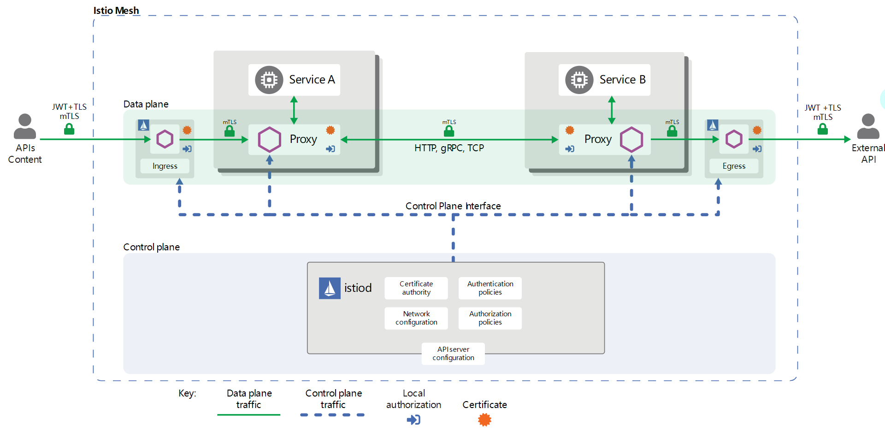

# 安全管理


本文使用istio版本为v1.9.2。

Istio安全架构图如下：



从图中可知安全方面主要集中在以下几个方面：

* 终端用户基于JWT的身份认证方案；
* 经网关(ingress/egress)的流量安全；
* 网格内部的流量安全(认证，授权)；
* Istio自身的安全方案；

# 网格内部流量

## 自动双向TLS

除非显示的指定，否则通过官方的配置(default/demo等)安装的istio，均默认开启了双向TLS认证(mtls, mutual TLS)，正如"Istio安全架构图"中展示的，网格内服务间通信时双方的envoy代理数据是被TLS加密的。

源码部分可参考[github](func ApplyMeshConfigDefaults(yaml string) (*meshconfig.MeshConfig, error) {)，默认mTLS配置被置为`true`:

> EnableAutoMtls:              &types.BoolValue{Value: true}, 

具体配置可参考[官网释义](https://istio.io/latest/docs/reference/config/istio.mesh.v1alpha1/)。

> 老版本通过`Values.global.mtls.enabled`和`Values.global.mtls.auto`来配置，新版本替换为'`PeerAuthentication`资源和`meshConfig.enableAutoMtls`，参见[github](https://github.com/istio/istio/blob/1768302ab944e8bdbd7d5b78514c0a5a11cdd213/operator/pkg/apis/istio/v1alpha1/validation/validation.go#L100)。

默认情况下istio使用自生成的证书与密钥等进行mTLS加密，并根据认证等策略异步发送配置到目标端点。代理收到配置后，新的认证要求会立即生效。

### 实例验证

分别创建`full`,`part`,`legacy`三个命名空间，分别部署`httpbin`与`sleep`服务，除了`legacy`之外其他均注入边车。

```bash
# kubectl create ns full
# kubectl apply -f <(istioctl kube-inject -f samples/httpbin/httpbin.yaml) -n full
# kubectl apply -f <(istioctl kube-inject -f samples/sleep/sleep.yaml) -n full
# kubectl create ns part
# kubectl apply -f <(istioctl kube-inject -f samples/httpbin/httpbin.yaml) -n part
# kubectl apply -f <(istioctl kube-inject -f samples/sleep/sleep.yaml) -n part
# kubectl create ns legacy
# kubectl apply -f samples/httpbin/httpbin.yaml -n legacy
# kubectl apply -f samples/sleep/sleep.yaml -n legacy
```

若流量被istio双向TLS加密，则代理自动在消息头中添加了`X-Forwarded-Client-Cer`，可通过`httpbin`服务的`/headers`查看。

```bash
# kubectl -nfull exec -it deploy/sleep -- curl -s http://httpbin.part:8000/headers | grep X-Forwarded-Client-Cert
    "X-Forwarded-Client-Cert": "By=spiffe://cluster.local/ns/full/sa/httpbin;Hash=aa013048768c74c5289c2ae4bbab4f944cb878d13e7dee78aa75d7b7930a34fc;Subject=\"\";URI=spiffe://cluster.local/ns/full/sa/sleep"
```

通过以下循环，使得三个命名空间下的服务进行互相访问测试，均能正常访问：

```bash
# for from in "full" "part" "legacy"; do for to in "full" "part" "legacy"; do echo -e "sleep.${from} to httpbin.${to}";kubectl exec "$(kubectl get pod -l app=sleep -n ${from} -o jsonpath={.items..metadata.name})" -c sleep -n ${from} -- curl "http://httpbin.${to}:8000/headers" -s  -w "response code: %{http_code}" | egrep -o 'URI\=spiffe.*sa/[a-z]*|response.*$';echo  ; done; done
sleep.full to httpbin.full
URI=spiffe://cluster.local/ns/full/sa/sleep  # 双向mTLS
response code: 200

sleep.full to httpbin.part
URI=spiffe://cluster.local/ns/full/sa/sleep  # 双向mTLS
response code: 200

sleep.full to httpbin.legacy                 # 宽容模式，明文
response code: 200

sleep.part to httpbin.full
URI=spiffe://cluster.local/ns/part/sa/sleep  # 双向mTLS
response code: 200

sleep.part to httpbin.part
URI=spiffe://cluster.local/ns/part/sa/sleep  # 双向mTLS
response code: 200

sleep.part to httpbin.legacy                 # 宽容模式，明文
response code: 200

sleep.legacy to httpbin.full                 # 宽容模式，明文
response code: 200

sleep.legacy to httpbin.part                 # 宽容模式，明文
response code: 200

sleep.legacy to httpbin.legacy               # 宽容模式，明文
response code: 200
```

从测试结果来看，只有互相具备代理容器的服务相互访问才被添加了mTLS，其他情况下流量均未被加密。

这是istio具备的一种特殊模式：宽容模式（permissive mode）。

## 同级认证策略

宽容模式也是在双向TLS中默认开启的，允许网格内服务同时接受纯文本流量和双向 TLS 流量，由代理自动识别并决定是否加密(两个http服务都携带边车，两者边车默认mTLS通信；当其中一个服务不携带边车，两者也能通信，通过明文)。

宽容模式是istio自定义资源`PeerAuthentication`(PA，同级认证)中的[配置项](https://istio.io/latest/docs/reference/config/security/peer_authentication/#PeerAuthentication-MutualTLS-Mode)，模式可配置为`禁用`(仅明文)，`严格`(仅mTLS)，`宽容`，`未配置`(若父级有配置则继承，否则宽容模式)。

认证策略为在 Istio 网格中**接收请求**的工作负载指定认证要求。事实上，`PeerAuthentication`资源只是用来管理**接收端**是否启用TLS认证，并没有携带身份认证方面的信息，认证信息通过[RequestAuthentication](https://istio.io/latest/zh/docs/reference/config/security/request_authentication/)资源进行配置。

`PeerAuthentication`资源主要用于为命名空间或特定工作负载配置认证模式，通过`namespace`与`selector`字段协同配置：

* namespace为根命名空间，selector为空或不配置：整个网格生效的配置；
* namespace为特定命名空间，selector为空或不配置：特定命名空间下生效的配置；
* namespace为特定命名空间，selector不为空：特定工作负载下生效的配置；

Istio 按照以下顺序为每个工作负载应用最窄的匹配策略：

1. 特定于工作负载的
2. 命名空间范围
3. 网格范围

不同级别的策略配置可以认为是一种父子关系，可用于继承。

### 特定范围同级认证

在根命名空间创建`STRICT`模式的`PeerAuthentication`，

```bash
# kubectl apply -f - <<EOF
apiVersion: "security.istio.io/v1beta1"
kind: "PeerAuthentication"
metadata:
  name: "default"
  namespace: "istio-system"
spec:
  mtls:
    mode: STRICT  # 使用mTLS通道的连接
EOF
```

运行稍作改动的上述命令：

```bash
# for from in "full" "part" "legacy"; do for to in "full" "part" "legacy"; do kubectl exec "$(kubectl get pod -l app=sleep -n ${from} -o jsonpath={.items..metadata.name})" -c sleep -n ${from} -- curl "http://httpbin.${to}:8000/ip" -s -o /dev/null -w "sleep.${from} to httpbin.${to}: %{http_code}\n"; done; done
sleep.full to httpbin.full: 200           
sleep.full to httpbin.part: 200
sleep.full to httpbin.legacy: 200
sleep.part to httpbin.full: 200
sleep.part to httpbin.part: 200
sleep.part to httpbin.legacy: 200
sleep.legacy to httpbin.full: 000           # 协议冲突
command terminated with exit code 56
sleep.legacy to httpbin.part: 000           # 协议冲突
command terminated with exit code 56
sleep.legacy to httpbin.legacy: 200
```

由于认证策略为在 Istio 网格中**接收请求**的工作负载(上游主机)指定认证要求，因此mTLS模式下携带边车代理的服务不能接收明文流量，连接被重置，curl客户端异常退出。

就是**接受请求**的那一端，在有边车的情况下，必须是mtls的，例如从`sleep.legacy`到`httpbin.full`是不行的，因为`httpbin.full` 有sidecar，而`sleep.legacy`没有sidecar，pa策略中又要求**接收请求**的工作负载指定为mtls，mtls是建立在两个sidecar之间的，所以由于位于下游的`sleep.legacy`没有sidecar，所以最终的请求会失败。

而如果下游有sidecar ,而接收请求的上游没有sidecar，此时请求也是可以通过的。例如`sleep.full`到`httpbin.legacy` 这是可以通的，因为前面已经说的，pa这是作用在接收请求的sidecar，而`httpbin.legacy`没有sidecar，所以不用走pa指定的策略。

以下是来自官网的原话：

```shell
# You see requests still succeed, except for those from the client that doesn’t have proxy, sleep.legacy, to the server with a proxy, httpbin.foo or httpbin.bar. This is expected because mutual TLS is now strictly required, but the workload without sidecar cannot comply.

你会看到请求任然成功了，除了那些没有sidecar的客户端（sleep.legacy），{sleep.legacy, to the server with a proxy, httpbin.foo or httpbin.bar}都失败了，因为mutual TLS is now strictly required，那些没有sidecar的workload不能遵从。
```

> curl: (56) Recv failure: Connection reset by peer
> command terminated with exit code 56

```shell
> apiVersion: security.istio.io/v1beta1
> kind: PeerAuthentication
> metadata:
>   name: "httpbin"
>   namespace: "bar"
> spec:
>   selector:
>     matchLabels:
>       app: httpbin
>   mtls:
>     mode: STRICT
> EOF
peerauthentication.security.istio.io/httpbin created

[root@linuxtest0029 istio-1.9.2]# for from in "foo" "bar" "legacy"; do for to in "foo" "bar" "legacy"; do kubectl exec "$(kubectl get pod -l app=sleep -n ${from} -o jsonpath={.items..metadata.name})" -c sleep -n ${from} -- curl "http://httpbin.${to}:8000/ip" -s -o /dev/null -w "sleep.${from} to httpbin.${to}: %{http_code}\n"; done; done
sleep.foo to httpbin.foo: 200
sleep.foo to httpbin.bar: 200
sleep.foo to httpbin.legacy: 200
sleep.bar to httpbin.foo: 200
sleep.bar to httpbin.bar: 200
sleep.bar to httpbin.legacy: 200
sleep.legacy to httpbin.foo: 200
sleep.legacy to httpbin.bar: 000
command terminated with exit code 56
sleep.legacy to httpbin.legacy: 200

# 指定workload级别，那么httpbin.bar，走的是mtls
```

此时加上如下dr，再次调用指令查看结果

```shell
apiVersion: networking.istio.io/v1alpha3
kind: DestinationRule
metadata:
  name: "httpbin"
  namespace: bar
spec:
  host: "httpbin.bar.svc.cluster.local"
  trafficPolicy:
    tls:
      mode: DISABLE

[root@linuxtest0029 patest]# for from in "foo" "bar" "legacy"; do for to in "foo" "bar" "legacy"; do kubectl exec "$(kubectl get pod -l app=sleep -n ${from} -o jsonpath={.items..metadata.name})" -c sleep -n ${from} -- curl "http://httpbin.${to}:8000/ip" -s -o /dev/null -w "sleep.${from} to httpbin.${to}: %{http_code}\n"; done; done
sleep.foo to httpbin.foo: 200
sleep.foo to httpbin.bar: 503  # 出现了503 ，发往httpbin.bar 的流量是明文，因为在dr中配置了 发往httpbin.bar的流量的 tls 是DISABLE 也就是走的明文，但之前我们在pa中配置的又是严格模式，所以客户端发送过来的请求是没法通过的。
sleep.foo to httpbin.legacy: 200
sleep.bar to httpbin.foo: 200
sleep.bar to httpbin.bar: 503  # 出现了503
sleep.bar to httpbin.legacy: 200
sleep.legacy to httpbin.foo: 200
sleep.legacy to httpbin.bar: 000
command terminated with exit code 56
sleep.legacy to httpbin.legacy: 200
```

如果修改dr的内容，将`DISABLE`改为`ISTIO-MUTUAL`

```shell
apiVersion: networking.istio.io/v1alpha3
kind: DestinationRule
metadata:
  name: "httpbin"
  namespace: bar
spec:
  host: "httpbin.bar.svc.cluster.local"
  trafficPolicy:
    tls:
      mode: ISTIO_MUTUAL
# 这里在原yaml中修改完后重新apply 一下即可

[root@linuxtest0029 patest]# for from in "foo" "bar" "legacy"; do for to in "foo" "bar" "legacy"; do kubectl exec "$(kubectl get pod -l app=sleep -n ${from} -o jsonpath={.items..metadata.name})" -c sleep -n ${from} -- curl "http://httpbin.${to}:8000/ip" -s -o /dev/null -w "sleep.${from} to httpbin.${to}: %{http_code}\n"; done; done
sleep.foo to httpbin.foo: 200
sleep.foo to httpbin.bar: 200  # 因为在dr中ISTIO_MUTUAL的作用，将发往"httpbin.bar.svc.cluster.local"的流量设置为了加密的，而pa又是严格模式，所以成功
sleep.foo to httpbin.legacy: 200
sleep.bar to httpbin.foo: 200
sleep.bar to httpbin.bar: 200
sleep.bar to httpbin.legacy: 200
sleep.legacy to httpbin.foo: 200
sleep.legacy to httpbin.bar: 000
command terminated with exit code 56
sleep.legacy to httpbin.legacy: 200

# 可以看到  sleep.foo to httpbin.bar  sleep.bar to httpbin.bar 在dr如果是DISABLE的情况是503的
# 但是如果将dr 设置成 ISTIO_MUTUAL， 那么请求又是可以正常访问的
# 因为如果将dr设置成DISABLE,那么客户端出来的流程就是明文的，但是pa中又设置成了STRICT，服务端这边带sidecar的，需要接收的是密文，所以出现503
# 如果将dr设置成DISABLE,那么客户端出来的流程就是密文的，pa中又设置成了STRICT，服务端这边带sidecar的，需要接收的是密文，所以访问正常
# 因为可以看出来，尽管dr配置的时候，如上所示，配置的是： "httpbin.bar.svc.cluster.local"，实际上作用的是发往这个Host的流量，也就是客户端发往服务端的请求流量，可以看做dr更像是作用于客户端的，而pa作用的是接收请求的一方，可以把他看做成服务端。
```

```shell
# 原先的pa 配置如下:
apiVersion: security.istio.io/v1beta1
kind: PeerAuthentication
metadata:
  name: "httpbin"
  namespace: "bar"
spec:
  selector:
    matchLabels:
      app: httpbin
  mtls:
    mode: STRICT
# 修改pa的配置如下
[root@linuxtest0029 patest]# cat <<EOF | kubectl apply -n bar -f -
> apiVersion: security.istio.io/v1beta1
> kind: PeerAuthentication
> metadata:
>   name: "httpbin"
>   namespace: "bar"
> spec:
>   selector:
>     matchLabels:
>       app: httpbin
>   mtls:
>     mode: STRICT
>   portLevelMtls:
>     80:
>       mode: DISABLE
> EOF
peerauthentication.security.istio.io/httpbin configured

# 此时再次调用所有的服务，可以看到所有的访问都通了
[root@linuxtest0029 patest]# for from in "foo" "bar" "legacy"; do for to in "foo" "bar" "legacy"; do kubectl exec "$(kubectl get pod -l app=sleep -n ${from} -o jsonpath={.items..metadata.name})" -c sleep -n ${from} -- curl "http://httpbin.${to}:8000/ip" -s -o /dev/null -w "sleep.${from} to httpbin.${to}: %{http_code}\n"; done; done
sleep.foo to httpbin.foo: 200
sleep.foo to httpbin.bar: 200
sleep.foo to httpbin.legacy: 200
sleep.bar to httpbin.foo: 200
sleep.bar to httpbin.bar: 200
sleep.bar to httpbin.legacy: 200
sleep.legacy to httpbin.foo: 200
sleep.legacy to httpbin.bar: 200
sleep.legacy to httpbin.legacy: 200

```

清除之前的pa 和 dr ，然后重新部署， 创建新的pa 和 dr

```shell
[root@linuxtest0029 patest]# kubectl apply -f - <<EOF
apiVersion: security.istio.io/v1beta1
kind: PeerAuthentication
metadata:
  name: "default"
  namespace: "foo"
spec:
  mtls:
    mode: STRICT
EOF
peerauthentication.security.istio.io/default created


[root@linuxtest0029 patest]# for from in "foo" "bar" "legacy"; do for to in "foo" "bar" "legacy"; do kubectl exec "$(kubectl get pod -l app=sleep -n ${from} -o jsonpath={.items..metadata.name})" -c sleep -n ${from} -- curl "http://httpbin.${to}:8000/ip" -s -o /dev/null -w "sleep.${from} to httpbin.${to}: %{http_code}\n"; done; done
sleep.foo to httpbin.foo: 200
sleep.foo to httpbin.bar: 200
sleep.foo to httpbin.legacy: 200
sleep.bar to httpbin.foo: 200
sleep.bar to httpbin.bar: 200
sleep.bar to httpbin.legacy: 200
sleep.legacy to httpbin.foo: 000
command terminated with exit code 56
sleep.legacy to httpbin.bar: 200
sleep.legacy to httpbin.legacy: 200


# cat <<EOF | kubectl apply -n foo -f -
apiVersion: security.istio.io/v1beta1
kind: PeerAuthentication
metadata:
  name: "overwrite-example"
  namespace: "foo"
spec:
  selector:
    matchLabels:
      app: httpbin
  mtls:
    mode: DISABLE
EOF
peerauthentication.security.istio.io/overwrite-example created

# 需要等待规则下发一段时间
[root@linuxtest0029 patest]# for from in "foo" "bar" "legacy"; do for to in "foo" "bar" "legacy"; do kubectl exec "$(kubectl get pod -l app=sleep -n ${from} -o jsonpath={.items..metadata.name})" -c sleep -n ${from} -- curl "http://httpbin.${to}:8000/ip" -s -o /dev/null -w "sleep.${from} to httpbin.${to}: %{http_code}\n"; done; done

sleep.foo to httpbin.foo: 503  # 出现503, 因为此时sleep.foo 是带sidecar的，此时还是他妈的会发起tls连接的过程，但是pa上又配置了httpbin不走，
sleep.foo to httpbin.bar: 200
sleep.foo to httpbin.legacy: 200
sleep.bar to httpbin.foo: 503  # 出现503
sleep.bar to httpbin.bar: 200
sleep.bar to httpbin.legacy: 200
sleep.legacy to httpbin.foo: 200  # 可以访问了
sleep.legacy to httpbin.bar: 200
sleep.legacy to httpbin.legacy: 200

# 为对httpbin.foo的请求配置tls 为 DISABLE (作用于客户端 或 请求方 或 下游)， 这里的httpbin.foo是上游
[root@linuxtest0029 patest]# cat <<EOF | kubectl apply -n foo -f -
apiVersion: networking.istio.io/v1alpha3
kind: DestinationRule
metadata:
  name: "overwrite-example"
  namespace: "foo"
spec:
  host: httpbin.foo.svc.cluster.local
  trafficPolicy:
    tls:
      mode: DISABLE
EOF
destinationrule.networking.istio.io/overwrite-example created


[root@linuxtest0029 patest]# for from in "foo" "bar" "legacy"; do for to in "foo" "bar" "legacy"; do kubectl exec "$(kubectl get pod -l app=sleep -n ${from} -o jsonpath={.items..metadata.name})" -c sleep -n ${from} -- curl "http://httpbin.${to}:8000/ip" -s -o /dev/null -w "sleep.${from} to httpbin.${to}: %{http_code}\n"; done; done
sleep.foo to httpbin.foo: 200
sleep.foo to httpbin.bar: 200
sleep.foo to httpbin.legacy: 200
sleep.bar to httpbin.foo: 200
sleep.bar to httpbin.bar: 200
sleep.bar to httpbin.legacy: 200
sleep.legacy to httpbin.foo: 200  
sleep.legacy to httpbin.bar: 200
sleep.legacy to httpbin.legacy: 200
```


## 测试 pa 与 dr 配合的情况

```shell
# 在干净的环境下部署好测试服务
[root@linuxtest0029 istio-1.9.2]# for from in "foo" "bar" "legacy"; do for to in "foo" "bar" "legacy"; do kubectl exec "$(kubectl get pod -l app=sleep -n ${from} -o jsonpath={.items..metadata.name})" -c sleep -n ${from} -- curl "http://httpbin.${to}:8000/ip" -s -o /dev/null -w "sleep.${from} to httpbin.${to}: %{http_code}\n"; done; done
sleep.foo to httpbin.foo: 200
sleep.foo to httpbin.bar: 200
sleep.foo to httpbin.legacy: 200
sleep.bar to httpbin.foo: 200
sleep.bar to httpbin.bar: 200
sleep.bar to httpbin.legacy: 200
sleep.legacy to httpbin.foo: 200
sleep.legacy to httpbin.bar: 200
sleep.legacy to httpbin.legacy: 200

创建如下pa:
apiVersion: security.istio.io/v1beta1
kind: PeerAuthentication
metadata:
  name: "default"
  namespace: "istio-system"
spec:
  mtls:
    mode: STRICT
再次访问，可以看到如下情况：
[root@linuxtest0029 istio-1.9.2]# for from in "foo" "bar" "legacy"; do for to in "foo" "bar" "legacy"; do kubectl exec "$(kubectl get pod -l app=sleep -n ${from} -o jsonpath={.items..metadata.name})" -c sleep -n ${from} -- curl "http://httpbin.${to}:8000/ip" -s -o /dev/null -w "sleep.${from} to httpbin.${to}: %{http_code}\n"; done; done
sleep.foo to httpbin.foo: 200
sleep.foo to httpbin.bar: 200
sleep.foo to httpbin.legacy: 200
sleep.bar to httpbin.foo: 200
sleep.bar to httpbin.bar: 200
sleep.bar to httpbin.legacy: 200
sleep.legacy to httpbin.foo: 000  # sleep.legacy 没有sidecar
command terminated with exit code 56
sleep.legacy to httpbin.bar: 000 # sleep.legacy 没有sidecar
command terminated with exit code 56
sleep.legacy to httpbin.legacy: 200

创建如下dr:
apiVersion: networking.istio.io/v1alpha3
kind: DestinationRule
metadata:
  name: "httpbin"
  namespace: "bar"
spec:
  host: httpbin.bar.svc.cluster.local
  trafficPolicy:
    tls:
      mode: ISTIO_MUTUAL
    portLevelSettings:
    - port:
        number: 8000
      tls:
        mode: DISABLE
再次访问，可以看到如下情况：
[root@linuxtest0029 istio-1.9.2]# for from in "foo" "bar" "legacy"; do for to in "foo" "bar" "legacy"; do kubectl exec "$(kubectl get pod -l app=sleep -n ${from} -o jsonpath={.items..metadata.name})" -c sleep -n ${from} -- curl "http://httpbin.${to}:8000/ip" -s -o /dev/null -w "sleep.${from} to httpbin.${to}: %{http_code}\n"; done; done
sleep.foo to httpbin.foo: 200
sleep.foo to httpbin.bar: 503    # 出现了503 
sleep.foo to httpbin.legacy: 200
sleep.bar to httpbin.foo: 200
sleep.bar to httpbin.bar: 503  # 出现了503
sleep.bar to httpbin.legacy: 200
sleep.legacy to httpbin.foo: 000
command terminated with exit code 56
sleep.legacy to httpbin.bar: 000
command terminated with exit code 56
sleep.legacy to httpbin.legacy: 200
```

上述的pa配置为全局的严格模式，在dr中配置的workload级别的tls为disable，那么httpbin是需要tls的，但是由于DR的作用，发往httpbin的流量并不是加密的，所以。查看`sleep.foo`的日志:

```shell
2021-06-24T07:30:05.982687Z	debug	envoy pool	queueing stream due to no available connections
2021-06-24T07:30:05.982692Z	debug	envoy pool	creating a new connection
2021-06-24T07:30:05.982720Z	debug	envoy client	[C53905] connecting
2021-06-24T07:30:05.982724Z	debug	envoy connection	[C53905] connecting to 10.244.192.96:80
2021-06-24T07:30:05.982841Z	debug	envoy connection	[C53905] connection in progress
2021-06-24T07:30:05.982868Z	debug	envoy connection	[C53905] connected
2021-06-24T07:30:05.982872Z	debug	envoy client	[C53905] connected
2021-06-24T07:30:05.982877Z	debug	envoy pool	[C53905] attaching to next stream
2021-06-24T07:30:05.982880Z	debug	envoy pool	[C53905] creating stream
2021-06-24T07:30:05.982886Z	debug	envoy router	[C53904][S12730250961259434163] pool ready
2021-06-24T07:30:05.983114Z	debug	envoy misc	Unknown error code 104 details Connection reset by peer
2021-06-24T07:30:05.983134Z	debug	envoy connection	[C53905] remote close
2021-06-24T07:30:05.983138Z	debug	envoy connection	[C53905] closing socket: 0
2021-06-24T07:30:05.983152Z	debug	envoy client	[C53905] disconnect. resetting 1 pending requests
2021-06-24T07:30:05.983160Z	debug	envoy client	[C53905] request reset
2021-06-24T07:30:05.983171Z	debug	envoy router	[C53904][S12730250961259434163] upstream reset: reset reason: connection termination, transport failure reason: 
2021-06-24T07:30:05.983210Z	debug	envoy http	[C53904][S12730250961259434163] Sending local reply with details upstream_reset_before_response_started{connection termination}
2021-06-24T07:30:05.983247Z	debug	envoy http	[C53904][S12730250961259434163] encoding headers via codec (end_stream=false):
':status', '503'
'content-length', '95'
'content-type', 'text/plain'
'date', 'Thu, 24 Jun 2021 07:30:05 GMT'
'server', 'envoy'
```

修改之前的dr：

```yaml
apiVersion: networking.istio.io/v1alpha3
kind: DestinationRule
metadata:
  name: "httpbin"
  namespace: "bar"
spec:
  host: httpbin.bar.svc.cluster.local
  trafficPolicy:
    tls:
      mode: ISTIO_MUTUAL
    portLevelSettings:
    - port:
        number: 8000
      tls:
        mode: ISTIO_MUTUAL # 将原先的DISABLE改为ISTIO_MUTUAL

[root@linuxtest0029 istio-1.9.2]# for from in "foo" "bar" "legacy"; do for to in "foo" "bar" "legacy"; do kubectl exec "$(kubectl get pod -l app=sleep -n ${from} -o jsonpath={.items..metadata.name})" -c sleep -n ${from} -- curl "http://httpbin.${to}:8000/ip" -s -o /dev/null -w "sleep.${from} to httpbin.${to}: %{http_code}\n"; done; done
sleep.foo to httpbin.foo: 200  
sleep.foo to httpbin.bar: 200 # 可以看到原先的503 变为了200
sleep.foo to httpbin.legacy: 200
sleep.bar to httpbin.foo: 200
sleep.bar to httpbin.bar: 200
sleep.bar to httpbin.legacy: 200
sleep.legacy to httpbin.foo: 000
command terminated with exit code 56
sleep.legacy to httpbin.bar: 000
command terminated with exit code 56
sleep.legacy to httpbin.legacy: 200

-------------------------------------------------------------------------------------------------------------------------------
再次修改dr :

apiVersion: networking.istio.io/v1alpha3
kind: DestinationRule
metadata:
  name: "httpbin"
  namespace: "bar"
spec:
  host: httpbin.bar.svc.cluster.local
  trafficPolicy:
    tls:
      mode: ISTIO_MUTUAL
    portLevelSettings:
    - port:
        number: 8000
      tls:
        mode: SIMPLE   # 设置成单向认证

[root@linuxtest0029 istio-1.9.2]# for from in "foo" "bar" "legacy"; do for to in "foo" "bar" "legacy"; do kubectl exec "$(kubectl get pod -l app=sleep -n ${from} -o jsonpath={.items..metadata.name})" -c sleep -n ${from} -- curl "http://httpbin.${to}:8000/ip" -s -o /dev/null -w "sleep.${from} to httpbin.${to}: %{http_code}\n"; done; done
sleep.foo to httpbin.foo: 200
sleep.foo to httpbin.bar: 503  # 出现了503
sleep.foo to httpbin.legacy: 200
sleep.bar to httpbin.foo: 200
sleep.bar to httpbin.bar: 503
sleep.bar to httpbin.legacy: 200
sleep.legacy to httpbin.foo: 000
command terminated with exit code 56
sleep.legacy to httpbin.bar: 000
command terminated with exit code 56
sleep.legacy to httpbin.legacy: 200

-------------------------------------------------------------------------------------------------------------------------------
此时更改pa 如下：
apiVersion: security.istio.io/v1beta1
kind: PeerAuthentication
metadata:
  name: "default"
  namespace: "istio-system"
spec:
  mtls:
    mode: PERMISSIVE

[root@linuxtest0029 istio-1.9.2]# for from in "foo" "bar" "legacy"; do for to in "foo" "bar" "legacy"; do kubectl exec "$(kubectl get pod -l app=sleep -n ${from} -o jsonpath={.items..metadata.name})" -c sleep -n ${from} -- curl "http://httpbin.${to}:8000/ip" -s -o /dev/null -w "sleep.${from} to httpbin.${to}: %{http_code}\n"; done; done
sleep.foo to httpbin.foo: 200
sleep.foo to httpbin.bar: 503
sleep.foo to httpbin.legacy: 200
sleep.bar to httpbin.foo: 200
sleep.bar to httpbin.bar: 503
sleep.bar to httpbin.legacy: 200
sleep.legacy to httpbin.foo: 200
sleep.legacy to httpbin.bar: 200
sleep.legacy to httpbin.legacy: 200
-------------------------------------------------------------------------------------------------------------------------------
apiVersion: security.istio.io/v1beta1
kind: PeerAuthentication
metadata:
  name: "default"
  namespace: "istio-system"
spec:
  mtls:
    mode: DISABLE
    
[root@linuxtest0029 istio-1.9.2]# for from in "foo" "bar" "legacy"; do for to in "foo" "bar" "legacy"; do kubectl exec "$(kubectl get pod -l app=sleep -n ${from} -o jsonpath={.items..metadata.name})" -c sleep -n ${from} -- curl "http://httpbin.${to}:8000/ip" -s -o /dev/null -w "sleep.${from} to httpbin.${to}: %{http_code}\n"; done; done
sleep.foo to httpbin.foo: 200
sleep.foo to httpbin.bar: 503
sleep.foo to httpbin.legacy: 200
sleep.bar to httpbin.foo: 200
sleep.bar to httpbin.bar: 503
sleep.bar to httpbin.legacy: 200
sleep.legacy to httpbin.foo: 200
sleep.legacy to httpbin.bar: 200
sleep.legacy to httpbin.legacy: 200
 -------------------------------------------------------------------------------------------------------------------------------

最终我修改了dr如下：
apiVersion: networking.istio.io/v1alpha3
kind: DestinationRule
metadata:
  name: "httpbin"
  namespace: "bar"
spec:
  host: httpbin.bar.svc.cluster.local
  trafficPolicy:
    tls:
      mode: ISTIO_MUTUAL
    portLevelSettings:
    - port:
        number: 8000
      tls:
        mode: DISABLE

[root@linuxtest0029 istio-1.9.2]# for from in "foo" "bar" "legacy"; do for to in "foo" "bar" "legacy"; do kubectl exec "$(kubectl get pod -l app=sleep -n ${from} -o jsonpath={.items..metadata.name})" -c sleep -n ${from} -- curl "http://httpbin.${to}:8000/ip" -s -o /dev/null -w "sleep.${from} to httpbin.${to}: %{http_code}\n"; done; done
sleep.foo to httpbin.foo: 200
sleep.foo to httpbin.bar: 200
sleep.foo to httpbin.legacy: 200
sleep.bar to httpbin.foo: 200
sleep.bar to httpbin.bar: 200
sleep.bar to httpbin.legacy: 200
sleep.legacy to httpbin.foo: 200
sleep.legacy to httpbin.bar: 200
sleep.legacy to httpbin.legacy: 200

OK， 所有的访问都返回了200。
```


在特定命名空间范围设置`STRICT`模式的`PeerAuthentication`，同理。

若有使用场景为**出站mTLS流量**的工作负载指定负载级别认证策略，则需要[结合`PeerAuthentication`与`DestinationRule`](https://istio.io/latest/docs/tasks/security/authentication/authn-policy/#enable-mutual-tls-per-workload)

```yaml
apiVersion: "networking.istio.io/v1alpha3"
kind: "DestinationRule"
metadata:
  name: "httpbin"
spec:
  host: "httpbin.part.svc.cluster.local"
  trafficPolicy:
    tls:
      mode: DISABLE
```

其中的`tls.mode`参见[官网](https://istio.io/latest/docs/reference/config/networking/destination-rule/#ClientTLSSettings-TLSmode)，当为`ISTIO_MUTUAL`代表使用istio自身管理的证书等进行加密管理，`DISABLE`代表禁用TLS连接。

运行上述命令进行测试：

```bash
# for from in "full" "part" "legacy"; do for to in "full" "part" "legacy"; do kubectl exec "$(kubectl get pod -l app=sleep -n ${from} -o jsonpath={.items..metadata.name})" -c sleep -n ${from} -- curl "http://httpbin.${to}:8000/ip" -s -o /dev/null -w "sleep.${from} to httpbin.${to}: %{http_code}\n"; done; done
sleep.full to httpbin.full: 200
sleep.full to httpbin.part: 503             # 边车协议冲突503，发送明文接收密文
sleep.full to httpbin.legacy: 200
sleep.part to httpbin.full: 200
sleep.part to httpbin.part: 503             # 边车协议冲突503，发送明文接收密文
sleep.part to httpbin.legacy: 200
sleep.legacy to httpbin.full: 000           # 协议冲突
command terminated with exit code 56       
sleep.legacy to httpbin.part: 000           # 协议冲突
command terminated with exit code 56
sleep.legacy to httpbin.legacy: 200
```

在另一篇描述503的文章中提到，当网格内服务TLS配置冲突时，请求以`503`状态码返回客户端(示例中表现为part被配置接收mTLS流量，但是发送过来的流量又是明文)。由于`legacy`未配置边车，因此`DestinationRule`资源不能对其命名空间下的服务生效，仍然以错误码56退出。

**注意**：通过上例可知，通过`DestinationRule`资源这种配置边车达到的mTLS禁用，与不携带边车默认的http明文是不一样的。

再次修改策略，使满足如下条件：

```bash
# kubectl get -A pa
NAMESPACE      NAME      MODE      AGE
istio-system   default   STRICT    134m    # 全局设置mTLS
part           default   DISABLE   2m31s   # part命名空间禁用mTLS
# kubectl get -A dr
NAMESPACE  NAME     HOST                            AGE
part       default  httpbin.part.svc.cluster.local  15m # 仅对目标'httpbin.part'禁用mTLS
# for from in "full" "part" "legacy"; do for to in "full" "part" "legacy"; do echo -e "sleep.${from} to httpbin.${to}";kubectl exec "$(kubectl get pod -l app=sleep -n ${from} -o jsonpath={.items..metadata.name})" -c sleep -n ${from} -- curl "http://httpbin.${to}:8000/headers" -s  -w "response code: %{http_code}" | egrep -o 'URI\=spiffe.*sa/[a-z]*|response.*$';echo  ; done; done
sleep.full to httpbin.full
URI=spiffe://cluster.local/ns/full/sa/sleep  # full到full为mTLS
response code: 200

sleep.full to httpbin.part                   # full到part为明文，因为pa.part
response code: 200

sleep.full to httpbin.legacy                 # 明文，因为legacy无边车
response code: 200

sleep.part to httpbin.full                   # mTLS，因为全局mTLS
URI=spiffe://cluster.local/ns/part/sa/sleep
response code: 200

sleep.part to httpbin.part                   # 明文，因为pa.part和dr.part
response code: 200

sleep.part to httpbin.legacy                 # 明文，因为legacy无边车
response code: 200

sleep.legacy to httpbin.full                 # 错误，因为legacy明文，full为mTLS
command terminated with exit code 56
response code: 000

sleep.legacy to httpbin.part                 # 明文，因为part仅接收明文
response code: 200

sleep.legacy to httpbin.legacy               # 明文
response code: 200
```

上述示例结果确认了`PeerAuthentication`策略为**接收请求**的工作负载生效，`DestinationRule`资源为**发送目的地**的流量生效策略。

### 特定端口认证策略

通过`PeerAuthentication`与`DestinationRule`，还可以为特定端口设置认证策略：

```yaml
apiVersion: "security.istio.io/v1beta1"
kind: "PeerAuthentication"
metadata:
  name: "httpbin"
  namespace: "part"
spec:
  selector:
    matchLabels:
      app: httpbin
  mtls:
    mode: STRICT
  portLevelMtls:
    80:            # pod或container中的端口
      mode: DISABLE
---
apiVersion: "networking.istio.io/v1alpha3"
kind: "DestinationRule"
metadata:
  name: "httpbin"
  namespace: "part"
spec:
  host: httpbin.part.svc.cluster.local
  trafficPolicy:
    tls:
      mode: ISTIO_MUTUAL
    portLevelSettings:
    - port:
        number: 8000     # svc中的端口
      tls:
        mode: DISABLE
```

再次进行验证：

```bash
# for from in "full" "part" "legacy"; do for to in "full" "part" "legacy"; do kubectl exec "$(kubectl get pod -l app=sleep -n ${from} -o jsonpath={.items..metadata.name})" -c sleep -n ${from} -- curl "http://httpbin.${to}:8000/ip" -s -o /dev/null -w "sleep.${from} to httpbin.${to}: %{http_code}\n"; done; done
sleep.full to httpbin.full: 200
sleep.full to httpbin.part: 200
sleep.full to httpbin.legacy: 200
sleep.part to httpbin.full: 200
sleep.part to httpbin.part: 200
sleep.part to httpbin.legacy: 200
sleep.legacy to httpbin.full: 000
command terminated with exit code 56
sleep.legacy to httpbin.part: 200
sleep.legacy to httpbin.legacy: 200
```

此时，`legacy`下的服务能够以明文的方式访问`part`下的httpbin服务，因为特定端口已经配置为明文发送。

需要**`注意`**的是，`PeerAuthentication`资源中指定的端口是pod或container中的端口号，而`DestinationRule`中指定的是service中的端口号(一般情况下都是填的service的端口)。

```yaml
apiVersion: v1
kind: Service
metadata:
  labels:
    app: httpbin
  name: httpbin
spec:
  ports:
  - name: http
    port: 8000
    protocol: TCP
    targetPort: 80
  selector:
    app: httpbin
```

###  切换认证策略

若存在策略的更新，由于istio几乎实时将新策略推送到工作负载。但是，Istio 无法保证所有工作负载都同时收到新政策。

因此在同级认证策略进行切换时，最好使用`宽容`模式作为过渡。

## 发送流量TLS

通过上文可知，`DestinationRule`资源为**发送目的地**的流量生效响应的TLS策略，据此可以实现通过`边车为http流量加密`与`边车为https流量解密`的功能。

### http流量加密

首先环境中部署一个单向https服务，并验证：

```bash
# kubectl -nhttps get po
NAME                            READY   STATUS    RESTARTS   AGE
goserver-tls-6fdcf6f5db-bmrlp   1/1     Running   0          4d1h
# kubectl -nhttps get svc
NAME          TYPE        CLUSTER-IP       EXTERNAL-IP   PORT(S)         AGE
goserver      ClusterIP   10.105.3.144     <none>        9090/TCP        11d
# curl -s -HHost:goserver --resolve "goserver:9090:10.105.3.144" --cacert ./ca.crt  https://goserver:9090/healthz
{"status":"healthy","hostName":"goserver-tls-6fdcf6f5db-bmrlp"}
```

再部署一个简单的sleep服务，注入边车。

为了简单起见，显示通过deploy配置为边车挂载ca证书(实际使用中可以通过SDS方式下发证书)：

```yaml
kind: Deployment
spec:
      containers:
      - name: sleep               # sleep容器
        image: curlimages/curl
      - name: istio-proxy         # 边车容器
        image: registry.hundsun.com/hcs/proxyv2:1.9.2      
        volumeMounts:
        - mountPath: /path/tls    # 证书挂载到代理容器某个目录下
          name: data
      volumes:
      - hostPath:
          path: /path/to/cert
          type: ""
        name: data
---
apiVersion: networking.istio.io/v1beta1
kind: DestinationRule
metadata:
  name: goserver-https
spec:
  host: goserver.https.svc.cluster.local
  trafficPolicy:
    tls:
      caCertificates: /path/tls/ca.crt
      mode: SIMPLE
```

通过sleep容器尝试发送http与https请求：

```bash
# curl -i http://goserver:9090/healthz
HTTP/1.1 200 OK
...
x-envoy-upstream-service-time: 22
server: envoy

{"status":"healthy","hostName":"goserver-tls-6fdcf6f5db-bmrlp"}

# curl -i --cacert ./ca.crt  https://goserver:9090/healthz
HTTP/2 200 
...

{"status":"healthy","hostName":"goserver-tls-6fdcf6f5db-bmrlp"}
```

两种方式均能调用成功，通过消息头发现，当发送http请求是消息头中返回了`server: envoy`，说明流量经过边车代理进行了加密通信。

此时查看sleep边车容器日志如下：

```bash
[2021-05-25T10:37:55.769Z] "GET /healthz HTTP/1.1" 200 - via_upstream - "-" 0 63 1 1 "-" "curl/7.76.1-DEV" "1d3ad295-a61e-49a2-b196-c27a9dd6fd8f" "goserver:9090" "10.244.102.141:8080" outbound|9090||goserver.https.svc.cluster.local 10.244.102.135:57490 10.105.3.144:9090 10.244.102.135:53604 - default
```

而发送https请求时，流量未经过边车代理，查看边车容器日志，发现流量以`Passthrough`的方式透传，如下：

```bash
[2021-05-25T10:38:47.976Z] "- - -" 0 - - - "-" 838 2707 25 - "-" "-" "-" "-" "10.105.3.144:9090" PassthroughCluster 10.244.102.135:54574 10.105.3.144:9090 10.244.102.135:54572 goserver -
```

导出边车所有配置，查看证书配置生效方式：

```json
{
 "configs": [
  {
   "@type": "type.googleapis.com/envoy.admin.v3.ClustersConfigDump",
   "dynamic_active_clusters": [ {
      "cluster": {
         "name": "outbound|9090||goserver.https.svc.cluster.local",
        "type": "EDS"},
      "transport_socket": {
       "name": "envoy.transport_sockets.tls",
       "typed_config": {
        "@type": "type.googleapis.com/envoy.extensions.transport_sockets.tls.v3.UpstreamTlsContext",
        "common_tls_context": {
         "combined_validation_context": {
          "validation_context_sds_secret_config": {
           "name": "file-root:/path/tls/ca.crt",
           "sds_config": {
            "api_config_source": {
             "api_type": "GRPC",
           }}}}}},
  ...   
  {"@type": "type.googleapis.com/envoy.admin.v3.SecretsConfigDump",
   "dynamic_warming_secrets": [
    {
     "name": "file-root:/path/tls/ca.crt",
     "secret": {
      "@type": "type.googleapis.com/envoy.extensions.transport_sockets.tls.v3.Secret",
      "name": "file-root:/path/tls/ca.crt"
     }}]}]}      
```

上述通过在`cluster`中添加了[transport_socket](https://www.envoyproxy.io/docs/envoy/v1.17.3/api-v3/extensions/transport_sockets/tls/v3/tls.proto#extension-envoy-transport-sockets-tls) 来达到为http流量自动加密的功能，可参考envoy[官网]([transport_socket](https://www.envoyproxy.io/docs/envoy/v1.17.3/api-v3/extensions/transport_sockets/tls/v3/tls.proto#extension-envoy-transport-sockets-tls) )介绍。

**注**：

双向认证时，证书配置如下：

```json
"dynamic_warming_secrets": [
    {
     "name": "file-cert:/path/tls/client.crt~/path/tls/client.key",
     "version_info": "uninitialized",
     "secret": {
      "@type": "type.googleapis.com/envoy.extensions.transport_sockets.tls.v3.Secret",
      "name": "file-cert:/path/tls/client.crt~/path/tls/client.key"
     }
    },
    {
     "name": "file-root:/path/tls/server-ca.crt",
     "version_info": "uninitialized",
     "secret": {
      "@type": "type.googleapis.com/envoy.extensions.transport_sockets.tls.v3.Secret",
      "name": "file-root:/path/tls/server-ca.crt"
     }
```


# 网关入站流量

Istio默认提供`Ingress Gateway`用于部署在网格边缘，通过配置`Gateway`资源来管理进入集群的流量。

安全网关支持通过Istio的` Secret 发现服务`（SDS）完成配置，当为多个主机或访问入口域名配置网关入口时，无需重启网关pod，可以动态新增、删除或者更新证书等配置。

> 该功能在老版本需要显示开启，在1.9版本中默认开启。

Istio支持以下不同格式的secret格式：

* 下文例子中使用的键名为`tls.key`和`tls.crt`，双向TLS的ca使用`ca.crt`；
* 键名为`key`和`cert`，双向TLS的ca使用`cacert`；
* 名为`<secret>`中键名为`key`和`cert`，另一个单独的secret命名为`<secret>-cacert`，其中ca键名为`cacert`；

##  http服务配置TLS网关

为`full`命名空间下的httpbin服务生成双向客户端、服务端认证证书(其中服务端域名指定为`httpbin.example.com`)，HTTPS证书生成及相关参见[网络](https://www.cnblogs.com/xiao987334176/p/11041241.html)。

在`istio-system`(istio-ingressgateway所在的命名空间)下创建相应的secret：

```bash
kubectl create -n istio-system secret generic httpbin-credential --from-file=tls.key=httpbin.key \
--from-file=tls.crt=httpbin.crt --from-file=ca.crt=ca.crt
```

根据[官方示例](https://istio.io/latest/docs/tasks/traffic-management/ingress/ingress-control/#determining-the-ingress-ip-and-ports)找出环境变量`SECURE_INGRESS_HOST`和`SECURE_INGRESS_PORT`，为httpbin服务创建网关与虚拟服务：

```yaml
apiVersion: networking.istio.io/v1alpha3
kind: Gateway
metadata:
  name: httpsgw
spec:
  selector:
    istio: ingressgateway # use istio default ingress gateway
  servers:
    - port:
        number: 443
        name: https
        protocol: HTTPS
      tls:
        mode: MUTUAL
        credentialName: httpbin-credential # must be the same as secret
      hosts:
        - httpbin.example.com
---
apiVersion: networking.istio.io/v1alpha3
kind: VirtualService
metadata:
  name: httpbin
spec:
  hosts:
    - "httpbin.example.com"
  gateways:
    - httpsgw
  http:
    - match:
        - uri:
            prefix: /status
        - uri:
            prefix: /delay
      route:
        - destination:
            port:
              number: 8000   # service端口
            host: httpbin
```

通过一台机子访问网关：

```bash
# curl -s -HHost:httpbin.example.com --resolve "httpbin.example.com:$SECURE_INGRESS_PORT:$SECURE_INGRESS_HOST" --cacert ./ca.crt --cert ./client.crt --key ./client.key "https://httpbin.example.com:$SECURE_INGRESS_PORT/status/418"
    -=[ teapot ]=-
       _...._
     .'  _ _ `.
    | ."` ^ `". _,
    \_;`"---"`|//
      |       ;/
      \_     _/
        `"""`
```

**注意**：原httpbin服务在网格内其实是http服务，通过网关添加了一层TLS使得入站请求必须为HTTPS请求，但是可以使用istio针对http的所有丰富的流量管理功能，例如通过上例VirtualService的规则，此时访问该服务的'/ip'端口将返回404状态码。

此时，导出`istio-ingressgateway`的envoy配置，观察网关如何使得TLS生效:

```json
# kubectl -nistio-system exec deploy/istio-ingressgateway -- curl http://localhost:15000/config_dump
......
{"configs": [{
   "@type": "type.googleapis.com/envoy.admin.v3.ListenersConfigDump",
   "dynamic_listeners": [{
     "name": "0.0.0.0_8443",
      "listener": {
      ......
         "filter_chain_match": {
          "server_names": [
           "httpbin.example.com"
          ]},
         "filters": [{
           "name": "envoy.filters.network.http_connection_manager",
           "typed_config": {
            "stat_prefix": "outbound_0.0.0.0_8443",
             "route_config_name": "https.443.https-go.httpsgw.full"
            }],            
         "transport_socket": {
          "name": "envoy.transport_sockets.tls",
          "typed_config": {
           "@type": "type.googleapis.com/envoy.extensions.transport_sockets.tls.v3.DownstreamTlsContext",
           "common_tls_context": {
            "tls_certificate_sds_secret_configs": [{
              "name": "kubernetes://go-credential"
             }],
           "require_client_certificate": true
          }}}]}}}]}]
......   
    {
   "@type": "type.googleapis.com/envoy.admin.v3.SecretsConfigDump",
   "dynamic_active_secrets": [{
     "name": "kubernetes://httpbin-credential",
     "secret": {
      "name": "kubernetes://httpbin-credential",
      "tls_certificate": {
       "certificate_chain": {
        "inline_bytes": "xxx"
       },
       "private_key": {
        "inline_bytes": "xxx"
       }}}},
    {
     "name": "kubernetes://httpbin-credential-cacert",
     "secret": {
      "name": "kubernetes://httpbin-credential-cacert",
      "validation_context": {
       "trusted_ca": {
        "inline_bytes": "xxx"
}}}}]}}
......
```

##  动态为多主机配置TLS网关

在同一命名空间下部署另一个http服务：

```yaml
apiVersion: v1
kind: Service
metadata:
  name: goserver
spec:
  ports:
  - name: http
    port: 9091
    protocol: TCP
    targetPort: 8081
  selector:
    app: goserver
---
apiVersion: apps/v1
kind: Deployment
metadata:
  name: goserver
spec:
  replicas: 1
  template:
    metadata:
      labels:
        app: goserver
    spec:
      containers:
      - image: goserver:v1.0.1 # go编写的简单的http服务
        name: goserver
        ports:
        - containerPort: 8081
          protocol: TCP
```

验证默认情况下在网格内是以http请求进行访问的：

```bash
# kubectl -nfull get po
NAME                       READY   STATUS    RESTARTS   AGE
goserver-69f9c9f89-tqs52   2/2     Running   0          17h
httpbin-66cdbdb6c5-vhkdl   2/2     Running   2          6d22h
sleep-865cdd767b-6qtwg     2/2     Running   0          47h
# kubectl -nfull exec deploy/sleep -- curl goserver:9091/healthz -s
{"status":"healthy","hostName":"goserver-69f9c9f89-tqs52"}
```

用之前的ca证书为这个服务签发双向客户端、服务端认证证书(其中服务端域名指定为`go.example.com`)，在`istio-system`(istio-ingressgateway所在的命名空间)下创建响应的secret：

```bash
kubectl create -n istio-system secret generic go-credential --from-file=tls.key=goserver.key \
--from-file=tls.crt=goserver.crt --from-file=ca.crt=ca.crt
```

为`goserver`服务创建网关与虚拟服务：

```yaml
apiVersion: networking.istio.io/v1alpha3
kind: Gateway
metadata:
  name: httpsgw
spec:
  selector:
    istio: ingressgateway # use istio default ingress gateway
  servers:
    - port:
        number: 443
        name: https
        protocol: HTTPS
      tls:
        mode: MUTUAL
        credentialName: httpbin-credential # must be the same as secret
      hosts:
        - httpbin.example.com
    - port:
        number: 443
        name: https-go   # 名称确保唯一，不能与上述其他名称重复
        protocol: HTTPS
      tls:
        mode: MUTUAL
        credentialName: go-credential # must be the same as secret
      hosts:
        - go.example.com
---
apiVersion: networking.istio.io/v1alpha3
kind: VirtualService
metadata:
  name: goserver
spec:
  hosts:
    - go.example.com
  gateways:
    - httpsgw
  http:
    - match:
        - uri:
            exact: /healthz
      route:
        - destination:
            host: goserver
            port:
              number: 9091
```

应用上述配置之后，尝试访问前期的两个服务：

```bash
# curl -s -HHost:go.example.com --resolve "go.example.com:$SECURE_INGRESS_PORT:$SECURE_INGRESS_HOST" --cacert ./ca.crt --cert ./client.crt --key ./client.key "https://go.example.com:$SECURE_INGRESS_PORT/healthz"
{"status":"healthy","hostName":"goserver-69f9c9f89-tqs52"}

# curl -s -HHost:httpbin.example.com --resolve "httpbin.example.com:$SECURE_INGRESS_PORT:$SECURE_INGRESS_HOST" --cacert ./ca.crt --cert ./client.crt --key ./client.key "https://httpbin.example.com:$SECURE_INGRESS_PORT/status/418"
    -=[ teapot ]=-
    ... ...
```

## https服务配置透传网关

若网格内的服务自身已配置为https服务，则网关就没有必要再次进行TLS加密，此时就可以使用网关的透传模式。

```yaml
# 简略版
kind: Service
metadata:
  name: nginx-https
spec:
  ports:
  - port: 443
    name: https
---
kind: Deployment
metadata:
  name: nginx-https
spec:
    spec:
      containers:
      - image: ymqytw/nginxhttps:1.5
        volumeMounts:
          - mountPath: /etc/nginx/ssl
            name: secret-volume
          - mountPath: /etc/nginx/conf.d
            name: configmap-volume
      volumes:
        - name: secret-volume
          secret:
            secretName: nginx-https
        - name: configmap-volume
          configMap:
            name: nginx-https
---
apiVersion: v1
kind: ConfigMap
metadata:
  name: nginx-https
data:
  default.conf: |-
    server {
            listen 443 ssl;
            ssl on;
            ssl_certificate /etc/nginx/ssl/server.crt;      #配置证书位置
            ssl_certificate_key /etc/nginx/ssl/server.key;  #配置秘钥位置
            ssl_client_certificate /etc/nginx/ssl/ca.crt;   #配置ca证书位置
            ssl_verify_client on;                           #客户端校验，双向认证
    }
---
kind: Secret
metadata:
  name: nginx-https
type: generic
data:
  server.crt: xxx
  server.key: yyy
  ca.crt: zzz
```

先在本机验证服务正常且为https服务(此处以nodeport的方式自解析，证书域名为`nginx.example.com`)：

```bash
# curl -HHost:nginx.example.com --resolve "nginx.example.com:24755:1xx.xx.xx.184"  --cacert ./ca.crt --cert ./client.crt --key ./client.key https://nginx.example.com:24755 -I
HTTP/1.1 200 OK
Server: nginx/1.11.3
```

以透传方式配置网关：

```yaml
apiVersion: networking.istio.io/v1alpha3
kind: Gateway
metadata:
  name: gw-pt
spec:
  selector:
    istio: ingressgateway # use istio default ingress gateway
  servers:
    - port:
        number: 443
        name: https
        protocol: HTTPS
      tls:
        mode: PASSTHROUGH
      hosts:
        - nginx.example.com
---
apiVersion: networking.istio.io/v1alpha3
kind: VirtualService
metadata:
  name: nginx-https
spec:
  hosts:
    - nginx.example.com
  gateways:
    - gw-pt
  tls:
    - match:
        - port: 443
          sniHosts:
            - nginx.example.com
      route:
        - destination:
            host: nginx-https    # svc name
            port:
              number: 443        # svc port
```

再以网关为入口进行访问测试：

```bash
# curl -I -HHost:nginx.example.com --resolve "nginx.example.com:$SECURE_INGRESS_PORT:$INGRESS_HOST" --cacert ./ca.crt --cert ./client.crt --key ./client.key "https://nginx.example.com:$SECURE_INGRESS_PORT/"
HTTP/1.1 200 OK
Server: nginx/1.11.3
```


