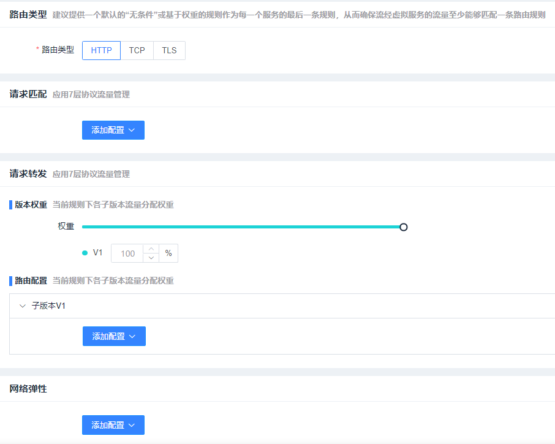
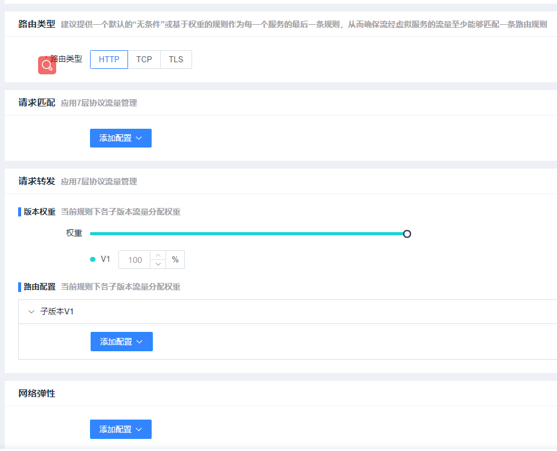

# 流量管理开发手册

## 开发需求：

### 服务暴露

istio资源： gateway

功能描述：对服务暴露配置做管理

### 熔断器

istio资源：destinationrule

功能描述： 对熔断器配置做管理

### 负载均衡

istio资源：destinationrule

功能描述：多负载均衡配置做管理

### 路由管理

istio资源：virtualservice

功能描述：对路由管理配置做管理

#### http路由

#### tls路由

#### tcp路由

## 一期交付接口：

#### expose

| 接口      | 描述                               | 状态 |
| --------- | ---------------------------------- | ---- |
| add       | 添加 服务暴露                      | OK   |
| get       | 获取 服务暴露（一条）              | OK   |
| list      | 列举 服务暴露（多条）              | OK   |
| delete    | 删除 服务暴露                      | OK   |
| update    | 更新 服务暴露                      | OK   |
| ports     | 网关端口                           | OK   |
| transform | 转化为yaml                         | OK   |
| apply     | 通过yaml更新配置                   | OK   |
| create    | 创建 （这部分可以使用 `add` 接口） | OK   |
| insert    | 增加 （这部分可以使用 `add` 接口） | OK   |

#### fuse 

| 接口      | 描述                               | 状态 |
| --------- | ---------------------------------- | ---- |
| add       | 添加 熔断器                        | OK   |
| get       | 获取 熔断器（一条）                | OK   |
| list      | 列举 熔断器（多条）                | OK   |
| delete    | 删除 熔断器                        | OK   |
| update    | 更新 熔断器                        | OK   |
| ports     | 服务端口列表                       | OK   |
| transform | 转化为yaml                         | OK   |
| apply     | 通过yaml更新配置                   | OK   |
| create    | 创建 （这部分可以使用 `add` 接口） | OK   |
| insert    | 增加 （这部分可以使用 `add` 接口） | OK   |

#### loadbalance

| 接口      | 描述                               | 状态 |
| --------- | ---------------------------------- | ---- |
| add       | 添加 负载均衡                      | OK   |
| get       | 获取 负载均衡（一条）              | OK   |
| list      | 列举 负载均衡（多条）              | OK   |
| delete    | 删除 负载均衡                      | OK   |
| update    | 更新 负载均衡                      | OK   |
| ports     | 服务端口列表                       | OK   |
| transform | 转化为yaml                         | OK   |
| apply     | 通过yaml更新配置                   | OK   |
| create    | 创建 （这部分可以使用 `add` 接口） | OK   |
| insert    | 增加 （这部分可以使用 `add` 接口） | OK   |

#### route （http、tcp、tls）

| 接口      | 描述                                    | 状态 |
| --------- | --------------------------------------- | ---- |
| add       | 添加 （http、tls、tcp）路由配置         | OK   |
| get       | 获取 （http、tls、tcp）路由配置（一条） | OK   |
| list      | 列举 （http、tls、tcp）路由配置（多条） | OK   |
| delete    | 删除 （http、tls、tcp）路由配置         | OK   |
| update    | 更新 （http、tls、tcp）路由配置         | OK   |
| sort      | 更换 （http、tls、tcp）路由配置 顺序    | OK   |
| ports     | 服务端口列表                            | OK   |
| transform | 转化为yaml                              | OK   |
| apply     | 通过yaml更新配置                        | OK   |
| create    | 创建 （这部分可以使用 `add` 接口）      | OK   |
| insert    | 增加 （这部分可以使用 `add` 接口）      | OK   |
| sni       | 获取sni列表                             | OK   |

一期交付时间：2021.8.9

开发内容：流量管理、安全管理

开发加联调时间：两个月

负责人：郑天驰、徐国瑞

## 二期迭代规划：

1. 证书合法性校验
2. yaml合法性校验
3. 报错信息转中文
4. 灰度发布单独拆除

