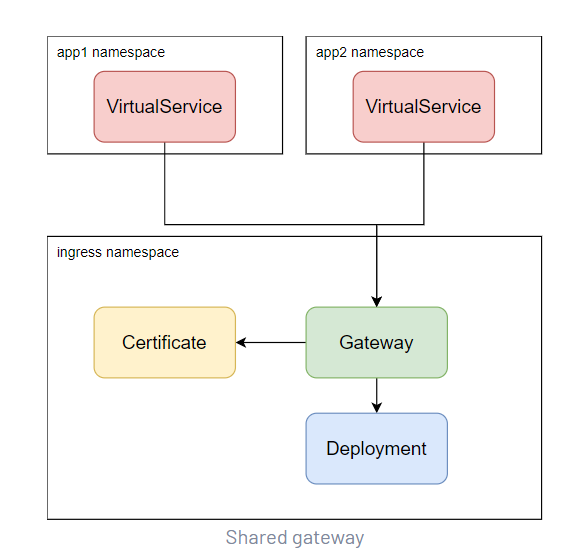
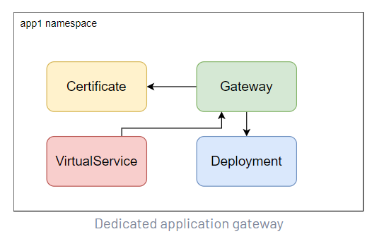

# 流量管理

- Istio的流量路由规则让您可以轻松地控制服务之间的流量和API调用。 Istio简化了服务级别属性(如断路器、超时和重试)的配置，并使其易于设置重要任务(如A/B测试、canary rollout和使用基于百分比的流量分割的分阶段rollout)。 它还提供了开箱即用的故障恢复特性，帮助您的应用程序更健壮地应对依赖服务或网络的故障。  

- Istio的流量管理模型依赖与您的服务一起部署的Envoy代理。 您的网格服务发送和接收的所有流量(数据平面流量)都是通过Envoy代理的，这使得您可以轻松地指导和控制网格周围的流量，而无需对您的服务进行任何更改。  

- 为了在网格中引导流量，Istio需要知道所有的端点在哪里，以及它们属于哪些服务。为了填充自己的服务注册中心，Istio连接到一个服务发现系统。例如，如果您在Kubernetes集群上安装了Istio，那么Istio将自动检测该集群中的服务和端点。

- 通过使用此服务注册表，Envoy代理可以将流量导向相关服务。大多数基于微服务的应用程序都有每个服务工作负载的多个实例来处理服务流量，有时称为负载平衡池。默认情况下，Envoy代理使用轮循模型在每个服务的负载平衡池中分发流量，请求依次发送到每个池成员，在每个服务实例收到请求后返回到池的顶部。

- 虽然Istio的基本服务发现和负载平衡为您提供了一个工作的服务网格，但Istio所能做的还远远不够。在许多情况下，您可能希望对网格流量进行更细粒度的控制。作为a /B测试的一部分，您可能希望将特定百分比的流量导向服务的新版本，或者对服务实例的特定子集的流量应用不同的负载平衡策略。您可能还想对进出网格的流量应用特殊规则，或者向服务注册表添加网格的外部依赖项。通过使用Istio的流量管理API将您自己的流量配置添加到Istio中，您可以完成所有这些操作。

- 与其他Istio配置一样，该API是使用Kubernetes自定义资源定义(crd)指定的，您可以使用YAML配置该资源定义，您将在示例中看到。


## 服务暴露（gateway）

您可以使用gateway来管理网格的 inbound 和 outbound 流量，让您指定希望进入或离开网格的流量。网关配置应用于运行在网格边缘的独立特使代理，而不是与您的服务工作负载一起运行的sidecar特使代理。

与其他控制进入系统的流量的机制(如Kubernetes Ingress api)不同，Istio网关允许您使用Istio流量路由的全部功能和灵活性。您可以这样做，因为Istio的Gateway资源只允许您配置4-6层负载平衡属性，如要公开的端口、TLS设置等。然后，不是向同一个API资源添加应用层流量路由(L7)，而是将一个常规的Istio虚拟服务绑定到网关。这可以让你像管理Istio网格中的任何其他数据平面流量一样管理网关流量。

网关主要用于管理入口流量，但您也可以配置出口网关。出口网关允许您为离开网格的流量配置一个专用出口节点，允许您限制哪些服务可以或应该访问外部网络，或者启用出口流量的安全控制，以增加您的网格的安全性，例如。您还可以使用网关来配置纯内部代理。

Istio提供了一些您可以使用的预配置网关代理部署(Istio -ingressgateway和Istio -egressgateway)，只有入口网关使用我们的默认配置文件部署。您可以将自己的网关配置应用到这些部署或部署和配置自己的网关代理。

### 服务暴露配置示例

```yaml
apiVersion: networking.istio.io/v1alpha3
kind: Gateway
metadata:
  name: ext-host-gwy
spec:
  selector:
    app: my-gateway-controller
  servers:
  - port:
      number: 443
      name: https
      protocol: HTTPS
    hosts:
    - ext-host.example.com   # 这个host 需要配合 virtualservice 实现路由转发
    tls:
      mode: SIMPLE
      credentialName: ext-host-cert
```

这个网关配置允许从ext-host.example.com的HTTPS流量进入端口443上的网格，但不为流量指定任何路由。

要指定路由并使网关按预期工作，还必须将网关绑定到虚拟服务。您可以使用虚拟服务的网关字段来完成此操作，如下面的示例所示:

- gateway资源一般和virtualservice 配置使用
- 在gateway中的host ，需要在virtualservice 中也带上这个host ，并且在virtualservice 的 gateway字段中带上这个gateway，也就是网关绑定到virtualservice
- gateway中的端口是ingressgateway service 中的 service 端口，所以这里的端口是有范围的，不能随便填一个端口
- 对于外部访问，是走的nodeport，这个nodeport就是ingressgateway(service)中对应service port 的 nodeport
- 对于tls的配置，分为如下情况：
  - 单向认证 SIMPLE : 需要提供证书和密钥，相当于服务端的证书和密钥
  - 双向认证 MUTUAL: 需要提供证书和密钥以及CA证书
  - 网格双向认证 ISTIO_MUTUAL：不需要提供任何的证书和私钥，这一部分的证书由istio来维护
  - 透传 PASSTHROUGH : 这是非终结式的tls，如果进的是tls 的流量，出的也是tls 的流量，证书和密钥的管理由上游服务自身提供

为了实现正确的路由转发，还需要配置 virtualservice:

```yaml
apiVersion: networking.istio.io/v1alpha3
kind: VirtualService
metadata:
  name: virtual-svc
spec:
  hosts:
  - ext-host.example.com   # 这里对应于 gateway 中的host
  gateways:
  - ext-host-gwy # gateway 选择上述创建的gateway
```


### 网关部署

- 除了创建服务网格，Istio还允许您管理 gateway，这些网关是运行在网格边缘的Envoy代理，提供对进入和离开网格的流量的细粒度控制。

- Istio的一些内置配置文件在安装期间部署网关。例如，使用默认设置调用istioctl install将在控制平面上部署入口网关。

- 在Istio的生产安装中分别部署和管理一个或多个网关。

- 使用与Istio sidecar注入相同的机制，网关的Envoy代理配置也可以类似地自动注入。

- 建议在网关部署中使用自动注入，因为它让开发人员能够完全控制网关部署，同时也简化了操作。当有新的升级可用时，或者配置已经更改，只需重新启动网关荚就可以更新它们。这使得操作网关部署的体验与操作sidecars的体验相同。

- 为了支持用户使用现有的部署工具，Istio提供了几种不同的方式来部署网关。每种方法都会产生相同的结果。选择你最熟悉的方法。


#### istioOperator部署

```yaml
apiVersion: install.istio.io/v1alpha1
kind: IstioOperator
metadata:
  name: ingress
spec:
  profile: empty # Do not install CRDs or the control plane
  components:
    ingressGateways:
    - name: ingressgateway
      namespace: istio-ingress
      enabled: true
      label:
        # Set a unique label for the gateway. This is required to ensure Gateways
        # can select this workload
        istio: ingressgateway
  values:
    gateways:
      istio-ingressgateway:
        # Enable gateway injection
        injectionTemplate: gateway
```


#### k8s yaml 部署

```yaml
apiVersion: v1
kind: Service
metadata:
  name: istio-ingressgateway
  namespace: istio-ingress
spec:
  type: LoadBalancer
  selector:
    istio: ingressgateway
  ports:       # ports 可以根据需要自行添加，用以扩充实际可选的网关端口，最好带上nodeport
  - port: 80   # service port
    name: http # port name 有命名规范，之后会提到
  - port: 443
    name: https
---
apiVersion: apps/v1
kind: Deployment
metadata:
  name: istio-ingressgateway
  namespace: istio-ingress
spec:
  selector:
    matchLabels:
      istio: ingressgateway
  template:
    metadata:
      annotations:
        # Select the gateway injection template (rather than the default sidecar template)
        inject.istio.io/templates: gateway
      labels:
        # Set a unique label for the gateway. This is required to ensure Gateways can select this workload
        istio: ingressgateway # 这个label 非常重要，确保gateway可以选择到这个workload
        # Enable gateway injection. If connecting to a revisioned control plane, replace with "istio.io/rev: revision-name"
        sidecar.istio.io/inject: "true"
    spec:
      containers:
      - name: istio-proxy
        image: auto # The image will automatically update each time the pod starts.
---
# Set up roles to allow reading credentials for TLS
apiVersion: rbac.authorization.k8s.io/v1
kind: Role
metadata:
  name: istio-ingressgateway-sds
  namespace: istio-ingress
rules:
- apiGroups: [""]
  resources: ["secrets"]
  verbs: ["get", "watch", "list"]
---
apiVersion: rbac.authorization.k8s.io/v1
kind: RoleBinding
metadata:
  name: istio-ingressgateway-sds
  namespace: istio-ingress
roleRef:
  apiGroup: rbac.authorization.k8s.io
  kind: Role
  name: istio-ingressgateway-sds
subjects:
- kind: ServiceAccount
  name: default
```


### 管理网关

#### Gateway selectors

网关部署的pod上的标签由网关配置资源使用，因此网关选择器必须匹配这些标签。

例如，在上面的部署中，istio=ingressgateway label 是在gateway pod 设置的。要将网关应用到这些部署中，您需要选择相同的标签:

```yaml
apiVersion: networking.istio.io/v1beta1
kind: Gateway
metadata:
  name: gateway
spec:
  selector:
    istio: ingressgateway # 这里的label selector 对应于istio-ingressgateway pod 中的label
...
```

#### Gateway deployment 拓扑图

根据您的网格配置和用例，您可能希望以不同的方式部署网关。下面显示了几种不同的网关部署模式。注意，在同一个集群中可以使用多个这样的模式。

- 共享的gateway

在这个模型中，单个集中式(共享)网关被许多应用程序使用，这些应用程序可能跨越多个名称空间。入口名称空间中的网关将路由的所有权委托给应用程序名称空间，但保留对TLS配置的控制。



当您有许多想要对外公开的应用程序时，该模型工作得很好，因为它们能够使用共享的基础设施。在许多应用程序共享相同域或TLS证书的用例中，它也能很好地工作。


- 专用应用程序gateway (单个namespace ，单个 gateway的部署形式)

在这个模型中，应用程序名称空间有它自己的专用网关安装。这允许对单个名称空间给予完全控制和所有权。这种级别的隔离对于具有严格性能或安全需求的关键应用程序很有帮助。



除非Istio前面有另一个负载均衡器，否则这通常意味着每个应用程序都有自己的IP地址，这可能会使DNS配置复杂化。


### 入口IP和PORT

执行以下命令来确定Kubernetes集群是否运行在支持外部负载均衡器的环境中:

```shell
$ kubectl get svc istio-ingressgateway -n istio-system
NAME                   TYPE           CLUSTER-IP       EXTERNAL-IP      PORT(S)   AGE
istio-ingressgateway   LoadBalancer   172.21.109.129   130.211.10.121   ...       17h
```

- 如果设置了external - ip值，则您的环境有一个外部负载均衡器，您可以将其用于入口网关。

- 如果external - ip值为<none>(或永久<pending>)，则您的环境没有为入口网关提供外部负载均衡器。在这种情况下，可以通过服务的节点端口访问网关。  (当前我们的项目都是走的port)


如果是走nodeport 访问网关，请运行如下指令确认访问IP和端口：

```shell
# Set the ingress ports: （获取端口）
export INGRESS_PORT=$(kubectl -n istio-system get service istio-ingressgateway -o jsonpath='{.spec.ports[?(@.name=="http2")].nodePort}')   # http nodeport
export SECURE_INGRESS_PORT=$(kubectl -n istio-system get service istio-ingressgateway -o jsonpath='{.spec.ports[?(@.name=="https")].nodePort}')   # https nodeport
export TCP_INGRESS_PORT=$(kubectl -n istio-system get service istio-ingressgateway -o jsonpath='{.spec.ports[?(@.name=="tcp")].nodePort}')     # tcp nodeport

# Setting the ingress IP depends on the cluster provider:  （获取IP）
export INGRESS_HOST=$(kubectl get po -l istio=ingressgateway -n istio-system -o jsonpath='{.items[0].status.hostIP}')  # hostIP
```


**网关常见问题排查指令：**

1. 检查环境变量INGRESS_HOST和INGRESS_PORT的值。根据以下命令的输出，确保它们有有效值:

```shell
kubectl get svc -n istio-system
echo "INGRESS_HOST=$INGRESS_HOST, INGRESS_PORT=$INGRESS_PORT"
```

2. 检查在同一端口上没有定义其他Istio入口网关:

```shell
kubectl get gateway --all-namespaces
```

3. 检查在相同的IP和端口上没有定义Kubernetes Ingress资源:

```shell
kubectl get ingress --all-namespaces
```

4. 查看istio-ingressgateway控制器的日志，查看错误信息:

```shell
kubectl logs -n istio-system "$(kubectl get pod -l istio=ingressgateway \
-n istio-system -o jsonpath='{.items[0].metadata.name}')"
```


### 网关使用

#### Ingress Gateways

测试用例：

- httpbin

**配置gateway:**

入口网关描述了一个在网格边缘运行的负载均衡器，它接收传入的HTTP/TCP连接。它配置公开的端口、协议等，但与Kubernetes Ingress Resources不同，它不包括任何流量路由配置。进入流量的流量路由是使用Istio路由规则配置的，与内部服务请求的配置方式完全相同。(所以一般情况下 gateway virtualservie dr 是配置起来使用的)


**配置网关：**

```yaml
kubectl apply -f - <<EOF
apiVersion: networking.istio.io/v1alpha3
kind: Gateway
metadata:
  name: httpbin-gateway
spec:
  selector:
    istio: ingressgateway # use Istio default gateway implementation
  servers:
  - port:
      number: 80
      name: http
      protocol: HTTP
    hosts:
    - "httpbin.example.com"  # 这是访问的域名
EOF
```

**配置通过网关进入的路由:**

```yaml
kubectl apply -f - <<EOF
apiVersion: networking.istio.io/v1alpha3
kind: VirtualService
metadata:
  name: httpbin
spec:
  hosts:
  - "httpbin.example.com"  # 这是在上述gateway中的域名
  gateways:
  - httpbin-gateway        # 上述的 gateway
  http:
  - match:
    - uri:
        prefix: /status
    - uri:
        prefix: /delay
    route:
    - destination:
        port:
          number: 8000
        host: httpbin   # 转发给的实际服务
EOF
```

**访问httpbin:**

```shell
$ curl -s -I -HHost:httpbin.example.com "http://$INGRESS_HOST:$INGRESS_PORT/status/200"
HTTP/1.1 200 OK
server: istio-envoy
...

# INGRESS_HOST 实际上是hostIP
# 在请求头中必须添加上 host header  ---->  -HHost:httpbin.example.com
```

注意，您使用-H标志将Host HTTP头设置为" httpbin.example.com "。这是必要的，因为您的入口网关被配置为处理“httpbin.example.com”，但在您的测试环境中，您没有该主机的DNS绑定，只是将您的请求发送到入口IP。

**访问未显式公开的任何其他URL。你应该看到一个HTTP 404错误:**

```shell
$ curl -s -I -HHost:httpbin.example.com "http://$INGRESS_HOST:$INGRESS_PORT/headers"
HTTP/1.1 404 Not Found
...
```

**通过浏览器访问：**

在浏览器中输入httpbin服务URL是不起作用的，因为您不能像使用curl那样将Host头传递给浏览器。在实际情况中，这不是问题，因为您正确配置了所请求的主机，并且DNS是可解析的。因此，您可以在URL中使用主机的域名，例如 https://httpbin.example.com/status/200。**（必须确保这个域名是可以通过dns 解析的，否则无法访问）**

要在简单的测试和演示中解决这个问题，请在Gateway和VirtualService配置中为主机使用通配符*值。例如，如果您将入口配置更改为如下:

```yaml
kubectl apply -f - <<EOF
apiVersion: networking.istio.io/v1alpha3
kind: Gateway
metadata:
  name: httpbin-gateway
spec:
  selector:
    istio: ingressgateway # use Istio default gateway implementation
  servers:
  - port:
      number: 80
      name: http
      protocol: HTTP
    hosts:
    - "*"  # 配置为*
---
apiVersion: networking.istio.io/v1alpha3
kind: VirtualService
metadata:
  name: httpbin
spec:
  hosts:
  - "*"
  gateways:
  - httpbin-gateway
  http:
  - match:
    - uri:
        prefix: /headers
    route:
    - destination:
        port:
          number: 8000
        host: httpbin
EOF
```

然后可以在浏览器URL中使用$INGRESS_HOST:$INGRESS_PORT。例如，http://$INGRESS_HOST:$INGRESS_PORT/headers将显示浏览器发送的所有头信息。


#### 安全网关

这一部分是介绍如何使用简单或相互TLS公开安全的HTTPS服务

**生成证书和密钥：**

1. 创建根证书和私钥，为您的服务签署证书:

```shell
openssl req -x509 -sha256 -nodes -days 365 -newkey rsa:2048 -subj '/O=example Inc./CN=example.com' -keyout example.com.key -out example.com.crt
```

1. 为httpbin.example.com创建证书和私钥:

```shell
openssl req -out httpbin.example.com.csr -newkey rsa:2048 -nodes -keyout httpbin.example.com.key -subj "/CN=httpbin.example.com/O=httpbin organization"
openssl x509 -req -days 365 -CA example.com.crt -CAkey example.com.key -set_serial 0 -in httpbin.example.com.csr -out httpbin.example.com.crt
```

##### **为单个host配置TLS入口网关**

1. 为 ingress gateway 生成证书 :

   ```shell
   $ kubectl create -n istio-system secret tls httpbin-credential --key=httpbin.example.com.key --cert=httpbin.example.com.crt
   ```

2. 定义一个 gateway 使用  `servers:`  port 443, 将`credentialName`的值指定为`httpbin-credential`。这些值与secret的名称相同。TLS模式的值为`SIMPLE`。

   ```yaml
   $ cat <<EOF | kubectl apply -f -
   apiVersion: networking.istio.io/v1alpha3
   kind: Gateway
   metadata:
     name: mygateway
   spec:
     selector:
       istio: ingressgateway # use istio default ingress gateway
     servers:
     - port:
         number: 443
         name: https
         protocol: HTTPS
       tls:
         mode: SIMPLE
         credentialName: httpbin-credential # must be the same as secret
       hosts:
       - httpbin.example.com
   EOF
   ```

3. 配置 gateway’s ingress 的路由. 定义相应的 virtual service.

   ```yaml
   $ cat <<EOF | kubectl apply -f -
   apiVersion: networking.istio.io/v1alpha3
   kind: VirtualService
   metadata:
     name: httpbin
   spec:
     hosts:
     - "httpbin.example.com"
     gateways:
     - mygateway
     http:
     - match:
       - uri:
           prefix: /status
       - uri:
           prefix: /delay
       route:
       - destination:
           port:
             number: 8000
           host: httpbin
   EOF
   ```

4. 发送一个HTTPS请求通过HTTPS访问httpbin服务:

   ```shell
   $ curl -v -HHost:httpbin.example.com --resolve "httpbin.example.com:$SECURE_INGRESS_PORT:$INGRESS_HOST" \
   --cacert example.com.crt "https://httpbin.example.com:$SECURE_INGRESS_PORT/status/418"
   ```

   `httpbin`服务将返回[418 I ' m a Teapot]代码。

5. 删除网关的密匙并创建一个新密匙来更改入口网关的凭据。

   ```shell
   $ kubectl -n istio-system delete secret httpbin-credential
   ```

   ```shell
   $ mkdir new_certificates
   $ openssl req -x509 -sha256 -nodes -days 365 -newkey rsa:2048 -subj '/O=example Inc./CN=example.com' -keyout new_certificates/example.com.key -out new_certificates/example.com.crt
   $ openssl req -out new_certificates/httpbin.example.com.csr -newkey rsa:2048 -nodes -keyout new_certificates/httpbin.example.com.key -subj "/CN=httpbin.example.com/O=httpbin organization"
   $ openssl x509 -req -days 365 -CA new_certificates/example.com.crt -CAkey new_certificates/example.com.key -set_serial 0 -in new_certificates/httpbin.example.com.csr -out new_certificates/httpbin.example.com.crt
   $ kubectl create -n istio-system secret tls httpbin-credential \
   --key=new_certificates/httpbin.example.com.key \
   --cert=new_certificates/httpbin.example.com.crt
   ```

6. 使用新的证书链使用curl访问httpbin服务:

   ```shell
   $ curl -v -HHost:httpbin.example.com --resolve "httpbin.example.com:$SECURE_INGRESS_PORT:$INGRESS_HOST" \
   --cacert new_certificates/example.com.crt "https://httpbin.example.com:$SECURE_INGRESS_PORT/status/418"
   ...
   HTTP/2 418
   ...
       -=[ teapot ]=-
   
          _...._
        .'  _ _ `.
       | ."` ^ `". _,
       \_;`"---"`|//
         |       ;/
         \_     _/
           `"""`
   ```

7. 如果您尝试使用以前的证书链访问`httpbin`，那么尝试将会失败。

   ```shell
   $ curl -v -HHost:httpbin.example.com --resolve "httpbin.example.com:$SECURE_INGRESS_PORT:$INGRESS_HOST" \
   --cacert example.com.crt "https://httpbin.example.com:$SECURE_INGRESS_PORT/status/418"
   ...
   * TLSv1.2 (OUT), TLS handshake, Client hello (1):
   * TLSv1.2 (IN), TLS handshake, Server hello (2):
   * TLSv1.2 (IN), TLS handshake, Certificate (11):
   * TLSv1.2 (OUT), TLS alert, Server hello (2):
   * curl: (35) error:04FFF06A:rsa routines:CRYPTO_internal:block type is not 01
   ```

##### **为多个host配置TLS入口网关**

您可以为多个主机配置入口网关，例如`httpbin.example.com`和`helloworldv1.example.com`。 The ingress gateway retrieves unique credentials corresponding to a specific `credentialName`.

1. 要恢复` httpbin `的凭据，请删除它的秘密并再次创建它。

   ```shell
   $ kubectl -n istio-system delete secret httpbin-credential
   $ kubectl create -n istio-system secret tls httpbin-credential \
   --key=httpbin.example.com.key \
   --cert=httpbin.example.com.crt
   ```

2. 部署`helloworld-v1` 

   ```yaml
   $ cat <<EOF | kubectl apply -f -
   apiVersion: v1
   kind: Service
   metadata:
     name: helloworld-v1
     labels:
       app: helloworld-v1
   spec:
     ports:
     - name: http
       port: 5000
     selector:
       app: helloworld-v1
   ---
   apiVersion: apps/v1
   kind: Deployment
   metadata:
     name: helloworld-v1
   spec:
     replicas: 1
     selector:
       matchLabels:
         app: helloworld-v1
         version: v1
     template:
       metadata:
         labels:
           app: helloworld-v1
           version: v1
       spec:
         containers:
         - name: helloworld
           image: istio/examples-helloworld-v1
           resources:
             requests:
               cpu: "100m"
           imagePullPolicy: IfNotPresent #Always
           ports:
           - containerPort: 5000
   EOF
   ```

   

3. 为 `helloworld-v1.example.com` 生成证书和私钥:

   ```shell
   $ openssl req -out helloworld-v1.example.com.csr -newkey rsa:2048 -nodes -keyout helloworld-v1.example.com.key -subj "/CN=helloworld-v1.example.com/O=helloworld organization"
   $ openssl x509 -req -days 365 -CA example.com.crt -CAkey example.com.key -set_serial 1 -in helloworld-v1.example.com.csr -out helloworld-v1.example.com.crt
   ```

   

4. 创建 `helloworld-credential` secret:

   ```shell
   $ kubectl create -n istio-system secret tls helloworld-credential --key=helloworld-v1.example.com.key --cert=helloworld-v1.example.com.crt
   ```

   

5. 定义 gateway带有 两个 server sections for port 443. 将每个端口上的` credentialName `的值分别设置为` httpbin-credential `和` helloworld-credential`。设置TLS模式为“SIMPLE”。

   ```yaml
   $ cat <<EOF | kubectl apply -f -
   apiVersion: networking.istio.io/v1alpha3
   kind: Gateway
   metadata:
     name: mygateway
   spec:
     selector:
       istio: ingressgateway # use istio default ingress gateway
     servers:
     - port:
         number: 443
         name: https-httpbin
         protocol: HTTPS
       tls:
         mode: SIMPLE
         credentialName: httpbin-credential  # 证书 httpbin-credential
       hosts:
       - httpbin.example.com
     - port:
         number: 443
         name: https-helloworld
         protocol: HTTPS
       tls:
         mode: SIMPLE
         credentialName: helloworld-credential  # 证书 helloworld-credential
       hosts:
       - helloworld-v1.example.com
   EOF
   ```

   

6. 配置 gateway’s 流量路由. 定义对应的 virtual service.

   ```yaml
   $ cat <<EOF | kubectl apply -f -
   apiVersion: networking.istio.io/v1alpha3
   kind: VirtualService
   metadata:
     name: helloworld-v1
   spec:
     hosts:
     - helloworld-v1.example.com
     gateways:
     - mygateway
     http:
     - match:
       - uri:
           exact: /hello
       route:
       - destination:
           host: helloworld-v1
           port:
             number: 5000
   EOF
   ```

7. 发送 HTTPS request 到 `helloworld-v1.example.com`:

   ```shell
   $ curl -v -HHost:helloworld-v1.example.com --resolve "helloworld-v1.example.com:$SECURE_INGRESS_PORT:$INGRESS_HOST" \
   --cacert example.com.crt "https://helloworld-v1.example.com:$SECURE_INGRESS_PORT/hello"
   HTTP/2 200
   ```

   

8. 发送 HTTPS 请求到 `httpbin.example.com` and 仍旧得到一个teapot返回:

   ```shell
   $ curl -v -HHost:httpbin.example.com --resolve "httpbin.example.com:$SECURE_INGRESS_PORT:$INGRESS_HOST" \
   --cacert example.com.crt "https://httpbin.example.com:$SECURE_INGRESS_PORT/status/418"
   ...
       -=[ teapot ]=-
   
          _...._
        .'  _ _ `.
       | ."` ^ `". _,
       \_;`"---"`|//
         |       ;/
         \_     _/
           `"""`
   ```

##### **配置双向认证的TLS入口网关**

您可以扩展您的网关定义以支持 [mutual TLS](https://en.wikipedia.org/wiki/Mutual_authentication). 通过删除入口网关的秘密凭证并创建一个新凭证来更改入口网关的凭据。服务器使用CA证书来验证它的客户端，我们必须使用名称“cacert”来保存CA证书。

```shell
$ kubectl -n istio-system delete secret httpbin-credential
$ kubectl create -n istio-system secret generic httpbin-credential --from-file=tls.key=httpbin.example.com.key \
--from-file=tls.crt=httpbin.example.com.crt --from-file=ca.crt=example.com.crt
```

1. 更改网关的定义，将TLS模式设置为`MUTUAL`。

   ```yaml
   $ cat <<EOF | kubectl apply -f -
   apiVersion: networking.istio.io/v1alpha3
   kind: Gateway
   metadata:
    name: mygateway
   spec:
    selector:
      istio: ingressgateway # use istio default ingress gateway
    servers:
    - port:
        number: 443
        name: https
        protocol: HTTPS
      tls:
        mode: MUTUAL
        credentialName: httpbin-credential # must be the same as secret
      hosts:
      - httpbin.example.com
   EOF
   ```

   

2. 尝试使用前面的方法发送一个HTTPS请求，看看它是如何失败的:

   ```shell
   $ curl -v -HHost:httpbin.example.com --resolve "httpbin.example.com:$SECURE_INGRESS_PORT:$INGRESS_HOST" \
   --cacert example.com.crt "https://httpbin.example.com:$SECURE_INGRESS_PORT/status/418"
   * TLSv1.3 (OUT), TLS handshake, Client hello (1):
   * TLSv1.3 (IN), TLS handshake, Server hello (2):
   * TLSv1.3 (IN), TLS handshake, Encrypted Extensions (8):
   * TLSv1.3 (IN), TLS handshake, Request CERT (13):
   * TLSv1.3 (IN), TLS handshake, Certificate (11):
   * TLSv1.3 (IN), TLS handshake, CERT verify (15):
   * TLSv1.3 (IN), TLS handshake, Finished (20):
   * TLSv1.3 (OUT), TLS change cipher, Change cipher spec (1):
   * TLSv1.3 (OUT), TLS handshake, Certificate (11):
   * TLSv1.3 (OUT), TLS handshake, Finished (20):
   * TLSv1.3 (IN), TLS alert, unknown (628):
   * OpenSSL SSL_read: error:1409445C:SSL routines:ssl3_read_bytes:tlsv13 alert certificate required, errno 0
   ```

   

3. 生成客户端证书和私钥:

   ```shell
   $ openssl req -out client.example.com.csr -newkey rsa:2048 -nodes -keyout client.example.com.key -subj "/CN=client.example.com/O=client organization"
   $ openssl x509 -req -days 365 -CA example.com.crt -CAkey example.com.key -set_serial 1 -in client.example.com.csr -out client.example.com.crt
   ```

   

4. Pass a client certificate and private key to `curl` and resend the request. Pass your client’s certificate with the `--cert` flag and your private key with the `--key` flag to `curl`.

   ```shell
   $ curl -v -HHost:httpbin.example.com --resolve "httpbin.example.com:$SECURE_INGRESS_PORT:$INGRESS_HOST" \
   --cacert example.com.crt --cert client.example.com.crt --key client.example.com.key \
   "https://httpbin.example.com:$SECURE_INGRESS_PORT/status/418"
   ...
       -=[ teapot ]=-
   
          _...._
        .'  _ _ `.
       | ."` ^ `". _,
       \_;`"---"`|//
         |       ;/
         \_     _/
           `"""`
   ```


#### 非终结式的tls

使用HTTPS保护网关任务描述了如何配置对HTTP服务的HTTPS入口访问。本示例描述如何配置对HTTPS服务的HTTPS入口访问，即配置入口网关对传入请求执行SNI直通，而不是TLS终止。

本任务使用的HTTPS服务示例是一个简单的NGINX服务器。在接下来的步骤中，你首先在Kubernetes集群中部署NGINX服务。然后配置一个网关，通过主机nginx.example.com提供对服务的入口访问。

**生成客户端和服务器证书和密钥**

1. 创建根证书和私钥以为您的服务签署证书:

```shell
openssl req -x509 -sha256 -nodes -days 365 -newkey rsa:2048 -subj '/O=example Inc./CN=example.com' -keyout example.com.key -out example.com.crt
```

1. 为nginx.example.com创建证书和私钥:

```shell
openssl req -out nginx.example.com.csr -newkey rsa:2048 -nodes -keyout nginx.example.com.key -subj "/CN=nginx.example.com/O=some organization"
openssl x509 -req -days 365 -CA example.com.crt -CAkey example.com.key -set_serial 0 -in nginx.example.com.csr -out nginx.example.com.crt
```

**部署nginx服务**

1. 创建Kubernetes [Secret]来保存服务器证书。

   ```
   $ kubectl create secret tls nginx-server-certs --key nginx.example.com.key --cert nginx.example.com.crt
   ```

2. 为NGINX服务器创建一个配置文件:

   ```shell
   $ cat <<\EOF > ./nginx.conf
   events {
   }
   
   http {
     log_format main '$remote_addr - $remote_user [$time_local]  $status '
     '"$request" $body_bytes_sent "$http_referer" '
     '"$http_user_agent" "$http_x_forwarded_for"';
     access_log /var/log/nginx/access.log main;
     error_log  /var/log/nginx/error.log;
   
     server {
       listen 443 ssl;
   
       root /usr/share/nginx/html;
       index index.html;
   
       server_name nginx.example.com;
       ssl_certificate /etc/nginx-server-certs/tls.crt;
       ssl_certificate_key /etc/nginx-server-certs/tls.key;
     }
   }
   EOF
   ```

3. 创建一个Kubernetes ConfigMap 来保存NGINX服务器的配置:

   ```
   $ kubectl create configmap nginx-configmap --from-file=nginx.conf=./nginx.conf
   ```

4. 部署 NGINX:

   ```yaml
   $ cat <<EOF | istioctl kube-inject -f - | kubectl apply -f -
   apiVersion: v1
   kind: Service
   metadata:
     name: my-nginx
     labels:
       run: my-nginx
   spec:
     ports:
     - port: 443
       protocol: TCP
     selector:
       run: my-nginx
   ---
   apiVersion: apps/v1
   kind: Deployment
   metadata:
     name: my-nginx
   spec:
     selector:
       matchLabels:
         run: my-nginx
     replicas: 1
     template:
       metadata:
         labels:
           run: my-nginx
       spec:
         containers:
         - name: my-nginx
           image: nginx
           ports:
           - containerPort: 443
           volumeMounts:
           - name: nginx-config
             mountPath: /etc/nginx
             readOnly: true
           - name: nginx-server-certs
             mountPath: /etc/nginx-server-certs
             readOnly: true
         volumes:
         - name: nginx-config
           configMap:
             name: nginx-configmap
         - name: nginx-server-certs
           secret:
             secretName: nginx-server-certs
   EOF
   ```

   

5. 为了测试NGINX服务器是否成功部署，从它的sidecar代理发送一个请求到服务器，而不检查服务器的证书(使用' curl '的' -k '选项)。确保服务器的证书被正确打印，例如，' common name (CN) '等于' nginx.example.com '。

   ```shell
   $ kubectl exec "$(kubectl get pod  -l run=my-nginx -o jsonpath={.items..metadata.name})" -c istio-proxy -- curl -sS -v -k --resolve nginx.example.com:443:127.0.0.1 https://nginx.example.com
   ...
   SSL connection using TLSv1.2 / ECDHE-RSA-AES256-GCM-SHA384
   ALPN, server accepted to use http/1.1
   Server certificate:
     subject: CN=nginx.example.com; O=some organization
     start date: May 27 14:18:47 2020 GMT
     expire date: May 27 14:18:47 2021 GMT
     issuer: O=example Inc.; CN=example.com
     SSL certificate verify result: unable to get local issuer certificate (20), continuing anyway.
   
   > GET / HTTP/1.1
   > User-Agent: curl/7.58.0
   > Host: nginx.example.com
   ...
   < HTTP/1.1 200 OK
   
   < Server: nginx/1.17.10
   ...
   <!DOCTYPE html>
   <html>
   <head>
   <title>Welcome to nginx!</title>
   ...
   ```

   

   **配置 ingress gateway**

1. Define a `Gateway` with a `server` section for port 443. Note the `PASSTHROUGH` TLS mode which instructs the gateway to pass the ingress traffic AS IS, without terminating TLS.

   ```yaml
   $ kubectl apply -f - <<EOF
   apiVersion: networking.istio.io/v1alpha3
   kind: Gateway
   metadata:
     name: mygateway
   spec:
     selector:
       istio: ingressgateway # use istio default ingress gateway
     servers:
     - port:
         number: 443
         name: https
         protocol: HTTPS
       tls:
         mode: PASSTHROUGH   # 模式为PASSTHROUGH
       hosts:
       - nginx.example.com
   EOF
   ```

   

2. Configure routes for traffic entering via the `Gateway`:

   ```yaml
   $ kubectl apply -f - <<EOF
   apiVersion: networking.istio.io/v1alpha3
   kind: VirtualService
   metadata:
     name: nginx
   spec:
     hosts:
     - nginx.example.com
     gateways:
     - mygateway
     tls:                       # 注意，这里是tls的，因为前面是非终结式tls,所有后面的流量也是tls的 
     - match:
       - port: 443
         sniHosts:
         - nginx.example.com
       route:
       - destination:
           host: my-nginx
           port:
             number: 443
   EOF
   ```

3. 从集群外部访问NGINX服务。注意，服务器返回了正确的证书，并成功验证了它(打印 SSL certificate verify ok )。

   ```shell
   $ curl -v --resolve "nginx.example.com:$SECURE_INGRESS_PORT:$INGRESS_HOST" --cacert example.com.crt "https://nginx.example.com:$SECURE_INGRESS_PORT"
   Server certificate:
     subject: CN=nginx.example.com; O=some organization
     start date: Wed, 15 Aug 2018 07:29:07 GMT
     expire date: Sun, 25 Aug 2019 07:29:07 GMT
     issuer: O=example Inc.; CN=example.com
     SSL certificate verify ok.
   
     < HTTP/1.1 200 OK
     < Server: nginx/1.15.2
     ...
     <html>
     <head>
     <title>Welcome to nginx!</title>
   ```


## 负载均衡以及熔断器 (destinationrule)

和虚拟服务一样，目的地规则也是Istio流量路由功能的关键部分。您可以将虚拟服务视为如何将流量路由到给定的目的地，然后使用目的地规则配置该目的地的流量所发生的情况。目的规则是在对虚拟业务路由规则进行评估后应用的，因此目的规则将应用于流量的“真实”目的地。

具体来说，您可以使用目标规则来指定指定的服务子集，例如按版本对给定服务的所有实例进行分组。然后，您可以在虚拟服务的路由规则中使用这些服务子集来控制服务的不同实例的流量。

目标规则还允许您在调用整个目标服务或特定服务子集时定制Envoy的流量策略，如首选负载均衡模型、TLS安全模式或断路器设置。您可以在目标规则引用中看到目标规则选项的完整列表。

DestinationRule定义了在路由发生后应用于服务的流量的策略。这些规则指定负载平衡的配置、sidecar中的连接池大小和离群值检测设置，以检测负载平衡池中的不健康主机并将其逐出。例如，评级服务的简单负载平衡策略如下所示:

```yaml
apiVersion: networking.istio.io/v1alpha3
kind: DestinationRule
metadata:
  name: bookinfo-ratings
spec:
  host: ratings.prod.svc.cluster.local
  trafficPolicy:
    loadBalancer:
      simple: LEAST_CONN
```

特定于版本的策略可以通过定义一个命名子集并覆盖在服务级别指定的设置来指定。以下规则对所有流向名为testversion的子集的流量使用轮询负载平衡策略，该子集由带有标签(版本:v3)的端点(例如pods)组成。

```yaml
apiVersion: networking.istio.io/v1alpha3
kind: DestinationRule
metadata:
  name: bookinfo-ratings
spec:
  host: ratings.prod.svc.cluster.local
  trafficPolicy:
    loadBalancer:
      simple: LEAST_CONN
  subsets:
  - name: testversion
    labels:
      version: v3
    trafficPolicy:
      loadBalancer:
        simple: ROUND_ROBIN
```

注意:只有当路由规则显式地将流量发送到这个子集时，为子集指定的策略才会生效。

流量策略也可以针对特定的端口定制。以下规则对端口80的所有流量使用最小的连接负载均衡策略，而对端口9080的流量使用轮询负载均衡设置。

```yaml
apiVersion: networking.istio.io/v1alpha3
kind: DestinationRule
metadata:
  name: bookinfo-ratings-port
spec:
  host: ratings.prod.svc.cluster.local
  trafficPolicy: # Apply to all ports
    portLevelSettings:
    - port:
        number: 80
      loadBalancer:
        simple: LEAST_CONN
    - port:
        number: 9080
      loadBalancer:
        simple: ROUND_ROBIN
```

### **子版本**

服务端点的子集。子集可用于A/B测试等场景，或路由到服务的特定版本。有关在这些场景中使用子集的示例，请参阅VirtualService文档。此外，在服务级定义的流量策略可以在子集级覆盖。以下规则对所有流向名为testversion的子集的流量使用轮询负载平衡策略，该子集由带有标签(版本:v3)的端点(例如pods)组成。

```yaml
apiVersion: networking.istio.io/v1alpha3
kind: DestinationRule
metadata:
  name: bookinfo-ratings
spec:
  host: ratings.prod.svc.cluster.local
  trafficPolicy:
    loadBalancer:
      simple: LEAST_CONN
  subsets:
  - name: testversion
    labels:
      version: v3
    trafficPolicy:
      loadBalancer:
        simple: ROUND_ROBIN
```

注意:只有当路由规则显式地将流量发送到这个子集时，为子集指定的策略才会生效。

通常需要一个或多个标签来标识子集目的地，但是，当相应的DestinationRule表示支持多个SNI主机(例如出口网关)的主机时，没有标签的子集可能有意义。在本例中，可以使用带有ClientTLSSettings的流量策略来标识对应于命名子集的特定SNI主机。

### **负载均衡**

使用示例：

```yaml
apiVersion: networking.istio.io/v1alpha3
kind: DestinationRule
metadata:
  name: bookinfo-ratings
spec:
  host: ratings.prod.svc.cluster.local
  trafficPolicy:
    loadBalancer:
      simple: ROUND_ROBIN
```

```yaml
 apiVersion: networking.istio.io/v1alpha3
 kind: DestinationRule
 metadata:
   name: bookinfo-ratings
 spec:
   host: ratings.prod.svc.cluster.local
   trafficPolicy:
     loadBalancer:
       consistentHash:
         httpCookie:
           name: user
           ttl: 0s
```

| Field               | Type                          | Description                                                  | Required |
| ------------------- | ----------------------------- | ------------------------------------------------------------ | -------- |
| `simple`            | `SimpleLB (oneof)`            |                                                              | No       |
| `consistentHash`    | `ConsistentHashLB (oneof)`    |                                                              | No       |
| `localityLbSetting` | `LocalityLoadBalancerSetting` | Locality load balancer settings, this will override mesh wide settings in entirety, meaning no merging would be performed between this object and the object one in MeshConfig | No       |


### 熔断器

#### 连接池

例如，以下规则设置到redis服务myredissrv的连接限制为100个，连接超时为30ms

```yaml
apiVersion: networking.istio.io/v1alpha3
kind: DestinationRule
metadata:
  name: bookinfo-redis
spec:
  host: myredissrv.prod.svc.cluster.local
  trafficPolicy:
    connectionPool:
      tcp:
        maxConnections: 100
        connectTimeout: 30ms
        tcpKeepalive:
          time: 7200s
          interval: 75s
```

| Field  | Type           | Description                                                | Required |
| ------ | -------------- | ---------------------------------------------------------- | -------- |
| `tcp`  | `TCPSettings`  | Settings common to both HTTP and TCP upstream connections. | No       |
| `http` | `HTTPSettings` | HTTP connection pool settings.                             | No       |


#### 异常点检测

一种电路断路器的实现，它跟踪上游服务中每个主机的状态。适用于HTTP和TCP服务。对于HTTP服务，对于API调用持续返回5xx错误的主机将在预定义的一段时间内从池中弹出。对于TCP服务，在度量连续错误度量时，到给定主机的连接超时或连接失败将被视为错误。详情请参阅特使的异常值探测。

以下规则将连接池大小设置为100个HTTP1连接，其中不超过10个请求/连接到“评论”服务。此外，它设置了1000个并发HTTP2请求的限制，并配置了每5分钟扫描一次上游主机，以便任何连续7次失败的502、503或504错误码的主机将在15分钟内被弹出。

```yaml
apiVersion: networking.istio.io/v1alpha3
kind: DestinationRule
metadata:
  name: reviews-cb-policy
spec:
  host: reviews.prod.svc.cluster.local
  trafficPolicy:
    connectionPool:
      tcp:
        maxConnections: 100
      http:
        http2MaxRequests: 1000
        maxRequestsPerConnection: 10
    outlierDetection:
      consecutive5xxErrors: 7
      interval: 5m
      baseEjectionTime: 15m
```


## 路由转发 (virtualservice)

virtualservice和destinationrule是Istio流量路由功能的关键构建块 **(一般是两者配置起来使用)**。`virtualservice` 允许您配置请求如何在Istio服务网格中路由到服务，这是基于Istio和平台提供的基本连接和发现。每个 `virtualservice` 由一组按顺序评估的路由规则组成，让Istio将每个给定的请求与 `virtualservice`  匹配到网格内特定的真实目的地 。

`virtualservice` 对于Istio流量管理的灵活和强大起着关键作用。它们通过将客户机发送请求的地方与实际实现请求的目标工作负载强解耦来实现这一点。虚拟服务还提供了一种丰富的方式来指定不同的流量路由规则，以便将流量发送到这些工作负载。

为什么这很有用?在没有虚拟服务的情况下，Envoy使用在所有服务实例之间的轮询负载均衡来分配流量，如简介中所述。您可以利用对工作负载的了解来改进此行为。例如，有些可能代表不同的版本。这在A/B测试中非常有用，因为您可能希望根据不同服务版本的百分比配置流量路由，或者将来自内部用户的流量引导到特定的实例集。


- 使用虚拟服务，您可以为一个或多个 `host` 指定流量行为。在`virtualservice` 中使用路由`route`规则，告诉Envoy如何将虚拟服务的流量发送到适当的目的地。路由目的地可以是相同服务的版本，也可以是完全不同的服务的版本。

- 典型的用例是将流量发送到指定为服务子集的服务的不同版本。客户机将请求发送到虚拟服务 `host` ( virtual host ) ，就像它是一个单独的实体一样，然后Envoy根据`virtualservice` 规则将流量路由到不同的版本:例如，“20%的呼叫转到subset v2"。例如，这允许您创建一个`canary rollout`，在其中逐步增加发送到新服务版本的流量百分比。流量路由与实例部署是完全分离的，这意味着实现新服务版本的实例数量可以根据流量负载向上或向下扩展，而完全不需要参考流量路由。相比之下，像Kubernetes这样的容器编排平台只支持基于实例伸缩的流量分配，这很快就变得复杂起来。您可以在使用Istio的canary deployment中阅读更多关于虚拟服务如何帮助canary部署的信息。

虚拟服务还可以让你:

- 通过单个虚拟服务处理多个应用程序服务。例如，如果您的网格使用Kubernetes，您可以配置一个虚拟服务来处理特定名称空间中的所有服务。将单个虚拟服务映射到多个“实际”服务对于将单个应用程序转换为由不同微服务构建的组合服务特别有用，而不需要服务的消费者适应转换。你的路由规则可以指定“monolith.com对这些uri的调用转到微服务A”，等等。

配置流量规则时，需要结合网关对流量进行控制。

- 在某些情况下，您还需要配置目标规则以使用这些特性，因为这些特性是您指定服务子集的地方。在单独的对象中指定服务子集和其他特定于目标的策略，可以在虚拟服务之间干净地重用它们。

### 虚拟服务样例

以下虚拟服务将请求路由到服务的不同版本，这取决于请求是否来自特定用户。

```yaml
apiVersion: networking.istio.io/v1alpha3
kind: VirtualService
metadata:
  name: reviews
spec:
  hosts:
  - reviews      # 这里采用了k8s中的短域名
  http:
  - match:       # 匹配规则
    - headers:
        end-user:
          exact: jason
    route:       # 路由转发
    - destination:
        host: reviews
        subset: v2
  - route:       # 无匹配规则的路由转发，也就是默认的路由转发，一般放在最后面，因为默认的路由转发会匹配所有条件
    - destination:
        host: reviews
        subset: v3
```

### host 字段 （这一部分是虚拟的host）

hosts字段列出了虚拟服务的host, 也就是用户可寻址的目的地或这些路由规则应用的目的地。**这是客户端在向服务发送请求时使用的一个或多个地址。**

```yaml
hosts:
- reviews  # 可以是IP，DNS名称，k8s中的短域名或长域名，也可以使用 * 作为前缀
```

虚拟服务 host 可以是一个IP地址、一个DNS名称，或者(取决于平台)将隐式或显式解析为完全限定域名(FQDN)的短名称(例如Kubernetes服务短名称)。还可以使用通配符(" * ")前缀，为所有匹配的服务创建一组路由规则。虚拟服务 host 实际上不必是Istio服务注册中心的一部分，**它们只是虚拟目的地 ( virtual host )**。这让您可以为在网格中没有可路由条目的虚拟主机建模流量。

### Routing rules

http部分包含了虚拟服务的路由规则，描述了将http /1.1、HTTP2和gRPC流量路由到 host 字段指定的目的地的匹配条件和动作(您也可以使用tcp和tls部分来配置tcp和未终止tls流量的路由规则)。路由规则由您希望流量到达的目的地和零个或多个匹配条件组成，这取决于您的用例。

#### Match

示例中的第一个路由规则有一个条件，因此从match字段开始。在这种情况下，您希望此路由应用于来自用户“jason”的所有请求，因此您使用头、终端用户和精确字段来选择适当的请求。

```yaml
- match:
   - headers:
       end-user:
         exact: jason
```

#### Destination

路由部分的目的地字段指定匹配此条件的流量的实际目的地。与虚拟服务的host不同，目的地的host必须是Istio服务注册表中存在的真实目的地，否则Envoy将不知道将流量发送到哪里。这可以是一个带有代理的网格服务，也可以是一个使用服务条目添加的非网格服务。在本例中，我们在Kubernetes上运行，主机名是Kubernetes服务名:

```yaml
route:
- destination:
    host: reviews  # 这是实际的路由地址，必须是Istio服务注册表中存在的真实目的地
    subset: v2     # 指定子版本，这部分是在destinationrule中指定的
```

请注意，为了简单起见，在本页面的这个示例和其他示例中，我们使用Kubernetes的简短名称作为目标主机。在评估该规则时，Istio根据包含路由规则的虚拟服务的名称空间添加一个域后缀，以获得主机的完全限定名。在我们的示例中使用简短的名称还意味着您可以在任何您喜欢的名称空间中复制和尝试它们。

只有当目标主机和虚拟服务实际上位于同一个Kubernetes名称空间时，才能使用这样的短名称。因为使用Kubernetes短名称可能会导致错误配置，所以我们建议您在生产环境中指定完全限定的主机名。

destination部分还指定您希望匹配此规则条件的请求进入这个Kubernetes服务的哪个子集，在本例中是名为v2的子集。 subset v2 子集需要在destinationrule中定义

#### 路由规则优先级

**路由规则按照从上到下的顺序进行评估，虚拟服务定义中的第一个规则优先级最高**。在这种情况下，您希望任何不匹配第一个路由规则的内容都进入第二个规则指定的默认目的地。因此，第二条规则没有匹配条件，只是将流量导向v3子集。

```yaml
- route:             #  这是一条默认的目的的
  - destination:
      host: reviews
      subset: v3
```

**我们建议在每个虚拟服务中提供一个默认的“无条件”或基于权重的规则(如下所述)，作为最后一条规则，以确保发送到虚拟服务的流量总是至少有一条匹配的路由。**

#### 关于路由规则的更多信息

正如您在上面看到的，路由规则是将特定流量子集路由到特定目的地的强大工具。您可以设置流量端口、报头字段、uri等匹配条件。例如，这种虚拟服务允许用户将流量发送到两个独立的服务，评级和评论，就好像它们是http://bookinfo.com/上一个更大的虚拟服务的一部分。虚拟服务规则根据请求uri匹配流量，并将请求直接发送到适当的服务。

```yaml
apiVersion: networking.istio.io/v1alpha3
kind: VirtualService
metadata:
  name: bookinfo
spec:
  hosts:
    - bookinfo.com       # virtual host
  http:
  - match:
    - uri:
        prefix: /reviews
    route:
    - destination:
        host: reviews    # 真实存在的 reviews 服务
  - match:
    - uri:
        prefix: /ratings
    route:
    - destination:
        host: ratings    # 真是存在的 ratings 服务
```

对于某些匹配条件，您还可以使用确切的值、前缀或正则表达式来选择它们。

您可以在AND条件的相同匹配块中添加多个匹配条件，或者在or条件的相同规则中添加多个匹配块。您还可以为任何给定的虚拟服务使用多个路由规则。这让您可以在单个虚拟服务中任意设置路由条件的复杂或简单。

除了使用匹配条件外，您还可以按百分比“权重”分配流量。这对于A/B测试和canary rollout非常有用:

```yaml
spec:
  hosts:
  - reviews
  http:
  - route:
    - destination:
        host: reviews
        subset: v1
      weight: 75
    - destination:
        host: reviews
        subset: v2
      weight: 25
```


## 常见问题


### 协议选择

Istio支持代理任何TCP流量。这包括HTTP、HTTPS、gRPC以及原始TCP协议。为了提供额外的功能，比如路由和丰富的度量，必须确定协议。这可以自动完成或显式指定。

非tcp协议不支持代理，如UDP。这些协议将继续正常工作，不会受到Istio代理的任何拦截，但不能在仅使用代理的组件(如入口或出口网关)中使用。

#### 自动协议选择

Istio可以自动检测HTTP和HTTP/2流量。如果协议不能自动确定，流量将被视为普通TCP流量。

#### 明确的协议选择

协议可以在服务定义中手工指定。

这可以通过两种方式配置:

- port name: `name: <protocol>[-<suffix>]`.
- Kubernetes 1.18+, 通过 `appProtocol` 字段: `appProtocol: <protocol>`.

支持的协议：

- `http`
- `http2`
- `https`
- `tcp`
- `tls`
- `grpc`
- `grpc-web`
- `mongo`
- `mysql`*
- `redis`*
- `udp` (UDP将不会被代理，但端口可以明确声明为UDP)

这些协议在默认情况下是禁用的，以避免意外启用实验特性。要启用它们，请配置相应的Pilot环境变量。

下面是一个服务的例子，它通过`appProtocol`定义一个`mysql`端口，通过名称定义一个http端口:```

```yaml
kind: Service
metadata:
  name: myservice
spec:
  ports:
  - number: 3306
    name: database
    appProtocol: mysql
  - number: 80
    name: http-web
```


## 理解流量管理

Istio的目标之一是充当一个“透明代理”，可以放到现有集群中，允许流量像以前一样继续流动。然而，Istio有一些与典型的Kubernetes集群不同的强大方法来管理流量，因为它提供了请求负载平衡等附加特性。要理解在您的网格中发生了什么，了解Istio如何路由流量是很重要的。

### 协议

与Kubernetes不同，Istio能够处理应用程序级协议，如HTTP和TLS。一般来说，Istio可以理解三种协议:

- HTTP，包括HTTP/1.1, HTTP/2和gRPC。注意，这并不包括TLS加密通信(HTTPS)。
- TLS，其中包括HTTPS。
- 原始的TCP字节。

“TCP”的使用可能会让人感到困惑，因为在其他上下文中，它被用来区分其他L4协议，如UDP。当在Istio中引用TCP协议时，这通常意味着我们将其视为原始的字节流，而不是解析应用层协议(如TLS或HTTP)。

### 流量路由

当特使代理收到请求时，它必须决定将请求转发到何处。默认情况下，这将是请求的原始服务，除非是定制的。其工作原理取决于所使用的协议。

#### tcp

当处理TCP流量时，Istio只有非常少量的有用信息来路由连接——只有目的IP和端口。这些属性用于确定预期的服务;代理被配置为侦听每个服务IP (<Kubernetes ClusterIP>:<Port>)对，并将流量转发到上游服务。

对于定制，可以配置TCP VirtualService，它允许在特定的ip和端口上进行匹配，并将其路由到不同的上游服务。

#### tls

在处理TLS通信时，Istio比原始TCP有更多的可用信息:我们可以检查TLS握手期间呈现的`SNI`字段。

对于标准服务，使用与原始TCP相同的 IP:port 匹配。但是，对于没有定义服务IP的服务，例如ExternalName服务，SNI字段将用于路由。

此外，可以使用TLS VirtualService配置自定义路由，以匹配`SNI`并将请求路由到自定义目的地。

#### http

HTTP允许比TCP和TLS更丰富的路由。使用HTTP，您可以路由单独的HTTP请求，而不仅仅是连接。此外，还有许多丰富的属性可用，如host 、path、header、查询参数等。

尽管无论是否使用Istio(假设没有应用配置来定制路由)，TCP和TLS流量的行为通常是相同的，但HTTP有很大的不同。**(http 更加丰富)**

Istio将对单个请求进行负载平衡。一般来说，这是非常可取的，特别是在使用长寿命连接(如gRPC和HTTP/2)的情况下，在这种情况下连接级别的负载平衡是无效的。

请求的路由基于port和host，而不是port和IP。这意味着目的IP地址实际上被忽略了。例如，curl 8.8.8.8 -H "Host: productpage.default.svc.cluster.local"将被路由到productpage Service。