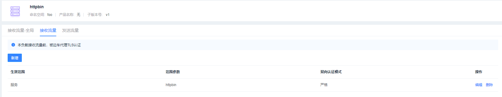
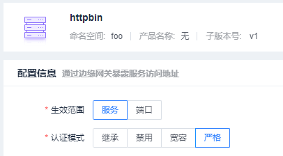
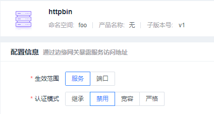
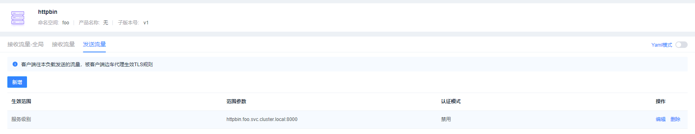
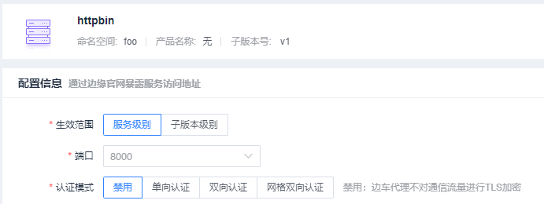
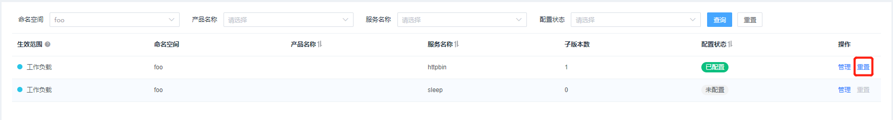
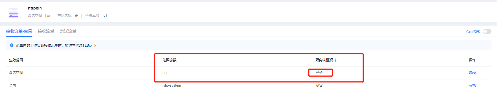
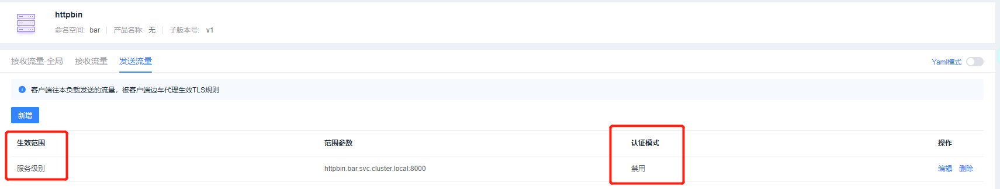
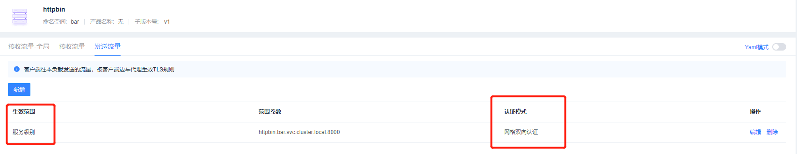
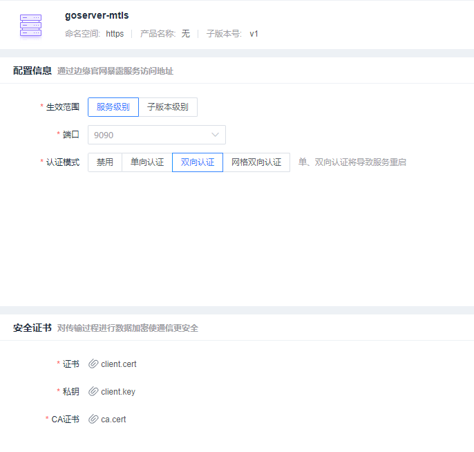

# 发送流量验收流程


## 前提准备

### 服务部署

#### httpbin服务部署

发送流量中的服务部署和接收流量中的服务部署流程一模一样

#### goserver服务部署

```shell
$ kubectl create ns https
$ kubectl label namespace https istio-injection=enabled
```

tls模式：

```yaml
apiVersion: v1
kind: Service
metadata:
  labels:
    hsapp: goserver-tls
    hsproduct: ""
  name: goserver-tls
  namespace: https
spec:
  ports:
  - name: https
    port: 9090
    protocol: TCP
    targetPort: 8080
  selector:
    hsapp: goserver-tls
  type: NodePort
---
apiVersion: apps/v1
kind: Deployment
metadata:
  labels:
    hsapp: goserver-tls
    hsproduct: ""
    hsversion: v1
  name: goserver-tls-v1
  namespace: https
spec:
  replicas: 1
  selector:
    matchLabels:
      hsapp: goserver-tls
      hsproduct: ""
      hsversion: v1
  template:
    metadata:
      labels:
        hsapp: goserver-tls
        hsproduct: ""
        hsversion: v1
    spec:
      containers:
      - image: goserver-tls:v1.0.0
        imagePullPolicy: IfNotPresent
        name: goserver
        ports:
          - name: https
            containerPort: 8080
            protocol: TCP
        volumeMounts:
          - mountPath: /home/host
            name: certs
      volumes:
        - hostPath:
            path: /home/ztc/goserver/goserver/goserver-tls/cert   # 路径根据服务器上的路径来
            type: ""
          name: certs   # 为边车容器挂载，虽然不挂载不影响功能验证，但是边车容器日志中会出现找不到证书报错
```

mtls模式：

```yaml
apiVersion: v1
kind: Service
metadata:
  labels:
    hsapp: goserver-mtls
    hsproduct: ""
  name: goserver-mtls
  namespace: https
spec:
  ports:
  - name: https
    port: 9090
    protocol: TCP
    targetPort: 8443
  - name: tcp
    port: 9091
    protocol: TCP
    targetPort: 8444
  - name: http
    port: 9092
    protocol: TCP
    targetPort: 80
  selector:
    hsapp: goserver-mtls
  type: NodePort
---
apiVersion: apps/v1
kind: Deployment
metadata:
  labels:
    hsapp: goserver-mtls
    hsproduct: ""
    hsversion: v1
  name: goserver-mtls-v1
  namespace: https
spec:
  replicas: 1
  selector:
    matchLabels:
      hsapp: goserver-mtls
      hsproduct: ""
      hsversion: v1
  template:
    metadata:
      labels:
        hsapp: goserver-mtls
        hsproduct: ""
        hsversion: v1
    spec:
      containers:
      - image: goserver-mtls:v1.0.0
        imagePullPolicy: IfNotPresent
        name: goserver
        ports:
          - name: https
            containerPort: 8443
            protocol: TCP
          - name: https-1
            containerPort: 8444
            protocol: TCP
          - name: http
            containerPort: 80
            protocol: TCP
```

镜像可以联系 “郑天驰34854”提供

```yaml
apiVersion: v1
kind: Service
metadata:
  name: sleep
  namespace: https
  labels:
    hsapp: sleep
    hsproduct: ""
spec:
  ports:
  - port: 80
    name: http
  selector:
    hsapp: sleep
---
apiVersion: apps/v1
kind: Deployment
metadata:
  name: sleep-v1
  namespace: https
  labels:
    hsapp: sleep
    hsproduct: ""
    hsversion: v1
spec:
  replicas: 1
  selector:
    matchLabels:
      hsapp: sleep
      hsproduct: ""
      hsversion: v1
  template:
    metadata:
      labels:
        hsapp: sleep
        hsproduct: ""
        hsversion: v1
    spec:
      terminationGracePeriodSeconds: 0
      containers:
      - name: sleep
        image: curlimages/curl
        command: ["/bin/sleep", "3650d"]
        imagePullPolicy: IfNotPresent
        volumeMounts:
        - mountPath: /etc/sleep/tls
          name: secret-volume
      volumes:
      - name: secret-volume
        secret:
          secretName: sleep-secret
          optional: true
```

**对 goserver-tls 服务做测试 (tls)：**

```shell
goserver 服务部署完成后，首先对功能做一轮测试
# 直接在容器内部做一次访问：

1.进入容器内部
$ kubectl exec -it  <goserver-tls pod name>  -n https -c goserver -- sh

2.通过证书进行访问
# 如果使用的是带证书的访问，需要访问的是域名，而不能直接访问localhost,并且需要对这个域名做dns解析为127.0.0.1方可访问
# -HHost 里面的域名就是证书中的域名， --resolve做一层dns解析，因为现在是在本地测试，直接转成 127.0.0.1，随后附上ca证书
curl -HHost:goserver-tls --resolve "goserver-tls:8080:127.0.0.1"  --cacert ./ca.crt  https://goserver-tls:8080/healthz
{"status":"healthy","hostName":"goserver-tls-55866f8dfc-mtxsd"}

3.不做合法性检测的访问
curl -k  https://localhost:8080/healthz
{"status":"healthy","hostName":"goserver-tls-v1-c78d5d6d4-wtftl"}

4.测试完成后退出
ctrl + p + q
```

```shell
# 在sleep服务中对goserver服务做访问
1.获取到goserver service 的 CLUSER IP

$kubectl get service -n https
NAME           TYPE        CLUSTER-IP    EXTERNAL-IP   PORT(S)          AGE
goserver-tls   NodePort    10.1.150.24   <none>        9090:31581/TCP   3h18m
sleep          ClusterIP   10.1.127.46   <none>        80/TCP           3h4m

2.进入sleep容器内部
$ kubectl exec -it  <sleep pod name>  -n https -c sleep -- sh

3.自己在sleep 容器 /home/curl_user 目录下 vi 一个ca,然后把外面的ca.crt证书的内容拷贝进来

4.利用上述的IP地址做域名解析，然后访问 (注意当前的路径下有ca)
curl -s   -HHost:goserver-tls --resolve "goserver-tls:9090:10.1.150.24" --cacert ./ca  https://goserver-tls:9090/healthz
{"status":"healthy","hostName":"goserver-tls-v1-c78d5d6d4-wtftl"}

3.测试完成后退出
ctrl + p + q
```

**对 goserver-mtls 服务做测试 (mtls)：**

```shell
# 首先在容器内部做测试

1.进入容器内部 （容器内部再带了证书和秘钥）
$ kubectl exec -it  <goserver-mtls pod name>  -n https -c goserver -- sh

2. 不做合法性检测的访问
$ curl -i -k  --cert ./client.crt --key ./client.key  https://localhost:8443/healthz

3.带CA证书的访问
$ curl -i --cacert ./server-ca.crt --cert ./client.crt --key ./client.key -HHost:goserver-mtls --resolve "goserver-mtls:8443:127.0.0.1"  https://goserver-mtls:8443/healthz
HTTP/1.1 200 OK
Date: Thu, 19 Aug 2021 06:40:09 GMT
Content-Length: 67
Content-Type: text/plain; charset=utf-8

{"status":"healthy","hostName":"goserver-mtls-v1-674dd4f446-9shtg"}sh-4.2#

4.测试完成后退出
ctrl + p + q
```

```shell
# 在sleep服务中对goserver服务做访问
1.获取到goserver service 的 CLUSER IP

$ kubectl get service -n https
NAME            TYPE        CLUSTER-IP    EXTERNAL-IP   PORT(S)                                        AGE
goserver-mtls   NodePort    10.1.123.34   <none>        9090:30757/TCP,9091:31995/TCP,9092:31244/TCP   23m
goserver-tls    NodePort    10.1.150.24   <none>        9090:31581/TCP                                 3h52m
sleep           ClusterIP   10.1.127.46   <none>        80/TCP                                         3h38m

2.进入sleep容器内部
$ kubectl exec -it  <sleep pod name>  -n https -c sleep -- sh

3.将server-ca.crt client.crt client.key 拷贝到sleep容器的内部 ， 我使用的路径为 “/home/curl_user” 

4.利用上述的IP地址做域名解析，然后访问
$ curl -i --cacert ./server-ca.crt --cert ./client.crt --key ./client.key  -HHost:goserver-mtls --resolve "goserver-mtls:9090:10.1.123.34"  https://goserver-mtls:9090/healthz

HTTP/2 200 
content-type: text/plain; charset=utf-8
content-length: 67
date: Thu, 19 Aug 2021 06:54:02 GMT

{"status":"healthy","hostName":"goserver-mtls-v1-674dd4f446-9shtg"}
```


### 证书生成

证书的生成可以参考前面服务暴露中的证书生成

不过边车证书和服务暴露中的证书又不太一样，可以看下在envoy中证书的配置如下：

```yaml
apiVersion: networking.istio.io/v1alpha3
kind: EnvoyFilter
metadata:
  name: goserver-mtls
  namespace: istio-system
spec:
  configPatches:
    - applyTo: CLUSTER
      match:
        cluster:
          name: "outbound|9090||goserver-mtls.https.svc.cluster.local"
      patch:
        operation: MERGE
        value:
          transport_socket:
            name: custom.transport_sockets.tls
            typed_config:
              "@type": type.googleapis.com/envoy.extensions.transport_sockets.tls.v3.UpstreamTlsContext
              common_tls_context:
                tls_certificates:
                - certificate_chain:
                    inline_bytes: "LS0tLS1CRUdJTiBDRVJUSUZJQ0FURS0tLS0tCk1JSUZpekNDQTNNQ0NRQ3BROEtDN2wwbGx6QU5CZ2txaGtpRzl3MEJBUXNGQURDQm9qRUxNQWtHQTFVRUJoTUMKUTA0eEVUQVBCZ05WQkFnTUNGcG9aVXBwWVc1bk1SRXdEd1lEVlFRSERBaG9ZVzVuZW1odmRURVFNQTRHQTFVRQpDZ3dIYUhWdVpITjFiakVMTUFrR0ExVUVDd3dDWkhJeEtqQW9CZ05WQkFNTUlVaDFibVIxYmlCRFpYSjBhV1pwClkyRjBaU0JCZFhSb2IzSnBkSGtnTWpBeU1URWlNQ0FHQ1NxR1NJYjNEUUVKQVJZVFpYaGhiWEJzWlVCb2RXNWsKYzNWdUxtTnZiVEFlRncweU1UQTJNalV3TnpVNU16SmFGdzB6TVRBMk1qTXdOelU1TXpKYU1Hd3hDekFKQmdOVgpCQVlUQWtOT01SRXdEd1lEVlFRSURBaGFhR1ZLYVdGdVp6RVJNQThHQTFVRUJ3d0lkR0ZwZW1odmRYSXhGREFTCkJnTlZCQU1NQzNSbGMzUWdZMnhwWlc1ME1TRXdId1lKS29aSWh2Y05BUWtCRmhKamJHbGxiblJBYUhWdVpITjEKYmk1amIyMHdnZ0lpTUEwR0NTcUdTSWIzRFFFQkFRVUFBNElDRHdBd2dnSUtBb0lDQVFDMnVPZTJQV0UwYitHUgoxMXFYUEZNakM3OGtLNitNb1dZWW1oZkhUSzVYRS9UYzJSWHJRV0dzN3ljUW9UYVcvUUx0SC9rRVFIa2FrZnBGCkJ2ZFl1R204ZkZVa2xKbnhCcTZLamw5TGczc0FjWVNrb3pIandlcmtQUFYvZnRyQVo2eTAwYzJ5OXFRK0hGc3AKZjJXcDF4cmY1dlJJdWJ6N25GQVNhcnhZbmdvdkQ2eXFDcElwSHZjOHoxS2ZLa3pDUFZJV0M3Y0ZWQUU1aCtIUgpjMndqRS96Vit3bGc5b05WdkNoeGJRNVRLeHZMUVJoRXphdVBYeXR0a0NrbG9yMElYVnU1bGlaWjVyaE9DMmkyCllDUGRlYmpFZk9lYVFVdU1HNDVYUGIxWDhqKzFkTE55ekMzVVo1TGtTUTIxMDdKYSs5MGRJZ3pid25Wb1NhdkcKbWNLbjgzS29hTXJBY2ptVDMrRjV6dVg4c3VEVk8xckxsR0k3Q1NWZlhWQnBTbkQ0dG5BLzZPWTRZelNJclUzSwpPa3VqbWpZM1NHMnI3WkdTQzN2NHg5SUw0SkRuS1JMQUszUngrNzFTTWl0VXdvOFQ1Q1E0K0JkVldsYmFEaEQyCjV0c3F6b3kxZHNCVy9tdDBrR0t4OTVsSzhUdmdFMGxLK2pVTzJRd0VDczFQNUo2VmJrNkl4eHBCK1dUK3pueG0KR0tsR2RRRGYxV0VlLzVQY3dwYk1sL2hWRHVqNlpQOVZVaWU5WmlGanhlSzdaMWVKWENFY3RWb1JvR1hiRE5UNApVKzZmazZONHlSYnFPTmJrRnhuejdtMjJ2MzFPN0crSlcyK3B1MnZQczVnWWllSTBrNFJRNHJmNDJndUttMG9ECi9sWG9YaEgxU1FLNERVcUJOTmZlK215K25oNmtBUUlEQVFBQk1BMEdDU3FHU0liM0RRRUJDd1VBQTRJQ0FRQ0oKRUJueUMrMDZnOVd5N3QzSXFsazZiSmM4VzhGdThCeUNHeDdHdG5Ib2srRlkxMThzWW9PZE5xL2FnNmNOS3RtMgpxR1RqdXFSb2ZvVWFsVU85K2JCRHpybG13SUNhUDlBY0ViZDh6c20wR0hoN1FIK2N4K2c3Nm5PV0xGYXVrdFRuClQySmJDUXBvRGdCZyt4K1lTNTBTTDh3d2MyOWt3Z1IydXdZZ2JlV2VZVjRnd1dMNWx3dVlvRExGSTFOOFVoNFcKR3A5Q0IvYmRJdGEveVBobjYwK3JINldOdjNZNnhhQUFPS2cwMTFzZGF3TXRybFFta1B6UWhwcVFabS9tdjdWaQpQQjZqWTAwVXJUa1NTYTBlT29PY0QvK3ExNUpEWi9pNUpMV0FZT3BkOTd5ak1BTEhQSHpNMzlQZkIxblV3cWUyCmtpRy9RZDMrRXVPOVBpWWYyTGxtYTY2NFdRU29jN3pma2NCRHluam9DSWN5dCtwL0NDSTFqUVNvcjZVYkFnSDMKeUV6THczWEt6Z3ZSMDB2dTM2L3IrRmtWbDZnS2dOekRieDYyaThPMnl2SFlSbkhjRE8xaHJKNE50NWFpTlp6WApOUllLSHRrRWRlYldMNUdDTWxqR2ttazRrVE5Gb2JFWnJjWWh5ZGVXVXlHK3ZzUFg3YkFMZzlOYnlKcVVRRkM4Cm8xQkZqMk5SY1ZKQWhFL1BwbUtVeHAzY2dDUWMxUHppR3g4aldHcVA2TzY2aFhCSFQxVm9LSjlzcmFXT1VGNzgKWUVrWUE3K1A1UVM1VitNdS83dFR6TElPc3B0cjlIWWJQY3RLdTA3VkU2UHJqeEpMMnpXbm95c21Qb3JhS2dXawozWnpxS3l0UEVjMC9Tb1lyc0Z4SlZlRENaVWFiazZNUkxkLzlTSTRqOUE9PQotLS0tLUVORCBDRVJUSUZJQ0FURS0tLS0tCg=="
                  private_key:
                    inline_bytes: "LS0tLS1CRUdJTiBSU0EgUFJJVkFURSBLRVktLS0tLQpNSUlKS0FJQkFBS0NBZ0VBdHJqbnRqMWhORy9oa2RkYWx6eFRJd3UvSkN1dmpLRm1HSm9YeDB5dVZ4UDAzTmtWCjYwRmhyTzhuRUtFMmx2MEM3Ui81QkVCNUdwSDZSUWIzV0xocHZIeFZKSlNaOFFhdWlvNWZTNE43QUhHRXBLTXgKNDhIcTVEejFmMzdhd0dlc3ROSE5zdmFrUGh4YktYOWxxZGNhMytiMFNMbTgrNXhRRW1xOFdKNEtMdytzcWdxUwpLUjczUE05U255cE13ajFTRmd1M0JWUUJPWWZoMFhOc0l4UDgxZnNKWVBhRFZid29jVzBPVXlzYnkwRVlSTTJyCmoxOHJiWkFwSmFLOUNGMWJ1WlltV2VhNFRndG90bUFqM1htNHhIem5ta0ZMakJ1T1Z6MjlWL0kvdFhTemNzd3QKMUdlUzVFa050ZE95V3Z2ZEhTSU0yOEoxYUVtcnhwbkNwL055cUdqS3dISTVrOS9oZWM3bC9MTGcxVHRheTVSaQpPd2tsWDExUWFVcHcrTFp3UCtqbU9HTTBpSzFOeWpwTG81bzJOMGh0cSsyUmtndDcrTWZTQytDUTV5a1N3Q3QwCmNmdTlVaklyVk1LUEUrUWtPUGdYVlZwVzJnNFE5dWJiS3M2TXRYYkFWdjVyZEpCaXNmZVpTdkU3NEJOSlN2bzEKRHRrTUJBck5UK1NlbFc1T2lNY2FRZmxrL3M1OFpoaXBSblVBMzlWaEh2K1QzTUtXekpmNFZRN28rbVQvVlZJbgp2V1loWThYaXUyZFhpVndoSExWYUVhQmwyd3pVK0ZQdW41T2plTWtXNmpqVzVCY1o4KzV0dHI5OVR1eHZpVnR2CnFidHJ6N09ZR0luaU5KT0VVT0szK05vTGlwdEtBLzVWNkY0UjlVa0N1QTFLZ1RUWDN2cHN2cDRlcEFFQ0F3RUEKQVFLQ0FnQUVBeFZiWkFlaFhoK0cwMEt5OVdraDZOMGVqek1BbEg2b1phSEdCNElBZVhpejdMUlZnUThDL0JGUQpoU21zc1F1Q1oyUlJXcFVPSjB4bWZadXF3QW5hVUtTUjlBMVpSSHRLb1l1b0hjL3lsNHVCRGZCSGZ2ZUlZV3BHCmpXT0NQQVNIeDkrTFlXMER6QjJZVUtyTHl1UlZMRDRLNXNFbWlTMGM2bWtPVFJJT0xIcnZGT0pXc3M1YzhIUncKK0QzTk9nbDJZSFY1VVhuaGFJRmwxdkgxNXpkeS8xc2FYTzlQVDUxWHVEeExTVFFJQjNyZjcrQW5lc0I2WEdMNgo1NUxjL3lmSGNHdVJKOGErTi9QcHBUekVYU3JZYmFHc09tak5QOEdsV3I2d2txb2hjdG1KMkwvYzNSVlZtK0VJCk1BakhoS1k3UUljbHdDUlIwT1JMclE2Z0gzRlNCY2d6VEVxTWF6TXpFa3FYejNBeWFsRHM5YnVQS1B0dSs4MnEKQlRpUDFJWDAydXJHSW95dGRuemd1OURTZ1Z0OG1obVJsMjVHaXVoWGN5UHRtWEVuNkl5OUlMV1laZHBOWHhUVAplNXRVRk9wTEc3cCtLWC81TVg4ZC9oOUg3cXpsdWtYUmNHZ090OXo0Q0dqT0p1V25lOXZCcDY2Qm4zalJ0eHdaCkJRdW53WlYxV2Rvb0RhNG92M1k2NXVwc2ZTRWhMeUtNM1pzb2xyWXduTlBTUjRYUkZabXRiTGlEUE5xaFVMeHIKSFdSd3hEZmQ1a2RVdnRUakZWMDhwTmV2ZkxFU1JveTNyc0h4b3BkcVNPaElVeXliOCsxbyttcThpNVVyN05BWQpBRWQ1TXhzbFVraEhSdXd3bStQSWlleG1SYTNqRisvc29veERXall2TzR0TjcyUVpBUUtDQVFFQTdqb3NJRHBDCkRZbXdaNktQbUZwYk55L0Rod3hBMFcyV2NmRlB2THZhNU9hbzBnRU1wM2pONGJPZkRyUE9MdVJ0VHBjZWhMcW8KVlZ0RWc0d3hkUjZ1MnNwM2NPZ1dFOHJ6RGRTR05xanVweXpDUmpSc0c0MlVxMVhiN1ZYWCtrTHpIY0xtRmVHNwpxa0hoQ0oxUTlNdHFxTWFtMXhNU241Vnl2dnRCRWhwNThDN1hYeE1wNG9VU2c2ZVZIYXNkUDJIYndEUXJNbU50CmMzM0VOQnBWVFpMNnB4NXRBK0lGbFl3SzVPWlhjdUl4MEFsZEYyOEtxMy81dTdnU3U4aCt0K2gwTVJtNU41Zk0KT2R0eWVZKzE3MzQ5NWZ0WkZhd1B3MEZYOEJyRUlhY09rVlVwVEFtOEdIbkJ5NExMTm5hOUZyOUE3M2E1cWVPYwp6NjRsaHN1UkxCN2pNUUtDQVFFQXhGcXBPYWIwU2xENmFyUUZCcGxjTnlwRlQ1bkc0c0RkS0hSTktsWEFsVVJSCnV2eDNkalVPWVNnWU1IbTJFNTJWQ08zcGtBQmVZZEs0UmM2SEdKWnpFTXFRc3ZLaUdPeElldkVmOHNKeFZpbHoKSWdrQVg2eUJic1hlelN5NEVCZmdCdUZpUjg0RG9iRWMxSUY3QkhxMWpCZEdlN0xycnZvdVpVc3ZoOXIxWVJaMApKeTV0VlVlOXYrVHd6SUNyS0NzbGV5a0oxVjVNZHFHYWNhcVJDaFNaNkhCNEtEWnRCKzhvUHlTZmFGbnF1M3JSCmp4eDZ2ZEJlZzhIODRxR0lnZmdMUGxQM1I4TUdzTUtIemJlSkFPNVNPRE9nanh3eithTzB5VnRpTjVSZXArMUIKVHVFeUM5bGlVNGlHT0ZEOXVNdTN3dHg3TU9WbDBxZVpla3RZQkpWNTBRS0NBUUVBdUR5TSs2K1NmZDNLYTV1dwo2ZWFYUEtyWDBJMk5ZMm9aTzYyZ09Sb2ZRMytQZURvUGkwVkdGQk5TSTVDekdGallvRHNIQXlkSUlCc2hkWXJxCmhPVmgzUnRRSENXaFRWVmJlNHFzOFlEY2NMV1EyYktaR1FYNXdEZjZpaVlsamdwUTh1ZFVBZ0E5bm9Lc2dua0gKcnduU1J3eTY0d0tCR0tIL3grdVFlMnUyZWlYL3NpdWo3T2QxVmhRNG9tVS9qVkVsSGhRNmhCR1pDQVJ2eE12SQp4T0d5cjZROE14Q051UVpCTnAxZGJCKzYzbVVmZFl3TytHdFV1L1N6cUQ1Nm9jaEljK0NzK1cyUUovNnJIWkFpCjZFRDlwZXNwRGpXdlN4WXg2Q01MSSt1S3ZLTGIrVTVlQlovRVhKdWVoVlIzRUN5QkQ3RUdEWGxXUU5jeGRubmcKbi9xVFFRS0NBUUErN1Rzc2djZnFoVGNydVJPZlFNamYyUWtyY0lIZnE2VjAwSWptVjJNSHMwUnFJM3o1Z2hsZwpvNlBVN1R5ZjNyR2prZk4zTmRjSmpLbUhuWitJRHJkRG0xZHlNZlltL0pwaDVDS3ovd0twZFZFemlDVDVoR1JhCnBzazNnZXhmSS9lazNOaE5ZTVdqTFFxclErK3p5TXVqNE5XeTBPMWRQMHBkSmhKT2ZLcUUrZGd4c2x4UnAxTTEKUzE2c2UxUGU1S3ozWW5pSFM5Zy9jSno1Ym90YTZxMUVZNzd1VERyMi92c3IrVVdwQUtBTWcxampmMklLc051SgphRUx1TW94MzhwRlA0VUx2V1o0c1NidVIvdzdHSUpweTdvQzNQSGVmdW9vMnViV3BVRUJobXRTQ1BnTjI3cXpuClRtcU5ZODljU05WVWVxcDBTaUF1dVkyak5zQTNmOXZ4QW9JQkFEQks4Q3BPNFBPOWViejd2czZNdGRhekE2QWwKa0pPN0tiNGFVVGI4ZVFMUlppQURseENKLzdDVStIM0RjRndRd3ZldWg3dXlnVCtaS1pmcmZoTkdwa01oNCtoWgphdWRoalFpYzdrRFNGbEo2UzMxRzVrVmlNd0pKRHJaTld3eXVLcmx4VVl5UGtQanI2MUxNdnZLbGFtTVdqem12Cll5QlBmREZXUGlXUkV4VjFjRFg3Vzk2WlpKb1FKcTM3U0FIREs5NDJUTkhUb21iTHEza3JzdXlSMUhQV3hXZ0YKZnZaaXlvd2ZOeGE5Z3Rtd3VEd0VDTmRwUCtxWFZGd2RBbk5qMzl1YnBjRDBlSUs3OU1aL2dzVS9sQWRIaE5qZQpXb0E0K1NJRWZJcDRIOXpEdVROWCtlcDc1Nm1rWWIyQWUybTdXa2doV0hyNEZKYW1WOUpuMDlsZy9QYz0KLS0tLS1FTkQgUlNBIFBSSVZBVEUgS0VZLS0tLS0K"
                validation_context:
                  trusted_ca:
                    inline_bytes: "LS0tLS1CRUdJTiBDRVJUSUZJQ0FURS0tLS0tCk1JSUdHVENDQkFHZ0F3SUJBZ0lKQUo4ZUg5QW5uMGU4TUEwR0NTcUdTSWIzRFFFQkN3VUFNSUdpTVFzd0NRWUQKVlFRR0V3SkRUakVSTUE4R0ExVUVDQXdJV21obFNtbGhibWN4RVRBUEJnTlZCQWNNQ0doaGJtZDZhRzkxTVJBdwpEZ1lEVlFRS0RBZG9kVzVrYzNWdU1Rc3dDUVlEVlFRTERBSmtjakVxTUNnR0ExVUVBd3doU0hWdVpIVnVJRU5sCmNuUnBabWxqWVhSbElFRjFkR2h2Y21sMGVTQXlNREl4TVNJd0lBWUpLb1pJaHZjTkFRa0JGaE5sZUdGdGNHeGwKUUdoMWJtUnpkVzR1WTI5dE1CNFhEVEl4TURZeU5UQTNOVGt5T1ZvWERUTXhNRFl5TXpBM05Ua3lPVm93Z2FJeApDekFKQmdOVkJBWVRBa05PTVJFd0R3WURWUVFJREFoYWFHVkthV0Z1WnpFUk1BOEdBMVVFQnd3SWFHRnVaM3BvCmIzVXhFREFPQmdOVkJBb01CMmgxYm1SemRXNHhDekFKQmdOVkJBc01BbVJ5TVNvd0tBWURWUVFERENGSWRXNWsKZFc0Z1EyVnlkR2xtYVdOaGRHVWdRWFYwYUc5eWFYUjVJREl3TWpFeElqQWdCZ2txaGtpRzl3MEJDUUVXRTJWNApZVzF3YkdWQWFIVnVaSE4xYmk1amIyMHdnZ0lpTUEwR0NTcUdTSWIzRFFFQkFRVUFBNElDRHdBd2dnSUtBb0lDCkFRQ3RNMUdnR1g3NVp2M25wN0RhRU9nUXNkNlZXUmgzUFFFUXE0Zm05VXFaandnSUJVN0psUnpMaXlhalhheG0KSnU4ZDRObGNaTk1nTC9mS2s0d1gzL3hBc0hnL3M3TkEyV3FYZmRrNTBLMXRORzJ6aG1WZzFpcVNIeU1mck43RwpCUE94amVPOG9hMkZiVzhJQzU0elpwNGEvYS9XT0ZsNGJoaEdtMGdVeGRlaDJNTkFDVTEyOVdxRUZnYTdGRmZzCksreDZsRzQrZWJuRUt2WUo0eUF1Q25OdnZ3Q1lJM1dUQW51RGtrS2l5VHNwTVhpOEpEcVg1ZEZoS2JjdU9wNWMKQzdDb2dSbjV4SzRlMXdtQXNQWGJTa1EzbzlhWFBaMDc1Z3ZNelIvTEFDVEEwZ3ZOTnhFMGRlUmJKWW5rN1JlawpKQU1nSml0c1hoaHhJd3F4MzZSdW5JdDYrNEJyUXJHMzVqRjJ2TVdFaDVpcGcyaFN1VzlHRzRXSmJnMjVtblhOCnd6bEx2YW82Q2pFMEpuZmIxUzdFdklrWGl3OW02Z2NSZXpibVd3Y1ZidWhubFJtUFMyUXhvNUlDZlphM3V5SU8KUGQxanNmbWYxYlJqeGFkYjVVWk1seWExK3dHdFBLbzNOSFVlTzJPSGhFajBLV0s4RGFZNlpnT25uZDNNeG5lZAp1NTI1WVp6N1ZLNnZ6MVU0NmJCS0t3YWRLS3JMMnozN2MvMGI5M2xocTBuVnhTd25VWXplTzVyZE1oTURkVTRLCnlxdXFtOU1QSHI5d0lYZEpzNjlYbWxMbVpjNlo5eHZjWUkzeVZMNUg3N0Z1MGc5a1JxR01HMU9vVnkyV1A1UU0KVklueDN3d1lna2NBMEtlcUFpem4rSjNMYkJ6VTlSeWwzRjdkTDVlSnhmTnVPd0lEQVFBQm8xQXdUakFkQmdOVgpIUTRFRmdRVVphK2lVU2E1N2NyeC9yNnhIY1hjd1JXY1diMHdId1lEVlIwakJCZ3dGb0FVWmEraVVTYTU3Y3J4Ci9yNnhIY1hjd1JXY1diMHdEQVlEVlIwVEJBVXdBd0VCL3pBTkJna3Foa2lHOXcwQkFRc0ZBQU9DQWdFQUlreEkKQlNxcXJwOXZhL21ML1QxV1VXd2FkL1pVSXpZVWxwcGhhN3hIYjQxTmpNeUVPNUhKTk8vOENGTk14MzduclFEdwpxMHFObjZvRUV3SzZBd1A1ZTNlS2JDN1duOUZrSWgrVlNNaWZjVUxDUnpGRnp3UFloWlVib3Q2aGw0cWt0QTl1CjZ1VVIwcXBySjFRMC9uR1B2UXo4OG14b05SNTVTZTNTczFWekNYZVM4MnU2TVlSZXBZNG1oQ3R1Si9lZndKQVMKWTRCY2JTUGVscmRQWXl5YjB0aUhvL1dxbEEvSFE1MU54eXpNRG1uQ3huMFEvWHhnWjNmRnhhRFVZRkZJamh3VQpjY2NkaGprN2xWTENhaW92NlZjSVp6Q1JMZWFpZlh4SEJYSmtzVldJMCt1MHhleElLOEVTd0Izb0NEdHQ1L0VICk02aDN6Wkk5cmRYbnd2U0hlbWxtYTIwVy9HT2FsbXhtbmxLanZjT1ZVQ2ZRNVYwbmwyRDJlMzRtMlFOOFE4azIKZHBzbUg3ZlIwRmJKUzVaOHBUck1MT2FrcWdmUm1kQ0RlbXNaQ0tDVm9uekViSjU5dHdBMWtKRDBscnVRdFV3VQptMXhxQVcwTEFYSGZKZmVCRDVpWWVzREJva3kxZzN2c21tRWNRV3NCTWZZekdPMTZsZ1RBK1RUN0F0UldVaFV0CjIxdlBDQkNHSm9nNjJ2UTA3c0F4MWpsOWdCQzFaSkthOWVFc1lDSTdvd2RmMklSYUVIdm96dklMdTNtQ2cwalgKMnJyeFJrbVdaenl5Wlo0VUdHaUUzenRaZDNUMXhCL1hHQ2YzZzFEbGdFUjNyU0VBbmwzWGowcUFxdjV0N29sKwpSM1pZRmk0SEpYMERxVVJEZlFaeDhEZE1TN043SlRLVU9vNlN2ZVU9Ci0tLS0tRU5EIENFUlRJRklDQVRFLS0tLS0K"
```

现阶段我们使用的证书是byte数组，需要使用 `base64`指令将原证书做一层转换：

```shell
# 证书文件
$ cat example.com.crt 
-----BEGIN CERTIFICATE-----
MIIDLTCCAhWgAwIBAgIJAKmMuR24fPgSMA0GCSqGSIb3DQEBCwUAMC0xFTATBgNV
BAoMDGV4YW1wbGUgSW5jLjEUMBIGA1UEAwwLZXhhbXBsZS5jb20wHhcNMjEwODE2
MDYxOTQwWhcNMjIwODE2MDYxOTQwWjAtMRUwEwYDVQQKDAxleGFtcGxlIEluYy4x
FDASBgNVBAMMC2V4YW1wbGUuY29tMIIBIjANBgkqhkiG9w0BAQEFAAOCAQ8AMIIB
CgKCAQEA0JrakeLkrl2tCathO2UOAwOxpB8uvjrcGlOePCMsKfpWpBYzD3H2mTg3
Zd2o5sVrhZV5YxrvDa5+fnKG66fRk0dbOUIRnalgFDX7ccS12HzepDhOqbdtD0da
AUhYKhgb+hkR50UmGIjK8xmcGYSD9Ul7Ut+EOxdONFS1yhDqGbJVRuJFjvApa4M/
eJIRson/1iGFgmo3wMFInR9RSM7L1XjcCv2OrEifTI5LQQN9A4v55OSCB+lM2ckk
hzJMj/gigKdTeEuIORsTFy31Ztl7TKTFKb4lezcrciO3CdP4XXfwsnGV5+yqcY+Z
ccHlsKg1GfMqrUj7Sd9UVHgPNZN2fwIDAQABo1AwTjAdBgNVHQ4EFgQUBTuDpmYe
tWZlByWSE5kPl8BIAoEwHwYDVR0jBBgwFoAUBTuDpmYetWZlByWSE5kPl8BIAoEw
DAYDVR0TBAUwAwEB/zANBgkqhkiG9w0BAQsFAAOCAQEAJQMQZMaNXQSRK1lLA/+I
RL3/b9Bv9Z4lcFY0/lmrbVLSrrLXkG0VdDTMt31StVrlPL2LLLCtJ6upBgNi+A82
T5d1NkFIg/zhwvZPRrAVi1iIqpfQGKJBopc2d7uIKNayDHjGlKVUNtxq7iBEL7V/
ahG2FAFfTBB0N0L5ughOR4rRcM7WoapJAcjg+w9LM34Bvv7+e+FAt1BEx8kjtu3/
C69TfFAOWAeTJlUX6XZE+JmlEhP05NMGb/fottRc0DCm8Ijnh3cFTYEepBGXDI77
HUteBdOaPZ+AzbjjptqGKFy2onCVHlTSaJJesI/uMT3p3kCLFHco0V5wUhcrwq75
CA==
-----END CERTIFICATE-----

# 转换成byte数组
$ base64 example.com.crt 
LS0tLS1CRUdJTiBDRVJUSUZJQ0FURS0tLS0tCk1JSURMVENDQWhXZ0F3SUJBZ0lKQUttTXVSMjRm
UGdTTUEwR0NTcUdTSWIzRFFFQkN3VUFNQzB4RlRBVEJnTlYKQkFvTURHVjRZVzF3YkdVZ1NXNWpM
akVVTUJJR0ExVUVBd3dMWlhoaGJYQnNaUzVqYjIwd0hoY05NakV3T0RFMgpNRFl4T1RRd1doY05N
akl3T0RFMk1EWXhPVFF3V2pBdE1SVXdFd1lEVlFRS0RBeGxlR0Z0Y0d4bElFbHVZeTR4CkZEQVNC
Z05WQkFNTUMyVjRZVzF3YkdVdVkyOXRNSUlCSWpBTkJna3Foa2lHOXcwQkFRRUZBQU9DQVE4QU1J
SUIKQ2dLQ0FRRUEwSnJha2VMa3JsMnRDYXRoTzJVT0F3T3hwQjh1dmpyY0dsT2VQQ01zS2ZwV3BC
WXpEM0gybVRnMwpaZDJvNXNWcmhaVjVZeHJ2RGE1K2ZuS0c2NmZSazBkYk9VSVJuYWxnRkRYN2Nj
UzEySHplcERoT3FiZHREMGRhCkFVaFlLaGdiK2hrUjUwVW1HSWpLOHhtY0dZU0Q5VWw3VXQrRU94
ZE9ORlMxeWhEcUdiSlZSdUpGanZBcGE0TS8KZUpJUnNvbi8xaUdGZ21vM3dNRkluUjlSU003TDFY
amNDdjJPckVpZlRJNUxRUU45QTR2NTVPU0NCK2xNMmNrawpoekpNai9naWdLZFRlRXVJT1JzVEZ5
MzFadGw3VEtURktiNGxlemNyY2lPM0NkUDRYWGZ3c25HVjUreXFjWStaCmNjSGxzS2cxR2ZNcXJV
ajdTZDlVVkhnUE5aTjJmd0lEQVFBQm8xQXdUakFkQmdOVkhRNEVGZ1FVQlR1RHBtWWUKdFdabEJ5
V1NFNWtQbDhCSUFvRXdId1lEVlIwakJCZ3dGb0FVQlR1RHBtWWV0V1psQnlXU0U1a1BsOEJJQW9F
dwpEQVlEVlIwVEJBVXdBd0VCL3pBTkJna3Foa2lHOXcwQkFRc0ZBQU9DQVFFQUpRTVFaTWFOWFFT
UksxbExBLytJClJMMy9iOUJ2OVo0bGNGWTAvbG1yYlZMU3JyTFhrRzBWZERUTXQzMVN0VnJsUEwy
TExMQ3RKNnVwQmdOaStBODIKVDVkMU5rRklnL3pod3ZaUFJyQVZpMWlJcXBmUUdLSkJvcGMyZDd1
SUtOYXlESGpHbEtWVU50eHE3aUJFTDdWLwphaEcyRkFGZlRCQjBOMEw1dWdoT1I0clJjTTdXb2Fw
SkFjamcrdzlMTTM0QnZ2NytlK0ZBdDFCRXg4a2p0dTMvCkM2OVRmRkFPV0FlVEpsVVg2WFpFK0pt
bEVoUDA1Tk1HYi9mb3R0UmMwRENtOElqbmgzY0ZUWUVlcEJHWERJNzcKSFV0ZUJkT2FQWitBemJq
anB0cUdLRnkyb25DVkhsVFNhSkplc0kvdU1UM3Aza0NMRkhjbzBWNXdVaGNyd3E3NQpDQT09Ci0t
LS0tRU5EIENFUlRJRklDQVRFLS0tLS0K

#------------------------------------------------证书转换-----------------------------------------------------------------#

# 转换指令
echo $(base64 xxx.xxx | tr '\n' '@') | sed 's/@//g' >  xxx_xxx.xxx

# 例如我要转换客户端的私钥
echo $(base64 client.key | tr '\n' '@') | sed 's/@//g' >  clientByte.key
# mtls 中，我执行了如下指令：
echo $(base64 client.key | tr '\n' '@') | sed 's/@//g' >  clientByte.key
echo $(base64 client.crt | tr '\n' '@') | sed 's/@//g' >  clientByte.crt
echo $(base64 server-ca.crt | tr '\n' '@') | sed 's/@//g' >  server-caByte.crt
```


## 测试流程

### 测试示例一：

1.清除之前配置的安全配置

2.给 foo namespace 中的 httpbin服务添加配置





3.访问查看

```shell
for from in "foo" "bar" "legacy"; do for to in "foo" "bar" "legacy"; do kubectl exec "$(kubectl get pod -l hsapp=sleep -n ${from} -o jsonpath={.items..metadata.name})" -c sleep -n ${from} -- curl "http://httpbin.${to}:8000/ip" -s -o /dev/null -w "sleep.${from} to httpbin.${to}: %{http_code}\n"; done; done

sleep.foo to httpbin.foo: 200
sleep.foo to httpbin.bar: 200
sleep.foo to httpbin.legacy: 200
sleep.bar to httpbin.foo: 200
sleep.bar to httpbin.bar: 200
sleep.bar to httpbin.legacy: 200
sleep.legacy to httpbin.foo: 000       # 从 sleep.legacy 到 httpbin.foo的访问出现 000 
command terminated with exit code 56
sleep.legacy to httpbin.bar: 200
sleep.legacy to httpbin.legacy: 200
```


4.修改接收流量为为禁用模式



```shell
for from in "foo" "bar" "legacy"; do for to in "foo" "bar" "legacy"; do kubectl exec "$(kubectl get pod -l hsapp=sleep -n ${from} -o jsonpath={.items..metadata.name})" -c sleep -n ${from} -- curl "http://httpbin.${to}:8000/ip" -s -o /dev/null -w "sleep.${from} to httpbin.${to}: %{http_code}\n"; done; done

sleep.foo to httpbin.foo: 200
sleep.foo to httpbin.bar: 200
sleep.foo to httpbin.legacy: 200
sleep.bar to httpbin.foo: 503    # sleep.bar to httpbin.foo 出现了503
sleep.bar to httpbin.bar: 200
sleep.bar to httpbin.legacy: 200
sleep.legacy to httpbin.foo: 200
sleep.legacy to httpbin.bar: 200
sleep.legacy to httpbin.legacy: 200
```

5.为了让出现503的服务可以正常访问，我们添加`发送流量`的安全配置






6.然后再次请求查看

```shell
for from in "foo" "bar" "legacy"; do for to in "foo" "bar" "legacy"; do kubectl exec "$(kubectl get pod -l hsapp=sleep -n ${from} -o jsonpath={.items..metadata.name})" -c sleep -n ${from} -- curl "http://httpbin.${to}:8000/ip" -s -o /dev/null -w "sleep.${from} to httpbin.${to}: %{http_code}\n"; done; done

sleep.foo to httpbin.foo: 200
sleep.foo to httpbin.bar: 200
sleep.foo to httpbin.legacy: 200
sleep.bar to httpbin.foo: 200     # sleep.bar to httpbin.foo 原先是503.现在变为200了，说明刚刚的配置修改成功
sleep.bar to httpbin.bar: 200
sleep.bar to httpbin.legacy: 200
sleep.legacy to httpbin.foo: 200
sleep.legacy to httpbin.bar: 200
sleep.legacy to httpbin.legacy: 200
```


### 测试情况二：

1.首先清空之前配置的所有项，找到对应的服务，点击“重置”按钮即可

2.测试当前的环境是否是正常的 (全部返回200代表是正常的)

```shell
for from in "foo" "bar" "legacy"; do for to in "foo" "bar" "legacy"; do kubectl exec "$(kubectl get pod -l hsapp=sleep -n ${from} -o jsonpath={.items..metadata.name})" -c sleep -n ${from} -- curl "http://httpbin.${to}:8000/ip" -s -o /dev/null -w "sleep.${from} to httpbin.${to}: %{http_code}\n"; done; done

sleep.foo to httpbin.foo: 200
sleep.foo to httpbin.bar: 200
sleep.foo to httpbin.legacy: 200
sleep.bar to httpbin.foo: 200
sleep.bar to httpbin.bar: 200
sleep.bar to httpbin.legacy: 200
sleep.legacy to httpbin.foo: 200
sleep.legacy to httpbin.bar: 200
sleep.legacy to httpbin.legacy: 200
```

3.修改全局中的配置如下

将 bar namespace 中的 命名空间级别 双项认证模式 设置为 为“严格”模式



4.访问查看

```shell
for from in "foo" "bar" "legacy"; do for to in "foo" "bar" "legacy"; do kubectl exec "$(kubectl get pod -l hsapp=sleep -n ${from} -o jsonpath={.items..metadata.name})" -c sleep -n ${from} -- curl "http://httpbin.${to}:8000/ip" -s -o /dev/null -w "sleep.${from} to httpbin.${to}: %{http_code}\n"; done; done

sleep.foo to httpbin.foo: 200
sleep.foo to httpbin.bar: 200
sleep.foo to httpbin.legacy: 200
sleep.bar to httpbin.foo: 200
sleep.bar to httpbin.bar: 200
sleep.bar to httpbin.legacy: 200
sleep.legacy to httpbin.foo: 200
sleep.legacy to httpbin.bar: 000       # 出现000代表配置成功
command terminated with exit code 56
sleep.legacy to httpbin.legacy: 200
```

5.添加httpbin.bar 中的发送流量的配置



6.再次访问

```shell
for from in "foo" "bar" "legacy"; do for to in "foo" "bar" "legacy"; do kubectl exec "$(kubectl get pod -l hsapp=sleep -n ${from} -o jsonpath={.items..metadata.name})" -c sleep -n ${from} -- curl "http://httpbin.${to}:8000/ip" -s -o /dev/null -w "sleep.${from} to httpbin.${to}: %{http_code}\n"; done; done
sleep.foo to httpbin.foo: 200
sleep.foo to httpbin.bar: 503     # 出现了503 
sleep.foo to httpbin.legacy: 200
sleep.bar to httpbin.foo: 200
sleep.bar to httpbin.bar: 503     # 出现了503 
sleep.bar to httpbin.legacy: 200
sleep.legacy to httpbin.foo: 200
sleep.legacy to httpbin.bar: 000
command terminated with exit code 56
sleep.legacy to httpbin.legacy: 200
```

7.为了将503消除掉，再次修改配置如下



将服务级别修改为 “双向认证模式”

8.再次访问查看

```shell
for from in "foo" "bar" "legacy"; do for to in "foo" "bar" "legacy"; do kubectl exec "$(kubectl get pod -l hsapp=sleep -n ${from} -o jsonpath={.items..metadata.name})" -c sleep -n ${from} -- curl "http://httpbin.${to}:8000/ip" -s -o /dev/null -w "sleep.${from} to httpbin.${to}: %{http_code}\n"; done; done

sleep.foo to httpbin.foo: 200
sleep.foo to httpbin.bar: 200        # 之前503的问题解决了
sleep.foo to httpbin.legacy: 200
sleep.bar to httpbin.foo: 200
sleep.bar to httpbin.bar: 200
sleep.bar to httpbin.legacy: 200
sleep.legacy to httpbin.foo: 200
sleep.legacy to httpbin.bar: 000
command terminated with exit code 56
sleep.legacy to httpbin.legacy: 200
```


### 测试情况三(双向认证)：

1.首先清空之前配置的所有项，找到对应的服务，点击“重置”按钮即可


2.如果之前有配置过全局级别的，需要另外修改下全局级别的配置（模式是 `宽容模式`），因为在重置的过程中不会修改namespace 级别的配置，重置的是 workload级别的发送流量和接收流量。

3.测试发送流量双向认证模式

配置 `goserver-mtls` 服务的 `发送流量` 如下所示：



注意这里上传的证书必须是byte数组的证书 （clientByte.key 、clientByte.crt、server-caByte.crt ），需要按照前面的教程将证书做一层转换

4.进入到sleep服务容器内部

```shell
$ kubectl exec -it  <sleep-pod name> -n https -c sleep -- sh

# 必须在home 目录下才有权限操作
cd /home/curl_user
# 证书生成中有提到生成byte数组类型的证书，使用 vi 将生成的证书拷贝到容器中，拷贝进去后 :wq 保存退出
vi client.crt
vi client.key
vi server-ca.crt
```

5.访问查看

```shell
# 方式一（不带证书访问）
# 注意，注意走的是http的访问，而不是https，istio会自动帮你升级为https，并且走的是双向认证
$ curl -i http://goserver-mtls:9090/healthz

HTTP/1.1 200 OK
Date: Thu, 19 Aug 2021 07:10:48 GMT
Content-Length: 67
Content-Type: text/plain; charset=utf-8

{"status":"healthy","hostName":"goserver-mtls-v1-674dd4f446-9shtg"}


# 方式二（带证书访问）
curl -i --cacert ./server-ca.crt --cert ./client.crt --key ./client.key  -HHost:goserver-mtls --resolve "goserver-mtls:9090:10.1.123.34"  http://goserver-mtls:9090/healthz

HTTP/1.1 200 OK
Date: Thu, 19 Aug 2021 07:44:53 GMT
Content-Length: 67
Content-Type: text/plain; charset=utf-8

{"status":"healthy","hostName":"goserver-mtls-v1-674dd4f446-9shtg"}
```


### 测试情况四

测试发送流量单向认证模式  （这一部分需要在 `hsmesh v2.2.2` 迭代内容做完后才可以测试）