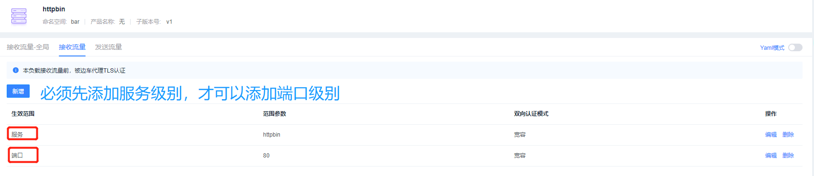
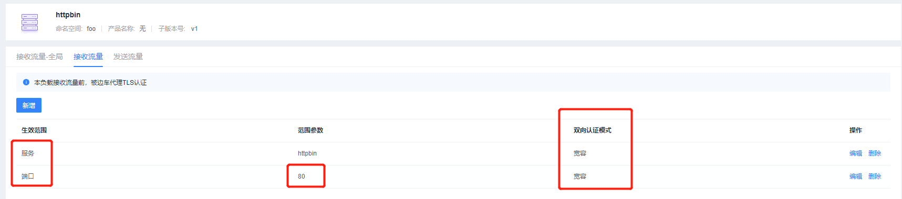
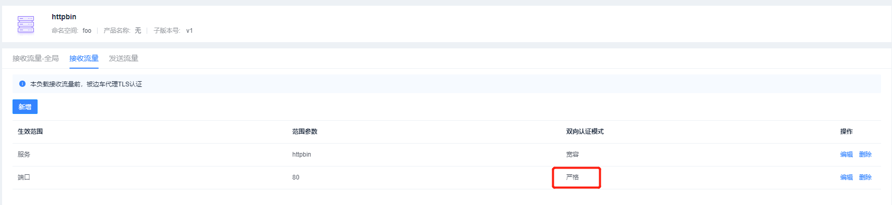

# 接收流量验收流程


## 前提准备

### httpbin 服务

httpbin.yaml

```yaml
apiVersion: v1
kind: Service
metadata:
  name: httpbin
  labels:
    hsapp: httpbin
    hsproduct: ""
spec:
  ports:
  - name: http
    port: 8000
    targetPort: 80
  selector:
    hsapp: httpbin
---
apiVersion: apps/v1
kind: Deployment
metadata:
  name: httpbin-v1
  labels:
    hsapp: httpbin
    hsproduct: ""
    hsversion: v1
spec:
  replicas: 1
  selector:
    matchLabels:
      hsapp: httpbin
      hsproduct: ""
      hsversion: v1
  template:
    metadata:
      labels:
        hsapp: httpbin
        hsproduct: ""
        hsversion: v1
    spec:
      containers:
      - image: docker.io/kennethreitz/httpbin
        imagePullPolicy: IfNotPresent
        name: httpbin
        ports:
        - containerPort: 80
```

### sleep服务

sleep.yaml

```yaml
apiVersion: v1
kind: Service
metadata:
  name: sleep
  labels:
    hsapp: sleep
    hsproduct: ""
spec:
  ports:
  - port: 80
    name: http
  selector:
    hsapp: sleep
---
apiVersion: apps/v1
kind: Deployment
metadata:
  name: sleep
  labels:
    hsapp: sleep
    hsproduct: ""
spec:
  replicas: 1
  selector:
    matchLabels:
      hsapp: sleep
  template:
    metadata:
      labels:
        hsapp: sleep
    spec:
      terminationGracePeriodSeconds: 0
      containers:
      - name: sleep
        image: curlimages/curl
        command: ["/bin/sleep", "3650d"]
        imagePullPolicy: IfNotPresent
        volumeMounts:
        - mountPath: /etc/sleep/tls
          name: secret-volume
      volumes:
      - name: secret-volume
        secret:
          secretName: sleep-secret
          optional: true
```

### 部署服务脚本

```shell
#!/bin/bash

kubectl create ns foo
kubectl apply -f <(istioctl kube-inject -f httpbin.yaml) -n foo
kubectl apply -f <(istioctl kube-inject -f sleep.yaml) -n foo
kubectl create ns bar
kubectl apply -f <(istioctl kube-inject -f httpbin.yaml) -n bar
kubectl apply -f <(istioctl kube-inject -f sleep.yaml) -n bar
kubectl create ns legacy
kubectl apply -f httpbin.yaml -n legacy
kubectl apply -f sleep.yaml -n legacy
```


## 测试流程

### 服务级别

在没有任何配置的情况下查看访问情况

```shell
for from in "foo" "bar" "legacy"; do for to in "foo" "bar" "legacy"; do kubectl exec "$(kubectl get pod -l hsapp=sleep -n ${from} -o jsonpath={.items..metadata.name})" -c sleep -n ${from} -- curl "http://httpbin.${to}:8000/ip" -s -o /dev/null -w "sleep.${from} to httpbin.${to}: %{http_code}\n"; done; done

sleep.foo to httpbin.foo: 200
sleep.foo to httpbin.bar: 200
sleep.foo to httpbin.legacy: 200
sleep.bar to httpbin.foo: 200
sleep.bar to httpbin.bar: 200
sleep.bar to httpbin.legacy: 200
sleep.legacy to httpbin.foo: 200
sleep.legacy to httpbin.bar: 200
sleep.legacy to httpbin.legacy: 200
```

#### 严格模式

设置 bar namespace 中的 httpbin 接收流量为`严格模式`，生效范围选择 “服务”


然后访问查看

```yaml
for from in "foo" "bar" "legacy"; do for to in "foo" "bar" "legacy"; do kubectl exec "$(kubectl get pod -l hsapp=sleep -n ${from} -o jsonpath={.items..metadata.name})" -c sleep -n ${from} -- curl "http://httpbin.${to}:8000/ip" -s -o /dev/null -w "sleep.${from} to httpbin.${to}: %{http_code}\n"; done; done

sleep.foo to httpbin.foo: 200
sleep.foo to httpbin.bar: 200
sleep.foo to httpbin.legacy: 200
sleep.bar to httpbin.foo: 200
sleep.bar to httpbin.bar: 200
sleep.bar to httpbin.legacy: 200
sleep.legacy to httpbin.foo: 200
sleep.legacy to httpbin.bar: 000      #  出现 000 代表配置生效
command terminated with exit code 56  #
sleep.legacy to httpbin.legacy: 200
```

#### 继承模式

设置 bar namespace 中的 httpbin 接收流量为`继承模式`

```shell
for from in "foo" "bar" "legacy"; do for to in "foo" "bar" "legacy"; do kubectl exec "$(kubectl get pod -l hsapp=sleep -n ${from} -o jsonpath={.items..metadata.name})" -c sleep -n ${from} -- curl "http://httpbin.${to}:8000/ip" -s -o /dev/null -w "sleep.${from} to httpbin.${to}: %{http_code}\n"; done; done

sleep.foo to httpbin.foo: 200
sleep.foo to httpbin.bar: 200
sleep.foo to httpbin.legacy: 200
sleep.bar to httpbin.foo: 200
sleep.bar to httpbin.bar: 200
sleep.bar to httpbin.legacy: 200
sleep.legacy to httpbin.foo: 200
sleep.legacy to httpbin.bar: 200      #  返回200， 代表配置成功
sleep.legacy to httpbin.legacy: 200
```


#### 禁用模式

设置 bar namespace 中的 httpbin 接收流量为`禁用模式`

```shell
for from in "foo" "bar" "legacy"; do for to in "foo" "bar" "legacy"; do kubectl exec "$(kubectl get pod -l hsapp=sleep -n ${from} -o jsonpath={.items..metadata.name})" -c sleep -n ${from} -- curl "http://httpbin.${to}:8000/ip" -s -o /dev/null -w "sleep.${from} to httpbin.${to}: %{http_code}\n"; done; done

sleep.foo to httpbin.foo: 200
sleep.foo to httpbin.bar: 503       # 返回503代表成功
sleep.foo to httpbin.legacy: 200
sleep.bar to httpbin.foo: 200
sleep.bar to httpbin.bar: 503       # 返回503代表成功
sleep.bar to httpbin.legacy: 200
sleep.legacy to httpbin.foo: 200
sleep.legacy to httpbin.bar: 200
sleep.legacy to httpbin.legacy: 200
```


#### 宽容模式

设置 bar namespace 中的 httpbin 接收流量为`宽容模式`

```shell
for from in "foo" "bar" "legacy"; do for to in "foo" "bar" "legacy"; do kubectl exec "$(kubectl get pod -l hsapp=sleep -n ${from} -o jsonpath={.items..metadata.name})" -c sleep -n ${from} -- curl "http://httpbin.${to}:8000/ip" -s -o /dev/null -w "sleep.${from} to httpbin.${to}: %{http_code}\n"; done; done

sleep.foo to httpbin.foo: 200
sleep.foo to httpbin.bar: 200
sleep.foo to httpbin.legacy: 200
sleep.bar to httpbin.foo: 200
sleep.bar to httpbin.bar: 200
sleep.bar to httpbin.legacy: 200
sleep.legacy to httpbin.foo: 200
sleep.legacy to httpbin.bar: 200
sleep.legacy to httpbin.legacy: 200
```


### 端口级别

1. 先添加服务级别的配置
2. 然后再添加端口级别的配置 （不能跳过第一步）



设置 bar namespace 中的 httpbin 接收流量为`严格模式`， 生效范围选择 “端口”


为了对比测试，我们现将 foo namespace 中的 httpbin 的设置为如下所示：




```shell
for from in "foo" "bar" "legacy"; do for to in "foo" "bar" "legacy"; do kubectl exec "$(kubectl get pod -l hsapp=sleep -n ${from} -o jsonpath={.items..metadata.name})" -c sleep -n ${from} -- curl "http://httpbin.${to}:8000/ip" -s -o /dev/null -w "sleep.${from} to httpbin.${to}: %{http_code}\n"; done; done

sleep.foo to httpbin.foo: 200
sleep.foo to httpbin.bar: 200
sleep.foo to httpbin.legacy: 200
sleep.bar to httpbin.foo: 200
sleep.bar to httpbin.bar: 200
sleep.bar to httpbin.legacy: 200
sleep.legacy to httpbin.foo: 200
sleep.legacy to httpbin.bar: 200
sleep.legacy to httpbin.legacy: 200
```

然后更改为如下所示的配置：



将端口级别的双向认证修改为 `严格`，端口级别会覆盖服务级别

```shell
for from in "foo" "bar" "legacy"; do for to in "foo" "bar" "legacy"; do kubectl exec "$(kubectl get pod -l hsapp=sleep -n ${from} -o jsonpath={.items..metadata.name})" -c sleep -n ${from} -- curl "http://httpbin.${to}:8000/ip" -s -o /dev/null -w "sleep.${from} to httpbin.${to}: %{http_code}\n"; done; done

sleep.foo to httpbin.foo: 200
sleep.foo to httpbin.bar: 200
sleep.foo to httpbin.legacy: 200
sleep.bar to httpbin.foo: 200
sleep.bar to httpbin.bar: 200
sleep.bar to httpbin.legacy: 200
sleep.legacy to httpbin.foo: 000   # 刚刚设置的严格模式生效了，返回了000
command terminated with exit code 56
sleep.legacy to httpbin.bar: 200
sleep.legacy to httpbin.legacy: 200
```