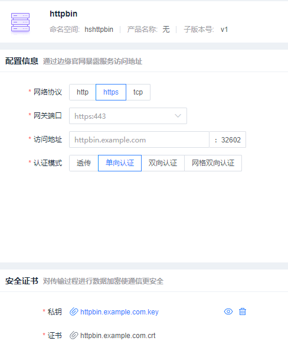
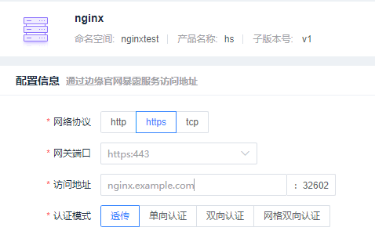

[TOC]

# 服务暴露验收流程


## 前提准备

### 1. ingressgateway配置

对`ingressgateway` 添加`tcp`的端口:

```shell
$ kubectl edit service -n istio-system

# 在 service port 中 我添加了如下的配置
  - name: hs-tcp
    nodePort: 31450
    port: 31450
    protocol: TCP
    targetPort: 31450
```


### 2. httpbin服务部署

**httpbin (deployment & service):**

```shell
$ kubectl create ns hshttpbin
$ kubectl label namespace hshttpbin istio-injection=enabled
```

```yaml
# Copyright Istio Authors
#
#   Licensed under the Apache License, Version 2.0 (the "License");
#   you may not use this file except in compliance with the License.
#   You may obtain a copy of the License at
#
#       http://www.apache.org/licenses/LICENSE-2.0
#
#   Unless required by applicable law or agreed to in writing, software
#   distributed under the License is distributed on an "AS IS" BASIS,
#   WITHOUT WARRANTIES OR CONDITIONS OF ANY KIND, either express or implied.
#   See the License for the specific language governing permissions and
#   limitations under the License.

##################################################################################################
# httpbin service
##################################################################################################
apiVersion: v1
kind: Service
metadata:
  name: httpbin
  namespace: hshttpbin
  labels:
    hsapp: httpbin
    hsproduct: ""
spec:
  ports:
  - name: http
    port: 8000
    targetPort: 80
  selector:
    hsapp: httpbin
---
apiVersion: apps/v1
kind: Deployment
metadata:
  name: httpbin-v1
  namespace: hshttpbin
  labels:
    hsapp: httpbin
    hsproduct: ""
    hsversion: v1
spec:
  replicas: 1
  selector:
    matchLabels:
      hsapp: httpbin
      hsproduct: ""
      hsversion: v1
  template:
    metadata:
      labels:
        hsapp: httpbin
        hsproduct: ""
        hsversion: v1
    spec:
      containers:
      - image: docker.io/kennethreitz/httpbin
        imagePullPolicy: IfNotPresent
        name: httpbin
        ports:
        - containerPort: 80
```

### 3. tcp-echo服务部署

tcp-echo服务：

```shell
$ kubectl create ns tcptest
$ kubectl label namespace tcptest istio-injection=enabled
```

```yaml
apiVersion: v1
kind: Service
metadata:
  name: hs-tcp
  namespace: tcptest
  labels:
    hsapp: tcp
    hsproduct: hs
spec:
  ports:
  - name: tcp
    port: 9000
  - name: tcp-other
    port: 9001
  selector:
    hsapp: tcp
    hsproduct: hs
---
apiVersion: apps/v1
kind: Deployment
metadata:
  name: hs-tcp-v1
  namespace: tcptest
  labels:
    hsapp: tcp
    hsproduct: hs
    hsversion: v1
spec:
  replicas: 1
  selector:
    matchLabels:
      hsapp: tcp
      hsproduct: hs
      hsversion: v1
  template:
    metadata:
      labels:
        hsapp: tcp
        hsproduct: hs
        hsversion: v1
    spec:
      containers:
      - name: tcp-echo
        image: docker.io/istio/tcp-echo-server:1.2
        imagePullPolicy: IfNotPresent
        args: [ "9000,9001,9002", "hello" ]
        ports:
        - containerPort: 9000
        - containerPort: 9001
```


### 4. Nginx服务部署

```shell
$ kubectl create ns nginxtest
$ kubectl label namespace nginxtest istio-injection=enabled
```

```yaml
# 为NGINX服务器创建一个配置文件:
$ cat <<\EOF > ./nginx.conf
events {
}

http {
  log_format main '$remote_addr - $remote_user [$time_local]  $status '
  '"$request" $body_bytes_sent "$http_referer" '
  '"$http_user_agent" "$http_x_forwarded_for"';
  access_log /var/log/nginx/access.log main;
  error_log  /var/log/nginx/error.log;

  server {
    listen 443 ssl;

    root /usr/share/nginx/html;
    index index.html;

    server_name nginx.example.com;
    ssl_certificate /etc/nginx-server-certs/tls.crt;
    ssl_certificate_key /etc/nginx-server-certs/tls.key;
  }
}
EOF
```

```shell
# 创建一个Kubernetes ConfigMap 来保存NGINX服务器的配置:
$ kubectl create configmap hs-nginx -n nginxtest --from-file=nginx.conf=./nginx.conf
```

```shell
# 这一步的提示是按照： “证书生成中的非终结时tls nginx 服务证书生成” 中的步骤，生成nginx的证书
# 创建Kubernetes [Secret]来保存服务器证书。
$ kubectl create secret tls hs-nginx -n nginxtest --key nginx.example.com.key --cert nginx.example.com.crt
```

**Nginx服务配置**

```yaml
apiVersion: v1
kind: Service
metadata:
  name: hs-nginx
  namespace: nginxtest
  labels:
    hsapp: nginx
    hsproduct: hs
spec:
  ports:
  - port: 443
    protocol: TCP
  selector:
    hsapp: nginx
    hsproduct: hs
---
apiVersion: apps/v1
kind: Deployment
metadata:
  name: hs-nginx-v1
  namespace: nginxtest
  labels:
    hsapp: nginx
    hsproduct: hs
    hsversion: v1
spec:
  selector:
    matchLabels:
      hsapp: nginx
      hsproduct: hs
      hsversion: v1
  replicas: 1
  template:
    metadata:
      labels:
        hsapp: nginx
        hsproduct: hs
        hsversion: v1
    spec:
      containers:
      - name: my-nginx
        image: nginx
        ports:
        - containerPort: 443
        volumeMounts:
        - name: nginx-config
          mountPath: /etc/nginx
          readOnly: true
        - name: nginx-server-certs
          mountPath: /etc/nginx-server-certs
          readOnly: true
      volumes:
      - name: nginx-config
        configMap:
          name: hs-nginx           # 前提是已经创建了该configmap
      - name: nginx-server-certs
        secret:
          secretName: hs-nginx  # 前提是已经创建了该secret
```


### **5. 更新nss:**

```shell
yum update nss nss-util nspr
```


## 证书生成

### **网关证书和客户端证书**

**证书生成脚本**：

```shell
#!/bin/bash
# 根证书
openssl req -x509 -sha256 -nodes -days 365 -newkey rsa:2048 -subj '/O=example Inc./CN=example.com' -keyout example.com.key -out example.com.crt
# 为httpbin.example.com创建证书和私钥
openssl req -out httpbin.example.com.csr -newkey rsa:2048 -nodes -keyout httpbin.example.com.key -subj "/CN=httpbin.example.com/O=httpbin organization"
openssl x509 -req -days 365 -CA example.com.crt -CAkey example.com.key -set_serial 0 -in httpbin.example.com.csr -out httpbin.example.com.crt

# 为客户端创建证书和私钥
openssl req -out client.example.com.csr -newkey rsa:2048 -nodes -keyout client.example.com.key -subj "/CN=client.example.com/O=client organization"
openssl x509 -req -days 365 -CA example.com.crt -CAkey example.com.key -set_serial 1 -in client.example.com.csr -out client.example.com.crt
```

### 非终结式TLS Nginx 服务证书生成

**生成客户端和服务器证书和密钥**

在` 10.20.144.84 /home/ztc/hsmesh-test/noTlsNginx ` 下有

1. 创建根证书和私钥以为您的服务签署证书:

```shell
openssl req -x509 -sha256 -nodes -days 365 -newkey rsa:2048 -subj '/O=example Inc./CN=example.com' -keyout example.com.key -out example.com.crt
```

2. 为`nginx.example.com`创建证书和私钥:

```shell
openssl req -out nginx.example.com.csr -newkey rsa:2048 -nodes -keyout nginx.example.com.key -subj "/CN=nginx.example.com/O=some organization"
openssl x509 -req -days 365 -CA example.com.crt -CAkey example.com.key -set_serial 0 -in nginx.example.com.csr -out nginx.example.com.crt
```


## 环境变量

```shell
# 环境变量设置 （可以根据情况设定环境变量）
export INGRESS_PORT=$(kubectl -n istio-system get service istio-ingressgateway -o jsonpath='{.spec.ports[?(@.name=="http2")].nodePort}') 2>&1
export SECURE_INGRESS_PORT=$(kubectl -n istio-system get service istio-ingressgateway -o jsonpath='{.spec.ports[?(@.name=="https")].nodePort}') 2>&1
export TCP_INGRESS_PORT=$(kubectl -n istio-system get service istio-ingressgateway -o jsonpath='{.spec.ports[?(@.name=="hs-tcp")].nodePort}') 2>&1
export INGRESS_HOST=$(kubectl get po -l istio=ingressgateway -n istio-system -o jsonpath='{.items[0].status.hostIP}')
export GATEWAY_URL=$INGRESS_HOST:$INGRESS_PORT 2>&1
```


# 开始测试

## 一、Http测试

**virtualservice (http):**

```yaml
apiVersion: networking.istio.io/v1alpha3
kind: VirtualService
metadata:
  name: httpbin
  namespace: hshttpbin
  labels:
    hsapp: httpbin
    hsproduct: ""
spec:
  hosts:
  - "httpbin.example.com" 
  gateways:
  - httpbin     
  http:
  - match:
    - uri:
        prefix: /status
    - uri:
        prefix: /delay
    route:
    - destination:
        port:
          number: 8000
        host: httpbin   # 转发给的实际服务
```

**YAML模板**

**virtualserive (https):**

```yaml
apiVersion: networking.istio.io/v1alpha3
kind: VirtualService
metadata:
  name: httpbin
  labels:
    hsapp: httpbin
    hsproduct: ""
spec:
  hosts:
  - "httpbin.example.com"
  gateways:
  - httpbin
  http:
  - match:
    - uri:
        prefix: /status
    - uri:
        prefix: /delay
    route:
    - destination:
        port:
          number: 8000
        host: httpbin
```

**gateway (http):**

```yaml
apiVersion: networking.istio.io/v1alpha3
kind: Gateway
metadata:
  name: httpbin
  namespace: hshttpbin
  labels:
    hsapp: httpbin
    hsproduct: ""
spec:
  selector:
    istio: ingressgateway # use Istio default gateway implementation
  servers:
  - port:
      number: 80
      name: http
      protocol: HTTP
    hosts:
    - "httpbin.example.com"  # 这是访问的域名
```

**界面配置**

在`服务暴露`中添加如下的配置


在`路由管理`中添加如下配置


在`负载均衡`中添加如下配置


最终在服务器上对服务进行访问，返回200 代表访问且配置成功

```shell
$ curl -s -I -HHost:httpbin.example.com "http://$INGRESS_HOST:$INGRESS_PORT/status/200"
HTTP/1.1 200 OK
server: istio-envoy
...
```


## 二、Https测试

### 1. 单向认证验证

**YAML模板**

**gateway (https - simple 单向认证):**

```shell
$ kubectl create -n istio-system secret tls httpbin-credential --key=httpbin.example.com.key --cert=httpbin.example.com.crt
```

```yaml
apiVersion: networking.istio.io/v1alpha3
kind: Gateway
metadata:
  name: httpbin
  namespace: hshttpbin
  labels:
    hsapp: httpbin
    hsproduct: ""
spec:
  selector:
    istio: ingressgateway # use istio default ingress gateway
  servers:
  - port:
      number: 443
      name: https
      protocol: HTTPS
    tls:
      mode: SIMPLE
      credentialName: httpbin-xxxxx # must be the same as secret
    hosts:
    - httpbin.example.com
```

**https 单项认证验证** （界面操作）

添加`服务暴露`配置



添加 `负载均衡`  和 `路由管理` （这一部分和前一步 http 配置中的一致），如果出现了下面的茶杯代表访问成功

```shell
# 确保服务端当前路径下有  example.com.crt 文件  （10.20.144.84中有，路径为：/home/ztc/vstest/httpbin ）
$ curl -v -HHost:httpbin.example.com --resolve "httpbin.example.com:$SECURE_INGRESS_PORT:$INGRESS_HOST" \
--cacert example.com.crt "https://httpbin.example.com:$SECURE_INGRESS_PORT/status/418"

.......
    -=[ teapot ]=-

       _...._
     .'  _ _ `.
    | ."` ^ `". _,
    \_;`"---"`|//
      |       ;/
      \_     _/
        `"""`
.......
```


### 2. 双向认证验证

**YAML模板**

**gateway (https - mutual 双向认证)：**

```shell
$ kubectl create -n istio-system secret generic httpbin-credential --from-file=tls.key=httpbin.example.com.key \
--from-file=tls.crt=httpbin.example.com.crt --from-file=ca.crt=example.com.crt
```

```yaml
apiVersion: networking.istio.io/v1alpha3
kind: Gateway
metadata:
  name: httpbin
  namespace: hshttpbin
  labels:
    hsapp: httpbin
    hsproduct: ""
spec:
  selector:
    istio: ingressgateway # use istio default ingress gateway
  servers:
  - port:
      number: 443
      name: https
      protocol: HTTPS
    tls:
      mode: MUTUAL
      credentialName: httpbin-xxxx # must be the same as secret
    hosts:
    - httpbin.example.com
```

**https 双向认证验证** 

添加`服务暴露`配置


添加 `负载均衡`  和 `路由管理` （这一部分和前一步 http 配置中的一致），如果出现了下面的茶杯代表访问成功

```shell
# 注意服务器上必须存在对应的证书  （10.20.144.84中有，路径为：/home/ztc/vstest/httpbin ）

$ curl -v -HHost:httpbin.example.com --resolve "httpbin.example.com:$SECURE_INGRESS_PORT:$INGRESS_HOST" --cacert ./example.com.crt --cert ./client.example.com.crt --key ./client.example.com.key "https://httpbin.example.com:$SECURE_INGRESS_PORT/status/418"
```


```shell
# 环境变量设置
export INGRESS_PORT=$(kubectl -n istio-system get service istio-ingressgateway -o jsonpath='{.spec.ports[?(@.name=="http2")].nodePort}') 2>&1
export SECURE_INGRESS_PORT=$(kubectl -n istio-system get service istio-ingressgateway -o jsonpath='{.spec.ports[?(@.name=="https")].nodePort}') 2>&1
export TCP_INGRESS_PORT=$(kubectl -n istio-system get service istio-ingressgateway -o jsonpath='{.spec.ports[?(@.name=="tcp")].nodePort}') 2>&1
export INGRESS_HOST=$(kubectl get po -l istio=ingressgateway -n istio-system -o jsonpath='{.items[0].status.hostIP}')
export GATEWAY_URL=$INGRESS_HOST:$INGRESS_PORT 2>&1

# 双向认证 https
[root@linuxtest0029 httpbin]# curl -v -HHost:httpbin.example.com --resolve "httpbin.example.com:$SECURE_INGRESS_PORT:$INGRESS_HOST" --cacert ./example.com.crt --cert ./client.example.com.crt --key ./client.example.com.key "https://httpbin.example.com:$SECURE_INGRESS_PORT/status/418"

* Added httpbin.example.com:32602:10.20.144.84 to DNS cache
* About to connect() to httpbin.example.com port 32602 (#0)
*   Trying 10.20.144.84...
* Connected to httpbin.example.com (10.20.144.84) port 32602 (#0)
* Initializing NSS with certpath: sql:/etc/pki/nssdb
*   CAfile: ./example.com.crt
  CApath: none
* NSS: client certificate from file
* 	subject: O=client organization,CN=client.example.com
* 	start date: Aug 13 03:01:28 2021 GMT
* 	expire date: Aug 13 03:01:28 2022 GMT
* 	common name: client.example.com
* 	issuer: CN=example.com,O=example Inc.
* SSL connection using TLS_ECDHE_RSA_WITH_AES_128_GCM_SHA256
* Server certificate:
* 	subject: O=httpbin organization,CN=httpbin.example.com
* 	start date: Aug 13 03:01:27 2021 GMT
* 	expire date: Aug 13 03:01:27 2022 GMT
* 	common name: httpbin.example.com
* 	issuer: CN=example.com,O=example Inc.
> GET /status/418 HTTP/1.1
> User-Agent: curl/7.29.0
> Accept: */*
> Host:httpbin.example.com
> 
< HTTP/1.1 418 Unknown
< server: istio-envoy
< date: Fri, 13 Aug 2021 05:15:07 GMT
< x-more-info: http://tools.ietf.org/html/rfc2324
< access-control-allow-origin: *
< access-control-allow-credentials: true
< content-length: 135
< x-envoy-upstream-service-time: 13
< 

    -=[ teapot ]=-

       _...._
     .'  _ _ `.
    | ."` ^ `". _,
    \_;`"---"`|//
      |       ;/
      \_     _/
        `"""`
* Connection #0 to host httpbin.example.com left intact
```


### 3. 透传验证 (请确保已经部署了nginx服务)

**YAML模板**

```yaml
apiVersion: networking.istio.io/v1alpha3
kind: Gateway
metadata:
  name: hs-nginx
  namespace: nginxtest
  labels:
    hsapp: nginx
    hsproduct: hs
spec:
  selector:
    istio: ingressgateway # use istio default ingress gateway
  servers:
  - port:
      number: 443
      name: https
      protocol: HTTPS
    tls:
      mode: PASSTHROUGH   # 模式为PASSTHROUGH
    hosts:
    - nginx.example.com
```

```yaml
apiVersion: networking.istio.io/v1alpha3
kind: VirtualService
metadata:
  name: hs-nginx
  namespace: nginxtest
  labels:
    hsapp: nginx
    hsproduct: hs
spec:
  hosts:
  - nginx.example.com
  gateways:
  -  hs-nginx
  tls:                       # 注意，这里是tls的，因为前面是非终结式tls,所有后面的流量也是tls的 
  - match:
    - port: 443
      sniHosts:
      - nginx.example.com
    route:
    - destination:
        host: hs-nginx
        port:
          number: 443
```

**界面操作**

在`服务暴露`界面中



在`负载均衡`界面中


在`路由管理`界面中


**测试流程**

1. 为了测试`NGINX`服务器是否成功部署，从它的`sidecar`代理发送一个请求到服务器，而不检查服务器的证书(使用`curl` 的` -k `选项)。确保服务器的证书被正确打印，例如，` common name (CN) `等于`nginx.example.com `。

   ```shell
   $ kubectl exec "$(kubectl get pod -n nginxtest -l hsapp=nginx -o jsonpath={.items..metadata.name})" -c istio-proxy -n nginxtest -- curl -sS -v -k --resolve nginx.example.com:443:127.0.0.1 https://nginx.example.com
   ...
   SSL connection using TLSv1.2 / ECDHE-RSA-AES256-GCM-SHA384
   ALPN, server accepted to use http/1.1
   Server certificate:
     subject: CN=nginx.example.com; O=some organization
     start date: May 27 14:18:47 2020 GMT
     expire date: May 27 14:18:47 2021 GMT
     issuer: O=example Inc.; CN=example.com
     SSL certificate verify result: unable to get local issuer certificate (20), continuing anyway.
   
   > GET / HTTP/1.1
   > User-Agent: curl/7.58.0
   > Host: nginx.example.com
   ...
   < HTTP/1.1 200 OK
   
   < Server: nginx/1.17.10
   ...
   <!DOCTYPE html>
   <html>
   <head>
   <title>Welcome to nginx!</title>
   ...
   ```

2. 从集群外部访问NGINX服务。注意，服务器返回了正确的证书，并成功验证了它(打印 SSL certificate verify ok )。

   ```shell
   # 切换到证书的路径下，再执行下面的指令
   $ curl -v --resolve "nginx.example.com:$SECURE_INGRESS_PORT:$INGRESS_HOST" --cacert ./example.com.crt "https://nginx.example.com:$SECURE_INGRESS_PORT"
   Server certificate:
     subject: CN=nginx.example.com; O=some organization
     start date: Wed, 15 Aug 2018 07:29:07 GMT
     expire date: Sun, 25 Aug 2019 07:29:07 GMT
     issuer: O=example Inc.; CN=example.com
     SSL certificate verify ok.
   
     < HTTP/1.1 200 OK
     < Server: nginx/1.15.2
     ...
     <html>
     <head>
     <title>Welcome to nginx!</title>
   ```


### 4. 网格双向认证验证 （该功能与之后用户自己上传istio证书结合起来测试）

**YAML模板** （用作参考）

```yaml
apiVersion: networking.istio.io/v1alpha3
kind: Gateway
metadata:
  name: httpbin
  namespace: hshttpbin
  labels:
    hsapp: httpbin
    hsproduct: ""
spec:
  selector:
    istio: ingressgateway # use istio default ingress gateway
  servers:
  - port:
      number: 443
      name: https
      protocol: HTTPS
    tls:
      mode: ISTIO_MUTUAL
      credentialName: httpbin-xxxx # must be the same as secret
    hosts:
    - httpbin.example.com
```


## 三、Tcp测试

**YAML模板** (用作参考)

```yaml
apiVersion: networking.istio.io/v1beta1
kind: VirtualService
metadata:
  labels:
    hsapp: tcp
    hsproduct: hs
  name: hs-tcp
  namespace: tcptest
spec:
  gateways:
  - hs-tcp
  hosts:
  - hs-tcp
  - hs-tcp.tcptest
  - hs-tcp.tcptest.svc.cluster.local
  - 10.20.144.84
  tcp:
  - route:
    - destination:
        host: hs-tcp.tcptest.svc.cluster.local
        port:
          number: 9000
        subset: v1
      weight: 100
```


```yaml
apiVersion: networking.istio.io/v1beta1
kind: Gateway
metadata:
  labels:
    hsapp: tcp
    hsproduct: hs
  name: hs-tcp
  namespace: tcptest
spec:
  selector:
    istio: ingressgateway
  servers:
  - hosts:
    - 10.20.144.84
    port:
      name: tcp-31450
      number: 31450
      protocol: tcp
```


```yaml
apiVersion: networking.istio.io/v1beta1
kind: DestinationRule
metadata:
  labels:
    hsapp: tcp
    hsproduct: hs
  name: hs-tcp
  namespace: tcptest
spec:
  host: hs-tcp.tcptest.svc.cluster.local
  subsets:
  - labels:
      hsversion: v1
    name: v1
    trafficPolicy:
      loadBalancer:
        simple: ROUND_ROBIN
```


**界面操作**

配置`服务暴露`


配置`负载均衡`


配置`路由转发`


**测试指令：**

```shell
export TCP_INGRESS_PORT=$(kubectl -n istio-system get service istio-ingressgateway -o jsonpath='{.spec.ports[?(@.name=="hs-tcp")].nodePort}') 2>&1
export INGRESS_HOST=$(kubectl get po -l istio=ingressgateway -n istio-system -o jsonpath='{.items[0].status.hostIP}')

for i in {1..20}; do \
kubectl exec "$(kubectl get pod -l app=sleep -n <namespace> -o jsonpath={.items..metadata.name})" \
-c sleep -n tcptest -- sh -c "(date; sleep 1) | nc $INGRESS_HOST $TCP_INGRESS_PORT"; \
done
```

例如我在自己的服务器上执行了如下指令 ：

```shell
$ kubectl exec sleep-64d7d56698-bkqvb -n twohello -c sleep -- sh -c "(date; sleep 1) | nc $INGRESS_HOST $TCP_INGRESS_PORT"

hello Mon Aug 16 02:50:37 UTC 2021  # 返回 hello 代表成功了
```


