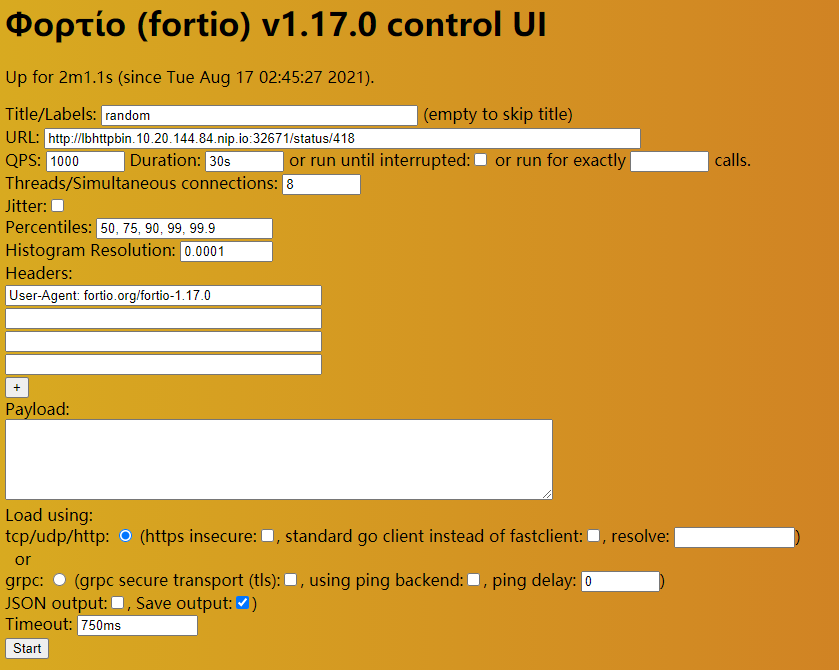
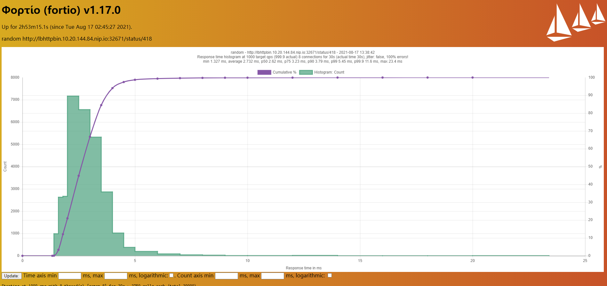
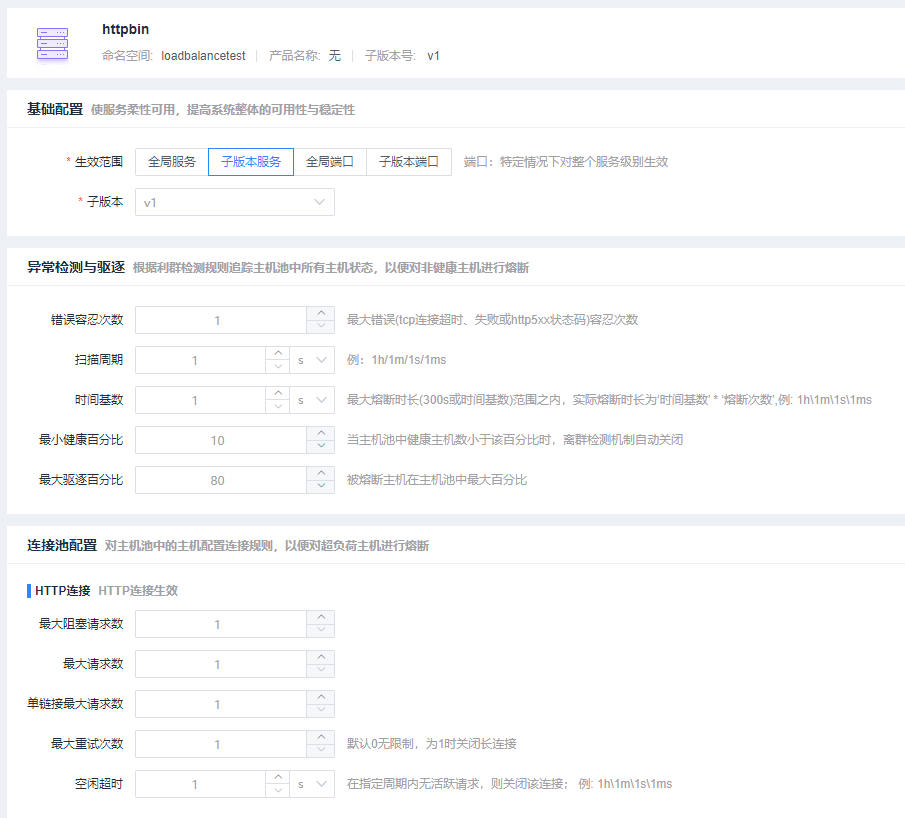
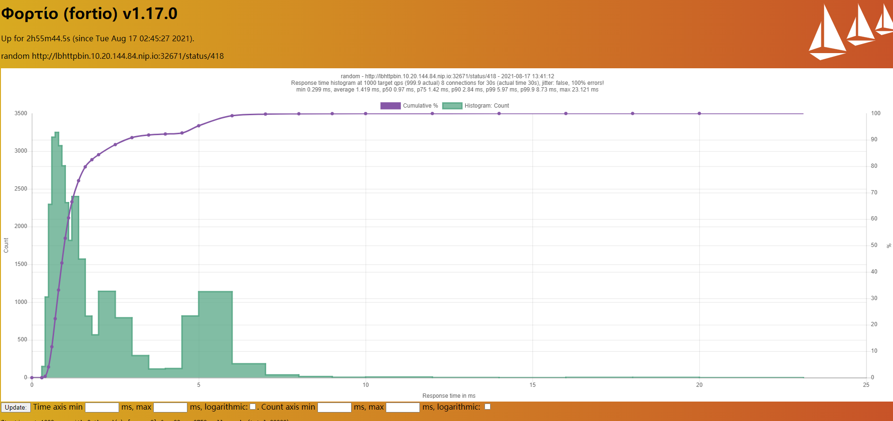

# 熔断器验收流程


## 前提准备

前提准备和 “负载均衡”验收流程一致

## 测试流程





在没有配置熔断器的前提下做测试：




配置熔断器（以极端条件做测试）：





```shell
# target 50% 0.000970599
# target 75% 0.0014177
# target 90% 0.00284068
# target 99% 0.00596664
# target 99.9% 0.00873333
Sockets used: 25750 (for perfect keepalive, would be 8)
Jitter: false
Code 418 : 4251 (14.2 %)
Code 503 : 25749 (85.8 %)    # 大多数情况下返回了 503
```

