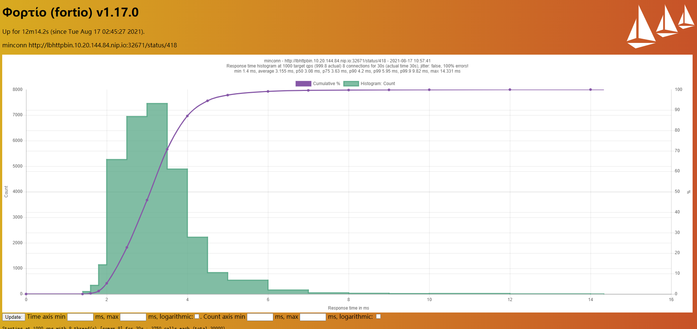

# 负载均衡配置流程


## 前提准备

### httpbin服务部署

```shell
$ kubectl create ns loadbalancetest
$ kubectl label namespace loadbalancetest istio-injection=enabled
```

**httpbin (deployment & service):**

```yaml
# Copyright Istio Authors
#
#   Licensed under the Apache License, Version 2.0 (the "License");
#   you may not use this file except in compliance with the License.
#   You may obtain a copy of the License at
#
#       http://www.apache.org/licenses/LICENSE-2.0
#
#   Unless required by applicable law or agreed to in writing, software
#   distributed under the License is distributed on an "AS IS" BASIS,
#   WITHOUT WARRANTIES OR CONDITIONS OF ANY KIND, either express or implied.
#   See the License for the specific language governing permissions and
#   limitations under the License.

##################################################################################################
# httpbin service
##################################################################################################
apiVersion: v1
kind: Service
metadata:
  name: httpbin
  namespace: loadbalancetest
  labels:
    hsapp: httpbin
    hsproduct: ""
spec:
  ports:
  - name: http
    port: 8000
    targetPort: 80
  selector:
    hsapp: httpbin
---
apiVersion: apps/v1
kind: Deployment
metadata:
  name: httpbin-v1
  namespace: loadbalancetest
  labels:
    hsapp: httpbin
    hsproduct: ""
    hsversion: v1
spec:
  replicas: 3    # 注意，这里的副本数我设定的是三个，副本数必须是多个，如果是1个副本是无法测除负载均衡的
  selector:
    matchLabels:
      hsapp: httpbin
      hsproduct: ""
      hsversion: v1
  template:
    metadata:
      labels:
        hsapp: httpbin
        hsproduct: ""
        hsversion: v1
    spec:
      containers:
      - image: docker.io/kennethreitz/httpbin
        imagePullPolicy: IfNotPresent
        name: httpbin
        ports:
        - containerPort: 80
```

### fortio服务部署

```shell
# 先查看下当前哪些端口已经被占用了
$ netstat -ntlp

# 这里我使用了 41000,41001两个端口
$ docker run -d -i -p 41000:8080 -p 41001:8079 fortio/fortio server

# 查看fortio服务是否已经正常启动，可以看到当前的状态是up了
$ docker ps | grep fortio
e1867fcb5dc6        fortio/fortio                               "/usr/bin/fortio ser…"   6 seconds ago       Up 4 seconds        8078/tcp, 8081/tcp, 0.0.0.0:41001->8079/tcp, 0.0.0.0:41000->8080/tcp   intelligent_lehmann

# 通过浏览器访问fortio页面 （我在10.20.144.84服务器上部署了fortio）
URL: http://10.20.144.84:41000/fortio/
```


## 开始测试


**界面配置**

`服务暴露`配置


`负载均衡`配置


`路由转发`配置


**访问测试**

在浏览器中输入上面配置的域名：

```
http://lbhttpbin.10.20.144.84.nip.io:32671/status/418
```


这个茶壶出来了说明配置成功了

## **fortio测试**


### 简单模式

#### 轮询


```
# target 50% 0.00267854
# target 75% 0.0031762
# target 90% 0.00363579
# target 99% 0.00530288
# target 99.9% 0.0118571
```


```
# target 50% 0.00259043
# target 75% 0.00303927
# target 90% 0.00349354
# target 99% 0.00502732
# target 99.9% 0.00786364
```


#### **最少连接**





#### 随机


```
# target 50% 0.00278242
# target 75% 0.00344381
# target 90% 0.00418041
# target 99% 0.00599367
# target 99.9% 0.0105714
```


```
# target 50% 0.00277877
# target 75% 0.00343208
# target 90% 0.00413097
# target 99% 0.00591018
# target 99.9% 0.0124286
```


#### 直连


```
# target 50% 0.000823341
# target 75% 0.00105589
# target 90% 0.0013543
# target 99% 0.0154511
# target 99.9% 0.0271718
```


```
# target 50% 0.0132952
# target 75% 0.0152025
# target 90% 0.0178481
# target 99% 0.0331035
# target 99.9% 0.0473195
```


### 一致性哈希

#### 消息头 （暂时找不到测试用例）

#### cookie  （暂时找不到测试用例）

#### 请求参数 （暂时找不到测试用例）


#### 使用源IP

是


否


