# 路由转发验收流程


## 前提准备

### **部署bookinfo服务**

```shell
$ kubectl create ns bookinfo
$ kubectl label namespace bookinfo istio-injection=enabled
```

**bookinfo yaml 配置**

```yaml
# Copyright Istio Authors
#
#   Licensed under the Apache License, Version 2.0 (the "License");
#   you may not use this file except in compliance with the License.
#   You may obtain a copy of the License at
#
#       http://www.apache.org/licenses/LICENSE-2.0
#
#   Unless required by applicable law or agreed to in writing, software
#   distributed under the License is distributed on an "AS IS" BASIS,
#   WITHOUT WARRANTIES OR CONDITIONS OF ANY KIND, either express or implied.
#   See the License for the specific language governing permissions and
#   limitations under the License.

##################################################################################################
# This file defines the services, service accounts, and deployments for the Bookinfo sample.
#
# To apply all 4 Bookinfo services, their corresponding service accounts, and deployments:
#
#   kubectl apply -f samples/bookinfo/platform/kube/bookinfo.yaml
#
# Alternatively, you can deploy any resource separately:
#
#   kubectl apply -f samples/bookinfo/platform/kube/bookinfo.yaml -l service=reviews # reviews Service
#   kubectl apply -f samples/bookinfo/platform/kube/bookinfo.yaml -l account=reviews # reviews ServiceAccount
#   kubectl apply -f samples/bookinfo/platform/kube/bookinfo.yaml -l app=reviews,version=v3 # reviews-v3 Deployment
##################################################################################################

##################################################################################################
# Details service
##################################################################################################
apiVersion: v1
kind: Service
metadata:
  name: details
  labels:
    app: details
    service: details
    hsapp: details
    hsproduct: ""
spec:
  ports:
  - port: 9080
    name: http
  selector:
    app: details
---
apiVersion: v1
kind: ServiceAccount
metadata:
  name: bookinfo-details
  labels:
    account: details
---
apiVersion: apps/v1
kind: Deployment
metadata:
  name: details-v1
  labels:
    app: details
    version: v1
    hsapp: details
    hsversion: v1
    hsproduct: ""
spec:
  replicas: 1
  selector:
    matchLabels:
      app: details
      version: v1
      hsapp: details
      hsversion: v1
      hsproduct: ""
  template:
    metadata:
      labels:
        app: details
        version: v1
        hsapp: details
        hsversion: v1
        hsproduct: ""
    spec:
      serviceAccountName: bookinfo-details
      containers:
      - name: details
        image: docker.io/istio/examples-bookinfo-details-v1:1.16.2
        imagePullPolicy: IfNotPresent
        ports:
        - containerPort: 9080
        securityContext:
          runAsUser: 1000
---
##################################################################################################
# Ratings service
##################################################################################################
apiVersion: v1
kind: Service
metadata:
  name: ratings
  labels:
    app: ratings
    service: ratings
    hsapp: ratings
    hsproduct: ""
spec:
  ports:
  - port: 9080
    name: http
  selector:
    app: ratings
---
apiVersion: v1
kind: ServiceAccount
metadata:
  name: bookinfo-ratings
  labels:
    account: ratings
---
apiVersion: apps/v1
kind: Deployment
metadata:
  name: ratings-v1
  labels:
    app: ratings
    version: v1
    hsapp: ratings
    hsversion: v1
    hsproduct: ""
spec:
  replicas: 1
  selector:
    matchLabels:
      app: ratings
      version: v1
      hsapp: ratings
      hsversion: v1
      hsproduct: ""
  template:
    metadata:
      labels:
        app: ratings
        version: v1
        hsapp: ratings
        hsversion: v1
        hsproduct: ""
    spec:
      serviceAccountName: bookinfo-ratings
      containers:
      - name: ratings
        image: docker.io/istio/examples-bookinfo-ratings-v1:1.16.2
        imagePullPolicy: IfNotPresent
        ports:
        - containerPort: 9080
        securityContext:
          runAsUser: 1000
---
##################################################################################################
# Reviews service
##################################################################################################
apiVersion: v1
kind: Service
metadata:
  name: reviews
  labels:
    app: reviews
    service: reviews
    hsapp: reviews
    hsproduct: ""
spec:
  ports:
  - port: 9080
    name: http
  selector:
    app: reviews
---
apiVersion: v1
kind: ServiceAccount
metadata:
  name: bookinfo-reviews
  labels:
    account: reviews
---
apiVersion: apps/v1
kind: Deployment
metadata:
  name: reviews-v1
  labels:
    app: reviews
    version: v1
    hsapp: reviews
    hsversion: v1
    hsproduct: ""
spec:
  replicas: 1
  selector:
    matchLabels:
      app: reviews
      version: v1
      hsapp: reviews
      hsversion: v1
      hsproduct: ""
  template:
    metadata:
      labels:
        app: reviews
        version: v1
        hsapp: reviews
        hsversion: v1
        hsproduct: ""
    spec:
      serviceAccountName: bookinfo-reviews
      containers:
      - name: reviews
        image: docker.io/istio/examples-bookinfo-reviews-v1:1.16.2
        imagePullPolicy: IfNotPresent
        env:
        - name: LOG_DIR
          value: "/tmp/logs"
        ports:
        - containerPort: 9080
        volumeMounts:
        - name: tmp
          mountPath: /tmp
        - name: wlp-output
          mountPath: /opt/ibm/wlp/output
        securityContext:
          runAsUser: 1000
      volumes:
      - name: wlp-output
        emptyDir: {}
      - name: tmp
        emptyDir: {}
---
apiVersion: apps/v1
kind: Deployment
metadata:
  name: reviews-v2
  labels:
    app: reviews
    version: v2
    hsapp: reviews
    hsversion: v2
    hsproduct: ""
spec:
  replicas: 1
  selector:
    matchLabels:
      app: reviews
      version: v2
      hsapp: reviews
      hsversion: v2
      hsproduct: ""
  template:
    metadata:
      labels:
        app: reviews
        version: v2
        hsapp: reviews
        hsversion: v2
        hsproduct: ""
    spec:
      serviceAccountName: bookinfo-reviews
      containers:
      - name: reviews
        image: docker.io/istio/examples-bookinfo-reviews-v2:1.16.2
        imagePullPolicy: IfNotPresent
        env:
        - name: LOG_DIR
          value: "/tmp/logs"
        ports:
        - containerPort: 9080
        volumeMounts:
        - name: tmp
          mountPath: /tmp
        - name: wlp-output
          mountPath: /opt/ibm/wlp/output
        securityContext:
          runAsUser: 1000
      volumes:
      - name: wlp-output
        emptyDir: {}
      - name: tmp
        emptyDir: {}
---
apiVersion: apps/v1
kind: Deployment
metadata:
  name: reviews-v3
  labels:
    app: reviews
    version: v3
    hsapp: reviews
    hsversion: v3
    hsproduct: ""
spec:
  replicas: 1
  selector:
    matchLabels:
      app: reviews
      version: v3
      hsapp: reviews
      hsversion: v3
      hsproduct: ""
  template:
    metadata:
      labels:
        app: reviews
        version: v3
        hsapp: reviews
        hsversion: v3
        hsproduct: ""
    spec:
      serviceAccountName: bookinfo-reviews
      containers:
      - name: reviews
        image: docker.io/istio/examples-bookinfo-reviews-v3:1.16.2
        imagePullPolicy: IfNotPresent
        env:
        - name: LOG_DIR
          value: "/tmp/logs"
        ports:
        - containerPort: 9080
        volumeMounts:
        - name: tmp
          mountPath: /tmp
        - name: wlp-output
          mountPath: /opt/ibm/wlp/output
        securityContext:
          runAsUser: 1000
      volumes:
      - name: wlp-output
        emptyDir: {}
      - name: tmp
        emptyDir: {}
---
##################################################################################################
# Productpage services
##################################################################################################
apiVersion: v1
kind: Service
metadata:
  name: productpage
  labels:
    app: productpage
    service: productpage
    hsapp: productpage
    hsproduct: ""
spec:
  ports:
  - port: 9080
    name: http
  selector:
    app: productpage
---
apiVersion: v1
kind: ServiceAccount
metadata:
  name: bookinfo-productpage
  labels:
    account: productpage
---
apiVersion: apps/v1
kind: Deployment
metadata:
  name: productpage-v1
  labels:
    app: productpage
    version: v1
    hsapp: productpage
    hsversion: v1
    hsproduct: ""
spec:
  replicas: 1
  selector:
    matchLabels:
      app: productpage
      version: v1
      hsapp: productpage
      hsversion: v1
      hsproduct: ""
  template:
    metadata:
      labels:
        app: productpage
        version: v1
        hsapp: productpage
        hsversion: v1
        hsproduct: ""
    spec:
      serviceAccountName: bookinfo-productpage
      containers:
      - name: productpage
        image: docker.io/istio/examples-bookinfo-productpage-v1:1.16.2
        imagePullPolicy: IfNotPresent
        ports:
        - containerPort: 9080
        volumeMounts:
        - name: tmp
          mountPath: /tmp
        securityContext:
          runAsUser: 1000
      volumes:
      - name: tmp
        emptyDir: {}
---
```

#### 配置服务暴露

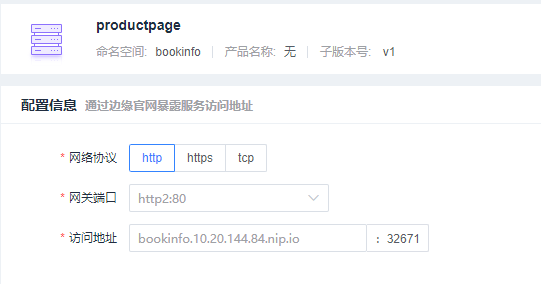


#### 配置负载均衡或熔断器（其中会设定路由转发的子版本）


### 部署httpbins

可以参考服务暴露中的httpbin部署配置


## 测试过程


### 按权重转发

给bookinfo中的reviews服务配置 `路由转发`

在测试的过程中，可以随意设置版本权重

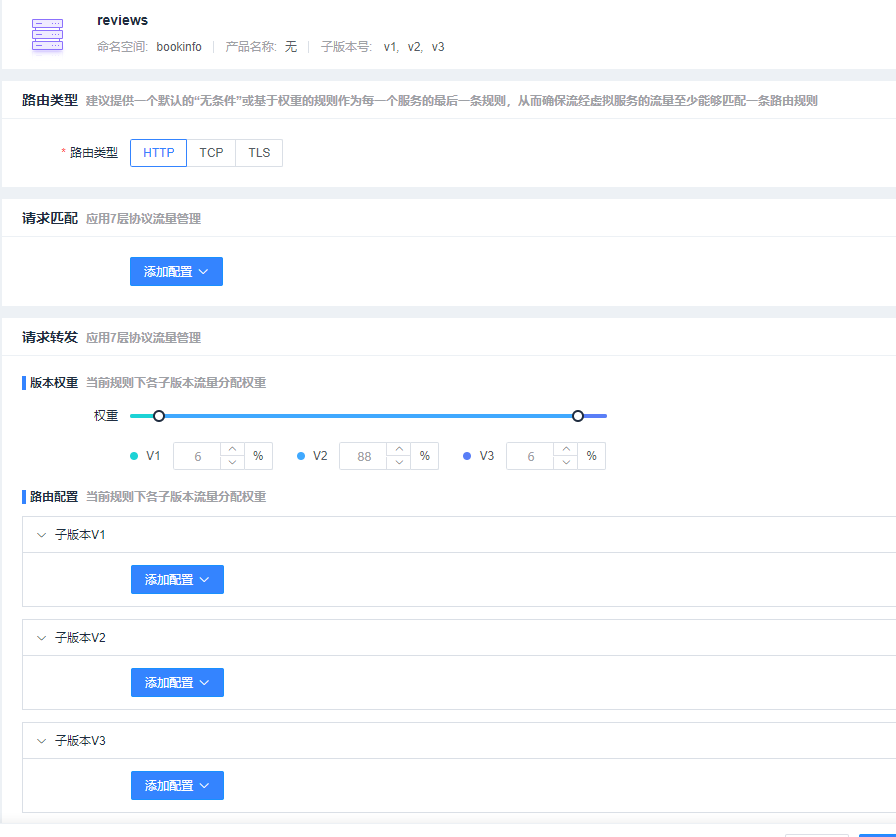

并给每个子版本配置`负载均衡`

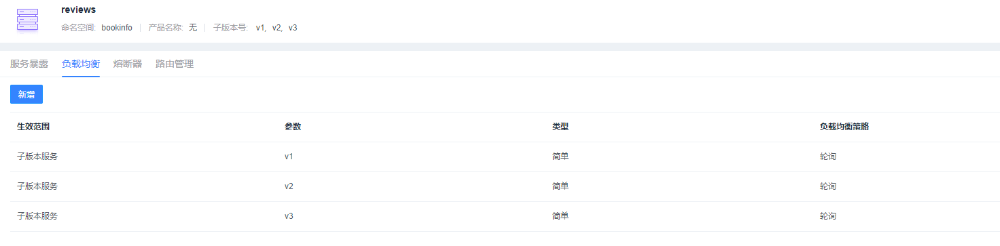

进入到`kiali`的拓扑图页面：

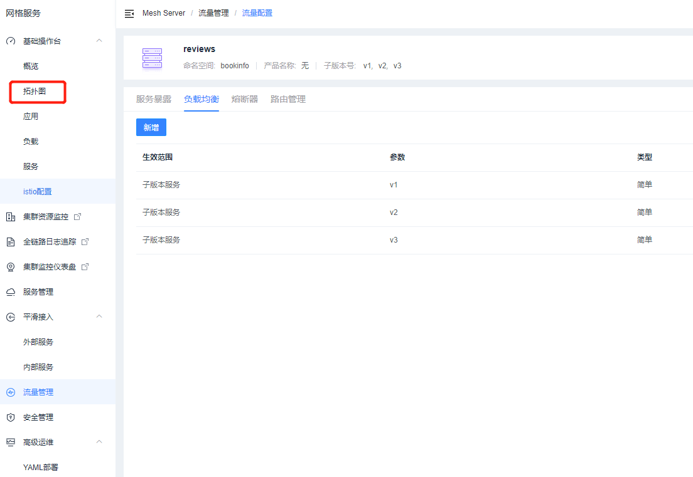

选择 `bookinfo` 命名空间

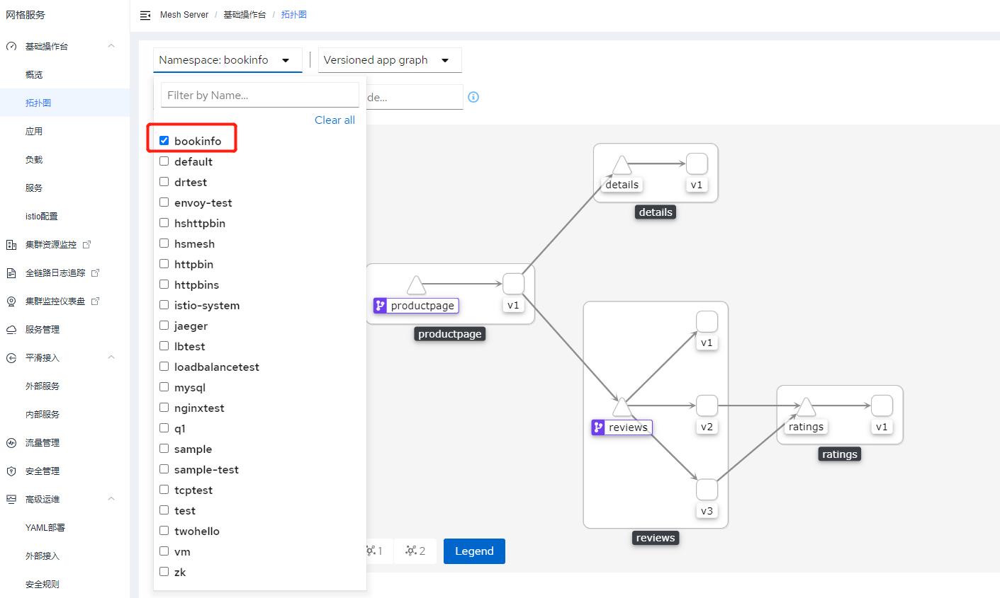

在fortio页面中设置访问的域名：

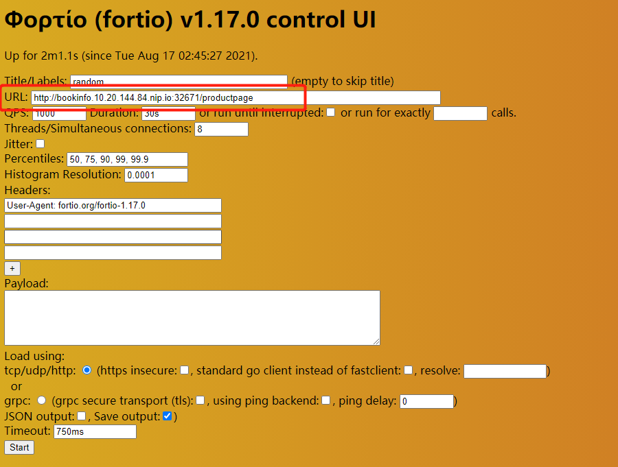

点击`start`后在 kiali 的拓扑图页面查看转发情况：

reviews v1:

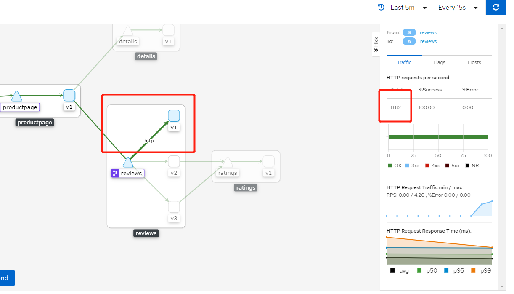

reviews v2:

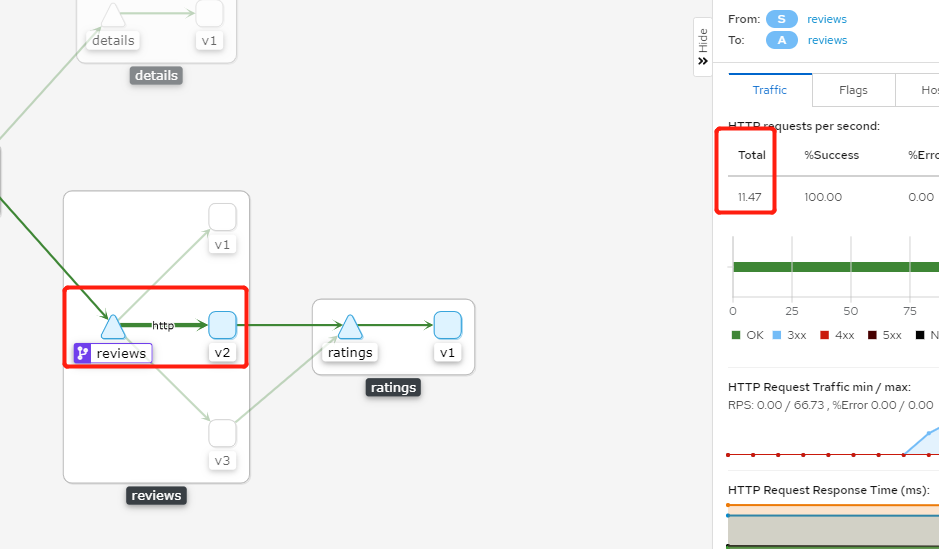

reviews v3:

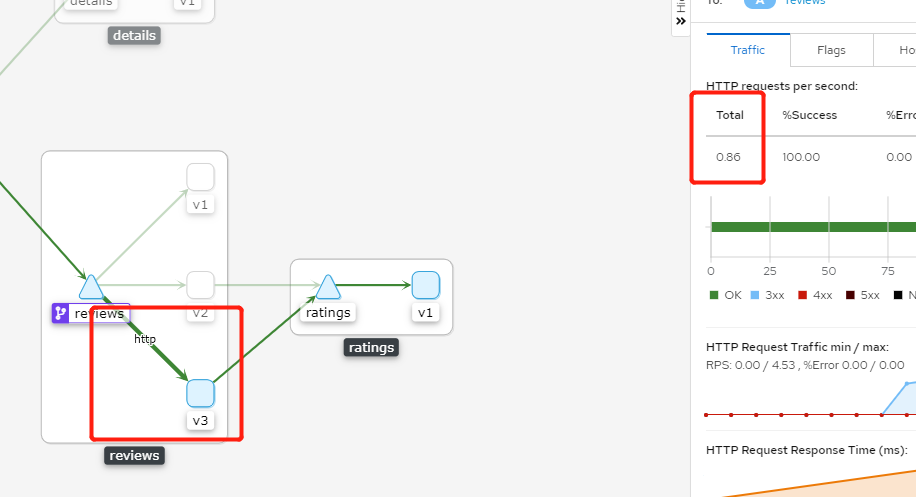

可以看出已经按照原先设定的流量比例在做转发了


### 按照匹配规则转发

测试示例：例如我想将 用户为 jason的请求，全部发送给reviews v3服务


需要配置成如下所示：

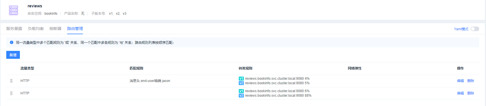

第一条 理由管理 规则如下所示：

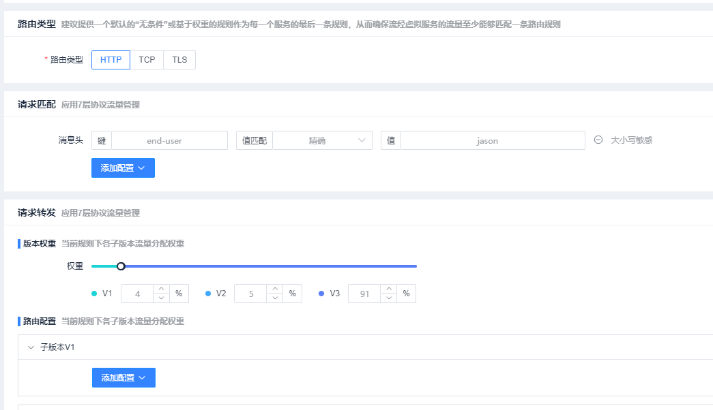

**使用fortio访问：**

1. 首先登入jason用户，主要输入用户名，不用输入密码


2. 获取访问的cookie


3. 在fortio中加入这个cookie

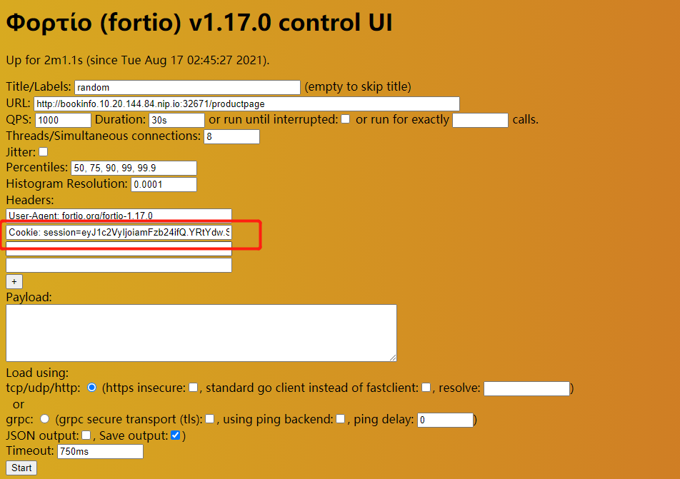

4. 使用fortio并发访问，然后查看 `kiali` 中拓扑图

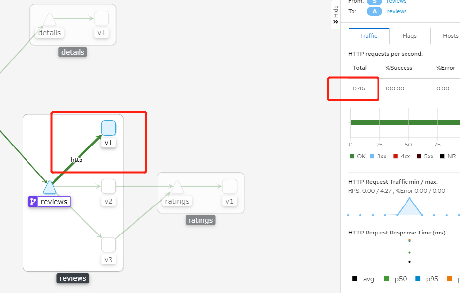


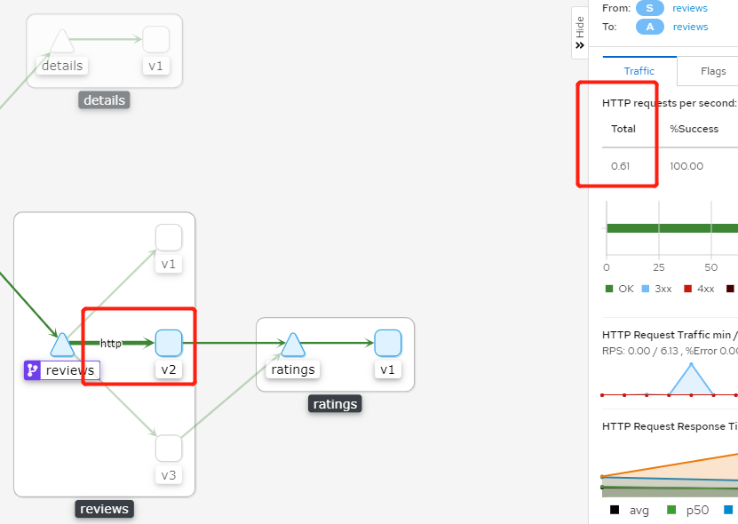


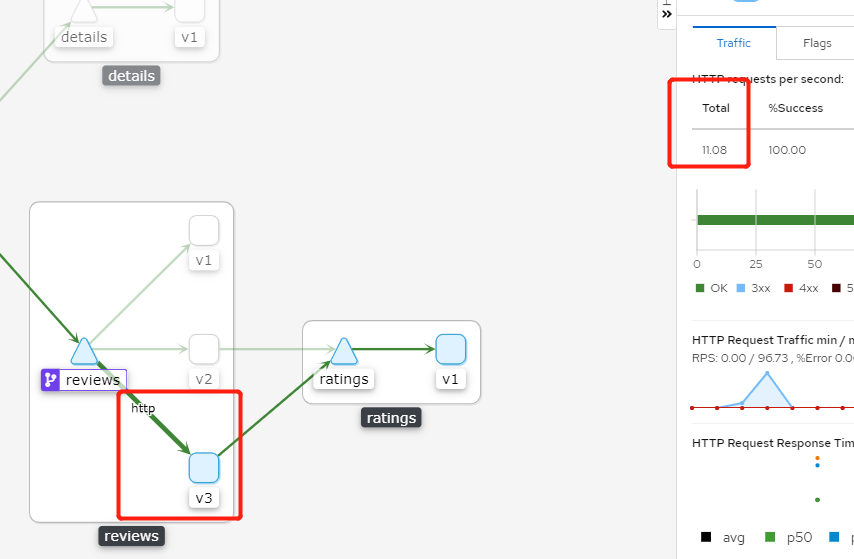

可以看出已经按照请求头实现了特定的转发规则


### 服务弹性功能

#### header

在 `productpage` 服务中修改原先的 路由转发 配置

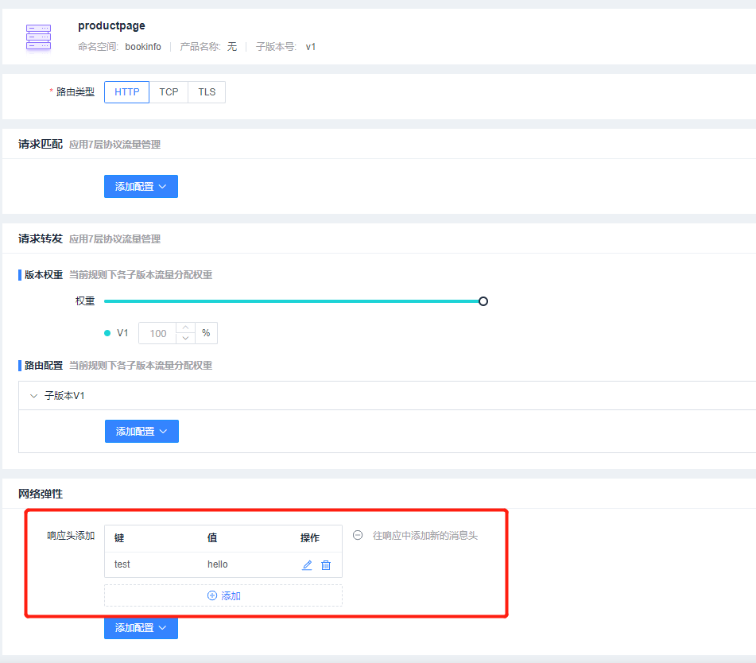

可以看到响应头中出现了刚刚添加的配置

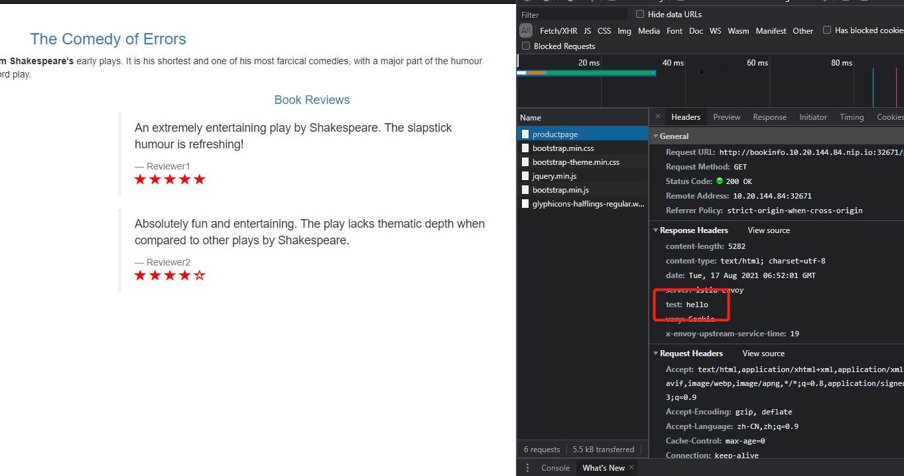

#### 超时测试


因为当前版本没有加入故障注入的功能，所以我借助了yaml 高级的功能，添加了如下的配置：


接着使用浏览器访问  (因为前面是给jason的匹配条件设置的服务弹性，所以注意要登入Jason用户)：

将 reviews 的流量在 jason 请求下 全部转发给 reviews v2 服务用于测试


直接通过浏览器访问  (因为前面是给jason的匹配条件设置的服务弹性，所以注意要登入Jason用户)：

```
http://bookinfo.10.20.144.84.nip.io:32671/productpage
```

不断地刷新页面，可以看出大概两秒钟才刷新一下页面 （所有组件都能加载出来）

接下去配置超时：

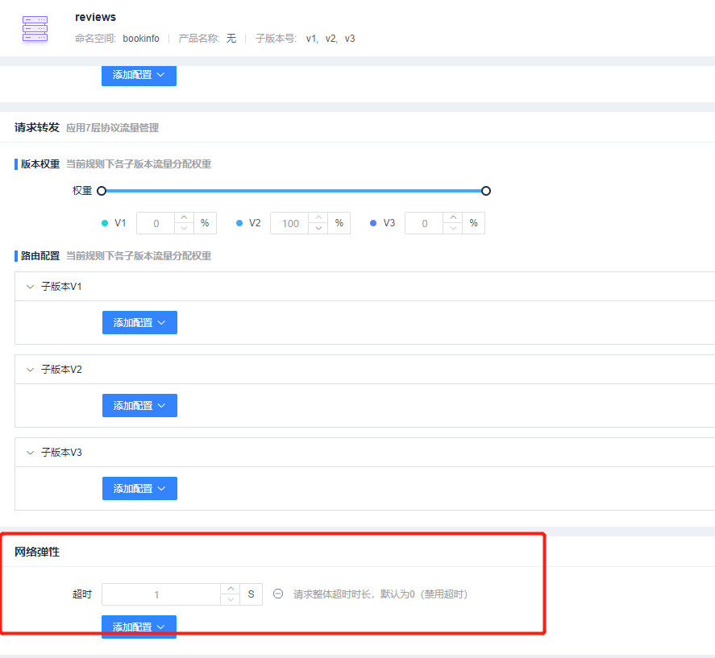

再次访问网页，出现了error ，说明超时的配置生效了

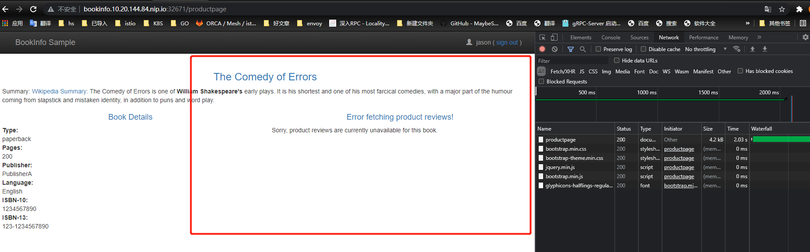

#### 重试

如果在httpbin服务中有`服务暴露`的配置，需要先删除掉


在服务器上使用sleep服务访问，测试重试功能

查看httpbin 服务中 istio-proxy 容器的日志：

```shell
# -f 会持续输出日志，在产生访问之后才会打印出日志，所以在执行了下面的那条指令后才会在日志中出现返回
kubectl logs -f  httpbin-v1-xxxx-xxxxx -n <namespace> -c istio-proxy


# 如果出现了连续的返回 500 ，代表配置生效了
[2021-08-17T10:38:56.538Z] "HEAD /status/500 HTTP/1.1" 500 - via_upstream - "-" 0 0 2 1 "-" "curl/7.76.0-DEV" "60a1fa2e-366f-4f6e-b212-f5dc1c3e4f4c" "httpbin.hshttpbin.svc.cluster.local:8000" "127.0.0.1:80" inbound|80|| 127.0.0.1:46736 10.244.192.102:80 10.244.192.97:54534 outbound_.8000_.v1_.httpbin.hshttpbin.svc.cluster.local default
[2021-08-17T10:38:56.549Z] "HEAD /status/500 HTTP/1.1" 500 - via_upstream - "-" 0 0 1 0 "-" "curl/7.76.0-DEV" "60a1fa2e-366f-4f6e-b212-f5dc1c3e4f4c" "httpbin.hshttpbin.svc.cluster.local:8000" "127.0.0.1:80" inbound|80|| 127.0.0.1:46736 10.244.192.102:80 10.244.192.97:54534 outbound_.8000_.v1_.httpbin.hshttpbin.svc.cluster.local default
[2021-08-17T10:38:56.556Z] "HEAD /status/500 HTTP/1.1" 500 - via_upstream - "-" 0 0 0 0 "-" "curl/7.76.0-DEV" "60a1fa2e-366f-4f6e-b212-f5dc1c3e4f4c" "httpbin.hshttpbin.svc.cluster.local:8000" "127.0.0.1:80" inbound|80|| 127.0.0.1:46736 10.244.192.102:80 10.244.192.97:54534 outbound_.8000_.v1_.httpbin.hshttpbin.svc.cluster.local default
[2021-08-17T10:38:56.583Z] "HEAD /status/500 HTTP/1.1" 500 - via_upstream - "-" 0 0 1 1 "-" "curl/7.76.0-DEV" "60a1fa2e-366f-4f6e-b212-f5dc1c3e4f4c" "httpbin.hshttpbin.svc.cluster.local:8000" "127.0.0.1:80" inbound|80|| 127.0.0.1:46736 10.244.192.102:80 10.244.192.97:54534 outbound_.8000_.v1_.httpbin.hshttpbin.svc.cluster.local default
[2021-08-17T10:38:56.738Z] "HEAD /status/500 HTTP/1.1" 500 - via_upstream - "-" 0 0 1 1 "-" "curl/7.76.0-DEV" "60a1fa2e-366f-4f6e-b212-f5dc1c3e4f4c" "httpbin.hshttpbin.svc.cluster.local:8000" "127.0.0.1:80" inbound|80|| 127.0.0.1:46736 10.244.192.102:80 10.244.192.97:54534 outbound_.8000_.v1_.httpbin.hshttpbin.svc.cluster.local default
```


例如我已经部署了一个sleep的服务，那么我就可以执行如下指令

```shell
# 使用下面的指令的前提是按照”前提准备“中的 httpbin 服务部署
kubectl exec sleep-xxxx-xxxx -n <namespace> -c sleep -- curl --silent --head  httpbin.hshttpbin.svc.cluster.local:8000/status/500
```

